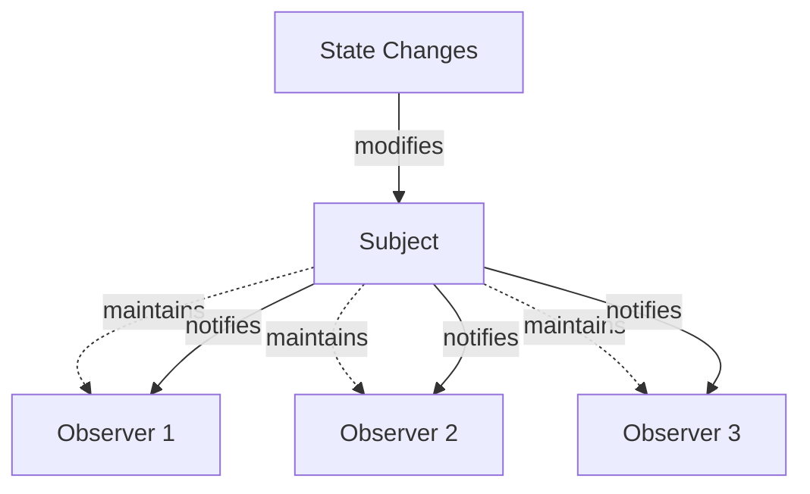
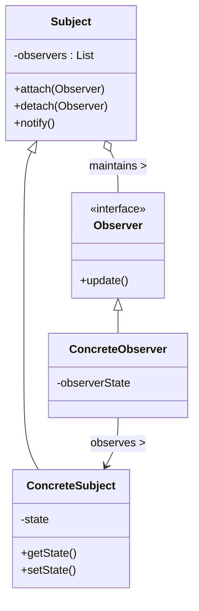
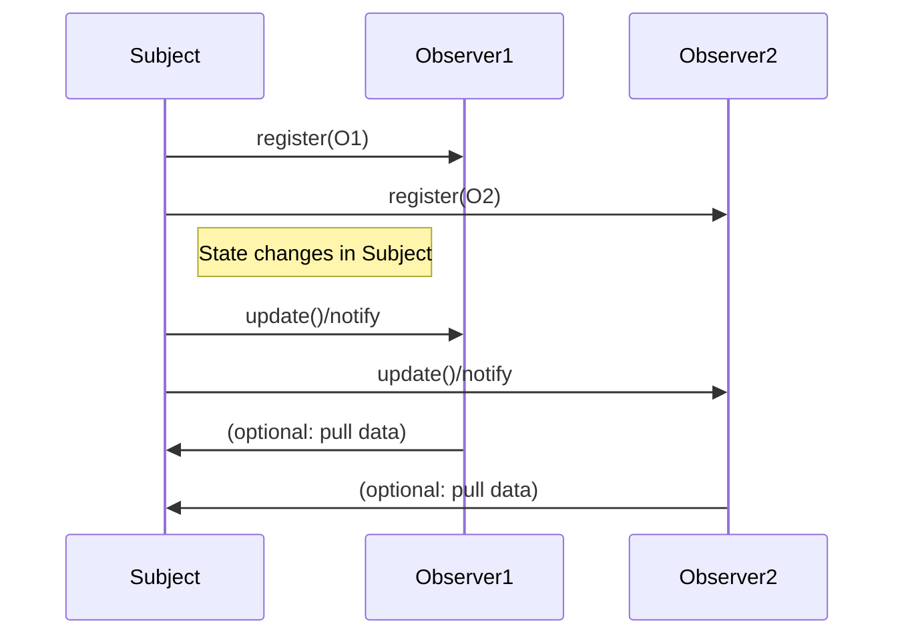

# Observer Pattern

## Introduction

The Observer Pattern is a behavioral design pattern that defines a dependency between objects such that when one object changes state, all its dependents are notified and updated automatically. It is fundamental for enabling loose coupling and facilitating the event-driven or reactive design paradigms in modern software engineering.

The Observer Pattern is sometimes called the *dependents* or *publisher-subscriber* pattern and forms the basis of a variety of notification and event systems in distributed software, GUIs, and real-time applications. It is formally cataloged in “Design Patterns: Elements of Reusable Object-Oriented Software” by Gamma et al. (Gang of Four, 1994).

## Technical Context

- **Pattern Type:** Behavioral (focuses on object communication)
- **Domain of Use:** Widely used in GUI frameworks, messaging systems, event buses, UI binding, and distributed event-driven systems.
- **Related Patterns:** Publish–Subscribe (a more decoupled variant), Mediator (coordinates interactions), Event Sourcing.

## Core Concepts and Key Components

The Observer Pattern splits participating objects into two distinct roles:

- **Subject (Observable):** The object whose state is monitored. Maintains a list of dependents and notifies them about state changes.
- **Observers (Subscribers/Listeners):** Objects that depend on the Subject. Register with the Subject and update themselves automatically when notified.

This enables a one-to-many dependency between subject and observers, as per the following diagram:



## Architectural Overview

### Structural Participants

1. **Subject (Observable):**
   - Maintains a list of registered observers.
   - Provides methods for observer registration/removal.
   - Notifies observers when its state changes.

2. **Observer:**
   - Defines a notification interface (`update()` or equivalent) to react to state changes in the Subject.

3. **ConcreteSubject:**
   - Implements the Subject interface.
   - Stores state of interest to ConcreteObservers.
   - Notifies observers when relevant state changes occur.

4. **ConcreteObserver:**
   - Implements the Observer interface.
   - Maintains reference to a ConcreteSubject (optional, context-specific).
   - Synchronizes its state with the subject upon notification.

### Typical Class Diagram



## Semantics and Data Flow

### Workflow Description

1. **Observer Registration:** Observers register themselves with a Subject they wish to observe.
2. **State Change in Subject:** State mutation occurs in the Subject (manually or via business logic).
3. **Notification (Pull/Push):**
   - **Push Model:** Subject sends changed state details to Observers.
   - **Pull Model:** Subject simply notifies; Observers query for state as needed.
4. **Observer Update:** Observers refresh themselves based on the new state.

### Sequence Diagram



## Implementation Details

### Interfaces

In most statically-typed languages, the Observer Pattern is implemented by defining two interfaces:

```java
// Subject interface
public interface Subject {
    void attach(Observer o);
    void detach(Observer o);
    void notifyObservers();
}

// Observer interface
public interface Observer {
    void update();
}
```

Languages with delegates, events, or functional constructs (e.g., JavaScript, C#, Python) often use native event handling mechanisms.

### Registration and Notification

Observers dynamically attach to or detach from Subjects. Subjects typically hold weak references to Observers to avoid memory leaks (circular references).

#### Push vs. Pull Models

- **Push Model:** `update()` includes event or data payload.
- **Pull Model:** `update()` is called without details; Observer queries Subject for new state as needed.

**Example: Push Model**

```java
void update(int newValue);
```

**Example: Pull Model**

```java
void update();
```

> [!TIP]
> Prefer the pull model when Observers have independent state needs or only need to check part of the Subject’s state.

### Threading and Concurrency

Notifying observers can be synchronous or asynchronous. In multithreaded environments, Subjects must synchronize observer lists and address race conditions from concurrent attach/detach operations or re-entrant notifications.

> [!WARNING]
> Improper synchronization in multi-threaded observer patterns can cause lost updates, deadlocks, or inconsistent observer lists. Use thread-safe collections or synchronization primitives where necessary.

### Memory Management

If Observers are no longer used but the Subject still holds references, memory leaks may occur (especially with event listeners in GUI toolkits). Using weak references or explicit deregistration prevents this.

#### Caution: Observer Leaks in GUI Applications

> [!CAUTION]
> A common pitfall in event-driven GUI systems: Observers not deregistered on window close can create persistent memory leaks. Always unregister Observers explicitly when no longer needed.

## Variations and Related Patterns

### Publish–Subscribe Model

- **Observer Pattern:** Subject knows its observers; direct references.
- **Publish–Subscribe:** Decouples senders (publishers) and receivers (subscribers) via a broker/message bus; subjects do not know subscribers.

### Mediator Pattern

- Coordinates communication between objects, avoids direct dependencies. Can use observers for event notification internally.

### Event Bus/Event Emitter

- Specialized frameworks (Node.js EventEmitter, Java EventBus) generalize notification and event pattern with filtering, wildcards, and priorities.

### Reactive Programming

- Frameworks (RxJava, ReactiveX) leverage observer pattern fundamentals but add functional operators for event transformations and combinations.

## Typical Use Cases

- **Graphical User Interfaces (GUI):** Event listeners for button clicks, form changes, view updates.
- **MVC/MVVM Architectures:** Views observe Models for state changes.
- **Distributed Event Systems:** Notification to distributed services or microservice event consumers.
- **Data Binding:** Spreadsheet recalculations, property observers, live analytics dashboards.

## Engineering Considerations

### Integration Points

- Observer Pattern fits wherever one system component should react to another's state changes without forming tight coupling.
- Inverting dependencies improves testability, code reuse, and module independence.

### Performance Implications

- Having a large or unbounded set of observers affects performance; notification becomes O(n) per event.
- For high-rate event systems, consider batching, deduplication, throttling, or filtering mechanisms.

### Implementation Challenges

- *Memory leaks*: see above section on memory management.
- *Cascading updates*: Observer actions may trigger further Subject state changes, risking infinite update loops. Use change tokens or guard flags to prevent recursion.

### Testing and Debugging

- Isolate Subject and Observer unit tests using mocks/stubs.
- Verify correct registration/unregistration flows and observer invocations.
- Use event logs or instrumentation to trace notification flows.

### Common Pitfalls

- Relying on object identity rather than reference equality for observer management.
- Accidental multiple registration (duplicate observer callbacks).
- Failing to unsubscribe observers on lifecycle completion.
- Assuming all observers always need to be notified (introduce filtering or prioritization as needed).

## Example: Simple Observer Implementation in Python

```python
class Subject:
    def __init__(self):
        self._observers = set()
        self._state = None
    
    def attach(self, observer):
        self._observers.add(observer)
    
    def detach(self, observer):
        self._observers.discard(observer)
    
    def notify(self):
        for observer in self._observers:
            observer.update(self._state)
    
    def set_state(self, new_state):
        self._state = new_state
        self.notify()
        
class Observer:
    def update(self, state):
        raise NotImplementedError

class ConcreteObserver(Observer):
    def update(self, state):
        print(f"Observer received state: {state}")

subject = Subject()
observer = ConcreteObserver()
subject.attach(observer)
subject.set_state("Active")  # Observer will be notified
```

## Standards and Specifications

- **Java:** `java.util.Observer` and `java.util.Observable` (deprecated since Java 9 in favor of event bus libraries and reactive programming).
- **.NET:** `System.IObserver<T>`, `System.IObservable<T>` interfaces formalize the pattern.
- **ECMAScript:** No built-in pattern, but libraries such as RxJS implement the pattern extensively for event streams.

## Summary Table: Observer Pattern Features

| Feature           | Description                                           |
|-------------------|------------------------------------------------------|
| Decoupling        | Observers and Subjects interact via interfaces only   |
| Notification      | One-to-many, synchronous or asynchronous             |
| Variants          | Push/pull, Publish–Subscribe, Event Bus              |
| Concerns          | Memory leaks, threading, notification granularity     |
| Common Use Cases  | UI events, data binding, distributed notifications   |

## Conclusion

The Observer Pattern is a foundational behavioral design pattern that enables decoupled, scalable, and maintainable software components to coordinate via event-driven notifications. By abstracting the dependency and update relationship, it supports modular system design across user interfaces, services, and distributed architectures. Nevertheless, careful implementation is required to avoid common pitfalls related to threading, memory management, and unregulated observer growth. Its principles underpin many advanced event and messaging frameworks found in contemporary software engineering practice.