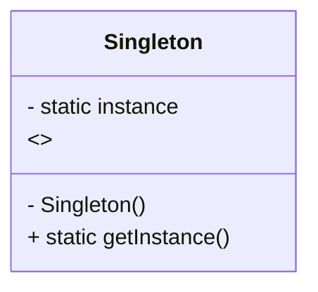
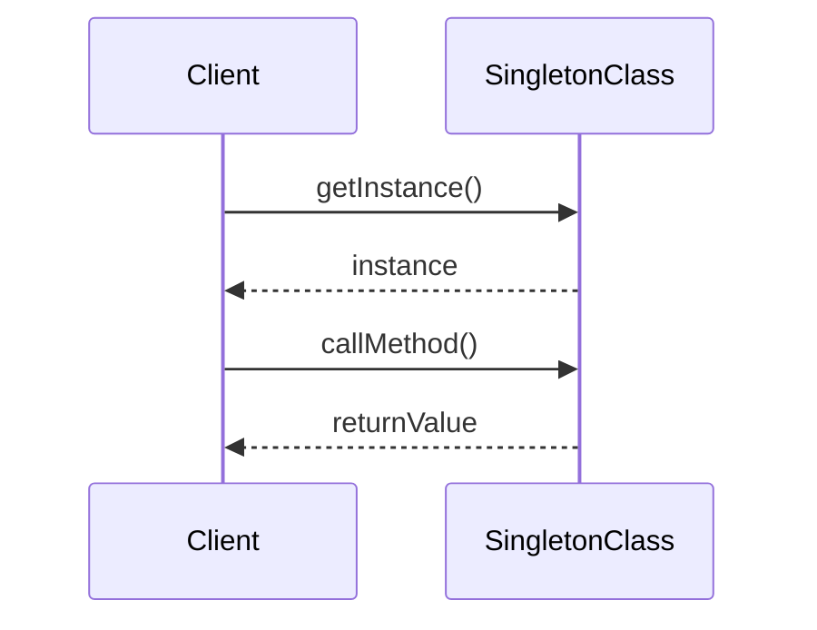
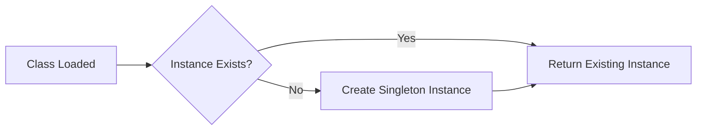

# Singleton Pattern &mdash; Technical Primer

## Introduction

The Singleton Pattern is a creational design pattern in software engineering. Its primary objective is to guarantee that a class has exactly one instance, while providing a global point of access to that instance. This can be useful when exactly one object is needed to coordinate actions across a system, such as configuration managers, logging utilities, or connection pools.

The Singleton Pattern is formally described in "Design Patterns: Elements of Reusable Object-Oriented Software" (Gamma et al., 1994) and is prevalent in object-oriented programming, most commonly in languages such as Java, C++, C#, and Python.

## Definition and Context

A Singleton ensures that a class:

1. Cannot be instantiated more than once.
2. Offers a well-known access point to that single instance across the entire execution context.

The Singleton Pattern is typically used in scenarios requiring a single point of coordination or control, such as:

- Logging services.
- Application configuration/state.
- Caches or central registries.
- Access to hardware resources or system-wide services.

It contrasts with patterns such as the Factory Pattern (for object creation) or Dependency Injection (for lifecycle and scope management), by strictly limiting instance creation.

## Core Concepts

The core concepts of the Singleton Pattern include:

- **Controlled instantiation:** Mechanisms that prevent direct instantiation of a class outside prescribed pathways.
- **Global access:** A static or global method provides access to the instance.
- **Lazy vs. eager initialization:** The singleton can be created upon class loading (eager) or upon first request (lazy).
- **Thread safety:** In multi-threaded environments, mechanisms must prevent simultaneous creation of multiple instances.

### Typical Architecture

A typical Singleton implementation can be visualized as a class with:

- A private static variable holding the unique instance.
- A public static method that returns this instance, creating it if it does not already exist.
- A private or protected constructor to prevent direct external instantiation.

#### Mermaid Diagram: Singleton Class Structure



## Implementation Details

### Basic Implementation (Eager Initialization)

In languages such as Java:

```java
public class Singleton {
    private static final Singleton instance = new Singleton();

    private Singleton() {
        // private constructor
    }

    public static Singleton getInstance() {
        return instance;
    }
}
```
- The instance is created when the class is loaded (eager initialization).
- Thread-safe due to static initialization semantics.
- Potential drawback: resource allocation even if the instance is never used.

### Lazy Initialization

Delays creation of the singleton until it is first accessed:

```java
public class Singleton {
    private static Singleton instance;

    private Singleton() {}

    public static synchronized Singleton getInstance() {
        if (instance == null) {
            instance = new Singleton();
        }
        return instance;
    }
}
```
- Uses synchronization to ensure thread safety.
- Ensures that the singleton is only created if needed.
- Synchronization overhead may be unacceptable for highly-contended scenarios.

### Double-Checked Locking (Optimized Lazy Initialization)

To reduce synchronization overhead:

```java
public class Singleton {
    private static volatile Singleton instance;

    private Singleton() {}

    public static Singleton getInstance() {
        if (instance == null) {
            synchronized (Singleton.class) {
                if (instance == null) {
                    instance = new Singleton();
                }
            }
        }
        return instance;
    }
}
```
- Reduces locking after the instance is initialized.
- The `volatile` modifier prevents instruction reordering issues.

### Language-Specific Variants

#### Python

```python
class Singleton:
    _instance = None

    def __new__(cls):
        if cls._instance is None:
            cls._instance = super().__new__(cls)
        return cls._instance
```
- Relies on overriding `__new__` for instantiation control.

#### C++

In C++, the Meyers Singleton leverages local static variables:

```cpp
class Singleton {
public:
    static Singleton& getInstance() {
        static Singleton instance;
        return instance;
    }
private:
    Singleton() {}
    Singleton(const Singleton&) = delete;
    Singleton& operator=(const Singleton&) = delete;
};
```
- Thread safety is guaranteed in C++11 and later due to static local variable initialization guarantees.

## Sequence of Access

The following diagram illustrates a typical singleton usage sequence in client code.



## Integration Points and Practical Constraints

### When and Where to Use

- For objects that coordinate system-wide behavior or manage shared resources.
- When a single configuration or state must be visible throughout the process.
- Where object lifecycle control must be centralized.

### Typical Drawbacks

- **Hidden dependencies**: Singleton use can disguise implicit coupling between components.
- **Testing**: Singletons introduce global state, complicating unit testing and test isolation.
- **Concurrency**: Naive implementations are not thread-safe.

#### :warning: Caution: Global State

> Use singletons judiciously. Introducing global state can make reasoning, testing, and maintaining software more complex.

### Integration with Dependency Injection

Many modern frameworks favor dependency injection (DI) for object lifecycle management. DI containers can provide singleton-like lifecycles (typically called "singletons" in many DI systems) without requiring explicit singleton code.

#### :bulb: Tip

> Prefer using a dependency injection (DI) framework's singleton scopes over manual implementation when using such systems.

## Variations and Alternatives

- **Enum Singleton (Java):** Enum instances are guaranteed singletons by the JVM, providing intrinsic serialization and reflection resistance.
- **Monostate Pattern:** Exposes instance behavior via static methods/properties, putting state in static fields rather than enforcing a unique object.
- **Service Locator Patterns:** Abstracts global lookup but can still introduce hidden dependencies.

### Common Pitfalls

```markdown
- Double instantiation due to serialization/deserialization, reflection, or classloader isolation.
- Thread-safety bugs with lazy initialization.
- Memory leaks due to the long-lived nature of singleton objects.
```

#### :warning: Warning: Classloaders

> In environments like application servers, distinct classloaders may result in multiple singleton instances for the same class in different contexts.

## Overview: Singleton Lifecycle



## Example Usages

- **Logging:** Ensures that logs are consistently written to the same sink.
- **Configuration Management:** A single source of configuration in a running process.
- **Connection Pooling:** Provide access to a pool manager, enforcing single access point.

## Summary of Engineering Decisions

- Choose eager or lazy instantiation based on startup considerations and resource use.
- Ensure thread safety, especially in multi-threaded environments.
- Avoid overusing singletons to minimize hidden coupling and improve testability.
- Consider relevant language- or framework-specific facilities for singleton management.

## Conclusion

The Singleton Pattern is a well-established, canonical solution for scenarios requiring a single instance of a class and global access to that instance. While the pattern offers a straightforward and efficient mechanism for resource coordination, developers must remain aware of potential drawbacks related to global state, hidden dependencies, and test complexity. Singleton usage should be complemented with language features, frameworks, and best practices to ensure reliability and maintainability in professional software projects.