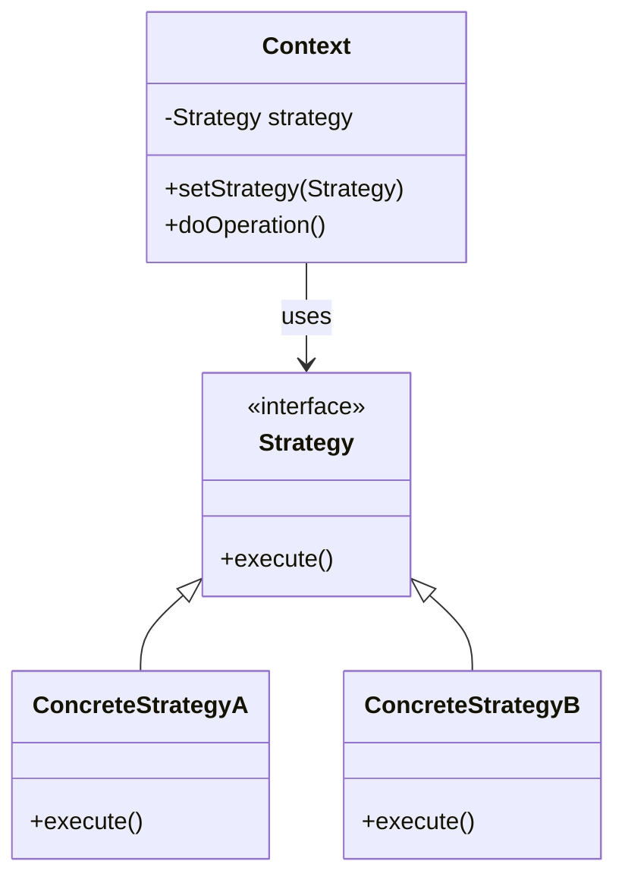
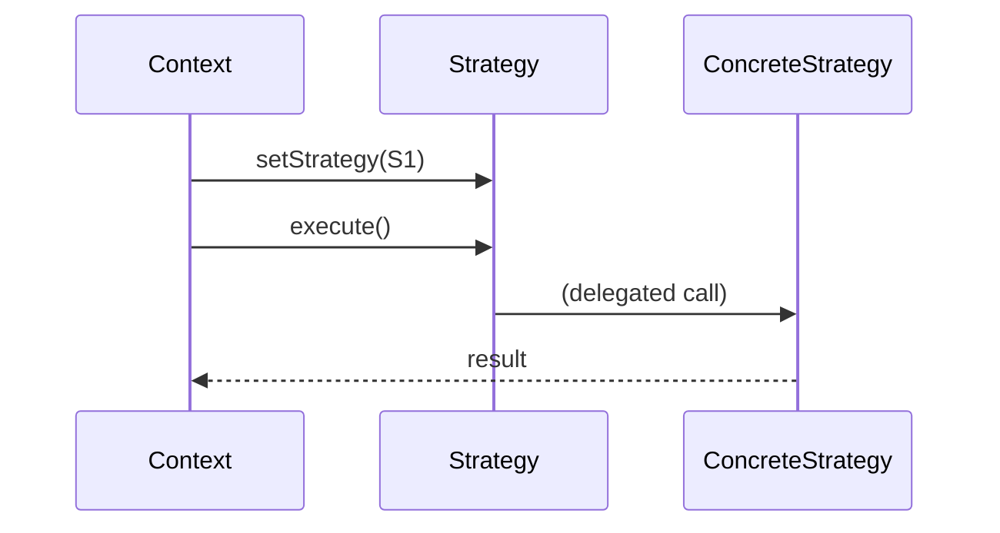
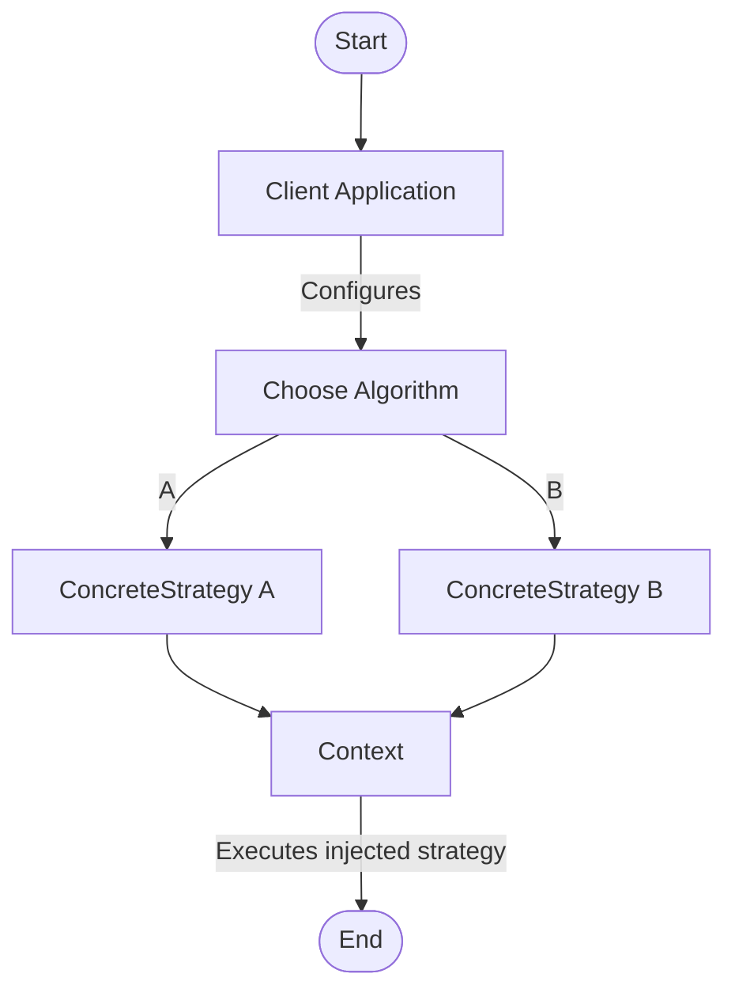

# Strategy Pattern: Technical Primer

## Introduction

The Strategy Pattern is a well-established behavioural design pattern, central to the domain of software engineering patterns. Its primary objective is to enable clients to select an algorithm’s behaviour at runtime by encapsulating interchangeable algorithms under a unified interface. This pattern encourages design flexibility, robustness, and testability by promoting composition over inheritance. The Strategy Pattern is formally documented in _Design Patterns: Elements of Reusable Object-Oriented Software_ by Gamma et al. ("Gang of Four", 1994), and is recognized in standards such as [POSA1](https://en.wikipedia.org/wiki/Pattern-Oriented_Software_Architecture) (Pattern-Oriented Software Architecture).

This document provides a comprehensive technical overview of the Strategy Pattern, targeting software engineers seeking to understand, apply, or implement the pattern in practical systems.

---

## 1. Definition and Technical Context

### 1.1. What is the Strategy Pattern?

The Strategy Pattern defines a family of algorithms, encapsulates each one, and makes them interchangeable. The pattern lets the algorithm vary independently from clients that use it. Put simply, it allows the user of a class (the _Context_) to dynamically select the algorithm or behaviour to be performed, rather than hard-coding it.

### 1.2. Applicability

The Strategy Pattern is applicable when:

- Multiple related classes differ only in their behaviour.
- There are different variants of an algorithm.
- Behaviour should be selected and changed at runtime.
- You wish to avoid using conditional statements for selecting algorithms.
- Behavioural extensions should not require modification of existing code (following the Open/Closed Principle).

Common use cases include:

- Sorting using interchangeable sorting algorithms.
- Validation schemas that should be swappable.
- Pluggable data compression or encoding strategies.

### 1.3. Comparison to Related Patterns

- **Factory Pattern:** A creational pattern responsible for creating instances, whereas Strategy is concerned with selecting behaviour.
- **Template Method:** Allows subclasses to override certain steps of an algorithm, but uses inheritance and is generally static; Strategy uses composition and is dynamic.

---

## 2. Core Concepts and Architecture

### 2.1. Key Participants

The Strategy Pattern involves three principal participants:

| Participant        | Responsibility                                            |
|--------------------|----------------------------------------------------------|
| **Context**        | Holds a reference to a Strategy. Delegates behaviour.    |
| **Strategy**       | Defines a common interface for all strategies.           |
| **ConcreteStrategy**| Implements specific algorithms adhering to the Strategy interface. |

#### Mermaid Block Diagram: Strategy Pattern Structure



---

### 2.2. Interactions

- **Context** delegates an operation to its configured **Strategy**.
- **Strategy** defines the API (often a single method) to be implemented.
- **ConcreteStrategy** provides the specific implementation logic.

The decoupling of context and implementation enables algorithms to be interchanged easily, individually tested, or extended without requiring context code changes.

---

## 3. Implementation Details

### 3.1. Standard Implementation in Object-Oriented Languages

- **Context** is composed with an interface (a pointer, reference, or field, depending on language) to **Strategy**.
- **Strategy Interface** defines a method (or methods) matching the algorithm signature.
- Clients can switch at runtime—either by setter methods, constructor or dependency injection, or via configuration.

#### Example: Pseudocode

```java
// Strategy interface
public interface CompressionStrategy {
    void compress(File input, File output);
}

// Concrete Strategies
public class ZipCompressionStrategy implements CompressionStrategy {
    public void compress(File input, File output) { /* ... */ }
}

public class GzipCompressionStrategy implements CompressionStrategy {
    public void compress(File input, File output) { /* ... */ }
}

// Context
public class FileCompressor {
    private CompressionStrategy strategy;
    public FileCompressor(CompressionStrategy strategy) { this.strategy = strategy; }
    public void setStrategy(CompressionStrategy strategy) { this.strategy = strategy; }
    public void compressFile(File input, File output) { strategy.compress(input, output); }
}
```

In this example, clients may interchangeably assign either `ZipCompressionStrategy` or `GzipCompressionStrategy` at runtime.

---

### 3.2. Behaviour at Runtime

#### Mermaid Sequence Diagram: Context Delegation to Strategy



- The context receives a strategy object.
- The context calls the strategy’s method, deferring the actual logic to the concrete strategy implementation.

---

### 3.3. Language-Specific Notes and Variations

- In languages with higher-order functions or lambdas (e.g., JavaScript, Python, or Java 8+), strategies can be implemented as callable objects or functions, further reducing boilerplate.
- In systems with dependency injection frameworks, strategies can be configured externally, improving testability and configurability.
- In statically-typed languages, the Strategy interface enforces compile-time correctness.
- In dynamically-typed languages, duck typing or protocols may be used.

#### Example: Functional Approach (JavaScript)

```js
function process(strategy, input) {
    return strategy(input);
}
const strategyA = (x) => x * 2;
const strategyB = (x) => x + 1;

process(strategyA, 5); // 10
process(strategyB, 5); // 6
```

---

## 4. Typical Usage Patterns

### 4.1. Dynamic Algorithm Switching

Clients can switch strategies at runtime depending on external factors (user preference, environment, input data characteristics).

### 4.2. Decoupling and Extension

Because clients use a common interface, new algorithms can be introduced without changing the client or context code, upholding Open/Closed and Single Responsibility principles.

### 4.3. Parameterization

The strategy instance can be selected at runtime through configuration (e.g., from a config file or environment variable), command-line argument, or dependency injection.

### 4.4. Example Applications

- **Sorting libraries** that let the user pick merge sort, quicksort, etc.
- **Payment processing** systems that can plug in credit card, PayPal, or cryptocurrency processors.
- **Rendering engines** supporting different rendering approaches (rasterization, ray-tracing, etc.).
- **AI or game logic** where tactics can be swapped without changing the core game loop.

---

## 5. Engineering Considerations

### 5.1. Integration Points

- The pattern works well in layered architectures where the context class represents the service layer and the strategies encapsulate swapping or pluggable business logic.
- During refactoring, moving algorithmic logic from the context into concrete strategy classes can improve maintainability.

### 5.2. Performance Implications

- Excessively fine-grained strategies may introduce performance or object management overhead.
- In languages lacking inlining or optimization for small classes, function pointers or lambda-style strategies might be preferable.
- Instantiating many strategy objects at runtime without proper pooling/allocation strategies may impact memory usage.

### 5.3. Testing

- Each strategy can be tested in isolation, facilitating unit testing of individual behaviours.

### 5.4. Extensibility and Maintainability

- Adding new strategies does not require modifying the context, which minimizes regression risks.
- Overuse may cause fragmentation if there is a proliferation of trivial strategies.

### 5.5. Common Pitfalls

> [!WARNING]
> **Pitfall:** Tight Ref coupling. If context is too dependent on strategy specifics, future changes to the strategy interface can break the context. The separation between context and strategy should be observed strictly.

> [!TIP]
> Strategies should be stateless where possible. Stateful strategies can introduce hidden dependencies and threading issues, particularly in concurrent environments.

> [!CAUTION]
> Avoid redundant strategies. If strategies differ only by minor data, refactor common code into the base interface or utility helpers.

---

## 6. Variations and Related Patterns

### 6.1. Policy Pattern

- Sometimes used interchangeably with Strategy (notably in the C++ community), focusing more broadly on policies for behaviour beyond pure algorithm selection.

### 6.2. Decorator Pattern

- Can be combined with Strategy to add optional behaviour modifications (e.g., logging, caching).

### 6.3. Template Method

- Inverts control by deferring steps to subclasses (using inheritance), while Strategy uses delegation (via composition).

---

## 7. Diagram: Strategy Pattern Workflow



---

## 8. Constraints and Assumptions

- Strategies must strictly adhere to a common interface.
- The context is responsible for holding and invoking strategies but should not know the details of their implementation.
- Clients must be able to configure or swap strategies; otherwise, the benefits of the pattern are reduced.
- Adding a new strategy should not require modifications to the context or existing strategies (Open/Closed Principle).

---

## 9. Summary Table: Strategy Pattern Characteristics

| Attribute                        | Description                                               |
|-----------------------------------|-----------------------------------------------------------|
| Type                              | Behavioural pattern                                        |
| Intent                            | Encapsulate interchangeable algorithms                     |
| Participants                      | Context, Strategy, ConcreteStrategy                       |
| Main benefit                      | Flexibility, maintainability, clean extension             |
| Drawbacks                         | Increased number of classes/objects, potential indirection |
| Suitable for                      | Pluggable behaviours, runtime algorithm selection         |
| Not suitable for                  | Simple behaviours or when algorithm rarely changes        |
| Commonly used with                | Factory, Template Method, Dependency Injection            |
| Standards                         | Documented by GoF, POSA1                                  |

---

## 10. Conclusion

The Strategy Pattern is a fundamental behavioural design pattern, providing a robust mechanism to encapsulate variable algorithms and behaviours under a unified interface. It is highly applicable to systems that demand modularity, runtime configurability, and extensibility. While it introduces additional indirection and potential runtime overhead, its benefits in maintainability, scalability, and testability often outweigh these concerns when applied judiciously.

Engineers are encouraged to consider the Strategy Pattern whenever multiple algorithms, behaviours, or business rules need to be swapped, extended, or configured at runtime without modifying client or context code. Strategic (no pun intended) application of this pattern can lead to software that is more reliable, readable, and adaptable in the face of changing requirements.