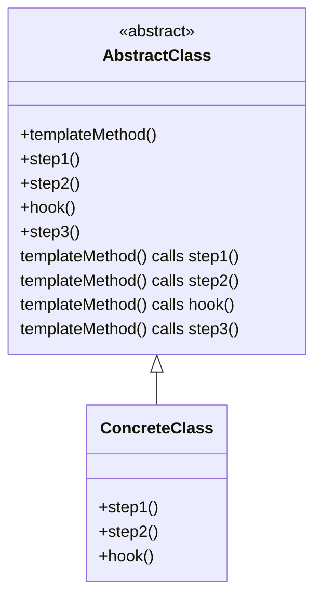
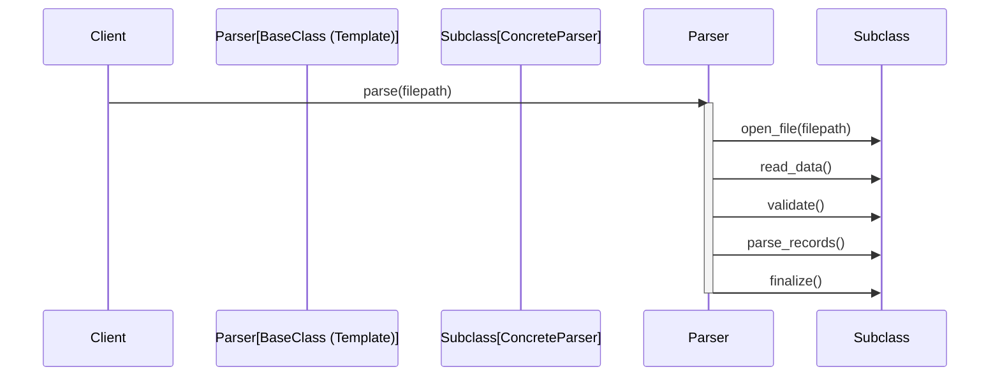

# Template Method Pattern

## Introduction

The Template Method Pattern is a fundamental behavioural design pattern originating from the seminal "Gang of Four" (GoF) software design patterns. It is widely adopted across object-oriented languages and systems to promote code reuse and consistent algorithmic logic. The core idea is to encapsulate the skeleton of an algorithm within a base (abstract) class, deferring some steps to subclasses without altering the overall control flow.

This pattern is instrumental in situations where a process involves standard structure but allows variation in certain operations. By separating invariant behaviour (the algorithm’s structure) from variant behaviour (steps that change), it enforces policy consistency while enabling controlled extensibility.

## Core Concepts

The Template Method Pattern centres around:

- **Abstract Base (Superclass):** Defines the algorithm structure using a *template method*—a method composed of calls to primitive operations, some of which are abstract or have default behaviour.
- **Concrete Subclasses:** Implement or override the placeholder (primitive) operations to provide specific behaviour for the customizable steps.
- **Invariant Algorithm:** The overall algorithmic procedure (the template method) is fixed and must not be overridden or changed by subclasses.

### Key Components

| Component           | Purpose                                                                                       |
|---------------------|----------------------------------------------------------------------------------------------|
| Template Method     | The method containing the sequence of steps (some concrete, some abstract or hook methods).  |
| Primitive Operations| Methods (possibly abstract) representing steps in the algorithm meant to be overridden.      |
| Hook Methods        | Optional methods with default (possibly empty) implementation—subclasses may override them.  |
| Concrete Subclass   | Subclasses that implement or customize the primitive or hook methods.                        |

## Class Structure

A typical implementation in an object-oriented language comprises the following structure:

```java
abstract class AbstractClass {
    // Template Method (final or non-overridable)
    public final void templateMethod() {
        step1();
        step2();
        hook();
        step3();
    }
    abstract void step1();
    abstract void step2();
    // Hook method with default implementation
    void hook() {}
    void step3() {/* default implementation */}
}

class ConcreteClass extends AbstractClass {
    void step1() { /* custom behaviour */ }
    void step2() { /* custom behaviour */ }
    void hook() { /* optional override */ }
}
```

## Mermaid Diagram: Template Method Pattern Structure



## Applicability

Apply the Template Method Pattern when:

- Multiple classes share the same algorithm structure but differ in specific steps.
- You want to avoid code duplication across related classes.
- Enforcement of certain steps or ordering is required, while allowing customization at well-defined points.
- Subclasses should not be permitted to alter the overall workflow, but only the details of specific steps.

Common domains where this pattern is found include:

- Frameworks and libraries providing extensible workflows (e.g., UI rendering pipelines, parsers, transaction demarcation in business logic).
- Processing workflows where the skeleton (e.g., reading, validating, processing) is consistent, but some stages differ.

## Detailed Mechanics

### Algorithm Skeleton

The "template method" (which is often marked `final` to prevent override) orchestrates a series of operations. Each operation may be:

- **Concrete:** Fully implemented in the abstract base class.
- **Primitive (Abstract):** Declaration only; subclass *must* implement.
- **Hook:** Method with a default (possibly null/no-op) implementation.

#### Example Workflow: Document Generation

```mermaid
flowchart TD
    A[generateDocument()]
    B[collectData()]
    C[formatData()]
    D[applyBranding()] 
    E[exportDocument()]
    A --> B --> C --> D --> E
    B -- overrideable -->|Concrete implementation in subclass| B
    C -- overrideable -->|Concrete implementation in subclass| C
    D -- hook -->|Optionally overridden| D
    E -- default -->|Provided in base| E
```

In this workflow, only `collectData`, `formatData`, and `applyBranding` (the first three steps) are meant for subclass customization, while `exportDocument` has fixed logic.

### Hooks and Extension Points

A notable refinement is the use of "hook" methods, providing optional extension points without enforcing subclass overrides. Hooks allow subclasses to adjust behaviour subtly, for example, by validating preconditions or logging, without mandatorily providing full new implementations.

### Inheritance vs. Composition

The Template Method Pattern, by its classical definition, relies on inheritance. The algorithmic skeleton is coded in the superclass, and extensibility is achieved via method override in subclasses. This is in contrast to the *Strategy Pattern*, which achieves similar separation by using *composition* (injecting interchangeable strategies rather than subclassing).

> [!TIP]
> When excessive subclassing leads to rigidity or complexity, consider using the Strategy Pattern as a more flexible, composition-based alternative.

## Practical Usage Guidelines

### Integration Points

- **Frameworks:** Expose high-level template methods for client extensions.
- **Libraries:** Structure complex operations (file processing, protocol handling, data transformation) as template methods to simplify subclassing.

### Performance Implications

There are minimal direct performance costs. However, excessive layering through subclasses and hooks may:

- Increase call stack depth.
- Reduce code clarity if overused.
- Lead to subtle bugs if method contracts in subclasses are not clear.

> [!CAUTION]
> Overriding non-final template methods can accidentally change algorithm semantics, leading to inconsistent and hard-to-debug behaviour.

### Implementation Challenges

- **Maintaining Invariants:** Ensure variants in steps do not violate overall algorithm correctness.
- **Subclassing Explosion:** Too many customizations may result in a large, unwieldy subclass hierarchy.
- **Documentation:** Carefully document expected behaviour of primitive and hook methods for subclass implementors.

### Common Pitfalls

- Allowing subclasses to override the template method itself (loses the fixed skeleton benefit).
- Insufficiently specifying what each overridable step is meant to accomplish (leads to misuse).
- Relying excessively on empty hooks can result in scattered, hard-to-follow logic (“hook hell”).

## Pattern Variations and Related Patterns

### Template Callbacks

Frequently, Template Method Patterns are implemented alongside the *Callback* mechanism, enabling partial override or delegating steps to function objects or lambdas, especially in modern languages (e.g., C#, Python, JavaScript).

### Abstract vs. Concrete Hooks

- **Abstract hooks:** Subclass *must* supply implementation (strong contract).
- **Optional/concrete hooks:** Base class provides default (possibly do-nothing) implementation.

### Integration with Strategy

Template Method can be used with Strategy, where certain steps inside the template method are delegated to configurable strategy objects.

### Comparison to Strategy Pattern

| Aspect             | Template Method                      | Strategy Pattern                       |
|--------------------|-------------------------------------|----------------------------------------|
| Extensibility      | Inheritance (subclassing)           | Composition (objects at runtime)       |
| Use Case           | Structure fixed, steps customizable | Steps interchangeable at runtime       |
| Static/Dynamic     | Compile-time flexibility            | Runtime flexibility                    |

## Example: Parsing Files with the Template Method Pattern

Suppose you are developing a file parsing framework. The workflow for parsing, regardless of file type, might involve:

1. Opening file.
2. Reading data.
3. Validating data.
4. Parsing records.
5. Finalizing result.

Using the Template Method Pattern, you can enforce this workflow, allowing subclasses to customize how records are parsed.

```python
class FileParser:
    def parse(self, filepath):
        self.open_file(filepath)
        self.read_data()
        self.validate()
        self.parse_records()
        self.finalize()

    def open_file(self, filepath):
        # Default, could be overridden if needed
        pass

    def read_data(self):
        raise NotImplementedError()

    def validate(self):
        pass  # Hook, optional

    def parse_records(self):
        raise NotImplementedError()

    def finalize(self):
        # Default finalization
        pass

class CSVFileParser(FileParser):
    def read_data(self):
        # Custom logic for reading CSV
        pass

    def parse_records(self):
        # Custom logic for parsing CSV
        pass
```

## Mermaid Sequence Diagram: Template Method Execution



## Constraints and Assumptions

- All custom steps that can be manipulated by subclasses should have well-defined contracts.
- Subclasses are assumed to only modify explicitly permitted steps, not overall sequence.
- The algorithm’s skeleton (template method) must be robust against erroneous overriding.

## Engineering Considerations

- **Testing:** Base classes should be unit tested for skeleton integrity; subclass unit tests must focus on custom step contracts.
- **Refactoring:** Carefully consider the boundary between invariants and variants when establishing what should be a primitive operation or hook.
- **API Evolution:** Adding steps to the skeleton later can introduce backward-incompatible changes for existing subclasses.

> [!WARNING]
> Breaking changes to the template method's sequence (such as reordering calls or adding new mandatory abstract methods) can break binary compatibility and subclass expectations.

## Real-World Examples

1. **Framework Lifecycle Management:**  
   Frameworks like Java EE’s `Servlet` or Android’s `Activity` lifecycle are built on the Template Method Pattern, invoking a fixed sequence (`onCreate`, `onStart`, etc.) wherein user code selectively overrides behaviour.

2. **Testing Libraries:**  
   Test frameworks (JUnit, TestNG) use template methods to organize test setup, execution, and teardown.

3. **Data Processing Pipelines:**  
   ETL systems employ template methods to enforce the extract-transform-load sequence.

## Summary

The Template Method Pattern is a versatile design pattern providing a controlled mechanism for customizing steps in a fixed algorithmic sequence. While it enforces consistency through inheritance, careful contract specification, documentation, and consideration of potential subclass combinatorics are vital for scalable, maintainable systems.

This pattern is best applied when you want to maintain a stable algorithmic skeleton across a set of related operations, allowing subclasses to supply variations in specific, clearly-delineated extension points. When dynamic, runtime configurability is desired—or when subclassing overhead becomes a concern—alternatives such as the Strategy Pattern should be evaluated. 

The Template Method Pattern remains a foundational technique for decoupling invariant control flow from variant behaviour, and is widely applicable across infrastructures, platforms, and domains.