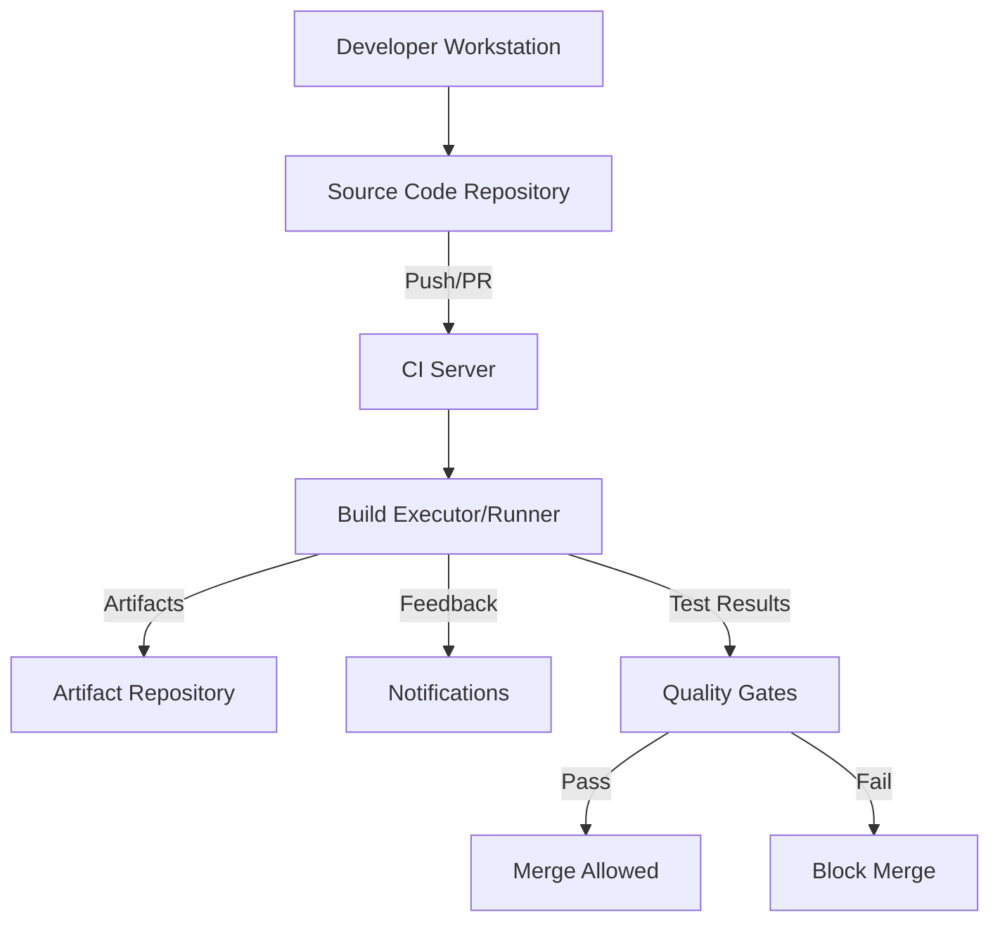
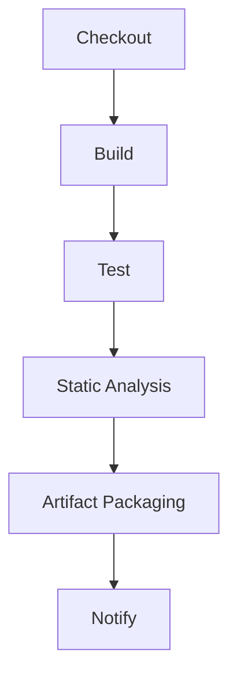
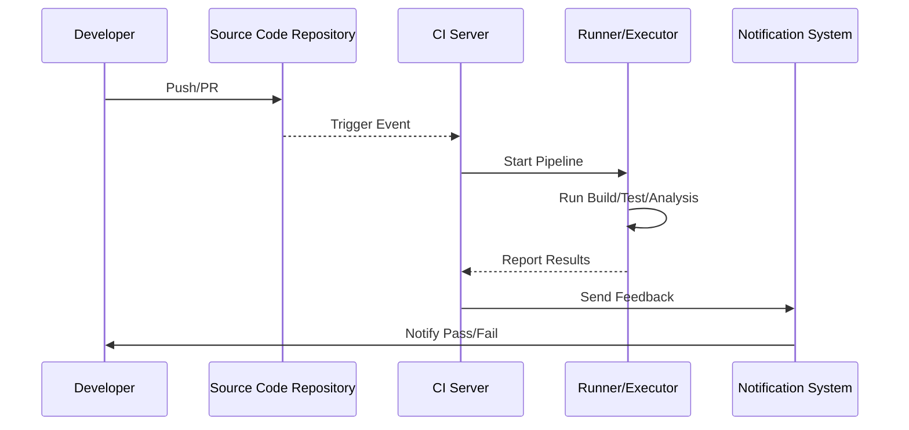

# Continuous Integration Fundamentals

## Introduction

Continuous Integration (CI) is a core software engineering practice that automates the integration of code changes from multiple contributors into a shared repository. By enabling frequent code commits, automatic builds, tests, security checks, and code quality gates, CI aims to detect issues early, improve software quality, and accelerate delivery.

Emerging from the principles of Agile and Extreme Programming (XP), CI serves as the foundation for modern DevOps and continuous delivery/deployment (CD) workflows. This document provides a comprehensive engineering overview of CI, its methodologies, technical architecture, toolchains, key concepts, and implementation nuances.

## Definition and Technical Context

Continuous Integration is defined as the systematic, automated process of:

- Frequently merging developer changes into a central codebase,
- Automatically building and validating those integrations via tests and static analysis,
- Providing rapid feedback to developers about integration quality.

In practice, CI addresses the "integration hell" that occurs when parallel development branches are merged infrequently, leading to complex conflicts and unpredictable software behavior.

CI is often implemented using dedicated server-based tools (such as Jenkins, GitHub Actions, or GitLab CI), adopting triggers on code events, structured workflow pipelines, and integrations with version control systems (VCS).

## Core Concepts and Principles

### 1. **Frequent Commits**

Developers are encouraged to commit small, incremental changes to a shared repository multiple times per day. This reduces merge conflicts, isolates issues, and increases code visibility.

### 2. **Automated Build Pipeline**

Each commit triggers a pipeline that:

- Retrieves the latest code,
- Ensures code can be built from source,
- Runs automated checks (tests, linting, static code analysis),
- Flags integration or quality issues early.

### 3. **Test Automation**

Automated testing—spanning unit, integration, and sometimes end-to-end tests—is integral to CI. Tests must be fast, repeatable, and reliable to provide actionable feedback.

### 4. **Feedback and Visibility**

Immediate feedback is provided to the contributor (and team) upon a pipeline failure, ensuring rapid detection and resolution of problems.

### 5. **Quality Gates**

CI pipelines enforce quality standards before code can be merged. Common gates include minimum test coverage, build-failure prevents merge, style checks, and mandatory code reviews.

### 6. **Consistent Environments**

Pipelines execute in controlled, reproducible environments—often using containers or virtual machines—to ensure consistency across builds and reduce "works on my machine" issues.

### 7. **Automated Security and Compliance Checks**

Modern CI integrates security scanning (SAST/DAST, dependency scanning, secret detection) and license compliance checks.

## CI Architecture Overview

### High-level System View

A typical CI system comprises:

- **Source Code Repository** (e.g., Git)
- **CI Server/Runner** (orchestrating builds and tests)
- **Artifact Storage** (build outputs)
- **Notification/Reporting Systems** (feedback to developers)



**Figure 1:** High-Level Architecture of a CI System

## CI Pipeline Components

A CI pipeline typically consists of sequential or parallel stages:

- **Checkout/Source Retrieval:** Pull latest code from VCS.
- **Build:** Compile source, resolve dependencies.
- **Test:** Execute automated tests (unit, integration, etc.).
- **Static Analysis:** Analyze code for quality, style, and security.
- **Artifact Packaging:** Build deployable artifacts for further testing or release.
- **Notification:** Communicate pipeline status/results.

Stages can be further decomposed and configured as jobs with specific tasks, executed on isolated runners.



**Figure 2:** CI Pipeline Stages

## CI Workflow in Practice

### Typical Workflow

1. **Code Change**: Developer modifies code and pushes to a branch.
2. **Trigger**: Repository events trigger a CI pipeline (e.g., push to main, or pull/merge request).
3. **Pipeline Execution**: Pipeline spins up runners/agents, performs defined build, test, and analysis jobs.
4. **Outcome Reporting**: Results (pass/fail, coverage, lint errors) are posted as feedback to the developer or as status checks on the pull request.
5. **Merge Decision**: Code can be merged/released only if all pipeline steps pass the required gates.



**Figure 3:** CI Workflow Sequence

### Pipeline Definitions

Most CI systems use declarative configuration files (YAML, XML, or domain-specific DSLs) located in the repository (e.g., `.github/workflows/`, `.gitlab-ci.yml`, or `Jenkinsfile`). These files define:

- When to trigger (on push, PR, schedule, manual)
- The pipeline stages, jobs, dependencies, and environment requirements
- Artifacts to archive and tests to report

### Example: Simple CI YAML

```yaml
# Example: GitHub Actions YAML for Node.js
name: CI Pipeline
on: [push, pull_request]
jobs:
  build:
    runs-on: ubuntu-latest
    steps:
      - uses: actions/checkout@v3
      - name: Set up Node
        uses: actions/setup-node@v3
        with:
          node-version: '18'
      - run: npm install
      - run: npm test
      - run: npm run lint
```

## Key CI Tooling

### Popular CI Platforms

- **Jenkins**: Open-source automation server, highly extensible, plugin-rich.
- **GitHub Actions**: Native CI/CD for GitHub repositories, YAML-based workflows.
- **GitLab CI**: Integrated CI/CD for GitLab; strong pipeline-as-code and container support.
- **CircleCI, Travis CI, Azure Pipelines**: Cloud-native, various integrations and pricing models.

### Runners and Agents

A **runner** (or agent) is an execution environment for pipeline jobs. Runners can be managed (hosted by cloud providers or the CI system) or self-hosted (infrastructure controlled by the team).

**Runner characteristics:**

- Can execute on VMs, containers, or bare metal
- Supports isolation, parallelism, custom tooling
- Often ephemeral for clean builds

### Containerization in CI

Containers (typically Docker) are widely utilized in CI pipelines for repeatability, environmental consistency, and dependency management. This supports "build once, run anywhere" guaranteeing parity between developer and CI environments.

## Security in CI

### Attack Surface

CI systems are attractive attack vectors due to:

- Access to sensitive secrets (API keys, database creds)
- Privileged build environments
- Source code access

### Best Practices

- Segregate secrets using dedicated vaults or environment variables with limited scope.
- Minimize runner privileges; avoid running untrusted code on persistent runners.
- Isolate builds per branch, user, or project to limit the blast radius of compromised pipelines.
- Scan for hardcoded secrets and malware in dependencies as pipeline steps.

> [!Caution]
> Misconfigured CI environments or leaking secrets in logs/artifacts can result in critical security breaches.

## Testing and Quality Gates

### Automated Test Coverage

Minimum thresholds for unit/integration/end-to-end test coverage are often enforced. Coverage tools (e.g., Istanbul, JaCoCo, Coveralls) integrate with CI pipelines to block merges on insufficient coverage.

### Static Analysis and Linting

SAST tools (e.g., SonarQube, ESLint, Checkstyle) automatically inspect code for bugs, security flaws, and maintainability. Linting ensures code style and conventions are consistent.

### Dependency and Vulnerability Scanning

Automated tools detect outdated libraries and known vulnerabilities (e.g., OWASP Dependency-Check, Snyk, WhiteSource). Integration as CI steps guarantees continuous compliance and reduces risk.

### Code Review Integration

Modern CI pipelines enforce successful build/test/gate completion before allowing code merges (e.g., protected branches in GitHub/GitLab).

## Branching Strategies and CI

### Trunk-Based Development

All feature changes integrate into a single main branch, minimizing long-lived branches and reducing complex merges.

### Feature Branches and Pull Requests

Developers work on isolated branches, open pull/merge requests, and rely on CI status checks to validate and gate merging into the mainline.

### Fork-Based Workflows

For open source and external contributions, CI runs on forked repositories with limitations on access to secrets and environment variables to limit exposure.

## Scaling and Performance

### Pipeline Parallelization

Jobs can be parallelized across stages (e.g., test sharding) to accelerate feedback. CI platforms provide configurations for parallel test execution and resource management.

### Caching

To avoid redundant work (downloading dependencies, compiling unchanged sources), CI systems support caching build artifacts appropriately.

> [!Tip]
> Cache invalidation is a classic challenge; cache only what is safe and deterministic between builds.

### Queue Management

High-velocity teams may saturate their CI infrastructure, necessitating job queues, prioritization, and autoscaling runners to maintain efficiency.

## Integration Points and DevOps Alignment

### Deployment Automation

While CI is strictly about *integration*, pipelines are often extended to include continuous delivery/deployment (CD). Separation of concerns via environment gates (test, staging, production) is recommended.

### Infrastructure as Code (IaC)

IaC definitions (e.g., Terraform, CloudFormation) often undergo the same CI flows as application code, supporting repeatability and pre-deployment verification.

> [!Note]
> Diagram to be added later: "Pipeline Extension from CI to CD Environments"

### Notification Systems

CI pipeline results are integrated with chat platforms (Slack, MS Teams), issue trackers (JIRA), and dashboards for visibility and incident response.

## Constraints, Variations, and Common Pitfalls

### Constraints and Assumptions

- **Reliable VCS**: CI assumes source code is managed in a robust, accessible repository.
- **Deterministic Builds**: CI pipelines must be deterministic; flaky tests or non-reproducible builds undermine trust in results.
- **Fast Feedback**: Best practices recommend that pipelines provide feedback in minutes, not hours.

### Common Pitfalls

- **Slow Pipelines**: Excessive duration leads to ignored failures and reduced developer engagement.
- **Overly Complex Pipelines**: Difficult to maintain or debug; pipeline-as-code must be clear, modular, and DRY (Don't Repeat Yourself).
- **Flaky Tests**: Unstable test suites produce false negatives, eroding confidence in CI.
- **Improper Secret Handling**: Storing secrets in plaintext or logs introduces security risk.
- **Environment Drift**: Inconsistent pipeline environments lead to non-repeatable results.

> [!Warning]
> Flaky or slow CI pipelines are a leading cause of bottlenecks in modern software delivery; invest in reliable, speedy builds and tests.

## Relevant Standards and Protocols

- **Source Code Management**: Git protocols, GitHub/GitLab API integrations.
- **YAML/DSL pipeline definitions**: Various, e.g., [GitHub Actions Workflow syntax](https://docs.github.com/en/actions/using-workflows/workflow-syntax-for-github-actions), [GitLab CI YAML](https://docs.gitlab.com/ee/ci/yaml/).
- **Testing Frameworks**: xUnit, JUnit, Mocha, pytest, etc.
- **Security Scanning**: SAST/DAST tools compliant with standards like OWASP.

## Summary

Continuous Integration is a foundational engineering discipline that automates the validation of code changes, reduces integration risk, and accelerates delivery. Effective CI implementation requires careful design of automated pipelines, judicious integration of testing and security, disciplined management of environments and secrets, and continuous refinement based on workflow feedback. As organizations mature their software lifecycle, CI forms the bedrock for higher-order practices such as continuous delivery, DevOps, and secure, scalable software engineering.