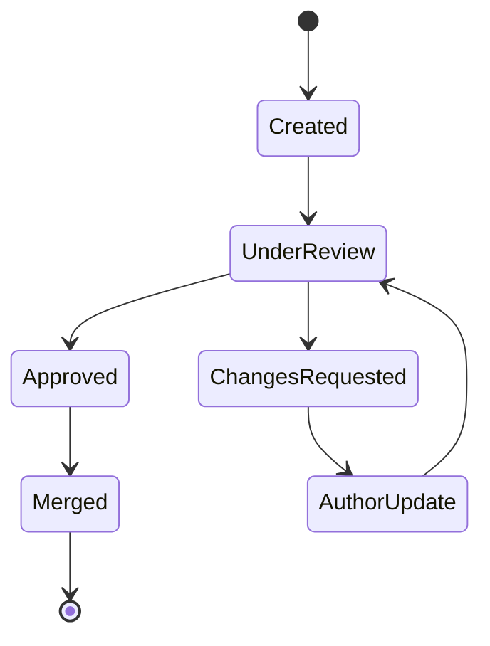
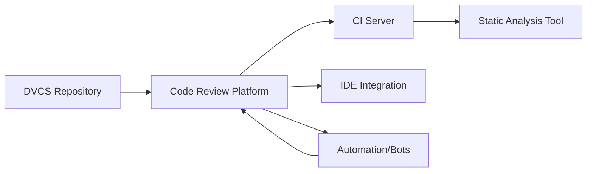

# Code Review Practices

## 1. Introduction

Code review, also referred to as peer code review, is a formal process within software engineering wherein code changes are systematically examined by individuals other than the original author before integration into the main codebase. Code reviews are now considered a standard practice in most modern software development projects, regardless of application domain or scale.

This document details the foundational concepts, workflows, and structured best practices for high-quality code review. It provides clarity on the objectives of code review, the typical roles and workflows involved, and the critical engineering considerations required for efficient and effective peer code review.

## 2. Objectives of Code Review

Code review seeks to maximize software quality, maintainability, and team knowledge sharing. Primary objectives include:

- **Defect Detection**: Identify bugs, logic errors, and security vulnerabilities early in the development cycle.
- **Code Quality Assurance**: Ensure adherence to coding standards, architectural guidelines, and best practices.
- **Knowledge Transfer**: Foster shared code ownership and reduce knowledge silos.
- **Maintainability Improvement**: Assess code clarity, documentation, and future extensibility.
- **Regulatory and Compliance Requirements**: Satisfy process requirements specific to certain industries.
- **Risk Mitigation**: Reduce the risk of regressions and production incidents.

## 3. Core Concepts

### 3.1. Code Change Granularity

Code review generally occurs on discrete changesets—such as pull requests, merge requests, or patches. Effective granularity ensures:

- **Atomicity**: Each review unit should implement a single, well-defined change.
- **Contextual Clarity**: The reviewer can easily understand intent and impact.
- **Efficiency**: Smaller changes are easier to review thoroughly.

### 3.2. Review Scope

A well-defined review scope covers:

- **Functional correctness**: Does the code do what it claims?
- **Non-functional correctness**: Performance, security, thread-safety, etc.
- **Adherence to standards**: Coding conventions and architectural principles.
- **Documentation**: Code comments, API docs, and usage examples.
- **Test completeness**: Quality and coverage of automated tests.

### 3.3. Reviewers and Roles

Typical roles in code reviews include:

- **Author**: Originator of the code change.
- **Reviewer(s)**: One or more engineers who examine the change.
- **Maintainer/Integrator**: Facilitates the merge process; may resolve disputes or coordinate final decision-making.
- **Observer/Stakeholder** (optional): May follow the process without active participation.

## 4. Code Review Workflows

Multiple code review workflows exist, tailored to team structure, tooling, and deployment frequencies. Here are canonical workflows:

### 4.1. Pre-Commit vs. Post-Commit Review

- **Pre-commit Review**: Changes are reviewed before they are merged, blocking integration until approval.
- **Post-commit Review**: Changes are merged to a shared branch first, with review and potential rework after the fact (less common in regulated industries and for critical code paths).

### 4.2. Review Scenes

#### Pull/Merge Request-Based Review (Contemporary Standard)

The dominant workflow centers on feature branches and pull/merge requests in distributed version control systems (DVCS).

```mermaid
flowchart TD
    A[Author Creates Feature Branch] --> B[Pushes Commit(s)]
    B --> C[Opens Pull/Merge Request]
    C --> D[Automatic CI Checks Run]
    D --> E[Reviewer(s) Assigned]
    E --> F[Reviewer(s) Examine Diff]
    F --> G[Feedback and Conversations]
    G -->|Revisions Requested| H[Author Makes Changes]
    H --> C
    G -->|Approved| I[Pull/Merge Request Merged]
    I --> J[Branch Closed]
```

#### Synchronous Over-the-Shoulder Review

In smaller teams or for complex changes, reviews might occur synchronously at the developer's workstation (physically or virtually), permitting real-time interaction.

#### Tool-Assisted Inspections

Some teams use dedicated static analysis and inspection tools in conjunction with, or in place of, human peer review for some classes of issues.

### 4.3. Review States and Decision Points

A review request typically transitions through clearly defined states:

- Created → Under Review → Approved → Merged → Archived (or)
- Created → Changes Requested → Author Update → Under Review (repeat)

#### Example State Diagram



### 4.4. Integration with Continuous Integration/Continuous Deployment (CI/CD)

Automated CI checks (tests, static analysis, linting, policy enforcement) are typically required before or in parallel with peer review. These may be **blocking** (must pass before review) or **advisory** (failures noted but can be overridden).

## 5. Tooling and Infrastructure

Modern teams leverage specialized tooling for code review:

- **DVCS Platforms**: GitHub, GitLab, Bitbucket; provide integrated review, comments, and status checks.
- **Standalone Review Tools**: Gerrit, Review Board, Phabricator; may support more advanced workflows or auditing.
- **IDE Integrations**: Many IDEs and editors support inline review tools and code comment resolution.
- **Static Analysis and Linters**: Automated scanners executed as part of CI or right within the review interface.
- **Bots and Automation**: Used to enforce policies, assign reviewers, label PRs, and even auto-merge in simple cases.

### Integration Point Diagram



## 6. Structured Best Practices

Robust engineering organizations institute code review best practices to maximize efficiency and effectiveness:

### 6.1. Reviewer Assignments

- Assign reviewers by expertise, code ownership, and availability.
- Use tools or round-robin systems to distribute load and avoid burnout.
- Ensure at least one reviewer is familiar with the affected subsystem.

### 6.2. Scope Management

- **Review Small, Focused Changes**: Large, multipurpose changes dramatically decrease review quality.
- **Enforce Change Descriptions**: Require succinct, clear descriptions with context, impact, and test coverage notes.

### 6.3. Review Depth and Thoroughness

- Prioritize high-risk and security-critical areas.
- Apply "trust, but verify" for frequent contributors.
- Avoid rubber-stamping; engage with the logic, not just formatting.

### 6.4. Commenting and Conversation

- Use precise, actionable suggestions rather than ambiguous feedback.
- Prefer inline and contextual comments to aid discoverability.

### 6.5. Handling Disagreements

- Resolve through constructive discussion; escalate to maintainers only when necessary.
- Favor team conventions over personal style preferences.

### 6.6. Automation Synergy

- Use CI pipelines to catch mechanical or repetitive defects so reviewers can focus on logic, design, and architecture.
- Automate labeling, reviewer assignment, and merge conditions where feasible.

### 6.7. Timeliness

- Set clear expectations for maximum review turnaround time.
- Use alerts and dashboards to prevent forgotten or blocked reviews.

### 6.8. Positive Reinforcement and Learning

- Highlight well-written code, thoughtful tests, or elegant solutions during review, not just problems.
- Treat reviews as opportunities for continuous team learning.

> [!TIP]  
> Effective code reviews are not adversarial—approach the process collaboratively rather than competitively.

## 7. Engineering Considerations

### 7.1. Project Scale and Team Structure

- **Small Teams**: May opt for lightweight processes or pair programming as a substitute for formal review.
- **Large Teams**: Require structured tools, automated enforcement, and clear definitions of code ownership.

### 7.2. Regulatory and Auditing Requirements

In safety-critical domains (e.g., aerospace, medical, financial), code reviews are often a **mandatory** artifact of compliance. Reviews must be logged, and all arguments and decisions auditable.

### 7.3. Security and Confidentiality

- Use access controls in review tools to prevent leakage of sensitive code or vulnerabilities.
- Integrate security-specific reviews (sometimes called "Security Champions") for critical systems.

### 7.4. Performance and Scalability

- Large changes and binary files are difficult to review efficiently; prefer incremental and text-based changes.
- High repository velocity (e.g., trunk-based development) may require tighter automation to avoid bottlenecks.

### 7.5. Review Fatigue

- Excess review workload degrades review quality; monitor reviewer assignments and rotate as needed.
- Periodically revisit review checklists to refine based on real-world experience.

> [!CAUTION]
> Over-reliance on tool-driven approvals can decrease review effectiveness—ensure that qualified human reviewers are meaningfully engaged.

## 8. Code Review Checklists

A checklist serves as a cognitive aid for reviewers, promoting thorough and consistent scrutiny.

### Generalized Code Review Checklist

- [ ] Code compiles and passes all automated tests.
- [ ] Code adheres to defined standards and conventions.
- [ ] Logic is clear and free from obvious defects.
- [ ] Sufficient documentation (comments, API docs, usage guides) is present.
- [ ] All relevant edge cases and error paths are handled.
- [ ] Code is modular and maintainable; no unnecessary duplication.
- [ ] Security, privacy, and compliance requirements are satisfied.
- [ ] Performance and resource usage are reasonable.

> [!IMPORTANT]
> Tailor checklists to your team’s language, platform, and risk domains. Standardize them, but revise as the codebase and requirements evolve.

## 9. Common Pitfalls

### Insufficient Review Depth

Rubber-stamping, or perfunctory reviews, introduce risks that are not always immediately visible—particularly regressions and subtle defects.

### Overly Large Changes

Monolithic changes deter thorough review and increase cognitive overload. Large pull requests should be split when possible.

### Poor Communication

Ambiguous comments and lack of constructive feedback foster misunderstanding and slow convergence.

### Ignoring Automation Failures

Reliance on "we'll fix it later" attitudes toward CI/linter failures can nullify the quality benefits of peer review.

### Focus on Style Over Substance

Obsessing over code style to the exclusion of logic, architecture, or requirements can mask more critical defects.

> [!WARNING]
> Never merge code that fails critical CI checks or has unresolved discussions, unless under explicit exception protocols.

## 10. Code Review Metrics and Measurement

Tracking review-related metrics enables teams to optimize the process:

- **Review latency**: Time between request and first/last review.
- **Review throughput**: Volume of code or changes reviewed per unit time.
- **Defect detection rate**: Number of issues found during review versus after release.
- **Rework frequency**: Fraction of reviews requiring rework.
- **Review participation**: Spread and equality of reviewer contributions.

While quantitative measurement is valuable, **beware of incentivizing speed over quality**.

## 11. Variations and Alternatives

### Pair Programming

Live, two-person collaborative development provides real-time review, often eliminating the need for post-hoc review on the same changes. Most effective in small, tightly-coupled teams.

### Lightweight Process (Change Approval)

In rapid prototyping or experimental branches, teams may use lower-friction approvals (e.g., single click, lightweight sign-off) or skip review altogether, recognizing the trade-off in risk and maintainability.

### Formal Inspections

More comprehensive processes (e.g., Fagan inspections) introduce roles, checklists, and multiple review sessions for high-assurance environments.

## 12. Standards and References

While code review itself is a process, not a formal protocol, several standards and practices are widely recognized:

- **IEEE 1028-2008**: Standard for Software Reviews and Audits.
- **OWASP Code Review Guide**: Security-focused review recommendations for web applications.
- **ISO/IEC/IEEE 12207:2017**: Software Life Cycle Processes: includes code review as a recommended activity.
- **Regulatory Guidance**: FDA for medical software, DO-178C for airborne systems impose review mandates.

## 13. Conclusion

Code review is essential to the production of robust, maintainable, and secure code. By combining well-defined objectives, structured workflows, automation, and human expertise, teams maximize both code quality and shared understanding. Rigorous application of review practices, tailored to project context and scaled with effective tooling, forms the backbone of high-performance software engineering organizations.

> [!NOTE]
> Diagram to be added later: Example of a collaborative review conversation, with threaded comments and multi-level discussion.

---

*End of document.*