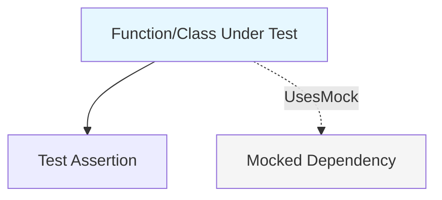
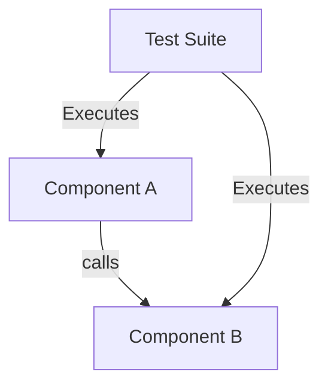
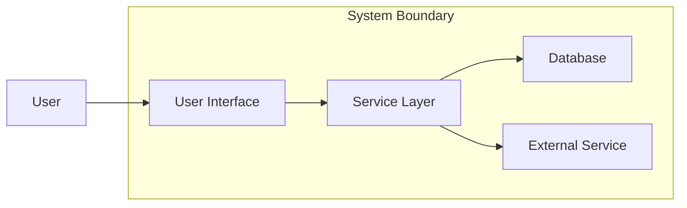
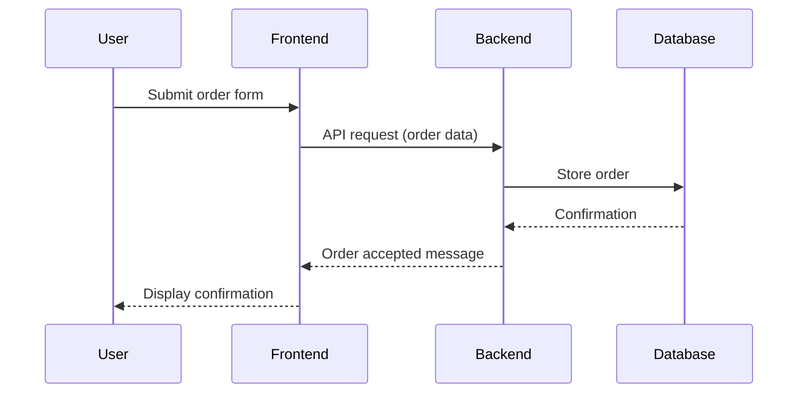
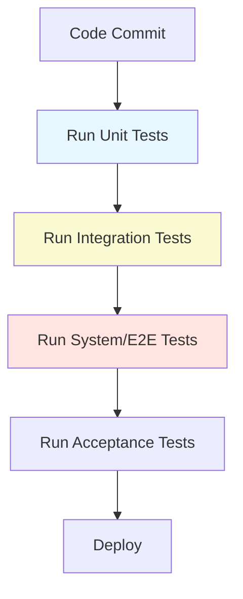

# Testing Strategies and Levels

## 1. Introduction and Context

Testing is a critical discipline within software engineering, required to ensure that delivered systems meet functional and non-functional requirements with predictable quality. Robust testing strategies and a structured approach to testing at different levels (unit, integration, system, acceptance, and regression) are essential for reducing defects, supporting maintainability, and enabling continuous delivery.

Contemporary engineering practice places structured testing within the broader contexts of **DevOps**, **Continuous Integration/Continuous Deployment (CI/CD)**, and **Quality Assurance (QA)**. Testing is not a monolithic activity; rather, it is composed of discrete levels that collectively serve to verify, validate, and monitor software throughout its lifecycle.

---

## 2. Core Concepts: Testing Levels Defined

Software testing is often discussed in terms of levels or stages, each targeting different scopes and objectives. The most universally recognized levels are:

- **Unit Testing**
- **Integration Testing**
- **System Testing**
- **Acceptance Testing**
- **Regression Testing**

These levels exist within a hierarchy, often conceptualized as a test pyramid.

### 2.1 The Test Pyramid

The "Test Pyramid" (originally popularized by Mike Cohn) illustrates the preferred balance and layering of automated tests.

```mermaid
flowchart TD
    A[Unit Tests] --> B[Integration Tests]
    B --> C[System (End-to-End) Tests]
    style A fill:#e6f7ff
    style B fill:#fafad2
    style C fill:#ffe4e1
    subgraph Pyramid Height
        direction TB
        C
        B
        A
    end
```
*Test Pyramid showing the stacking of Unit, Integration, and System tests. Volume is greatest at the base (Unit).*

---

## 3. Unit Testing

### 3.1 Definition

**Unit Testing** focuses on verifying the correctness of the smallest testable parts of an application, often called "units" (commonly functions, methods, or classes).

### 3.2 Architectural Context

- Tests are written alongside source code, typically using dedicated testing frameworks (e.g., JUnit for Java, pytest for Python).
- Units are isolated through dependency injection, stubs, or mocks.
- Fast execution; suitable for running on every code commit.

### 3.3 Scope and Practice

- **Goal:** Ensure that each unit of code performs as intended in isolation.
- Units tested do not involve external integrations (databases, APIs, file systems).
- High coverage supports refactoring and safe incremental development.


*Unit test architecture. The function under test is isolated from its dependencies.*

### 3.4 Engineering Considerations

- Ensure high code coverage but avoid trivial, non-valuable tests.
- Balance between positive, negative, and edge case tests.
- Maintain independence of tests (no shared state).
- Naming and structure alignments for automated discovery.

> **Alert**
> A common pitfall is overspecification—where unit tests are too tightly coupled to the implementation, causing brittleness and excessive maintenance.

---

## 4. Integration Testing

### 4.1 Definition

**Integration Testing** verifies the interaction between units or components, identifying issues arising from the combination that are not evident in isolation.

### 4.2 Architectural Layers

- Test the connections and data flow between modules.
- Involves partial or full integration of subsystems.
- May use real or simulated dependencies (e.g., in-memory databases, stubs).

### 4.3 Levels Within Integration Testing

- **Component Integration:** Tests the interaction of a small number of related modules.
- **System Integration:** Verifies integration across larger subsystems, possibly developed by different teams.


*Integration Test: Test Suite verifies interactions between multiple components.*

### 4.4 Practice and Common Variations

- Focus on realistic interactions; reduce mocking where possible.
- May require specialized test environments (e.g., staging replicas of services).
- Often slower than unit tests, but critical for detecting miscommunication between APIs, data contracts, workflows.

> **Alert**
> Integration tests can be flaky due to environment variability, network issues, or data state. Stable, repeatable environments are critical for reliability.

---

## 5. System Testing

### 5.1 Definition

**System Testing** is the process of testing the complete, integrated software solution to evaluate end-to-end system compliance with requirements.

### 5.2 Scope

- Performed in an environment that closely resembles production.
- Focuses on validating workflows, data integrity, and the co-existence of components under expected (and stress) loads.
- Encompasses both functional and non-functional requirements (performance, security, usability).


*System Testing: End-to-end workflow from user to all underlying system components.*

### 5.3 Practical Aspects

- Involves orchestration of test data, system state, and potentially test doubles for external dependencies.
- Automated "end-to-end" (E2E) test frameworks may be used (e.g., Selenium for web, Cypress).
- May include performance, stress, and security tests.

> **Tip**
> Automate system tests but keep their number and runtime reasonable, as long, brittle E2E suites cause slow feedback and are expensive to maintain.

---

## 6. Acceptance Testing

### 6.1 Definition

**Acceptance Testing** ensures that the system fulfills business requirements and is acceptable to the end user or customer. It is often the final evaluation before release.

### 6.2 Types

- **User Acceptance Testing (UAT):** Performed by end users or stakeholders.
- **Business Acceptance Testing (BAT):** Focuses on business workflows.
- **Contract Acceptance Testing:** Ensures compliance with external or regulatory requirements.

### 6.3 Process

- Derived from user stories, acceptance criteria, or requirements.
- May be manual or automated (e.g., using Cucumber for Behavior-Driven Development).
- Focus on real-world usage scenarios, edge cases, and user experience.

### 6.4 Example Flow


*Acceptance test: Validates that user actions result in the expected outcome across the stack.*

> **Alert**
> Acceptance tests may reveal gaps in requirements or UX ambiguities that were not visible to developers or testers earlier in the process.

---

## 7. Regression Testing

### 7.1 Definition

**Regression Testing** involves re-executing previous tests to ensure that recent code changes have not adversely affected existing functionality.

### 7.2 Motivation and Practice

- Protects against inadvertent defects due to new features, bug fixes, or refactoring.
- Typically automated within CI/CD pipelines for every build.
- Regression suites often aggregate unit, integration, system, and acceptance tests.

### 7.3 Scope

- Full regression: All tests.
- Selective regression: Impact analysis is used to execute only relevant tests.

### 7.4 Engineering Considerations

- Keep regression test suites lean and maintainable.
- Routinely review and refactor test cases to avoid redundant or obsolete tests.
- Monitor test suite duration and failure rates for actionable feedback.

> **Tip**
> Use test coverage tools and traceability matrices to ensure regression tests provide adequate coverage and are linked to requirements.

---

## 8. Engineering Workflows and Test Automation

Testing is most effective when integrated seamlessly into the engineering process. Modern workflows leverage automation, parallelism, and continuous feedback.

### 8.1 CI/CD Pipeline Integration

Typical automated workflows for each level:


*Testing Stages in a Typical CI/CD Pipeline.*

### 8.2 Tooling

- **Unit/Integration:** JUnit, pytest, Mocha, NUnit, TestNG, etc.
- **System/E2E:** Selenium, Cypress, Playwright, TestCafe.
- **Acceptance:** Cucumber, SpecFlow, Behave.
- **Regression:** CI tools (Jenkins, GitHub Actions, GitLab CI) orchestrate regression runs.

> **Alert**
> Parallelization increases speed but may introduce race conditions or data conflicts if tests do not clean up state rigorously.

---

## 9. Constraints, Assumptions, and Practical Challenges

### 9.1 Constraints

- Realistic test data and environment isolation are critical for reliability.
- Integration and system tests are more resource-intensive and slower.
- Test flakiness undermines trust in automation.

### 9.2 Assumptions

- Code is modular and testable (favors highly-cohesive, loosely-coupled architecture).
- Environments are reproducible (infrastructure-as-code, containerization).

### 9.3 Common Pitfalls

- Over-reliance on either too many unit tests (missing integration bugs) or too many end-to-end tests (slow, brittle suites).
- Poor maintenance of test code—loss of test value, increased noise, and reluctance to update.
- Incomplete requirements leading to ineffective acceptance tests.

> **Alert**
> Always treat test code as production code; apply the same standards for readability, maintainability, and review.

---

## 10. Variations and Extensions

### 10.1 Test Automation Strategies

- **Test-Driven Development (TDD):** Writing tests before code to specify intended behavior.
- **Behavior-Driven Development (BDD):** Expressing system behavior in natural language (Given-When-Then) and automating via tools like Cucumber.
- **Continuous Testing:** Automated tests run on every commit/change to provide early feedback.

### 10.2 Specialized Testing Types (Overlap with Levels)

- **Smoke Testing:** Early, basic tests to check overall system health after deployment.
- **Sanity Testing:** Quick check to ensure a specific function or bugfix works as expected.
- **Performance/Load Testing:** Ensures system stability and response times under expected/increased loads.
- **Security Testing:** Probes for vulnerabilities.

> **Note**
> Diagram to be added later—test strategy selection flowchart based on risk, criticality, and release stage.

---

## 11. Standards and References

While no universal international standard defines the precise implementation of each test level, several standards, guides, and models dictate best practices:

- **IEEE 829-2008** (Standard for Software and System Test Documentation): Defines test plan and report structures.
- **ISTQB Syllabus** (International Software Testing Qualifications Board): Foundational definitions of testing concepts and levels.
- **ISO/IEC/IEEE 29119** (Software Testing): International standard for testing processes.

These provide terminology, artifact templates, and process recommendations rather than prescriptive technical implementations.

---

## 12. Summary

A robust testing strategy employs a hierarchical set of levels—unit, integration, system, acceptance, and regression—to provide comprehensive coverage and assurance across the software lifecycle. Each level targets a distinct scope and risk area, and must be understood, implemented, and maintained according to best engineering practices. Test automation, continuous integration, and environment management are fundamental to making multilayered testing practical and effective.

Systematic application of these levels, tailored to the architecture and risks of each project, is essential for predictable, high-quality releases in modern software engineering.