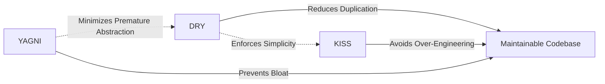
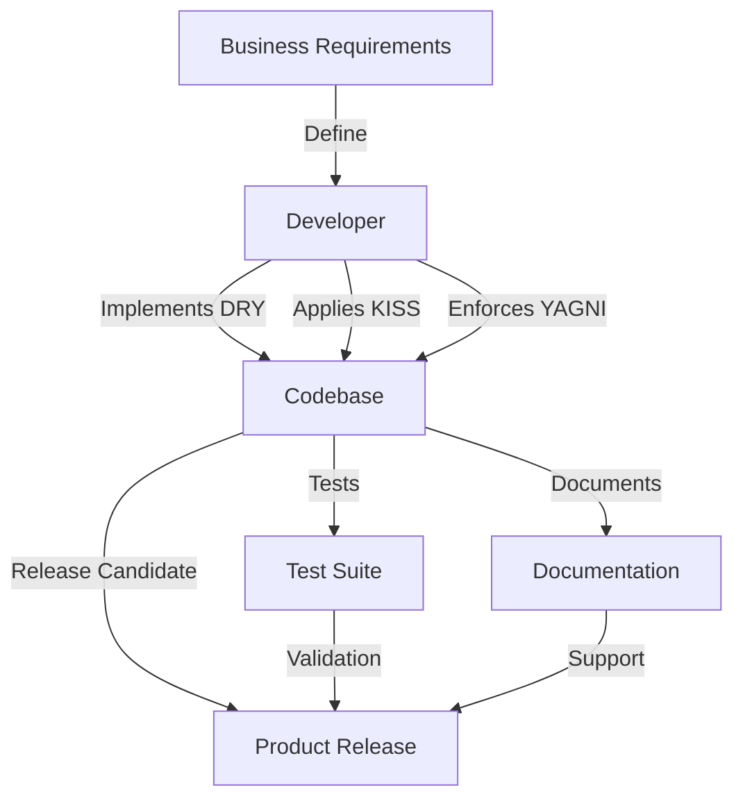

# Introduction

In software engineering, the efficient creation and maintenance of robust systems is guided by a set of widely-adopted heuristics and principles. Among the most fundamental are **DRY** ("Don't Repeat Yourself"), **KISS** ("Keep It Simple, Stupid"), and **YAGNI** ("You Aren't Gonna Need It"). These heuristics drive decision-making in architecture, design, coding, and maintenance by emphasizing simplicity, minimalism, and the avoidance of unnecessary complexity.

This document provides a formal introduction to DRY, KISS, and YAGNI as engineering principles, examining their origins, practical applications, impact on software systems, and the challenges associated with their adoption. It emphasizes workflow implications, constraints, assumptions, and common variations, relating these heuristics to broader industry standards and practices.

# 1. Context and Motivation

The rapid growth in software complexity has elevated the importance of clear, maintainable, and manageable codebases. Maintenance costs, onboarding friction, and defect rates increase exponentially with system complexity. Throughout the history of software engineering, practitioners have sought heuristics to manage and mitigate this complexity.

DRY, KISS, and YAGNI are core tenets for maximizing software maintainability, reducing technical debt, and ensuring long-term project sustainability. They form the bedrock of modern development practices, complementing more detailed methodologies such as the SOLID principles and Clean Code approaches.

# 2. Principle Definitions

## 2.1 DRY (Don't Repeat Yourself)

**Definition:**  
DRY mandates that every piece of knowledge or logic should exist in a single, unambiguous location within a codebase. Repetition is discouraged because duplicating logic introduces the risk of inconsistencies, increases maintenance overhead, and can lead to diverging implementations.

**Origins:**  
First articulated by Andy Hunt and Dave Thomas in "The Pragmatic Programmer" (1999), DRY extends beyond source code to database schemas, configuration files, documentation, and process logic.

**Scope:**  
- Source code logic  
- Business rules  
- API definitions  
- Tests and documentation

**Key Mechanisms:**  
- Code refactoring for reuse (functions, classes, modules)
- Centralization of configuration
- Shared libraries and abstractions

## 2.2 KISS (Keep It Simple, Stupid)

**Definition:**  
KISS advocates for simplicity in design and implementation. Systems should be as simple as possible, avoiding unnecessary complexity, abstractions, and features that do not provide immediate value.

**Origins:**  
First cited by the U.S. Navy in the 1960s and widely adopted in engineering disciplines, KISS asserts that most systems work best if they are kept simple rather than made complicated.

**Scope:**  
- Architecture design  
- Algorithm selection  
- API and interface design  
- Code structure and readability

**Key Mechanisms:**  
- Favoring simple solutions over complex ones  
- Incremental development  
- Minimal viable interfaces

## 2.3 YAGNI (You Aren't Gonna Need It)

**Definition:**  
YAGNI cautions against implementing features or adding abstractions based on anticipated future needs. Features should be built only when there is a demonstrable requirement.

**Origins:**  
Popularized by Extreme Programming (XP) practitioners, especially Ron Jeffries.

**Scope:**  
- Feature development  
- API surfaces  
- Architectural "hooks" and extensibility points

**Key Mechanisms:**  
- Just-in-time feature development  
- Avoidance of gold-plating  
- Deferred generalization

# 3. Principle Interrelations

The principles frequently intersect and reinforce one another. For example, adhering to DRY often leads to simpler codebases (KISS), and not building unnecessary features (YAGNI) supports simplicity and reduces opportunities for code duplication.



# 4. Application in Practice

## 4.1 DRY in Practice

**Workflow Example:**

1. Identify repeated logic blocks or data.
2. Abstract the repeated elements into a single module, function, or class.
3. Refactor all duplicates to reference the shared abstraction.

**Common Engineering Considerations:**
- **Integration:** Centralizing logic may introduce dependencies across teams or modules. Appropriate documentation and test coverage are essential.
- **Performance:** Excessive abstraction can lead to performance tradeoffs, such as additional function calls or tighter coupling.

> **:warning: Caution:** Overzealous adherence to DRY may result in "pseudo-abstractions" that decrease clarity or increase coupling, commonly referred to as the "DRY trap."

## 4.2 KISS in Practice

**Workflow Example:**

1. Determine the simplest viable solution for a given requirement.
2. Validate approach against functional and non-functional requirements.
3. Implement, favoring straightforward constructs and avoiding premature optimization.

**Common Engineering Considerations:**
- **Integration:** Simpler interfaces lower integration barriers and facilitate rapid prototyping.
- **Pitfalls:** Misapplying KISS may oversimplify legitimate complexity, reducing robustness or flexibility.

> **:bulb: Tip:** Simplicity should not come at the expense of correctness, clarity, or extensibility.

## 4.3 YAGNI in Practice

**Workflow Example:**

1. Assess all proposed features or design extensions against immediate requirements.
2. Defer or discard any feature not currently needed.
3. Conduct regular code and architecture reviews to excise speculative code.

**Common Engineering Considerations:**
- **Assumptions:** YAGNI presumes that requirements will evolve and that unused features contribute technical debt.
- **Tradeoffs:** Excessive short-term focus may impede long-term scalability or hamper anticipated growth.

> **:information_source: Note:** Many large-scale software failures have been attributed to "bloatware"—features built for hypothetical future use and never needed.

# 5. Exemplary Architecture

Below is a simplified architectural diagram showing how the three heuristics promote maintainability and high code quality across different layers of a typical software system.



# 6. Common Pitfalls and Constraints

## 6.1 Over-Abstraction

Pursuing DRY can lead to excessive or premature abstraction. This is often seen in the creation of "one-size-fits-all" modules that are difficult to maintain or extend, inhibiting KISS and YAGNI.

> **:warning: Warning:** Resist the urge to generalize abstractions until a clear, recurring pattern emerges.

## 6.2 Oversimplification

Misapplied KISS can result in solutions that ignore necessary complexities or edge cases, resulting in fragile systems.

## 6.3 Premature Optimization and Feature Bloat

Ignoring YAGNI leads to architectural bloat, higher maintenance burdens, and increased onboarding overhead.

## 6.4 Organizational Constraints

- **Team Maturity:** Teams inexperienced with these heuristics may misinterpret their boundaries, resulting in inconsistent application.
- **Legacy Systems:** Integrating DRY, KISS, and YAGNI principles into existing legacy codebases presents unique refactoring challenges.
- **Tooling:** Automated refactoring tools may assist with DRY, but care must be taken to preserve context and intent.

# 7. Integration with Industry Standards

DRY, KISS, and YAGNI are not formalized in standards such as ISO/IEC/IEEE 12207 (Software Life Cycle Processes) or the Agile Manifesto, but they are widely accepted as best practices and inform many coding standards and review processes. They support methodologies such as:

- **SOLID Principles:** Focusing on single responsibility, separation of concerns, and open/closed principle.
- **Clean Code Practices:** Maintaining readability, maintainability, and minimalism.

# 8. Illustrative Code Example

Below is an example of code refactoring in accordance with all three principles.

**Initial implementation (violates DRY, may violate KISS, possibly YAGNI):**

```python
def calculate_area_rectangle(width, height):
    return width * height

def calculate_area_square(side):
    return side * side  # repeat of the area formula

# Unused
def calculate_area_triangle(base, height):
    return 0.5 * base * height  # not needed (YAGNI)
```

**Refactored implementation (adheres to DRY, KISS, YAGNI):**

```python
def calculate_area(shape, *dimensions):
    if shape == 'rectangle':
        return dimensions[0] * dimensions[1]
    if shape == 'square':
        return dimensions[0] * dimensions[0]
    # Only support currently required shapes (YAGNI)
```

# 9. Typical Engineering Decisions

When applying DRY, KISS, and YAGNI, software engineers must:

- Assess whether code/generalization is truly repeated or coincidentally similar.
- Decide when abstraction improves maintainability versus when it's premature.
- Distinguish between simplicity and oversimplification, considering current vs. anticipated requirements.
- Choose appropriate refactoring timelines and strategies in legacy systems or large teams.

# 10. Summary Table

| Principle | Focus                     | Major Benefit                | Typical Pitfall                         |
|-----------|--------------------------|------------------------------|-----------------------------------------|
| DRY       | Duplication Elimination  | Easier maintenance           | Over-abstraction                        |
| KISS      | Simplicity               | Readable, flexible code      | Oversimplification, missing features    |
| YAGNI     | Necessity                | Reduced code bloat           | Short-term thinking, under-preparation  |

# 11. Concluding Remarks

DRY, KISS, and YAGNI are foundational heuristics that serve as guardrails for software engineering teams seeking to manage complexity and produce maintainable, robust systems. Their judicious application aids in mitigating technical debt, enhances team agility, and underpins code quality initiatives across the software lifecycle. Strict adherence, however, requires ongoing vigilance to avoid well-known pitfalls, including over-abstraction, oversimplification, and premature optimization.

These principles align closely with formal methodologies and industry standards aimed at promoting high-quality, maintainable, and comprehensible code. Practitioners are encouraged to approach DRY, KISS, and YAGNI as flexible guidelines, to be balanced with architectural judgment and organizational context.