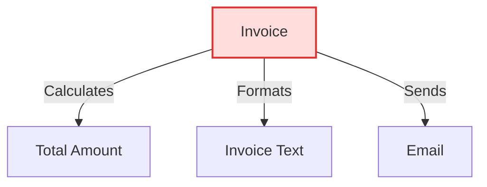
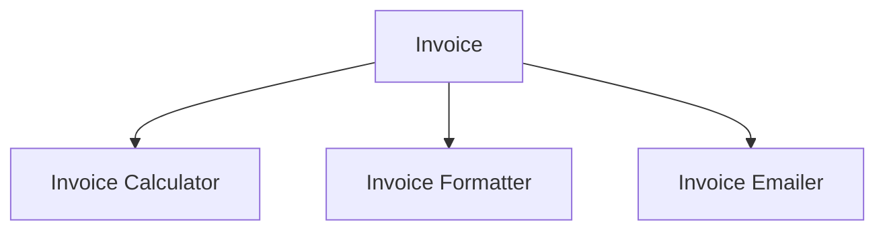
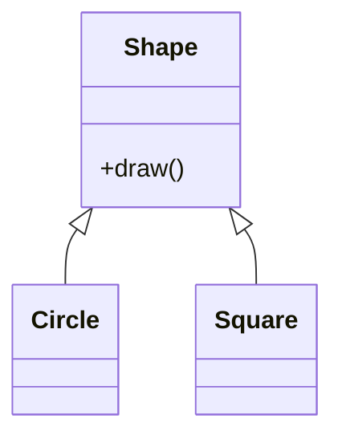
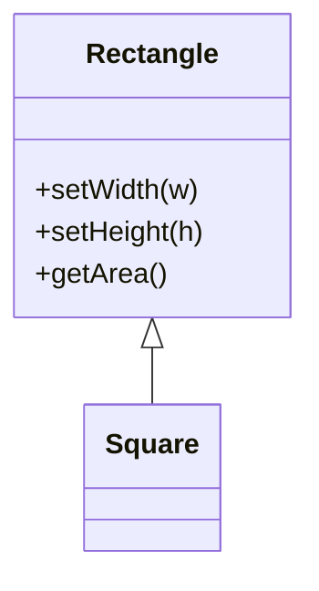
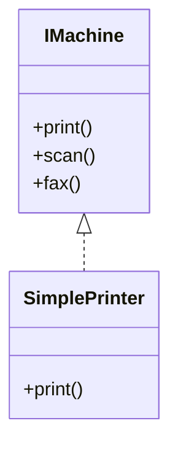
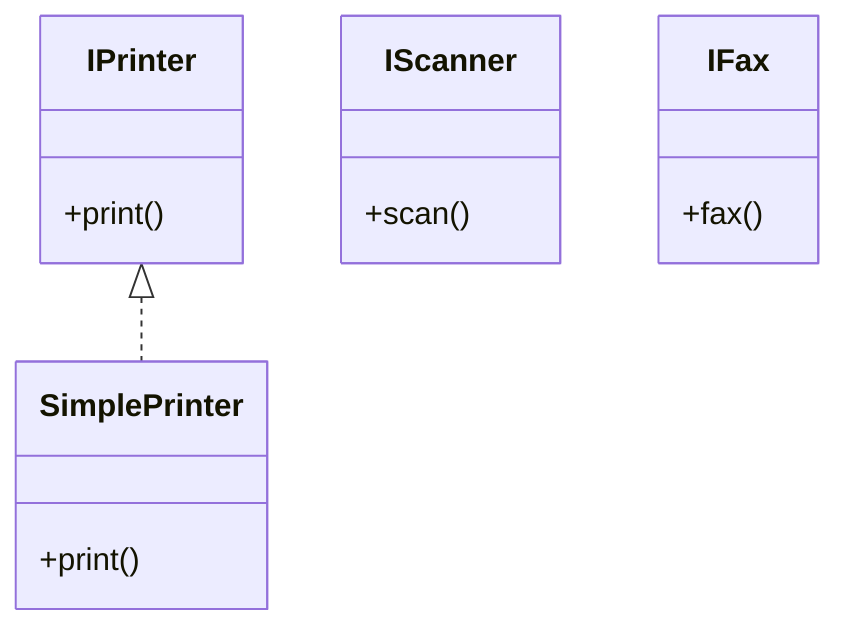
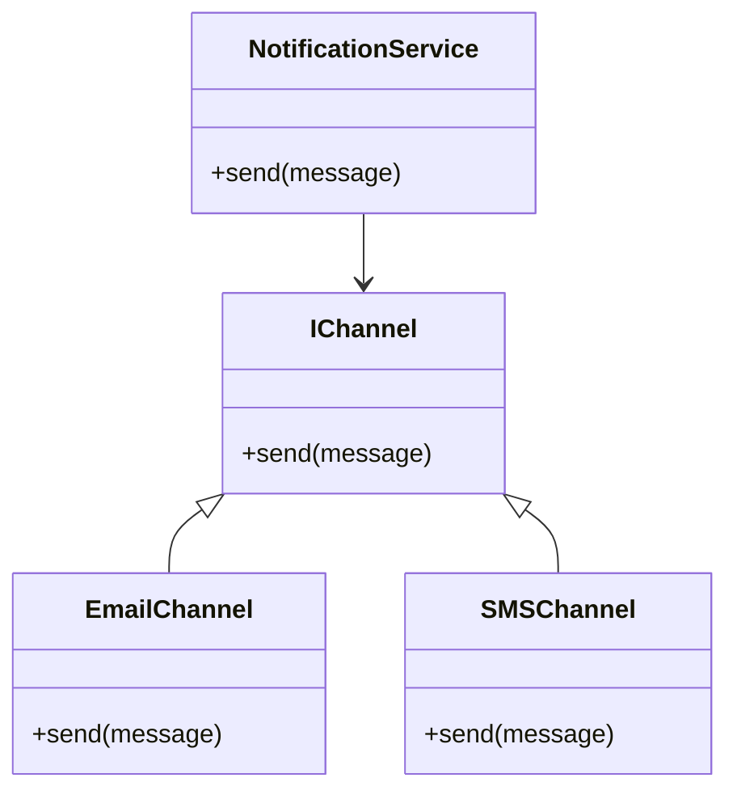
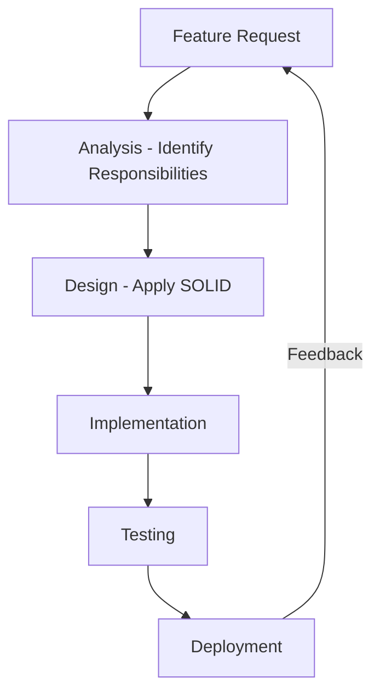
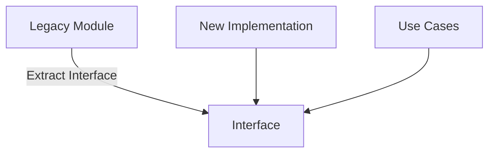

# SOLID Principles

## Introduction

The **SOLID principles** encompass a set of foundational design and development guidelines for object-oriented systems. The acronym "SOLID" was introduced by Michael Feathers, based on principles defined by Robert C. Martin (commonly known as "Uncle Bob"). These principles are intended to guide engineers in creating systems that are **robust, scalable, flexible, and maintainable** by promoting loose coupling, high cohesion, and separation of concerns in software architectures.

In combination with other software engineering best practices, including design patterns and clean architecture, SOLID principles are core to the effective design and evolution of complex codebases. This technical primer provides a comprehensive overview of the SOLID principles, their rationale, practical implementation considerations, and interactions with broader engineering concerns.

---

## The SOLID Acronym

- **S**: Single Responsibility Principle (SRP)
- **O**: Open/Closed Principle (OCP)
- **L**: Liskov Substitution Principle (LSP)
- **I**: Interface Segregation Principle (ISP)
- **D**: Dependency Inversion Principle (DIP)

Each principle addresses specific design challenges common in evolving object-oriented codebases.

---

## Technical Context

SOLID applies most directly to **object-oriented programming paradigms** (e.g., Java, C#, Python, C++), but some interpretations can inform modularity and architectural practices in functional or procedural code. SOLID-compliant designs are especially beneficial in:

- Enterprise applications with evolving requirements
- Frameworks or libraries consumed by third parties
- Large teams where code maintainability is paramount
- Systems requiring extensive testing or with long life cycles

While not formal specifications or regulated standards (unlike, for example, IEEE or ISO Software Engineering Standards), SOLID principles are defined by consensus within the software design community and are foundational elements in core textbooks and academic curricula.

---

## 1. Single Responsibility Principle (SRP)

**Definition:**  
A class (or module, or function) should have exactly one reason to change. This implies that it should encapsulate a single responsibility, or concern.

**Implication:**  
Each module or class addresses a single, well-defined functionality. Changes in requirements should impact only the class responsible for the affected feature.

### Practical Application

- **Responsibility** is defined as a reason to change, not necessarily a single method or operation.
- Avoids blending unrelated functionalities, making code easier to understand, evolve, and test.
- Promotes separation of concerns.

> This diagram illustrates a problematic `Invoice` class violating SRP by performing calculation, formatting, and communication responsibilities.

#### Refactored Example

> After applying SRP, responsibilities are distributed across dedicated collaborating classes.

### Engineering Considerations

- Over-adherence can result in excessive fragmentation ("many small classes").
- Judicious grouping of closely related concerns (cohesion) is essential.
- Interfaces and adapters (per the Adapter pattern) are often used to decouple these responsibilities.

---

## 2. Open/Closed Principle (OCP)

**Definition:**  
Software entities (classes, modules, functions) should be open for extension but closed for modification. That is, the behavior of a module can be extended without modifying its source code.

**Implication:**  
Adding new features or behaviors should not require altering existing, tested code. This enables safe evolution of systems and reduces the risk of introducing regressions.

### Typical Structures

- Use of **abstract base classes**, **interfaces**, and **polymorphism**.
- Strategic use of design patterns: **Strategy**, **Decorator**, **Observer**, and **Factory**.
- Reliance on **inheritance** and/or **composition**.

> New shape types can be added by extending `Shape`, without modifying the existing drawing logic.

### Engineering Considerations

- Excessive use of inheritance for OCP compliance can lead to "inheritance hierarchies" and brittle code.
- Composition (object delegation) often preferable to inheritance.
- Extensibility assumptions must be anticipated. Always provide extension points only for genuinely variable aspects.

---

## 3. Liskov Substitution Principle (LSP)

**Definition:**  
Objects of a superclass should be replaceable with objects of a subclass without adversely affecting the correctness of the program ([Liskov, 1987](https://dl.acm.org/doi/10.1145/38807.38821), "Data Abstraction and Hierarchy").

**Implication:**  
Subclasses must honor contracts established by their superclasses—"behavioral subtyping." Programs relying on the base class interface must not fail or misbehave if a derived class is substituted.

### Example Violation

A classic example is a `Rectangle`/`Square` hierarchy:

If `Square` overrides `setWidth` or `setHeight` to enforce equal sides, it may break code written for `Rectangle`.

### Guidelines

- Subclasses should never weaken preconditions nor strengthen postconditions.
- Prefer composition over inheritance when behavioral invariants cannot be preserved.
- Consider applying the **Design by Contract** approach to express expected behavior.

> **Alert**  
> Violations of LSP often lead to subtle bugs and maintenance headaches. Always verify substitutability with thorough testing.

---

## 4. Interface Segregation Principle (ISP)

**Definition:**  
Clients should not be forced to depend on interfaces they do not use. Prefer many client-specific interfaces over one general-purpose interface.

**Implication:**  
Large, "fat" interfaces impose unnecessary knowledge of methods clients do not require. Refactoring into smaller, more focused interfaces enhances maintainability and testability.

### Example

Here, `SimplePrinter` must implement unrelated methods.

#### Refactored Structure

> Each interface expresses a single responsibility, allowing clients to depend only on the functionality they require.

### Engineering Considerations

- Proliferation of small interfaces can lead to interface management overhead.
- Compose interfaces in layers, e.g., by aggregating through interface inheritance.

---

## 5. Dependency Inversion Principle (DIP)

**Definition:**  
High-level modules should not depend on low-level modules. Both should depend on abstractions. Abstractions should not depend on details; details should depend on abstractions.

**Implication:**  
Architectures should be designed around abstractions (interfaces or abstract classes), decoupling policy from implementation.

### Structure

- **High-level modules** define interfaces for required behaviors.
- **Low-level modules** implement these interfaces.
- Dependency injection (constructor/method/property injection) is a common mechanism.

> `NotificationService` depends only on the interface, and not on concrete implementations.

### Engineering Considerations

- Promotes testability (dependency mocks/stubs).
- Enables plug-and-play of new implementations with minimal code change.
- Requires extra configuration/plumbing (e.g., dependency injection frameworks, factories).
- Excessive abstraction may reduce readability and increase complexity in small or self-contained codebases.

---

## SOLID Principles in Practice

### Typical Workflows

1. **Requirement Analysis**: Identify changing and stable aspects of the system.
2. **Design**: Structure modules/classes to encapsulate single responsibilities, define interfaces for variable behaviors, and establish dependencies on abstractions.
3. **Implementation**: Use dependency injection, compose small interfaces, and utilize inheritance/composition appropriately.
4. **Testing**: Substitute mock implementations and verify substitutability and compatibility.
5. **Refactoring**: Restructure code as requirements evolve to maintain compliance.

---

## Architectural Patterns and SOLID Alignment

SOLID principles frequently underlie popular **architectural patterns**:

- **Layered Architecture**: Each layer depends on abstractions defined by a higher layer.
- **Hexagonal (Ports & Adapters)**: All core logic depends on abstract ports, adapters implement specifics.
- **Clean Architecture** (as defined by Robert C. Martin): Layered, explicit DIP, high testability, strong alignment with SOLID.

**Note**  
Mermaid diagrams expressing entire Clean Architecture or Hexagonal architecture may be helpful additions; these may be added later.

---

## Constraints and Limitations

- Not all software requires strict adherence to all SOLID principles. For small, temporary, or prototypical codebases, the costs may outweigh the benefits.
- Over-application can lead to over-engineered, overly abstract solutions, especially in projects with limited requirements for change or extension.
- Most beneficial in large, collaborative, and/or long-lived codebases.

---

## Integration and Engineering Decisions

- **Integration Points:** Interfaces and abstractions are primary integration points. This structure supports plugin architectures, microservices, or modular monoliths.
- **Performance:** Excessive abstraction may introduce indirection, slightly impacting performance. Premature optimization should be avoided; measure before refactoring.
- **Testing:** SOLID-compliant designs are easier to unit test (mocking, stubbing), improving CI/CD feedback cycles.
- **Legacy Code:** Refactoring towards SOLID can be incremental. Techniques like the "strangler pattern" support gradual architectural improvements.

---

## Common Pitfalls

> **Warning**
> - Excessive interface and class fragmentation can create maintenance complexity.
> - Misapplication of inheritance (to force OCP) may create tight coupling and hinder flexibility.
> - Neglecting LSP can introduce substitutability bugs that are difficult to diagnose.
> - Not all responsibilities are equally "atomic"; balancing cohesion and granularity is an engineering judgment.

---

## Summary Table

| Principle | Key Focus            | Design Goal                                  | Typical Pattern(s)         |
|-----------|---------------------|----------------------------------------------|---------------------------|
| SRP       | Responsibility      | Separation of concerns                       | Modular classes/modules    |
| OCP       | Extensibility       | Add functionality without modifying code     | Strategy, Decorator       |
| LSP       | Substitutability    | Reliable polymorphism                        | Inheritance, Design-by-Contract |
| ISP       | Interface granularity| Prevent client over-coupling                  | Client-specific interfaces |
| DIP       | Abstraction, Coupling| Invert source of dependency                   | Dependency Injection, Factories  |

---

## Conclusion

The SOLID principles serve as a rigorous foundation for modern object-oriented software engineering. They enable teams to build systems that can accommodate changing requirements, scale to new features, and remain maintainable over time. Applying SOLID does not guarantee the absence of architectural issues, but systematic adherence significantly reduces the incidence of tightly coupled, fragile, or monolithic codebases.

Practical use of SOLID requires contextual adaptation: engineers must weigh trade-offs in abstraction, performance, readability, and code manageability. Understanding and internalizing these principles is essential for engineers intent on effective design, quality assurance, and sustainable delivery of large-scale software systems.