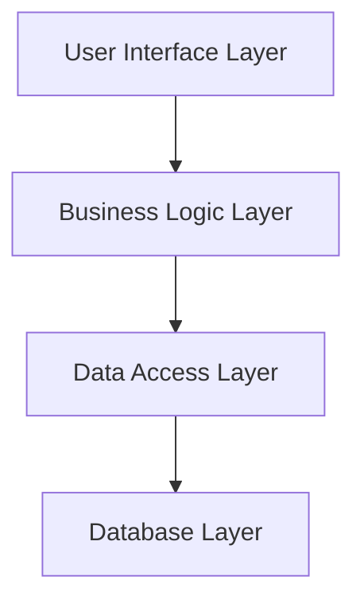
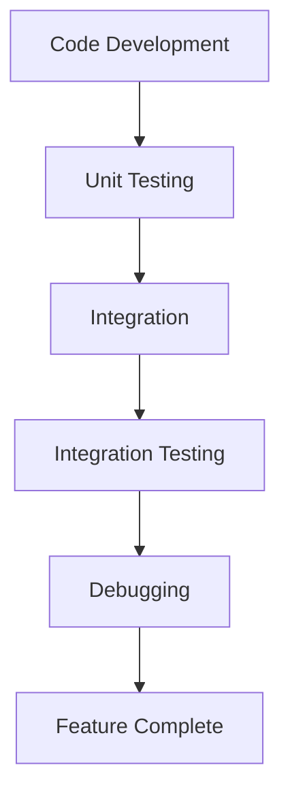
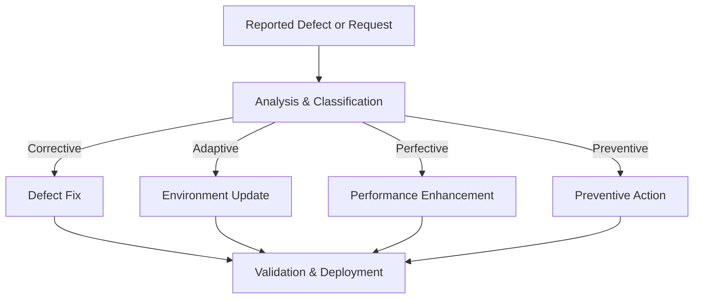
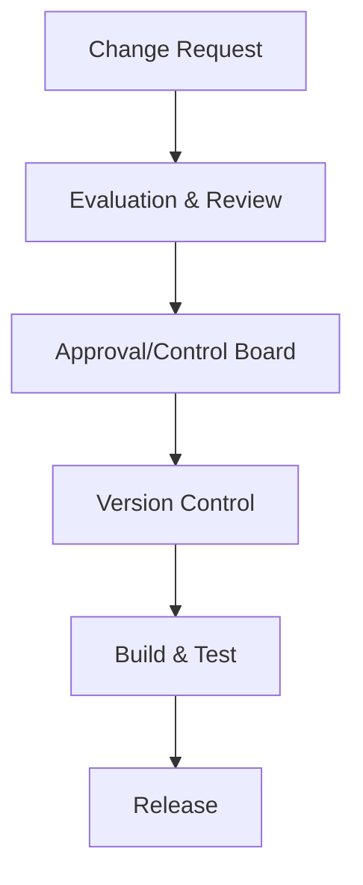
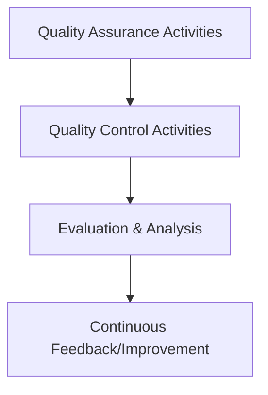
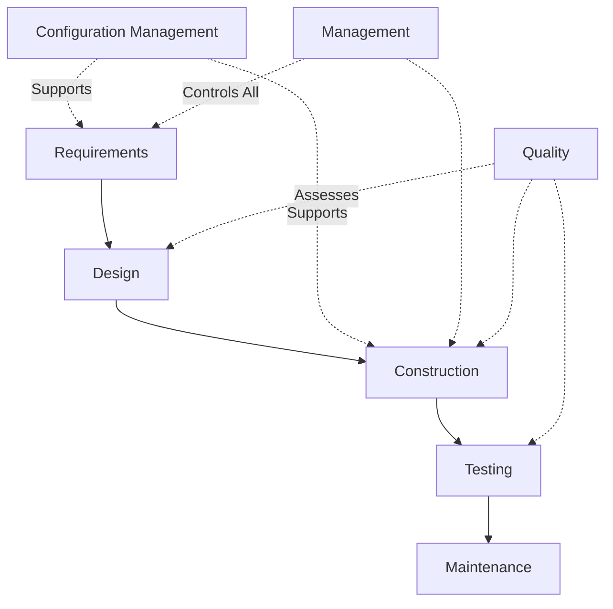

# SWEBOK Knowledge Areas

## Introduction to SWEBOK

The Software Engineering Body of Knowledge (SWEBOK) is an internationally recognized guide that defines the scope and structure of the software engineering discipline. Maintained by the IEEE Computer Society, SWEBOK establishes a coherent, shared vocabulary and framework for the practice and teaching of software engineering. The guide is widely referenced in academia, industry, licensing bodies, and professional standards. It is aligned with ISO/IEC/IEEE 24773 and other global frameworks for software engineering competence.

At the core of SWEBOK are its **Knowledge Areas (KAs)**. Each KA represents a significant consensus area within the discipline, enumerating the core topics, techniques, and practices that form the foundation of professional software engineering.

## SWEBOK Knowledge Areas: Structure and Purpose

SWEBOK does not prescribe a linear approach to software engineering but instead identifies the concepts and activities essential across the life cycle of software systems. The KAs encapsulate functions from requirements gathering through design, implementation, verification, and maintenance, as well as supporting disciplines like project management, engineering economics, and process improvement.

There are **15 Knowledge Areas** in SWEBOK (Version 3.0) that cover the breadth of software engineering. These KAs are:

1. Software Requirements
2. Software Design
3. Software Construction
4. Software Testing
5. Software Maintenance
6. Software Configuration Management
7. Software Engineering Management
8. Software Engineering Process
9. Software Engineering Models and Methods
10. Software Quality
11. Software Engineering Professional Practice
12. Software Engineering Economics
13. Computing Foundations
14. Mathematical Foundations
15. Engineering Foundations

Each KA is further subdivided into key topics and subtopics (known as topic breakdowns and reference lists), which map to established practices, standards, and tools.

Below, we detail each of the principal SWEBOK KAs, exploring both their theoretical foundations and how they interface in the software engineering process.

---

## Software Requirements

**Software Requirements** is concerned with the definition, documentation, and management of software needs. It encompasses the processes and artifacts required to specify what a system should do, how it should behave, and any constraints it must observe.

### Key Concepts

- **Requirements Elicitation**: Gathering needs from stakeholders through interviews, surveys, observation, prototyping, and other methods.
- **Requirements Analysis**: Refining, decomposing, and modeling requirements to ensure clarity, feasibility, and testability.
- **Requirements Specification**: Creating structured documents such as Software Requirements Specifications (SRS), often guided by standards like IEEE 830.
- **Requirements Validation**: Ensuring that documented requirements accurately reflect stakeholder intentions and are internally consistent.
- **Requirements Management**: Controlling changes to requirements throughout the project lifecycle.

### Workflow Example in Requirements Engineering

```mermaid
flowchart TD
    [Stakeholders] -->|Provide Input| [Elicitation]
    [Elicitation] -->|Produce Raw Requirements| [Analysis]
    [Analysis] -->|Model & Refine| [Specification]
    [Specification] -->|Create SRS| [Validation]
    [Validation] -->|Ensure Alignment| [Requirements Baseline]
    [Requirements Baseline] -->|Undergoes| [Change Control]
```

### Practical Considerations

- Traceability: Ensuring each requirement can be linked to corresponding design, implementation, and test artifacts.
- Volatility: Requirements are prone to changes; sophisticated change and version control mechanisms are essential.
- Ambiguity Mitigation: Utilizing modeling languages (UML, SysML) and formalisms to improve precision.


## Software Design

**Software Design** describes the technical process of envisioning and defining a software solution's architecture, components, interfaces, and other characteristics. The design phase translates requirements into a blueprint for construction.

### Key Concepts

- **Architectural Design**: High-level structural decisions, including architectural patterns (e.g., layered, microservices), system components, and their interactions.
- **Detailed Design**: Specification of individual modules, data structures, algorithms, and interface details.
- **Design Principles**: Concepts such as modularity, cohesion, coupling, abstraction, separation of concerns, and encapsulation.
- **Design Methodologies**: Waterfall, iterative, agile, and component-based approaches. Utilization of design patterns (GoF, enterprise, architectural).
- **Design Notations**: Standardized ways to express system architecture and design, such as UML, ER diagrams, or architecture description languages (ADLs).

### Layered Software Design Architecture



### Practical Considerations

- Scalability, reliability, and maintainability must be accounted for during the design phase.
- Balancing trade-offs between performance, extensibility, and complexity is a typical challenge.
- Adherence to relevant architectural and design standards (e.g., IEEE 1471 for architecture descriptions).

---

## Software Construction

**Software Construction** refers to detailed creation of working software through coding, verification, integration, and debugging.

### Key Concepts

- **Coding**: Implementing software units in accordance with specifications and established coding standards.
- **Unit Testing**: Verifying the smallest testable parts of the application for correctness.
- **Integration**: Combining implemented units into coherent subsystems.
- **Debugging**: Locating and resolving defects or inconsistencies.

### Software Construction Life Cycle



### Practical Considerations

- Adherence to language-specific standards, code reviews, and use of static/dynamic analysis tools.
- Incremental development and use of continuous integration pipelines are best practices.


## Software Testing

**Software Testing** comprises planned activities for evaluating and verifying software products to ensure their quality and alignment with requirements.

### Key Concepts

- **Test Levels**: Unit, integration, system, and acceptance testing.
- **Test Techniques**: Black-box (functional), white-box (structural), and grey-box methods.
- **Test Management**: Test planning, strategy, traceability, execution, and reporting.
- **Automation**: Use of frameworks and tools to enable reproducible, scalable testing.

### Testing Process Overview

```mermaid
flowchart TD
    [Test Planning] --> [Test Design]
    [Test Design] --> [Test Implementation]
    [Test Implementation] --> [Test Execution]
    [Test Execution] --> [Test Reporting]
```

### Practical Considerations

- Requirement traceability matrices ensure all requirements are covered by tests.
- Test data management and environment configuration are critical for reproducibility.
- Compliance with quality standards such as ISO/IEC/IEEE 29119 (Software Testing).


## Software Maintenance

**Software Maintenance** encompasses modifications after initial deployment to correct faults, improve performance, or adapt software to a changing environment.

### Key Concepts

- **Corrective Maintenance**: Addressing discovered defects.
- **Adaptive Maintenance**: Modifying software to remain compatible with evolving environments.
- **Perfective Maintenance**: Enhancing performance and maintainability.
- **Preventive Maintenance**: Making changes to prevent future problems.

### Maintenance Activity Flow



### Practical Considerations

- Systematic change management, adherence to configuration management, and regression testing are critical.
- Managing technical debt and documentation quality impacts long-term maintainability.


## Software Configuration Management

**Software Configuration Management (SCM)** is the discipline of tracking and controlling changes in software, including code, documents, and other artifacts.

### Key Concepts

- **Version Control**: Managing multiple versions of artifacts using tools like Git, SVN, or Mercurial.
- **Change Control**: Formal process for requesting, evaluating, and authorizing modifications.
- **Build Management**: Automation of software builds and releases.
- **Release Management**: Coordinating releases to users or production.

### SCM Workflow



### Practical Considerations

- Establishing baselines at key project milestones.
- Audit trails and traceability are required for compliance and quality assurance.
- Tool integration (e.g., CI/CD) is vital for effectiveness.


## Software Engineering Management

**Software Engineering Management** addresses project and risk management, planning, monitoring, and leadership for software projects.

### Key Concepts

- **Project Planning**: Scope, time, cost, risk, and resource planning. Standards: PMBOK, ISO/IEC/IEEE 12207.
- **Project Monitoring and Control**: Measuring progress and taking corrective actions.
- **Risk Management**: Identification, analysis, and mitigation of risks associated with development.
- **People Management**: Team building, communication, training, and performance assessment.

### High-Level Project Management Phases

```mermaid
flowchart TD
    [Initiation] --> [Planning]
    [Planning] --> [Execution]
    [Execution] --> [Monitoring & Controlling]
    [Monitoring & Controlling] --> [Closure]
```

### Practical Considerations

- Methodology selection (agile, waterfall, hybrid) impacts role assignments and communication.
- Resource constraints drive estimation, prioritization, and trade-offs.


## Software Engineering Process

**Software Engineering Process** defines the process frameworks, lifecycles, and practices utilized in software projects.

### Key Concepts

- **Process Models**: Waterfall, incremental, iterative, agile (e.g., Scrum, Kanban), and spiral.
- **Process Assessment and Improvement**: Capability Maturity Model Integration (CMMI), ISO/IEC 15504 (SPICE).
- **Process Metrics**: Quantitative analysis of process effectiveness and productivity.

### Software Process Models Comparison

```mermaid
graph TD
    WF[Waterfall]
    IN[Incremental]
    AG[Agile]
    SP[Spiral]
    WF -->|Structure| [Plan-Driven]
    IN -->|Structure| [Emergent]
    AG -->|Flexibility| [Collaborative & Adaptive]
    SP -->|Risk Mgmt| [Iterative Risk Focus]
```

### Practical Considerations

- Tailoring processes to organizational needs and project characteristics is common practice.
- Process improvement initiatives depend on maturity assessments and metric analysis.

---

## Software Engineering Models and Methods

This KA addresses the formal and semi-formal methods for modeling and analyzing systems throughout the lifecycle.

### Key Concepts

- **Modeling Languages**: UML, SysML for visual modeling; formal methods include Z, B, VDM.
- **Methodologies**: RUP, Agile Modeling, Domain-Driven Design.
- **Verification Techniques**: Model checking, theorem proving, simulation.

### Practical Considerations

- The adoption of models and methods is influenced by project criticality and safety/security requirements.
- Not all modeling approaches are suitable for every context; pragmatism is required.

---

## Software Quality

**Software Quality** encompasses practices, models, and measurements that address the degree to which software meets requirements and user expectations.

### Key Concepts

- **Quality Attributes**: Reliability, usability, performance, security, maintainability, portability.
- **Quality Models**: ISO/IEC 25010 (SQuaRE), McCall, Boehm.
- **Quality Assurance (QA)**: Process-centered activities like reviews and audits.
- **Quality Control (QC)**: Product-focused activities like inspections and testing.

### Quality Management Flow



### Practical Considerations

- Quality requirements must be explicit and measurable.
- Trade-offs exist between quality attributes (e.g., performance vs. maintainability).


## Software Engineering Professional Practice

This KA deals with professional responsibility, ethics, standards, and communication.

### Key Concepts

- **Ethics**: Compliance with codes such as the ACM/IEEE-CS Software Engineering Code of Ethics.
- **Professional Development**: Continual learning, credential maintenance.
- **Standards Adherence**: Following industry and organizational standards (e.g., ISO/IEC/IEEE 12207, 90003).

### Practical Considerations

- Unethical conduct can result in product failures, legal actions, and damage to reputation.
- Mentorship and knowledge sharing are essential for organizational growth.


## Software Engineering Economics

**Software Engineering Economics** covers the cost, benefit, and value considerations in software design, development, and deployment.

### Key Concepts

- **Cost Estimation**: Models such as COCOMO II, Function Points, Use Case Points.
- **Economic Analysis**: Return on investment (ROI), Net Present Value (NPV), cost-benefit analysis.
- **Budgeting and Resource Allocation**: Financial planning and management throughout the project.

### Practical Considerations

- Inaccurate estimation is a frequent source of project overruns.
- Economic modeling assists in make-buy or prioritization decisions.

---

## Foundations Knowledge Areas

SWEBOK includes three KAs that ground software engineering in foundational disciplines:

### Computing Foundations

- Algorithms, data structures, programming languages, and system fundamentals.
- Understanding computational limits, complexity, and hardware/software co-design.

### Mathematical Foundations

- Discrete mathematics, logic, statistics, and probability underpin software modeling, analysis, and verification.

### Engineering Foundations

- General engineering ethics, process, and systems thinking.
- Application of reliability, safety, and quality engineering principles in a software context.

---

## Interactions Between Knowledge Areas

No SWEBOK KA exists in isolation. The practice of software engineering requires traversing, revisiting, and integrating concepts across multiple KAs. For example, effective project management (Management KA) relies on a clear requirements baseline (Requirements KA), while sound design (Design KA) eases maintenance (Maintenance KA) and fosters higher quality (Quality KA).

### Example: Typical Software Life Cycle and KA Intersections



---

## Standards and Best Practices

Many KAs reference widely adopted standards and best practices, including:
- **IEEE 830**: Software requirements specification.
- **IEEE 1471**: Architectural description.
- **ISO/IEC/IEEE 12207**: Software life cycle processes.
- **ISO/IEC/IEEE 29119**: Software testing.
- **ISO/IEC 25010**: Software product quality models.
- **IEEE/ACM Software Engineering Code of Ethics**.

Adherence facilitates interoperability, traceability, and higher software quality.

---

## Engineering Considerations

### Integration Points

- Seamless collaboration between KAs depends on tooling (e.g., requirements management, version control, modeling environments).
- Data traceability between artifacts (requirements → design → code → test) is essential for regulated domains.

### Performance Implications

- Upfront investment in requirements and design yields tangible benefits in test coverage, maintainability, and defect reduction.
- Automation in configuration management and testing enhances consistency and reduces latent errors.

### Implementation Challenges

- Overlap and ambiguity between KAs (e.g., difference between design and construction tasks).
- Keeping process overhead proportional to project size and risk (“right-sizing” practices).

### Common Pitfalls

> **Caution**  
> Over-reliance on informal processes or inadequate requirements management can lead to late-stage project failures.

> **Warning**  
> Neglecting configuration management and quality assurance increases technical debt and hinders reproducibility.

---

## Conclusion

The SWEBOK Knowledge Areas framework provides a comprehensive taxonomy for software engineering activities, integrating core elements required for robust, maintainable, and high-quality software systems. For practicing engineers, fluency in these KAs is critical to achieving successful results, ensuring compliance with standards, and advancing both individual and organizational competence. SWEBOK’s modular approach enables tailored practices and continuous improvement, underpinning software engineering as an engineering discipline.