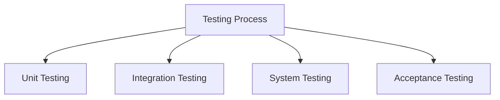
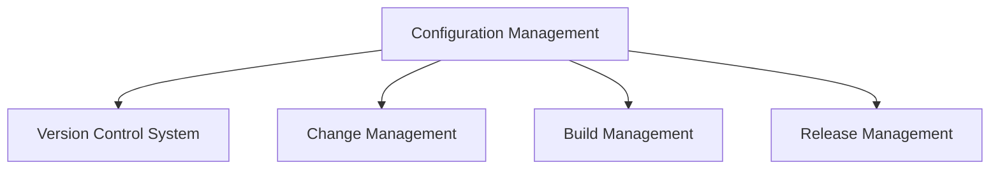
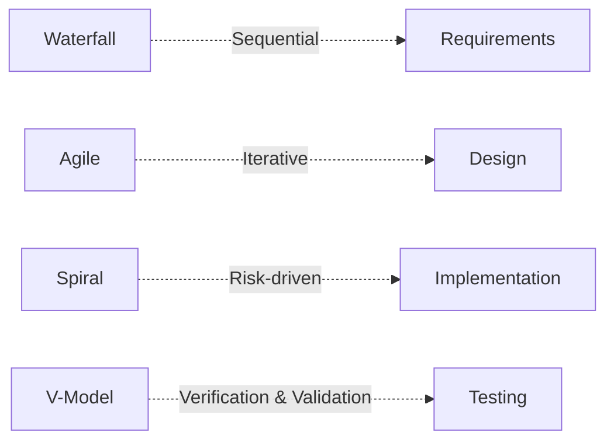
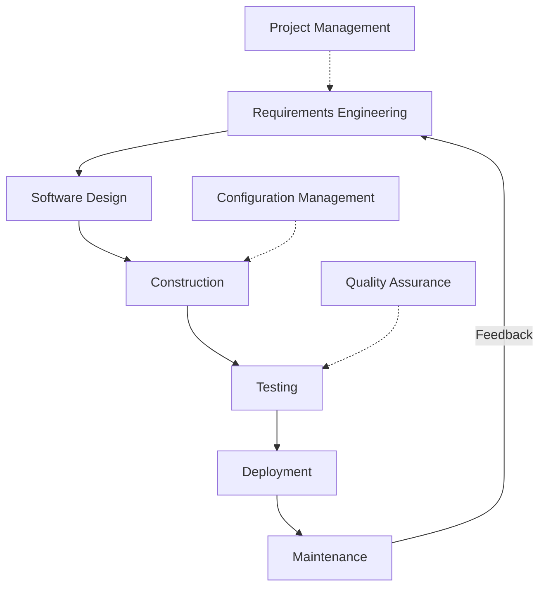

# SWEBOK Overview

## Introduction

The Software Engineering Body of Knowledge (SWEBOK) is an internationally recognized guide that catalogues the knowledge areas considered essential to the discipline of software engineering. Published and maintained by the IEEE Computer Society, SWEBOK offers a consensus-based description of best practices, terminology, and fundamental concepts that define the field. Engineers, educators, certifying bodies, and organizations reference SWEBOK to align on the scope and structure of professional software engineering.

The guide aims to promote a consistent view of software engineering, establish a foundation for professional practice, and facilitate unified standards for training and certification. SWEBOK is structured as a compendium of **Knowledge Areas (KAs)**, each reflecting a principal discipline within software engineering.

## Positioning SWEBOK in Technical Context

Software engineering exists at the intersection of software development, systems engineering, quality assurance, and project management. Unlike informal programming, software engineering is governed by processes, methodologies, and standards intended for large-scale, reliable, and maintainable systems. SWEBOK exists to define what every competent software engineer should know, and bridges the gap between academic theory, industrial practice, and international standards (e.g., IEEE, ISO/IEC).

SWEBOK does _not_ specify a particular methodology (such as Agile or Waterfall), nor does it describe prescriptive processes. Rather, it enumerates generic knowledge expected for the profession, including multiple accepted approaches to each problem domain.

> :warning: **Caution**
>
> SWEBOK is frequently revised and expanded in consultation with industry and academia (with SWEBOK Guide V3 being the latest major version at the time of writing). Practitioners should always confirm references are current and aligned with project needs.

## Architectural Overview of SWEBOK

SWEBOK divides software engineering knowledge into 15 principal Knowledge Areas (KAs), along with related topics such as professional practice and engineering foundations. Each KA covers subtopics and recommended practices that collectively define the profession's boundaries.

### High-Level Structure

```mermaid
graph TD
    SWEBOK[SWEBOK Guide]
    SWEBOK --> KA1[Software Requirements]
    SWEBOK --> KA2[Software Design]
    SWEBOK --> KA3[Software Construction]
    SWEBOK --> KA4[Software Testing]
    SWEBOK --> KA5[Software Maintenance]
    SWEBOK --> KA6[Software Configuration Management]
    SWEBOK --> KA7[Software Engineering Management]
    SWEBOK --> KA8[Software Engineering Process]
    SWEBOK --> KA9[Software Engineering Models and Methods]
    SWEBOK --> KA10[Software Quality]
    SWEBOK --> KA11[Software Engineering Professional Practice]
    SWEBOK --> KA12[Software Engineering Economics]
    SWEBOK --> KA13[Computing Foundations]
    SWEBOK --> KA14[Mathematical Foundations]
    SWEBOK --> KA15[Engineering Foundations]
```

#### Core Knowledge Areas (KAs)

The first ten KAs directly define the software process, from initial requirements through quality and professional management. The final five address the professional, economic, and foundational aspects that underpin and contextualize software engineering.

Below is an overview of each KA, focusing on their central themes and practical relevance.

---

## Knowledge Areas in Detail

### 1. Software Requirements

This KA focuses on eliciting, analyzing, documenting, validating, and managing software requirements. Important subareas include:

- Requirements Elicitation (e.g., interviews, workshops)
- Requirements Analysis (modeling, prioritization, feasibility study)
- Requirements Specification (formal and informal documentation)
- Requirements Validation (reviews, prototyping)
- Requirements Management (change control, traceability)

**Practical Considerations:**
- Effective requirements engineering minimizes project risk and rework.
- Requirements change and traceability are essential for large and evolving systems.

### 2. Software Design

Design transforms requirements into a description of software structure, components, interfaces, and data. Subtopics span:

- Architectural Design (system structure, high-level patterns)
- Detailed Design (class/module level, algorithms)
- Design Notations (UML, ER diagrams)
- Design Strategies (object-oriented, component-based, service-oriented)

**Practical Considerations:**
- Selection of design patterns and architectural styles impacts maintainability and scalability.
- Integration points (e.g., APIs, third-party services) must be specified during design.

### 3. Software Construction

Construction covers detailed creation and verification of working software:

- Coding Practices (naming, formatting, documentation)
- Construction Tools (IDEs, build systems, linters)
- Reuse (libraries, frameworks, code generation)

**Practical Considerations:**
- Automated build and test pipelines mitigate integration issues.
- Coding standards and code reviews address consistency and technical debt.

### 4. Software Testing

Testing verifies correctness, quality, and fitness for purpose:

- Test Levels (unit, integration, system, acceptance)
- Test Types (functional, non-functional, regression)
- Test Techniques (manual, automated, exploratory)

**Practical Considerations:**
- Test automation is critical for maintainable software.
- Defect tracking and metrics help prioritize remediation.

### 5. Software Maintenance

Maintenance is the adaptation, correction, and enhancement of deployed software:

- Types (corrective, adaptive, perfective, preventive)
- Maintenance Processes (impact analysis, regression testing)
- Evolution (refactoring, migration, legacy systems)

**Practical Considerations:**
- High-quality documentation and modular design facilitate future changes.
- Backward compatibility is often a constraint.

### 6. Software Configuration Management

This KA covers controlling and tracking software evolution:

- Version Control (repositories, branching strategies)
- Change Management (review, approval, traceability)
- Build and Release Management (automation, deployment tracking)

**Practical Considerations:**
- Distributed source control systems (e.g., Git) are industry standards.
- Release automation reduces deployment errors.

### 7. Software Engineering Management

Management ensures projects meet cost, schedule, and quality objectives:

- Project Planning (scope, schedule, budget)
- Risk Management (identification, assessment, mitigation)
- Measurement and Estimation (size, effort, productivity)
- Team Organization (roles, communication)

**Practical Considerations:**
- Accurate project estimation improves resource and risk management.
- Engineering decisions (e.g., build vs buy) must account for organizational context.

### 8. Software Engineering Process

Process engineering defines, implements, and improves methods used to develop software:

- Process Models (Waterfall, Agile, Spiral, V-Model)
- Process Assessment and Improvement (CMMI, ISO/IEC 15504)
- Tailoring (adapting processes to specific project needs)

**Practical Considerations:**
- Process selection must balance project risk, scope, and stakeholder requirements.

### 9. Software Engineering Models and Methods

This area focuses on formal approaches and modeling techniques:

- Modeling (UML, SysML, ERD)
- Methods (structured, object-oriented, formal methods)
- Notations and Tools

**Practical Considerations:**
- Tool support (CASE tools) impacts productivity.
- Formal methods may be required in high-assurance domains (e.g., avionics).

### 10. Software Quality

Quality encompasses the set of attributes that determine software's suitability for its intended purpose:

- Quality Attributes (reliability, usability, security, performance)
- Assurance Techniques (reviews, verification, validation)
- Measurement (metrics, defect density)
- Standards (ISO/IEC 9126, 25010)

**Practical Considerations:**
- Quality is built in through process discipline and systematic testing.
- Early defect detection reduces total lifecycle cost.

---

### Foundational and Contextual KAs

#### 11. Software Engineering Professional Practice

Ethics, group dynamics, communications, and legal compliance:

- Professional Ethics (IEEE/ACM Code of Ethics)
- Team Collaboration, Communication, and Leadership
- Regulatory and Legal Issues (IP, licensing, data protection)

#### 12. Software Engineering Economics

Economic analysis of software engineering choices:

- Cost-Benefit Analysis
- Return on Investment (ROI)
- Lifecycle Cost Estimation
- Risk and Value Management

#### 13. Computing Foundations

Essential computer science concepts relevant to software engineering:

- Algorithms and Data Structures
- Operating Systems
- Networking and Databases

#### 14. Mathematical Foundations

Mathematical skills and techniques:

- Discrete Mathematics (logic, sets, graphs)
- Statistics and Probability
- Formal Specification

#### 15. Engineering Foundations

General engineering concepts applicable to software:

- Systems Engineering Principles
- Process Improvement
- Measurement and Analysis

---

## SWEBOK in Practice

### Workflows and Organization

SWEBOK does not mandate a particular development methodology. Instead, it describes a set of interrelated disciplines, each of which is relevant throughout a software project's lifecycle. The primary workflow broadly follows the transition from requirements through maintenance, enabled and supported by the other KAs.

#### Example High-Level Workflow

### Assumptions and Constraints

- SWEBOK assumes a baseline of computer science and engineering knowledge.
- It is methodology-agnostic: applicable to both plan-driven and agile frameworks.
- KAs interact, but each can be developed and assessed independently.

## Integration Points

- SWEBOK aligns with internationally recognized standards such as ISO/IEC/IEEE 12207 (software lifecycle processes), ISO 9001 (quality management systems), and IEEE Standard Glossary of Software Engineering Terminology.
- Many professional and certification programs (e.g., IEEE Certified Software Development Professional) reference SWEBOK as their core syllabus.

## Common Pitfalls

> :warning: **Alert**
>
> Treating SWEBOK as a checklist may overlook the need for critical thinking and contextual adaptation to specific project or domain characteristics. 
> Engineering judgment is always required.

- Not all processes or KAs are equally relevant to every project; selective tailoring is crucial.
- Implementation rigor (e.g., for safety-critical software) varies by domain and must conform to domain-specific constraints and regulations.

## Summary Visualization

*Note: A summary block diagram of KA relationships can be added for an at-a-glance view of SWEBOK.*

> :memo: **Note**
>
> Diagram to be added later.

## Conclusion

SWEBOK serves as the authoritative reference guiding the maturation and professionalization of software engineering. Its organization into Knowledge Areas offers engineers, managers, and educators a shared framework for competencies, practices, and terminology. Adopting SWEBOK concepts improves both individual capability and organizational process maturity by providing a comprehensive view of best practices and critical disciplines needed for reliable, maintainable, and effective software systems.

For engineers new to formal software engineering, SWEBOK provides a roadmap: not as a rulebook, but as an evolving description of the field’s essential knowledge that can be adapted to a wide range of technologies, domains, and methodologies. Its use facilitates better alignment across teams, projects, and industries, ensuring that engineering quality, reliability, and professional standards remain central throughout the software lifecycle.