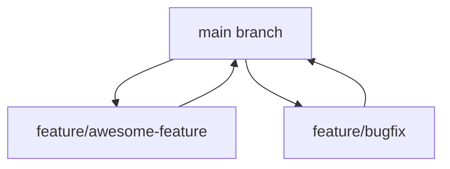
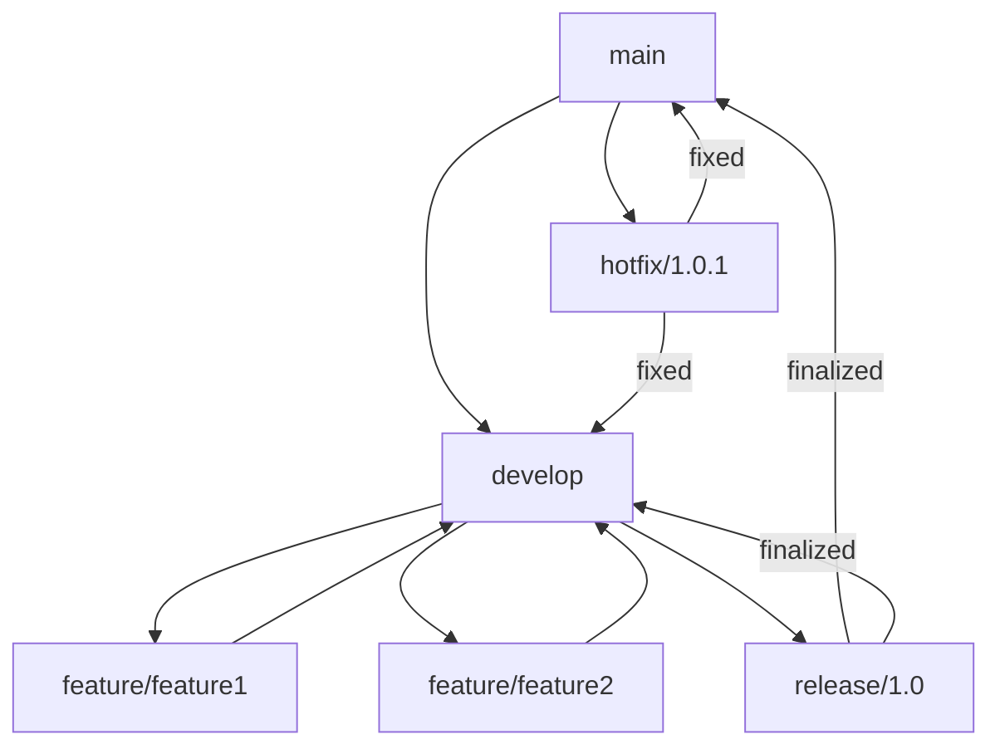
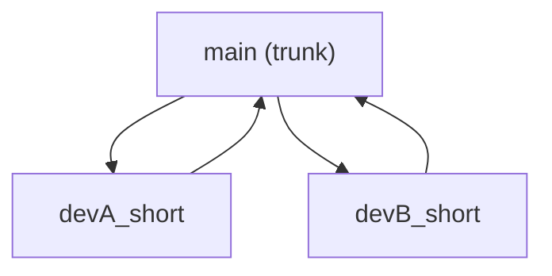
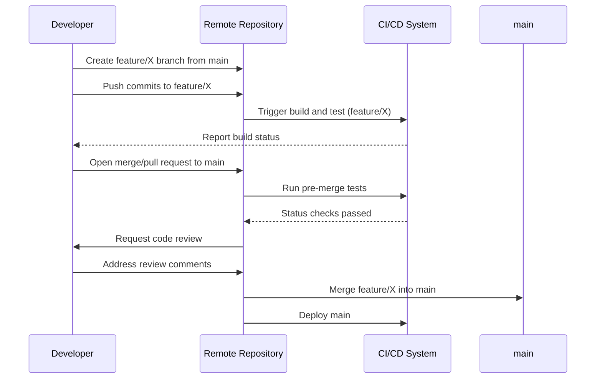
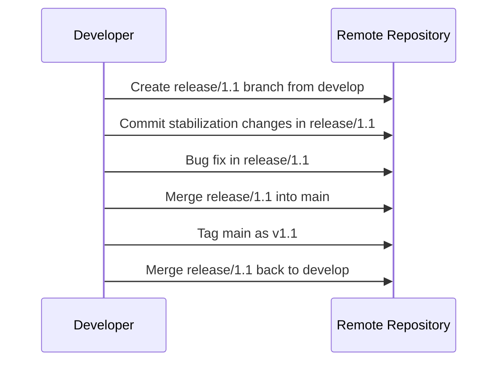

# Branching Models and Strategies

## 1. Introduction

Branching is an essential concept in modern software development, enabling multiple streams of work to proceed in parallel within source code repositories. Effective branching models and strategies support collaborative development, continuous integration, agile methodologies, release management, and defect isolation. This primer provides software engineers with a structured understanding of major branching models—including Gitflow, trunk-based development, and feature branch strategies—with focus on their practical implementations, rationale, constraints, and relative trade-offs.

## 2. Technical Context

Branching models are formalized patterns for organizing work within Version Control Systems (VCS), most commonly distributed systems such as [Git][1], but also applicable to centralized systems like Subversion (SVN) or Mercurial (Hg). The choice of a branching strategy impacts code quality, release cadence, developer productivity, and integration overhead. Notably, well-defined branching approaches underpin continuous integration (CI) and deployment (CD) paradigms.

[1]: https://git-scm.com/

## 3. Core Concepts

### 3.1 Branch

A branch represents an independent line of development. In technical terms, a branch is a mutable pointer to a commit within the version control DAG (Directed Acyclic Graph). Branches allow teams to:

- Work on features, bug fixes, experiments, or releases in isolation.
- Merge independent lines of work at controlled intervals.
- Support rollback, hotfixes, and long-lived product support.

### 3.2 Merge and Rebase

Merging is the process of integrating changes from one branch into another. Modern VCS support both "merge commits" (retaining explicit branch histories) and "fast-forward" merges (when possible). Rebasing is an alternative to merging, rewriting the commit history to apply changes atop another branch, yielding a linear history.

### 3.3 Branch Types

Typical branch types include:

- **Mainline (master/main):** The primary integration branch.
- **Feature branch:** Temporary branches for developing new features or changes.
- **Release branch:** Stabilization branches for preparing a release.
- **Hotfix branch:** Emergency branches for critical bug fixes in released versions.
- **Development branch:** An integration branch for ongoing development, distinct from the stable main branch (not used by all models).

---

## 4. Branching Strategies: Overview

Several well-established branching models are widely used. Each addresses concerns including collaboration, release management, stability, and integration.

### 4.1 Feature Branch Model

A straightforward pattern where each feature, fix, or change is developed in its own isolated branch, typically off the mainline.

#### Rationale

- Isolates in-progress changes.
- Supports code review and automated testing before integration.

#### Workflow

1. Create a feature branch from `main`.
2. Develop and test changes in the feature branch.
3. Submit a pull/merge request for integration into `main`.
4. Review and merge when ready.

#### Visual Representation (Feature Branch Model)

#### Practical Considerations

- Encourages short-lived branches to minimize merge conflicts.
- Merge gating (pre-merge CI and review) is recommended.
- Accumulation of long-running, divergent branches can significantly increase integration complexity.

> **GitHub Alert**
> **Tip:** Automate CI pipelines to validate feature branches before merging into the mainline to minimize integration risk.

---

### 4.2 Gitflow

Introduced by Vincent Driessen in 2010, Gitflow is a popular branching model designed for projects with scheduled release cycles, multiple concurrent versions, and formalized release processes.

#### Branch Roles

- **`main` (or `master`):** Contains production-ready code.
- **`develop`:** Main integration branch for ongoing work.
- **`feature/*`:** Short-lived branches branching off `develop`, for new features.
- **`release/*`:** Created from `develop` to stabilize and prepare a release.
- **`hotfix/*`:** Issued from `main` for emergency fixes to production.

#### Workflow

1. Develop new features in `feature/*` off `develop`.
2. Integrate features back into `develop`.
3. When ready for release, create `release/*` branch from `develop`.
4. Finalize release in `release/*` (bug fixes, documentation, final testing).
5. Merge `release/*` into both `main` and `develop`, tag release.
6. For critical production issues, use `hotfix/*` off `main`, merging into both `main` and `develop`.

#### Visual Representation (Gitflow Model)

#### Characteristics

- Suits large projects with multiple developers and scheduled releases.
- Clearly separates ongoing work from production releases.
- Supports parallel work on new features, releases, and hotfixes.

#### Practical Considerations

- High overhead maintaining several long-lived branches.
- Merge conflicts possible when hotfixes and feature changes overlap.
- Automation tooling can support Gitflow (e.g., standardized scripts or plugins).

> **GitHub Alert**
> **Caution:** Gitflow is ill-suited for projects aiming for continuous deployment or frequent releases. Consider the overhead before implementing in smaller or rapidly evolving teams.

---

### 4.3 Trunk-Based Development

Trunk-Based Development (TBD) centers on having all developers work in short-lived branches or directly in a single integration branch (the "trunk", often called `main`), with frequent integrations throughout the day.

#### Rationale

- Encourages rapid feedback and continuous integration.
- Minimizes divergence and complex merges.
- Aligns with practices for continuous delivery (CD) and deployment.

#### Workflow

1. Developers branch (or commit) directly off the trunk.
2. Branches are short-lived—ideally less than a day—integrated back rapidly.
3. Feature flags or toggles may be used to enable/disabling incomplete features in production-ready code.

#### Visual Representation (Trunk-Based Development Model)

#### Key Practices

- Requires robust automated tests and reliable CI.
- Merges must be fast and frequent; delayed merges are discouraged.
- Feature branches, if used, are extremely short-lived.

> **GitHub Alert**
> **Tip:** Use feature flags as an alternative to long-lived branches for incomplete or experimental features.

#### Variants and Extensions

- **Branch by abstraction:** For larger refactoring, employ patterns that allow changes to coexist behind abstractions, while still integrating frequently with the trunk.

---

## 5. Comparative Analysis

Understanding the distinctions between these models is vital for aligning engineering practices with organizational needs.

| Model                | Suitable For                | Branch Lifespan   | Release Agility  | Merge Complexity | Maintenance Overhead |
|----------------------|----------------------------|-------------------|------------------|------------------|---------------------|
| Feature Branch       | Most teams, moderate scale | Short to medium   | Medium           | Medium           | Low to Medium       |
| Gitflow              | Large projects, formal RM  | Medium to long    | Slow to Medium   | High             | High                |
| Trunk-Based          | High agility, CD/CD        | Very Short        | Fast             | Low              | Low                 |

---

## 6. Practical Engineering Considerations

### 6.1 Integration with Continuous Integration/Deployment

Branching strategies directly affect CI/CD implementation:

- **Feature Branches:** Each branch should trigger automated builds and tests. Merging should be gated by status checks.
- **Trunk-Based:** Demands pipeline speed and reliability to avoid hampering development.
- **Gitflow:** Release and hotfix branches may require their own CI/CD pipelines for validation.

### 6.2 Merge Conflicts and Code Review

- Long-lived branches amplify risk of complex merge conflicts.
- Shorter branch lifespan reduces integration effort.
- Use code review systems to ensure code quality and adherence to standards.

### 6.3 Release Management and Hotfixes

- Gitflow explicitly defines hotfix workflow; feature branch and TBD approaches may need agreed-upon emergency fix processes.
- Release branches enable staged deployments and post-code-freeze bug fixes.

### 6.4 Traceability

- Proper naming conventions and branch management enhance traceability between commits, issues, requirements, and releases.
- Automated tagging and metadata embedding streamline compliance and audit requirements.

> **GitHub Alert**
> **Warning:** Inadequate discipline in branch naming and management can degrade traceability and auditability, especially for regulated industries.

### 6.5 Tooling and Automation

- VCS platforms (e.g., GitHub, Bitbucket, GitLab) provide built-in and extensible support for branching workflows, access controls, and branch protections.
- Automation for branch creation, merging, and deletion is recommended, particularly for complex models like Gitflow.

---

## 7. Typical Workflow Sequences

### 7.1 Feature Lifecycle (Feature Branch)

---

### 7.2 Release Preparation (Gitflow)

---

## 8. Constraints and Assumptions

- Branching complexity must match team size, deployment frequency, and software criticality.
- Highly concurrent development (e.g., >10 parallel contributors) typically demands stricter branch management.
- Automated testing and deployment are preconditions for rapid-integration models like TBD.
- A source control system must efficiently support the intended branching model (distributed VCS recommended for advanced patterns).

---

## 9. Common Pitfalls

- **Merge Hell:** Accumulating divergent, infrequently merged branches causes large, error-prone merges.
- **Unmanaged Branch Proliferation:** Failing to clean up unused branches clutters repositories and increases confusion.
- **Poor CI Integration:** Inadequate pipeline automation increases risk of regressions at merge time.
- **Feature Freeze Fatigue:** In Gitflow, prolonged release or stabilization phases can halt normal development activity.
- **Improper Hotfix Handling:** Mishandling critical fixes can result in inconsistent production environments.

---

## 10. Standards and Specifications

While no universal standard governs branching models, related guidance includes:

- [Git Branching Documentation](https://git-scm.com/book/en/v2/Git-Branching-Branching-Workflows)
- IEEE 828-2012: IEEE Standard for Configuration Management in Systems and Software Engineering—addresses configuration identification and control.
- Tooling-specific conventions (e.g., [GitHub Flow][2]) define more opinionated workflows.

[2]: https://docs.github.com/en/get-started/quickstart/github-flow

---

## 11. Summary Table

| Branching Model              | Key Pros                             | Key Cons                           | Typical Use Case      |
|------------------------------|--------------------------------------|------------------------------------|-----------------------|
| **Feature Branch**           | Isolates changes, straightforward    | Potential merge conflicts if slow  | Moderate teams, code review focus |
| **Gitflow**                  | Structured releases, clear roles     | Complex for CD, heavy overhead     | Enterprises, formal release cycles |
| **Trunk-Based Development**  | Fast feedback, low merge overhead    | Discipline required, less isolated | High frequency delivery, modern SaaS |

---

## 12. Conclusion

Selecting an appropriate branching strategy is foundational to effective software development and release management. The most suitable model depends on business requirements, team structure, deployment cadence, and technical maturity. Feature branches, Gitflow, and trunk-based development each offer distinct tradeoffs in complexity, agility, and governance. Modern engineering practice emphasizes rapid integration, automated validation, and minimizing long-lived diverging branches. Teams are encouraged to periodically reassess and adapt their workflows to evolving needs, leveraging advancements in version control and automation tooling as appropriate.

---

## 13. Glossary

- **Branch:** A separate line of development in a VCS.
- **Merge:** The integration of changes from one branch into another.
- **Rebase:** Transfer a sequence of commits to a new base commit.
- **Feature flag:** Mechanism for conditionally enabling/disabling code.
- **Mainline:** Primary integration branch (e.g., `main` or `master`).
- **Hotfix:** Urgent fix applied to a released product.
- **CI/CD:** Continuous Integration and Continuous Deployment.

---