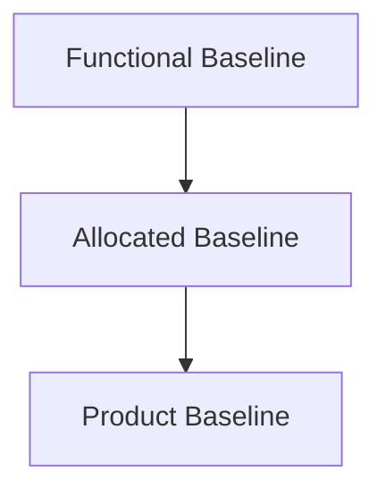
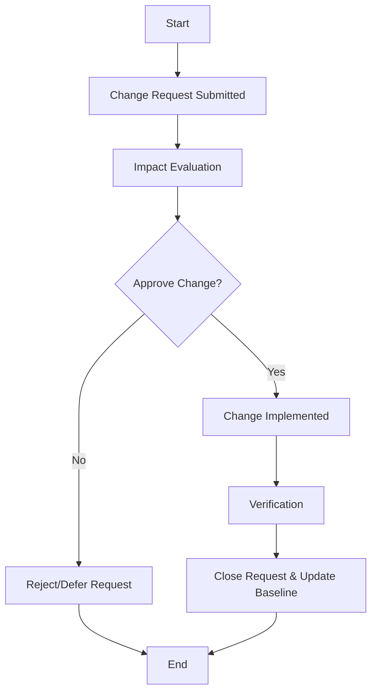
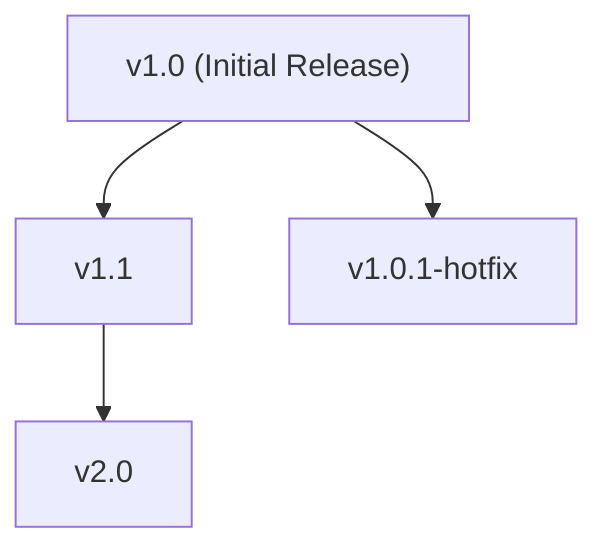
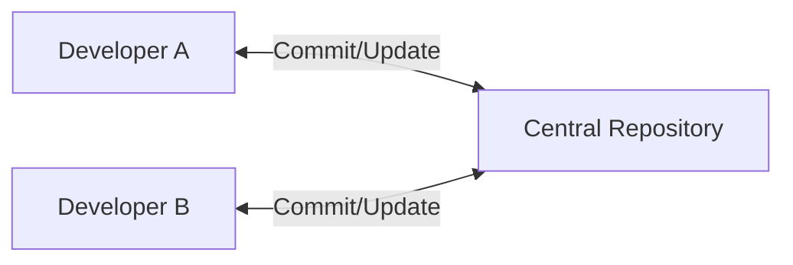
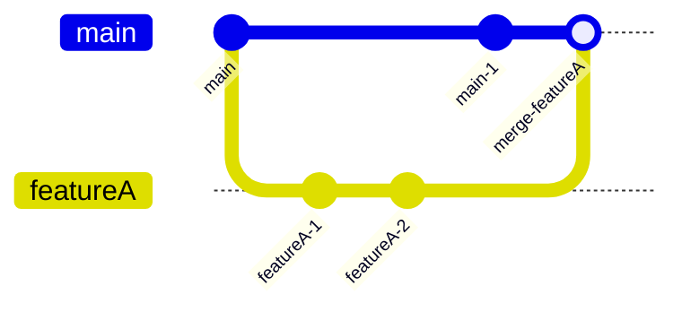

# Software Configuration Management Concepts

## Introduction

Software Configuration Management (SCM) is a disciplined approach to controlling and managing changes to software artefacts throughout the software lifecycle. Proper SCM ensures integrity, traceability, and reproducibility of software products—and is essential for delivering reliable, maintainable, and high-quality software systems.

SCM encompasses the creation, identification, control, auditing, and reporting of the configuration of software systems, including their constituent artefacts. SCM practices are an integral part of software engineering, referenced in standards such as IEEE 828 (Standard for Software Configuration Management Plans) and ISO/IEC/IEEE 24765 (Systems and software engineering—Vocabulary).

This document provides a structured technical primer, focusing on the management of artefacts, baselines, change control, and version identification—the foundational concepts of modern SCM.

---

## 1. SCM in Context

SCM is a core discipline within software engineering that intersects with development, testing, deployment, maintenance, and project management. It provides foundational support for:

- **Change Management:** Coordinating, documenting, and controlling changes to software systems.
- **Release and Deployment Management:** Ensuring repeatable, controlled delivery and rollback mechanisms.
- **Audit and Compliance:** Enabling traceability, reproducibility, and accountability.

SCM is not limited to source code. It covers any artefact necessary for building, deploying, operating, or maintaining a software system, including documentation, configurations, test data, build scripts, schema definitions, and environment descriptors.

---

## 2. Key SCM Concepts

### 2.1 Configuration Items (Artefacts)

A **configuration item** (CI) is any artefact managed under SCM. CIs are selected based on criteria such as their significance, necessity for repeatability, and impact on deliverables.

Typical configuration items:
- Source code files and directories
- Compiled binaries and executables
- Build scripts and pipelines
- Environment configuration files
- User manuals and architectural diagrams
- Test datasets and test drivers

Each CI is uniquely identified, versioned, and traced through the life of the project.

### 2.2 Baselines

A **baseline** is a formally reviewed and agreed-upon set of configuration items, serving as a fixed reference for further development or deployment. 

Baselines are subject to change control procedures and act as stable points in the project from which variations are made, products are built, or future modifications are approved.

Types of baselines:
- **Functional Baseline:** Establishes functional requirements.
- **Allocated Baseline:** Designates specific subsystems and their specifications.
- **Product Baseline:** Represents the configuration of the product at a particular point, ready for release or deployment.

#### Example: Baseline Hierarchy



### 2.3 Change Control

**Change control** is the systematic management of proposed changes to any CI or baseline. Its purpose is to assess the impact, feasibility, and necessity of changes, and enforce appropriate approval and documentation procedures.

Typical change control process:
1. **Request:** Submit a Change Request (CR) detailing the proposed modification.
2. **Evaluation:** Analyze the impact (technical, cost, schedule).
3. **Approval:** A Change Control Board (CCB) or similar authority approves or rejects the CR.
4. **Implementation:** Approved changes are carried out.
5. **Verification:** Ensure the change was correctly implemented.
6. **Closure:** Update records, baselines, and documentation.

#### Change Control Workflow



### 2.4 Version Identification

Version identification provides each CI with a unique label or tag, ensuring clarity about its lineage, derivation, and state.

Principles of version identification:
- Each new version is assigned a unique identifier (e.g. v1.3.2, rev42, commit hash).
- Identifiers may be based on version numbering schemes (semantic or otherwise), timestamps, or hash values.
- Versions are traceable to changes, authors, rationale, and baseline memberships.

**Semantic Versioning** is a common scheme in use (MAJOR.MINOR.PATCH), documented at [semver.org](https://semver.org/).

#### Example: Version Identification Tree



---

## 3. Typical SCM Architecture

### 3.1 Repository-Based Management

Modern SCM systems are typically repository-based, with centralized or distributed architectures.

- **Centralized Model:** Single, authoritative server; all clients synchronize with this server. Example: Subversion (SVN).
- **Distributed Model:** Every user has a full copy of the repository; synchronization is peer-to-peer. Example: Git, Mercurial.

#### Example: SCM System Architecture



*For a distributed model, each developer would interact locally before synchronizing with others.*

### 3.2 Branching and Merging

Branches enable parallel streams of development within the same SCM repository. Merging incorporates divergent changes back into a unified codebase.

Branching strategies:
- **Mainline (Trunk) Development:** One main branch with infrequent long-lived branches.
- **Feature Branching:** Short-lived branches for each feature or fix.
- **Release/Hotfix Branches:** Separate branches for maintenance or urgent fixes on stable releases.

#### Branching and Merging Example



---

## 4. SCM in Practice

### 4.1 Typical SCM Workflow

A standard SCM workflow includes:

1. **Artefact Check-in:** Developers add or update files in the repository.
2. **Change Tracking:** Changesets are identified, described, and associated with work items (e.g., issues, user stories, bugs).
3. **Review and Integration:** Changes may be code-reviewed, built, and tested prior to merging.
4. **Build and Release:** Build systems generate deployable artefacts from known repository states.
5. **Traceability and Audit:** Every change is auditable, with traceability from requirement to source to release.

### 4.2 Constraints and Assumptions

- **Atomicity:** Operations (commit, merge) should be atomic to prevent partial updates.
- **Consistency:** Repository must accurately reflect the state of all tracked artefacts.
- **Access Control:** Only authorized users can modify critical baselines or perform releases.
- **Performance:** Systems must scale for large repositories and distributed teams.
- **Integration:** SCM must interface correctly with build servers, CI/CD, and defect tracking tools.

### 4.3 Variations and Tooling

SCM is implemented using a variety of tools, each with its own trade-offs:

| Tool         | Model         | Strengths                   | Notes                               |
|--------------|---------------|-----------------------------|-------------------------------------|
| Git          | Distributed   | Branch/merge, performance   | De facto standard, widely adopted   |
| Mercurial    | Distributed   | Simple, robust branching    | Similar to Git, simpler UX          |
| Subversion   | Centralized   | Simplicity, fine-grained ACLs | Used in legacy or regulated contexts |
| Perforce     | Centralized   | Scalability, binary support | Large codebases, games, hardware    |

**Integration with CI/CD, code review, and defect tracking is essential for modern development environments.**

---

## 5. SCM Core Processes

### 5.1 Identification

Identification involves:

- Assigning unique names or identifiers to every CI.
- Defining attributes, ownership, and type for each artefact.
- Establishing relationships and dependencies among artefacts.

### 5.2 Control

Control is exercised through:

- Permission systems restricting who can change artefacts or baselines.
- Enforcement of policies for check-in, branching, and merging.
- Semantic hooks (pre-commit, post-commit scripts) for validation.

### 5.3 Status Accounting

Status accounting tracks the current state of each artefact and baseline.

Examples:
- What versions exist?
- Which change requests are pending, approved, or implemented?
- What is the status of each baseline (draft, approved, released)?

### 5.4 Audit and Review

Regular audits validate that:

- Baselines include correct and approved configuration items.
- Artefacts are consistent, complete, and free of unauthorized changes.
- Audit trails exist for changes and releases, in compliance with standards.

---

## 6. Engineering Considerations

### 6.1 Integration Points

- **Build Automation:** Build servers (e.g., Jenkins, GitHub Actions) poll or trigger on SCM changes to build/test artefacts.
- **Continuous Integration/Delivery (CI/CD):** Automated pipelines rely on SCM for reliable, reproducible builds.
- **Defect Tracking:** Issue IDs and change IDs are linked for accountability.
- **Infrastructure as Code (IaC):** Environment definitions are versioned alongside application source.

### 6.2 Performance and Scalability

- Large binary files or frequent merges can impact repository performance (mitigated by using artefact repositories or LFS systems).
- Distributed models offer superior resiliency and offline capabilities, but require robust conflict resolution strategies.

> **Tip**
> Use `.gitignore`, `.hgignore`, or corresponding mechanisms to prevent irrelevant artefacts (e.g., build outputs) from polluting the SCM repository and introducing unnecessary churn.

### 6.3 Implementation Challenges

#### Merge Conflicts

Automated merging tools can resolve many simultaneous changes, but semantic conflicts (business logic, design) require human review.

#### Unauthorized Changes

Insufficient access controls may result in unintended or malicious modifications to critical artefacts or baselines.

> **Warning**
> All changes to production baselines should undergo formal peer review and testing to prevent regressions and ensure compliance.

#### Change Propagation

Changes in shared artefacts (libraries, APIs) require coordinated update and compatibility management across dependent projects.

### 6.4 Compliance and Standards

SCM practices often need to comply with company policies, industry standards, or regulatory requirements (e.g., SOX, ISO 9001, DO-178C for avionics, etc.).

IEEE 828 is the standard for SCM plans, specifying requirements for:
- Configuration identification and control
- Status accounting and auditing
- Tools and resources
- Roles and responsibilities

---

## 7. Common Pitfalls and Best Practices

### 7.1 Pitfalls

- **Uncontrolled Changes:** Allowing direct commits to mainline leads to unpredictable builds and regressions.
- **Poor Version Labelling:** Vague or inconsistent versioning hampers reproducibility and debugging.
- **Neglected Baselines:** Failing to establish or update baselines leads to confusion in distributed teams.
- **Ineffective Access Control:** Developers accidentally or maliciously overwrite critical artefacts.

### 7.2 Best Practices

- Require pull/merge requests with mandatory review before integrating to main/trunk branches.
- Use systematic branching models (e.g., Git Flow, trunk-based development) suitable for team size and delivery cadence.
- Tag all release candidates and production releases; maintain detailed changelogs.
- Regularly audit repositories for unauthorized or undocumented changes.
- Automate builds, tests, and deployments based on events in the SCM repository.

> **Note**
> Consistently mapping change requests to commit identifiers (via issue-tracking integration) streamlines traceability and compliance audits.

---

## 8. Evolving Trends

- **GitOps** extends SCM principles to infrastructure deployment using pull-request-based workflows for infrastructure as code.
- **Monorepos** aggregate multiple independent projects into a single repository for unified dependency and SCM management.
- **Automated Code Quality** checks (linting, static/dynamic analysis) are integrated with SCM events for shift-left quality control.
- **Fine-Grained Modularity** in cloud-native and microservices architectures increases the need for cross-repo configuration and dependency management.

---

## 9. Summary

Software Configuration Management is fundamental to modern software engineering, providing tool-supported mechanisms for defining, managing, and controlling the artefacts essential for building, testing, and delivering reliable systems. Mastery of SCM concepts—including configuration item management, baselining, change control, and rigorous version identification—enables teams to collaborate efficiently, trace changes, and assure product quality.

With the proliferation of distributed development, automated toolchains, and complex delivery pipelines, robust SCM practices are vital for supporting the scale, pace, and governance demands of contemporary software projects.

---

## 10. Reference Standards

- **IEEE 828:** Standard for Software Configuration Management Plans
- **ISO/IEC/IEEE 24765:** Systems and software engineering—Vocabulary
- **Semantic Versioning:** MAJOR.MINOR.PATCH ([semver.org](https://semver.org/))
- **RFC 8144:** Use of Versioning in HTTP ([tools.ietf.org/html/rfc8144](https://tools.ietf.org/html/rfc8144))

---

## Appendix: Example SCM Process Flow

```mermaid
flowchart TD
    A[Identify Artefacts] --> B[Add to Repository]
    B --> C[Branch (Optional)]
    C --> D[Develop/Modify]
    D --> E[Review & Test]
    E --> F[Merge to Main & Tag Version]
    F --> G[Update Baseline]
    G --> H[Build/Deploy]
```

---

> **Note**
> Diagram to be added later: "Comprehensive SCM ecosystem view, including links between development, build automation, and deployment systems."