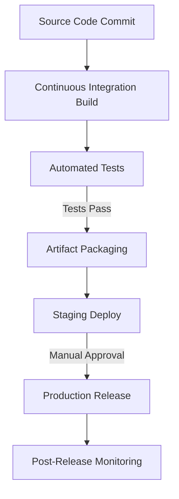
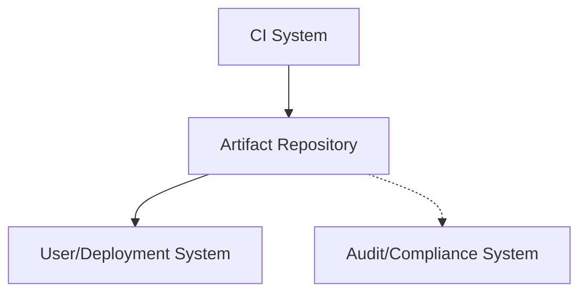
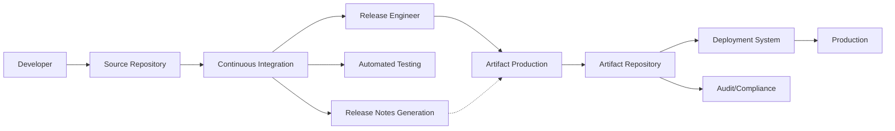

# Versioning and Release Engineering

## 1. Introduction

Versioning and release engineering are foundational elements in modern software engineering, ensuring controlled evolution, predictable packaging, and dependable deployment of software systems. These practices orchestrate the flow of code from development through to deployment, offering mechanisms for managing change, maintaining consistency, and delivering high-quality releases to end users. Understanding these topics is central to managing the complexity of collaborative software projects and supporting rapid, reliable delivery within both continuous delivery and traditional release cycles.

## 2. Core Concepts

### 2.1 Versioning

**Versioning** is the process of assigning unique identifiers to particular states of software artifacts. It provides mechanisms to distinguish between different iterations or states, enabling traceability, compatibility management, and upgrade/downgrade paths.

#### 2.1.1 Version Identifiers

A version identifier is usually a string that encodes information about the software’s release state. Common formats include:

- **Semantic Versioning (SemVer):** A widely adopted specification ([semver.org](https://semver.org)) that uses the format `MAJOR.MINOR.PATCH`, for example, `2.11.3`. Pre-release labels and build metadata (e.g., `1.2.0-beta+exp.sha.5114f85`) can be included for finer-grained identification.
- **Calendar Versioning (CalVer):** Uses calendar dates in the version, e.g., `2024.06`, to reflect release timing rather than feature changes.
- **Internal/Build Numbers:** Sometimes internal CI systems use incrementing build numbers or commit hashes.

##### Semantic Versioning Details

According to the SemVer 2.0.0 specification:

- **MAJOR:** Incremented for incompatible API changes.
- **MINOR:** Incremented for backwards-compatible feature additions.
- **PATCH:** Incremented for backwards-compatible bug fixes.

**Pre-release** versions (e.g., `1.2.0-beta`) signal non-final releases. **Build metadata** (after `+`, e.g., `1.2.0+build2012`) is ignored when determining precedence.

#### 2.1.2 Version Constraints and Compatibility

Consumers of libraries and services often specify version constraints—such as `>=1.5.0, <2.0.0`—to obtain compatible releases. APIs and data schemas frequently tie compatibility guarantees closely to versioning schemes.

> [!ALERT]
> **Tip:** Strict adherence to versioning conventions, especially for public APIs and packages, is vital to prevent breaking dependent systems during upgrades.

### 2.2 Release Engineering

**Release engineering** is the discipline concerned with building, packaging, and distributing software releases from source code and artifacts, with heavy emphasis on repeatability, traceability, and automation.

Key responsibilities include:

- **Release Packaging:** Creating deployable artifacts (e.g., installers, containers, libraries, distribution packages).
- **Build Automation:** Orchestrating sequence of compilation, linking, resource bundling, test execution, signing, etc.
- **Release Orchestration:** Coordinating steps to move releases through QA, staging, and production environments.
- **Release Documentation:** Generating change logs, release notes, and compliance reports.
- **Deployment:** Delivering releases to target systems or users, optionally with rollback capabilities.
- **Traceability:** Maintaining links between source code, build artifacts, and release metadata for auditability.

## 3. Technical Context

Versioning and release engineering operate atop **Source Control Management (SCM) systems** (such as Git, Mercurial, or Subversion), and interact closely with:

- **Continuous Integration/Continuous Delivery (CI/CD) pipelines**
- **Configuration Management Databases (CMDBs)**
- **Artifact Repositories** (e.g., JFrog Artifactory, Nexus, npm, PyPI)
- **Deployment Automation Systems** (e.g., Ansible, Helm, Spinnaker)

They are essential components in frameworks such as ITIL for service transition, and underpin compliance and regulatory requirements in many industries.

## 4. Implementation and Workflows

### 4.1. Example Release Lifecycle

A typical software release lifecycle involves several key phases, often automated via CI/CD:

#### 4.1.1 Automated Build and Packaging

Build automation ensures that each release can be constructed identically, minimizing "it works on my machine" scenarios. Common build tools include **Make**, **Gradle**, **Maven**, **Bazel**, and **CMake**.

Artifact packaging may involve:

- Compiling code
- Producing binaries or containers (e.g., Docker images)
- Generating manifests (e.g., `package.json`, `requirements.txt`, `.nuspec`)
- Digitally signing packages
- Assembling installers (e.g., MSI, DEB, RPM)

#### 4.1.2 CI/CD Integration

Modern software engineering practices integrate versioning and release workflows into pipelines:

- **Version tagging:** Tag SCM commits corresponding to releases.
- **Release triggers:** Releases may be triggered by pushing tags, merging to a `main` or `release` branch, or in response to scheduled events.
- **Automated deployment:** On successful build and test, deploy to artifact repositories or runtime environments.

> [!ALERT]
> **Caution:** Ensure that build and release processes are idempotent and avoid dependencies on local developer environments for reliability.

### 4.2. Versioning in Practice

#### 4.2.1 Tagging and Metadata

Releases are typically marked in the SCM as tags (e.g., `v2.11.3`), which can be annotated with release notes or build information.

- **Git tags:** Used to pinpoint release commits. Lightweight tags for simple markers; annotated tags for rich metadata.
- **Build metadata:** Tools like `git describe` or pipeline variables can embed source commit hashes into binaries for traceability.

#### 4.2.2 Handling Hotfixes and Patch Releases

Patch releases should be created from maintenance branches (e.g., `release/1.2.x`). The workflow might involve:

- Creating a branch from the relevant release tag
- Applying targeted fixes
- Running the full build, test, and packaging workflow
- Publishing an incremented patch version

### 4.3. Packaging and Distribution

#### 4.3.1 Types of Release Artifacts

Depending on platform, language, and distribution model, release artifacts may include:

- **Pre-built binaries** (e.g., `.exe`, `.dll`, `.jar`, `.so`)
- **Source tarballs or zip archives**
- **Executable installers** (e.g., MSI, DMG)
- **Package formats** (e.g., npm, pip, NuGet, RPM, DEB)
- **Container images** (e.g., Docker, OCI images)
- **Library artifacts** (e.g., static/dynamic libraries, shared objects)

#### 4.3.2 Artifact Repositories

Separation between build and deployment is supported via artifact repositories:

Key implementation considerations include retention policies, access controls, and immutability for released artifacts.

### 4.4. Release Notes and Tracking

Release notes are automatically or semi-automatically generated (often from linked issue trackers or commit logs). Tools such as **Conventional Commits**, **Keep a Changelog**, or integration with **Jira/GitHub Issues** can streamline note generation and enhance traceability.

### 4.5. Deployment Engineering

Deployment encompasses the controlled rollout of releases into test, staging, or production environments. Strategies and related concerns include:

- **Blue/Green Deployments**
- **Canary Releases**
- **Rolling Upgrades**
- **Rollback Mechanisms**
- **Infrastructure as Code (IaC)** for reproducible deployments

Release engineering interfaces with deployment automation tools to selectively promote releases.

## 5. Constraints, Assumptions, and Engineering Considerations

### 5.1. Consistency and Reproducibility

Build and release processes must be deterministic:

- Use dependency locks (e.g., `package-lock.json`, `Pipfile.lock`).
- Pin all external dependencies to specific versions.

> [!ALERT]
> **Warning:** Failing to lock dependencies can result in non-reproducible builds, unexpected errors, or security vulnerabilities.

### 5.2. Security and Compliance

Signed artifacts, checksums (SHA-256, GPG), and audit trails are essential for verifying the provenance and integrity of releases. Regulatory environments may require traceability from release binaries back to source commits, reviewer approvals, and test results.

### 5.3. Parallel Release Streams

Larger projects often manage multiple supported release streams (e.g., Long-Term Support (LTS) vs. latest feature releases). Each stream may have its own branching and versioning policies.

### 5.4. Third-Party Dependencies

Release engineering must track versions and licenses of third-party dependencies, and respond quickly to CVEs affecting those in active release lines.

### 5.5. Automation and Infrastructure

Scripting and pipeline infrastructure should be clearly versioned and tested themselves, to guard against release breaks from changes in the release tooling or system configurations.

### 5.6. Distributed Teams and Open Source

Practices may differ in open source development, where releases may be driven by maintainers and coordinated via public infrastructure (e.g., GitHub Releases, PyPI, npm), and automation is especially critical for community transparency.

## 6. Common Variations

### 6.1. Monorepos vs. Polyrepos

- **Monorepos:** All components share a single version history; coordinated release engineering is essential.
- **Polyrepos:** Independent versioning and release workflows per component.

### 6.2. Release Trains

Enterprises may employ release trains—a regular, time-boxed schedule for producing coordinated releases across components—balancing agility and predictability.

### 6.3. Continuous Delivery vs. Scheduled Releases

Continuous Delivery emphasizes frequent, automated releases; traditional models may schedule quarterly or milestone-based releases.

## 7. Standards and Specifications

While there are no overarching international standards for software release engineering, many specifications underpin the discipline:

- **Semantic Versioning 2.0.0** (semver.org)
- **Open Container Initiative (OCI)** image specification
- **SBOMs** (Software Bill of Materials) formats: [SPDX](https://spdx.dev/), [CycloneDX](https://cyclonedx.org/)
- **RFC 2119**: Key words for RFCs to Indicate Requirement Levels (commonly cited in specifications)

Build, integration, and artifact repositories may also have defined REST APIs (e.g., [Artifactory REST API](https://www.jfrog.com/confluence/display/JFROG/Artifactory+REST+API)) for release orchestration.

## 8. Summary Diagram

**Description:**  
This diagram depicts the typical workflow from code commit to production deployment, highlighting key engineering roles and automation handoffs.

## 9. Conclusion

Versioning and release engineering enable the software industry to deliver complex, evolving systems with confidence, traceability, and repeatability. Proper versioning ensures clarity and reliability for both producers and consumers of software, while disciplined release engineering enables robust automation, compliance, and transparency from code change to artifact deployment. Mastery of these practices is essential for any software engineer responsible for building, maintaining, or releasing production-quality systems.