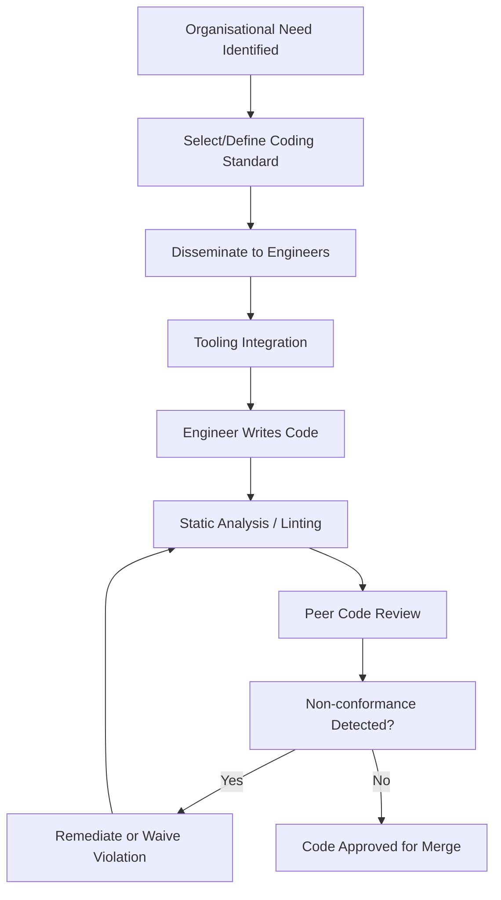
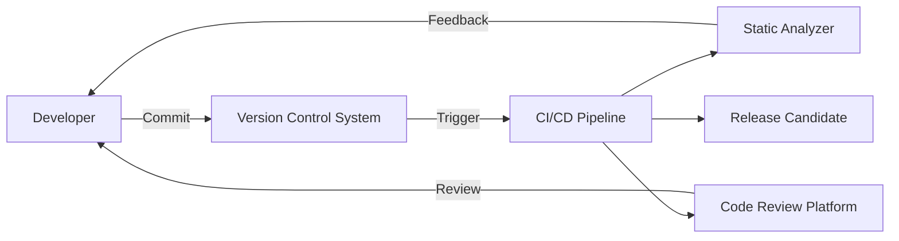
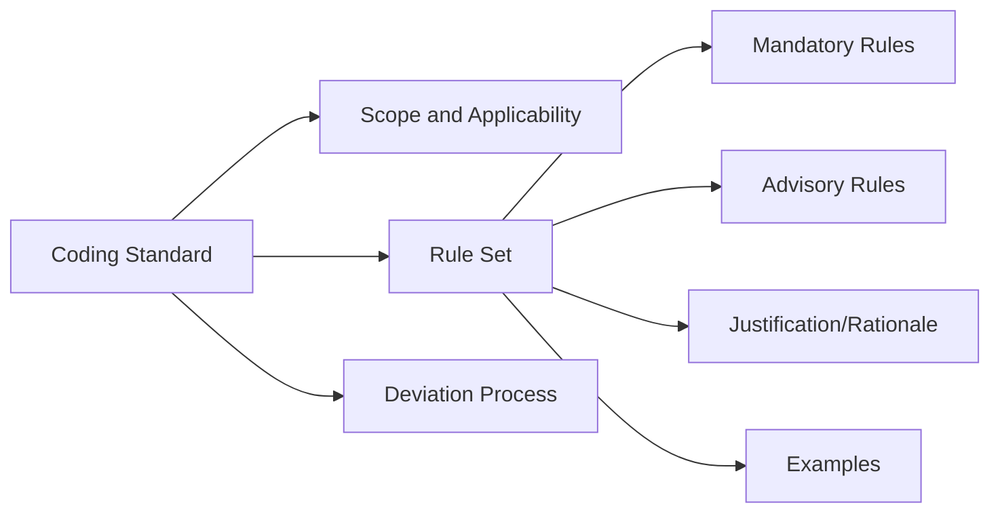

# Coding Standards and Guidelines

## Introduction

Coding standards and guidelines are systematically defined rules, recommendations, and conventions governing how source code should be written, organized, and maintained in a software project or organization. Their primary objective is to improve code readability, maintainability, reliability, and security, while fostering consistent engineering practices across teams and product lines.

Industry standards such as MISRA and CERT, alongside organisationally defined conventions, represent established methodologies to formalize best practices, minimize defects, enable compliance (e.g., with safety-critical regulations), and facilitate effective collaboration. This primer introduces the rationale, structure, and practical application of coding standards and guidelines in software engineering.

## Role and Purpose of Coding Standards

Coding standards and guidelines serve multiple technical and procedural functions:

- **Code Consistency:** Enforce uniformity in style, formatting, naming, and patterns, thus aiding comprehension and reducing onboarding time for new contributors.
- **Defect Prevention:** Specify rules known to prevent classes of defects (logic errors, undefined behavior).
- **Security Assurance:** Define safe coding patterns and proscribe known insecure constructs.
- **Maintainability and Scalability:** Ease future modification and expansion, especially in large and distributed engineering teams.
- **Compliance:** Satisfy regulatory, legal, and quality requirements (e.g., ISO 26262 for automotive, DO-178C for avionics).
- **Tooling Integration:** Enable the use of automated tools—such as static analyzers, formatters, or linter frameworks—to enforce rules and detect violations early in the development process.

## Fundamental Concepts

### Distinction: Standards vs. Guidelines

- **Coding Standards:** Mandatory rules (e.g., “every function must have a comment”) often defined by external organizations or internal policy. Violations require justification or must be fixed.
- **Coding Guidelines:** Recommended best practices (e.g., “prefer using for-each loops over traditional for loops”) that may be context-sensitive and can be waived under controlled circumstances.

### Typology

Coding standards may be categorized as follows:

- **Process-Oriented:** Relate to workflow practices (e.g., code review required before merging).
- **Language-Oriented:** Relate to language-specific constructs and idioms (e.g., safe pointer usage in C/C++).
- **Domain-Specific:** Tailored to the engineering, safety, or regulatory needs of an industry sector.

## Core Industry Standards

Below are key community- and industry-defined standards widely referenced in the field.

### MISRA

The Motor Industry Software Reliability Association (MISRA) produces formal guidelines for the C and C++ programming languages, notably:

- **MISRA C:** Initially published in 1998 for embedded automotive systems; now widely used in any safety- or security-critical C environment.
- **MISRA C++:** Guidelines for safe and robust C++ programming (especially for C++98/03).

**Key Features:**

- Rules for avoiding unsafe constructs (e.g., no dynamic memory allocation, ban on certain standard library functions).
- Explicit guidance on undefined, unspecified, or implementation-defined behavior.
- Clearly categorized rules (Required, Advisory, Mandatory).

**Typical Usage Domains:**

- Automotive software (ISO 26262 compliance).
- Industrial automation.
- Medical devices.

### CERT Secure Coding Standards

The CERT standards, developed by Carnegie Mellon University’s Software Engineering Institute, focus on secure software construction:

- **CERT C/C++ Secure Coding Standard**
- **CERT Java Secure Coding Standard**
- **Others for languages such as Perl, Python**

**Key Features:**

- Detailed guidance for each language on how to avoid security vulnerabilities (e.g., buffer overflows, integer overflows, race conditions).
- Extensive mapping to CWE (Common Weakness Enumeration) and similar vulnerability taxonomies.
- Regularly updated to address emerging security threats.

### Organisational Conventions

Organizations often define custom standards and guidelines to:

- Reflect internal engineering practices and legacy constraints.
- Integrate third-party libraries and frameworks safely.
- Satisfy unique product or customer requirements.
- Formalize review procedures and documentation requirements.

**Examples:**
- Google C++ Style Guide.
- Linux Kernel Coding Style.
- Internal company-specific rules (e.g., preferred dependency injection frameworks, naming schemes).

## Anatomy of a Coding Standard

A typical coding standard defines:

- The **scope** (language, version, domain).
- **Rules**: Unique, identified, and sometimes categorized as mandatory or advisory.
- **Justification**: Rationale or risk addressed by the rule.
- **Examples**: Compliant and non-compliant code excerpts.
- **Exception Processes**: Mechanisms for documenting and handling necessary rule waivers.

### Example MISRA Rule

| Rule                                                                 | Category         | Example                                                            | Rationale               |
| -------------------------------------------------------------------- |----------------- |------------------------------------------------------------------- |------------------------ |
| "All code shall conform to ISO C standard"                           | Mandatory        | Only ISO-compliant constructs may be used.                        | Portability, reliability|
| "Dynamic memory allocation functions shall not be used."             | Required         | `malloc`/`free` must be avoided.                                  | Predictable memory use  |

## Workflows for Coding Standards in Practice

### Typical Implementation Workflow

#### Explanation
This diagram describes a generalized process flow for coding standard compliance—from adoption through enforcement, remediation, and approval. Automation (e.g., static analysis) and human review are both essential.

### Integration with Tooling

Most coding standards are enforced via:

- **Static analysis tools** (e.g., PC-lint, Cppcheck, Clang-Tidy for MISRA/CERT; Checkstyle for Java; RuboCop for Ruby).
- **Formatters** (e.g., clang-format, Prettier).
- **IDE plugins** for linting and formatting.
- **Continuous Integration (CI)** pipelines invoking automated checks and generating compliance reports.

### Exception Handling

Not all violations are avoidable. Standards usually define:

- **Suppression Mechanisms:** (e.g., annotations, pragmas) to disable specific rule checks locally.
- **Waiver Processes:** Formal documentation explaining why deviation is required. These are reviewed and archived.

## Practical Engineering Considerations

### Integration Points

Coding standards often intersect with:

- **Version Control Systems:** Pre-commit hooks may block commits failing standard checks.
- **Code Review Tools:** Inline checklists or bots verify compliance before approval.
- **Build Pipelines:** Automated analysis at build/test time generates reports for auditability.

### Performance Implications

While coding standards do not typically affect runtime performance directly, some rules (e.g., restrictions on dynamic memory) guide engineering towards more predictable memory and timing profiles—critical for real-time, safety-critical, or embedded systems.

Adherence to safety/security standards often implies explicit code, eschewing optimizations that introduce subtle bugs (such as aggressive inlining or pointer aliasing).

### Typical Implementation Challenges

- **Legacy Codebases:** Retrofitting strict standards (e.g., MISRA) onto large, older code may be cost-prohibitive; staged adoption, grandfathering, and prioritized refactoring are common strategies.
- **Tooling Gaps:** Not all standards have complete automated tool support; manual inspection may be necessary for ambiguous or context-sensitive rules.
- **Developer Resistance:** Strict or verbose standards can create friction; effective training and rapid feedback mechanisms are important to maintain engineering velocity.

### Common Pitfalls

> **[!CAUTION] Overly Rigid Interpretation**
>
> Refusing all exceptions—especially in performance critical or platform-specific code—can result in convoluted or inefficient implementations.

> **[!WARNING] Complacency with Tool Coverage**
>
> Not all violations are detectable by automated tools; human expertise and review remain essential, especially for architectural or design-level rules.

> **[!TIP] Regular Review and Evolution**
>
> Coding standards should be reviewed periodically for relevance, effectiveness, and alignment with evolving language features and project needs.

## Coding Standard Variations and Extensions

### Domain and Language Specialization

- **Safety-Critical:** E.g., ESA’s Ada subset, JPL Class C/C++ standards.
- **Security-Focused:** CERT standards, SEI’s Secure Coding practices, ISO/IEC TS 17961 for C secure coding.
- **Organisational / Project-Local:** Startup-specific, project-based, open source community style guides.

### Integration with Broader Software Quality Initiatives

Coding standards are typically one element of broader quality systems, alongside:

- Code review policies.
- Unit/integration testing requirements.
- Documentation mandates.
- Regulatory compliance processes.

**Note:** Coding standards alone do not guarantee defect-free or secure software; they must be paired with sound engineering judgment and comprehensive validation activities.

## Typical Coding Standard Architecture

## Reviewing Compliance: Static Analysis and Human Oversight

Combination of automation and expertise:

| Stage                   | Technique                | Tool Examples                    |
|-------------------------|--------------------------|----------------------------------|
| Pre-commit              | Lint, auto-format        | pre-commit, clang-format         |
| Build/CI                | Static analysis          | PC-lint, Coverity, Clang-Tidy    |
| Code Review             | Checklist/manual review  | Gerrit, GitHub/GitLab reviews    |
| Release                 | Compliance/audit report  | SonarQube, custom scripts        |

> **[!TIP]**
> Use staged, risk-based approaches to prioritize rule enforcement in legacy systems to avoid overwhelming teams with unmanageable technical debt.

## Example: Enforcing MISRA in Automotive Embedded Software

### Constraints

- Minimal runtime overhead.
- Predictable execution and memory usage.
- Regulatory auditing traceable to standards (ISO 26262).

### Workflow

1. Standard selected (MISRA C 2012).
2. Rule exclusions/waivers documented as per project needs.
3. Engineers develop code using compliant subset and annotation for suppression as needed.
4. Static analyzer and code reviews verify conformance.
5. Compliance report generated for production release and fed to safety case.

> **[!ALERT] Automotive Safety**
>
> Non-conformance to MISRA or similar standards in production automotive software may lead to regulatory non-compliance, insurance risk, or even costly product recalls.

## Summary Comparison Table

| Standard      | Focus                | Language(s)    | Domain                       | Key Attributes                          |
|---------------|----------------------|----------------|------------------------------|-----------------------------------------|
| MISRA C/C++   | Safety, reliability  | C/C++          | Automotive, industrial       | Mandatory/advisory rules, real-time     |
| CERT          | Security             | C/C++, Java... | General (security-critical)  | Vulnerability mapping, CWE crosswalk    |
| Google Style  | Readability          | C++, Python... | Open source, internal Google | Formatting, naming, code conventions    |
| Custom Org    | Varies               | Any            | Any                          | Can combine elements of above           |

## Evolution of Coding Standards

- **Language Evolution:** As programming languages evolve (e.g., new C++ standards), coding standards must be periodically revised to incorporate or adapt to new features and deprecate unsafe idioms.
- **Toolchain Maturity:** Improved static analysis capabilities prompt tighter enforcement and the potential for more sophisticated rule sets.
- **Community Feedback:** Open review, incident analysis, and security disclosures often result in amendments or additions to standard rule sets.

## Conclusion

Coding standards and guidelines, spanning industry standards like MISRA and CERT as well as local conventions, play a vital role in the professional practice of software engineering. When implemented rigorously, they enable safer, more maintainable, and robust systems, especially where safety, security, or scale are paramount. For maximum effectiveness, standards should be applied judiciously, supported by proper tooling, expert oversight, and periodic reassessment to address the evolving technical landscape.

---

**Glossary**

- **MISRA:** Motor Industry Software Reliability Association (standards for safety-critical C/C++).
- **CERT:** Computer Emergency Response Team (secure coding standards for multiple languages).
- **Static Analysis:** Automated code inspection without executing the program.
- **Waiver:** Documented, justified exception to a coding standard rule.
- **Linter:** Tool that analyzes source code to flag violations of style, standards, or correctness.

---

**Note:**  
Mermaid diagrams above illustrate generalized processes and architecture. Substitute with formal organizational visuals where necessary.