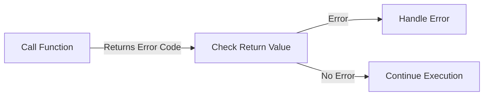
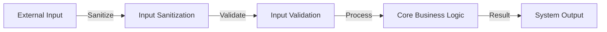

# Defensive Programming

## 1. Introduction

Defensive programming refers to a set of practices in software development aimed at producing code that continues to function correctly even when faced with unexpected usage, configuration errors, invalid states, or external failures. This approach anticipates potential problems originating from both internal errors (e.g., logic faults, improper use of APIs) and external influences (e.g., corrupted user input, hardware failures, malice).

Defensive programming is crucial in building reliable, maintainable, and robust software—particularly in domains where reliability and safety are paramount, such as embedded systems, financial services, health care, and safety-critical systems.

## 2. Rationale and Technical Context

Software systems rarely operate in a perfectly controlled environment. Inputs may be malformed, dependencies may fail, and even trusted internal modules may behave unexpectedly due to programming errors or specification ambiguities.

Defensive programming operates on the assumptions that:
- All inputs are potentially suspect until validated.
- All code should handle, to the extent possible, its own errors or misuse.
- Unexpected states should be detected and reported as early as possible.
- System integrity and recoverability have priority in failure scenarios.

Software engineering standards such as **MISRA C** (for safe C programming), **ISO/IEC 27001** (for information security management), and recommendations from the **IEEE Software Engineering Body of Knowledge (SWEBOK)**, all acknowledge the necessity of defensively designed code in professional practice.

## 3. Core Concepts

### 3.1 Input Validation and Sanitization

One fundamental principle of defensive programming is to never trust externally-supplied data. Rigorous input validation enforces boundaries and types on all inputs, including API calls, user interfaces, and inter-process communications.

#### Typical Validation Elements
- **Type checking:** Confirm inputs are of expected data type.
- **Range checking:** Validate numerical values against bounds.
- **Format checking:** Enforce structure or pattern (e.g., using regular expressions).
- **Null-checking:** Ensure references or pointers are not NULL/nil.

### 3.2 Fail-Fast and Error Detection

A key defensive principle is to detect errors "as soon as possible." When possible, invalid states should cause immediate, visible failures (fail-fast), allowing quick diagnosis before errors propagate. This is sometimes implemented through assertions, invariant checks, and strict condition enforcement.

```mermaid
flowchart LR
    Start[Receive Input] --> Validate[Validate Input]
    Validate -- Invalid -->|Fail Fast| Error[Raise Exception]
    Validate -- Valid --> Next[Continue Processing]
```

### 3.3 Exception and Error Handling

Exception handling structures should:
- Catch and manage errors at appropriate boundaries.
- Avoid silent failures.
- Restore systems to a consistent state or escalate failures in a controlled manner.

Defensive programming separates "expected errors" (such as a file not being found) from "unexpected errors" (such as an assert violation or memory corruption).

### 3.4 Defensive Data Structure and API Design

APIs should:
- Explicitly document preconditions, postconditions, and side effects.
- Minimize exposure of internal state (encapsulation).
- Avoid side effects unless clearly documented and intended.
- Use immutable objects where possible to prevent inadvertent changes.

### 3.5 Safe Defaults and Fallbacks

In the presence of uncertainty or partial failure, components should revert to safe, minimal, or non-privileged default behaviors, to prevent cascading failures or security breaches.

### 3.6 Principle of Least Privilege

Code operates with the minimal privileges required. This mitigates damage in the event of misbehavior or compromise.

## 4. Defensive Programming Workflow

Defensive programming is not a distinct phase but an overlapping concern throughout the software development lifecycle (SDLC).

```mermaid
flowchart TD
    REQ[Requirements Engineering] --> DES[Design]
    DES --> IMP[Implementation (Defensive Practices)]
    IMP --> TEST[Testing & Verification]
    TEST --> DEP[Deployment]
    DEP --> MAINT[Maintenance]
    MAINT -->|Feedback| REQ
    IMP -->|Peer Reviews| TEST
    IMP -->|Static Analysis Tools| TEST
```

- **During design:** Identify invariants, trust boundaries, and assumptions.
- **During implementation:** Enforce checks, sanitize input, and use defensive idioms.
- **During code review and testing:** Assess for robustness against misuse, and check coverage of edge cases.

## 5. Key Techniques and Patterns

### 5.1 Explicit Invariant Enforcement

Code should enforce critical invariants—those object or system properties which must always hold for correctness—using assertions, guards, or exceptions.

#### Example (Pseudocode)
```python
def transfer(source, dest, amount):
    assert amount >= 0, "Transfer amount must be non-negative"
    assert source.balance >= amount, "Insufficient funds"
    ...
```

### 5.2 Use of Defensive Copies

Mutable input objects (like arrays or lists) should be copied on receipt and when returned from methods, to prevent external references from modifying internal data.

### 5.3 Guard Clauses

A guard clause immediately exits a function on invalid conditions, simplifying the control flow and reducing nesting.

#### Example (Pseudocode)
```javascript
function processOrder(order) {
    if (!order) throw new Error("Order cannot be null");
    if (!order.items || order.items.length === 0) {
        throw new Error("Order must contain at least one item");
    }
    // ... main logic ...
}
```

### 5.4 Error Codes vs. Exceptions

Some languages or environments use error codes; others prefer exceptions. Defensive programming mandates that all error indications be checked and acted upon, never ignored.



### 5.5 Null Object Pattern

Rather than returning `null`/`None` for missing return values, some APIs provide a default "null object" which supports the expected interface but does nothing. This reduces null checks and potential `NullPointerException`-like errors.

### 5.6 Design by Contract (DbC)

DbC, formalized in languages like Eiffel, uses preconditions, postconditions, and invariants to define the rights and responsibilities of components. While not universal, its principles are often used informally in defensive programming.

## 6. Typical Constraints and Assumptions

- **Performance Overhead:** Input validation, invariant checks, and copying may incur computational overhead. Tradeoffs between performance and defensive rigor should be carefully managed.
- **Usability vs. Security:** Strict input validation may reject benign input; balancing user-friendliness and system safety requires contextual analysis.
- **Error Visibility:** Overly verbose error reporting may aid attackers. Error messages should be helpful for legitimate debugging but not leak sensitive details.

## 7. Defensive Programming in Practice

### 7.1 Example Architecture: Input Processing Pipeline



Here, external input passes through sanitization and validation layers before being processed, embodying a defensive approach.

### 7.2 Defensive Programming for APIs

APIs fundamentally reside at trust boundaries. Typical defensive measures include:

- Clear documentation of parameter types, shapes, and error conditions.
- Consistent error signaling (exceptions, error codes, etc.).
- Parameter checks at all entry points.
- Never trusting that the caller has satisfied preconditions.

### 7.3 Handling External Dependencies

When depending on external systems, defensive code:

- Times out and retries as appropriate.
- Treats unavailability as an expected state.
- Validates data received from external sources (including internal microservices).

**GitHub Alert:warning**
> Failing to validate the output of even trusted internal services can propagate faults or security flaws through your entire system.

### 7.4 Safety-Critical and High-Reliability Domains

In domains subject to regulation (such as medical devices or automotive systems), defensive programming is a requirement, often mandated by standards:
- **MISRA C/C++:** Enforces strict guidelines for safe code (e.g., no unchecked pointer operations, no use of undefined behavior).
- **IEC 61508/ISO 26262:** Mandate defensive coding and independent error detection for functional safety.

## 8. Common Pitfalls

### 8.1 Over-Defensiveness

Adding redundant checks or excessive error handling for code that is impossible to invoke incorrectly from the outside can:
- Waste resources and clutter code.
- Mask bugs in the calling code that should be detected and fixed.

### 8.2 Error Swallowing

Catching exceptions or errors without sufficient action (logging, alerting, or propagation) hides problems and leads to silent data corruption or functional failure.

**GitHub Alert:danger**
> Never catch exceptions simply to ignore them—handle or communicate all errors appropriately.

### 8.3 Inadequate Test Coverage

Despite careful defensive measures, untested failure paths and input conditions can nullify their intended effect. Comprehensive unit, integration, and fuzz testing are essential.

## 9. Tool Support and Automation

- **Static Analysis Tools:** Identify unchecked errors, missing null checks, and possible control-flow/bounds violations.
- **Fuzzers:** Automatically feed random or malformed inputs to test code resilience.
- **Linters:** Enforce defensive coding standards and idioms.

## 10. Representative Examples in Mainstream Languages

### 10.1 Java

```java
public void setAge(int age) {
    if (age < 0) {
        throw new IllegalArgumentException("Age cannot be negative");
    }
    this.age = age;
}
```

### 10.2 C

```c
int get_value(int* arr, size_t len, size_t idx) {
    if (!arr || idx >= len) {
        return -1; // Error
    }
    return arr[idx];
}
```

### 10.3 Python

```python
def divide(a, b):
    if b == 0:
        raise ValueError("Division by zero")
    return a / b
```

## 11. Engineering Considerations and Decision Points

| Consideration         | Engineering Decision                                      |
|----------------------|-----------------------------------------------------------|
| Performance vs Rigor | How aggressive should validation and assertion be?         |
| Security             | Are all untrusted inputs correctly sanitized and checked? |
| Usability            | Do error messages balance user help with security?        |
| Maintenance          | Are defensive checks readable, documented, and testable?  |
| Integration          | Do integration points document, enforce, and verify all assumptions? |

## 12. Defensive Programming in System Design

Defensive programming is not limited to code. It can and should influence:

- **Interface & protocol design:** Make illegal states unrepresentable; prefer explicit over implicit.
- **Configuration management:** Validate configuration values at startup.
- **Deployment:** Use canary releases or blue-green deployments to contain effects of failures.
- **Monitoring & alerting:** Detect and respond to operational errors rapidly.

## 13. Summary

Defensive programming is a multifaceted discipline, integral to robust, secure, and maintainable software. It emphasizes validation, error detection, explicit interface design, and diligent error handling. While it may incur cost in terms of performance and code complexity, these are often dwarfed by the benefits in reliability, maintainability, and security. The approach is widely adopted—explicitly or implicitly—across all critical sectors of industry, and is referenced by nearly every formal software standard.

**GitHub Alert:tip**
> Practice, review, and automate defensive programming standards to maximize codebase resilience and minimize operational risk.

---

**Note:** For detailed guidance, refer to domain-specific standards (e.g., MISRA, ISO 26262), language-specific best practices, and the SWEBOK.