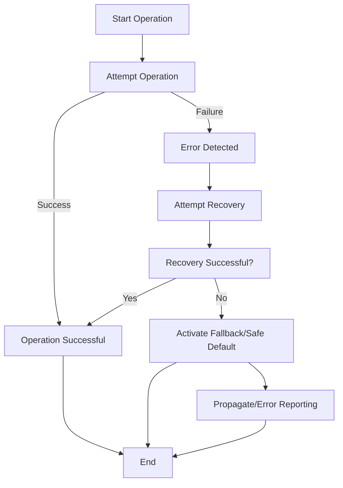
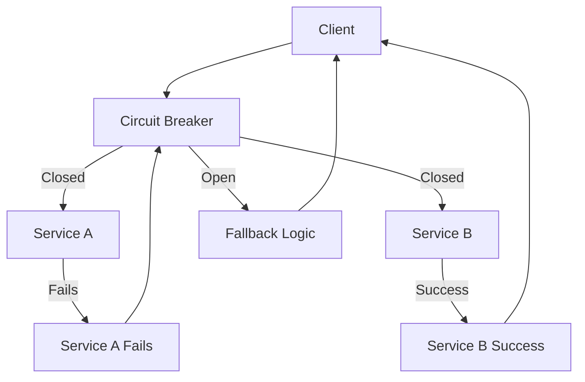
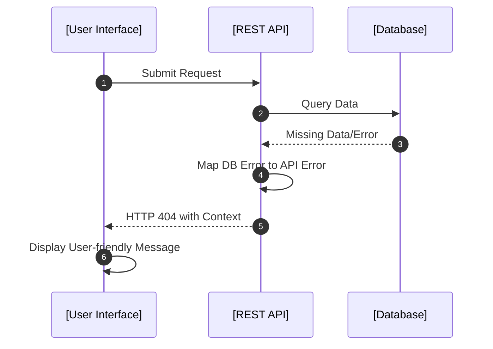

# Error Handling Strategies

## Introduction

In modern software systems, effective error handling is vital for ensuring system robustness, resilience, maintainability, and user satisfaction. "Error handling strategies" encompass the methodologies, techniques, and architectural patterns employed to detect, manage, recover from, and report failures within software components and across system boundaries. These strategies are essential for both defensive programming and achieving reliable operations amid expected and unexpected disruptions.

## Technical Context

Error handling operates at all abstraction layers, impacting application logic, middleware, libraries, frameworks, operating systems, and distributed systems. It is inextricably tied to core engineering principles including fail-fast, separation of concerns, robustness, and reliability.

Robust error handling strategies address:

- **Detection**: Identifying that an abnormal or unexpected condition has occurred.
- **Propagation**: Determining whether to address the error locally or to escalate it for higher-level handling.
- **Recovery**: Implementing mechanisms to restore or preserve the integrity and functionality of the system after a fault occurs.
- **Reporting**: Communicating errors in meaningful ways to users, maintainers, or external systems.
- **Defaulting**: Falling back to safe or conservative states when robust recovery is not possible.

These strategies reduce system fragility, simplify debugging, enable fault tolerance, and support graceful degradation.

## Core Concepts and Components

### Errors, Faults, and Exceptions

- **Error**: Any deviation from intended or correct behavior. Can arise from programming mistakes, environmental conditions, user input, hardware faults, resource exhaustion, or third-party dependencies.
- **Fault**: The underlying defect or condition that precipitates an error.
- **Exception**: A programming language construct used to signal anomalous or error conditions, and to alter normal control flow for resolution.

Not all errors should be treated equally; their severity, context, and recoverability vary.

### Error Handling Approaches

Three canonical strategies underlie most error handling designs:

1. **Error Recovery**: Attempt to restore normal operation, either fully or by compensating for failure.
2. **Error Propagation**: Reraise or forward the error to higher layers when local resolution is not feasible or appropriate.
3. **Safe Defaulting**: Fall back to predefined "safe" states to avoid catastrophic failures.

### Error Handling in System Architecture

Error handling mechanisms can be classified as:

- **Local**: Handled in the scope where the error originated (e.g., corrective action in a function or method).
- **Centralized**: Managed by frameworks, runtimes, middleware, or system-level handlers (e.g., global exception handlers, circuit breakers).
- **Distributed/Remote**: Managed across service boundaries, often requiring protocol-level semantics (e.g., HTTP status codes, gRPC error codes).

## Implementation Patterns

### Language-Level Error Handling Mechanisms

Common programming languages feature distinct constructs for error signaling and management.

- **Return Codes**: Functions/methods return status values indicating success or failure. (C, Go, many embedded languages)
- **Exceptions**: Structured constructs for abnormal flow control (`try`/`catch`, `throw`/`raise`) in languages such as Java, C#, Python, and C++.
- **Result/Option Types**: Encapsulate either a successful value or an error, statically enforce handling (Rust’s `Result`, Haskell’s `Either`).

#### Example: Exception Handling Flow

Below is a typical flow diagram for exception handling within a language runtime:

```mermaid
flowchart TD
    entry[Function Entry]
    exec[Normal Execution]
    error[Error Occurs]
    handler[Catch Block Exists?]
    handle[Handle Error]
    propagate[Propagate to Caller]
    exit[Function Exit (Normal)]
    abort[Terminate Execution]
    
    entry --> exec
    exec -->|No Error| exit
    exec -->|Error| error
    error --> handler
    handler -->|Yes| handle
    handler -->|No| propagate
    handle --> exit
    propagate -->|Another Handler| handle
    propagate -->|No Handler| abort
```

### Recovery Strategies

- **Retry Mechanisms**: Automatic or manual attempts to rerun failed operations, often with exponential backoff.
- **Compensation**: Undo partial work or apply corrective measures to return to a consistent state (important in transactions and distributed systems).
- **Fallback Routines**: Alternative logic or data paths employed when a primary method fails.

### Error Propagation Policies

- **Checked vs. Unchecked Exceptions**: Some languages (e.g., Java) distinguish exceptions requiring explicit acknowledgment in code from those that are optional.
- **Wrapping & Enrichment**: Adding contextual data via chained or wrapped errors for improved traceability.
- **Translation**: Mapping errors between abstraction layers, modules, or network boundaries (e.g., mapping a database failure to an HTTP 500 response).

### Safe Defaulting

- **Graceful Degradation**: Disabling non-essential features to preserve core functionality.
- **Use of Sentinel Values**: Predefined constants indicate benign but non-optimal states (e.g., `null object pattern`, return value of `0`).
- **Isolation/Quarantine**: Restricting affected subsystems to prevent error propagation.

## Workflows and Practical Considerations

### General Error Handling Workflow



### Integration Points

Typical integration of error handling:

- **APIs**: Designing error codes, responses, message schemas, and failure semantics (e.g., OpenAPI/Swagger for RESTful APIs, gRPC error codes).
- **Logging & Monitoring**: Emitting structured events, logs, or traces to observability tools (e.g., ELK stack, Prometheus, OpenTelemetry).
- **User Interface Feedback**: Surfacing actionable, relevant error messages to end users.

### Performance Implications

- **Exception Handling Overhead**: Using exceptions for normal control flow can be expensive in CPU and memory.
- **Error Path Latency**: Recovery and fallback paths may introduce latency spikes, particularly in distributed systems.

> [!CAUTION]
> Avoid using exceptions for predictable situations (e.g., end-of-file, validation errors) where explicit error checking is more efficient and leads to clearer code.

### Implementation Challenges and Pitfalls

#### Common Pitfalls

- **Swallowing Errors**: Catching errors without taking corrective action, logging, or rethrowing leads to silent failures and hard-to-debug issues.
- **Over-generalization**: Catching overly broad error types (`Exception`, `Throwable`, `Error` in some languages) can mask programming bugs or system-level failures.
- **Inconsistent Propagation**: Failing to propagate errors at module or system boundaries, leading to inconsistent system states.
- **Leaking Implementation Details**: Exposing low-level error information in user-facing contexts or external APIs reduces encapsulation and can cause security issues.

#### Implementation Best Practices

> [!TIP]
> 1. Categorize and prioritize errors; not all require the same handling.
> 2. Favor explicit error handling when recoverable.
> 3. Enrich errors with context (parameters, state, identifiers).
> 4. Ensure error semantics are consistent across boundaries (APIs, services).

## Error Handling in Distributed Systems

### Distributed Error Handling Architecture

Distributed systems amplify the importance and complexity of error handling, as failures can result from network partitions, timeouts, remote service failures, or out-of-order interactions.

#### Common Distributed Patterns

- **Retry Policies**: With idempotency safeguards to prevent unintended side effects.
- **Circuit Breakers**: Prevent repeatedly interacting with failing components, enabling graceful recovery when systems stabilize.
- **Bulkheading**: Isolate components or workloads so failures are contained.



> [!NOTE]
> In distributed protocols, standards such as HTTP, gRPC, and AMQP define error transport conventions (e.g., HTTP status codes, gRPC status and error messages), enabling interoperability of error handling across system and organizational boundaries.

### Idempotency and Exactly-once Semantics

Many recovery strategies rely on the idempotent nature of operations (i.e., executing an operation multiple times has the same effect as once). In distributed transactions, lack of idempotency can cause data corruption, so error handling strategies must factor in operation semantics.

### Error Reporting and Monitoring

Non-localized errors must be observable and actionable. Distributed tracing (e.g., OpenTelemetry, Jaeger) and structured error logs are critical for identifying root causes in complex, service-oriented architectures.

## Error Handling by Example

### Example: Layered Error Management



In this example, low-level database errors are translated (not leaked) into higher-level API errors, which are then presented meaningfully to the user.

## Standards and Specifications

- **HTTP/1.1 (RFC 7231)** — Defines status codes that communicate errors (e.g., 4xx for client errors, 5xx for server errors).
- **gRPC Status Codes** — Standard set for remote procedure call error communication.
- **ISO/IEC 9126: Software Engineering — Product Quality** — Includes reliability and fault tolerance as quality metrics.
- **POSIX errno** — Enumerates standard error codes and conventions for UNIX-like OSes.
- **OpenAPI Specification** — Structures API error reporting (responses, formats, codes).

## Engineering Decisions

Designers must weigh numerous trade-offs:

- **Granularity vs. Usability**: Fine-grained error reporting aids diagnostics but may over-expose internal logic.
- **Local vs. Centralized Handling**: Local handling can be context-aware, but centralized strategies simplify enforcement and monitoring.
- **Automated Recovery vs. Human Intervention**: Automated retries can improve availability but may mask symptoms requiring diagnosis.

> [!IMPORTANT]
> Regardless of approach, error handling should never be an afterthought. Incorporate it as a core concern during design, code reviews, and testing (including chaos engineering and failure injection).

## Summary

Error handling strategies underpin the trustworthiness and maintainability of software systems. By developing rigorous mechanisms for detection, propagation, recovery, and reporting, engineers create resilient software that reliably manages both anticipated and unforeseen failures. As systems evolve in scale and complexity—particularly in distributed environments—thoughtful error handling is essential for operational excellence and long-term system health.