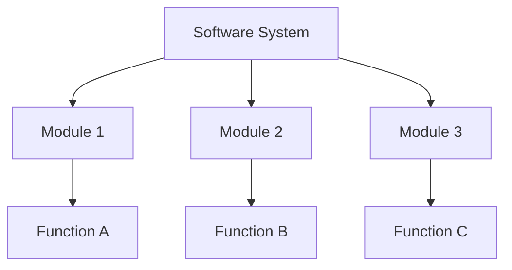
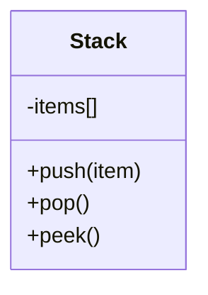
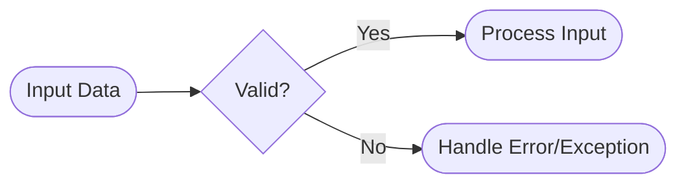
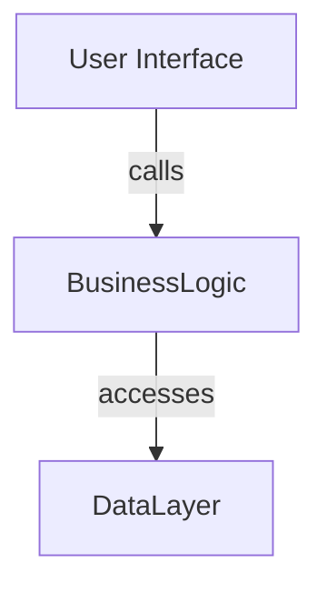
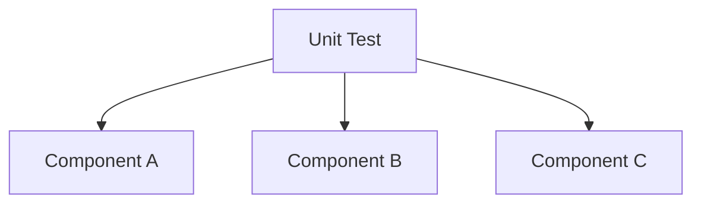
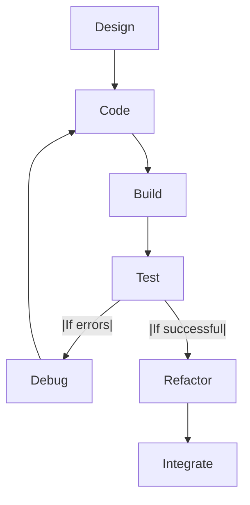
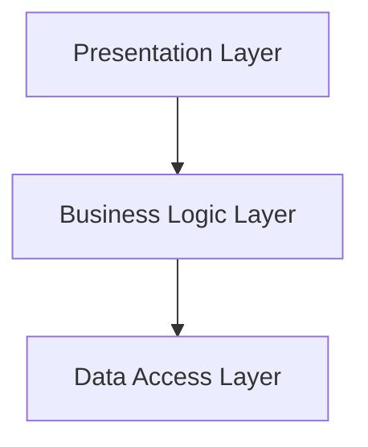
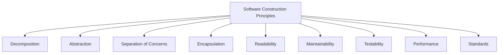

# Software Construction Principles

## Introduction

Software construction refers to the detailed creation of working, meaningful software through a combination of coding, validation, testing, and debugging. It sits at the core of the software engineering process, bridging design and maintenance by transforming abstract solutions into executable programs. Effective software construction applies well-defined principles to improve correctness, reliability, maintainability, and efficiency, directly influencing long-term project outcomes.

Software construction is rigorously described in the [SWEBOK Guide](https://www.computer.org/education/bodies-of-knowledge/software-engineering-v3/), emphasizing practices such as problem decomposition, abstraction, code organization, readability, testability, and maintainability. These principles underpin the creation of robust, scalable, and adaptable systems.

## Technical Context

Software construction is not isolated but interacts closely with requirements, design, testing, and deployment. It accepts validated designs and produces software artifacts that are compliant, efficient, and resilient to change. Construction activities are governed by programming paradigms, language features, organizational coding standards, and development methodologies such as Agile, Waterfall, or DevOps.

Key construction standards may be informed by ISO/IEC 24765 (Systems and software engineering vocabulary) and ISO/IEC/IEEE 12207 (Software life cycle processes), which describe generic processes that construction activities must often integrate with or conform to.

## Core Software Construction Principles

This section details essential principles and concepts that drive effective software construction.

### 1. Decomposition

**Decomposition** is the process of breaking down a complex problem or system into smaller, manageable components. Effective decomposition enables:

- Parallel development across teams
- Easier reasoning about program correctness
- Isolation of changes and improved modularity

Decomposition aligns closely with the concepts of modularity and separation of concerns, where each component is responsible for a well-defined part of the system functionality.

#### Approaches to Decomposition

- **Functional Decomposition:** Breaking down the system by function or process.
- **Object-Oriented Decomposition:** Modeling the system in terms of interacting objects.
- **Layered Decomposition:** Organizing components into logical layers (e.g., presentation, business logic, data persistence).

#### Practical Considerations

- Excessive decomposition may lead to over-engineering ("death by a thousand classes").
- Insufficient decomposition burdens components, complicating reuse and testing.

> [!Caution]
> Maintain balance: Decompose enough to enable modularity and clarity, but avoid fine-grained fragmentation that impairs comprehension and performance.

### 2. Abstraction

**Abstraction** enables programmers to manage complexity by hiding unnecessary details and exposing only relevant functionality. It appears in multiple forms:

- **Procedural Abstraction:** Using functions/methods to encapsulate sequences of operations.
- **Data Abstraction:** Using data types or objects to hide implementation details behind well-defined interfaces.

#### Examples

- Stack implemented via arrays or linked lists, but exposing only `push`, `pop`, and `peek` operations.
- Internal logic of services hidden behind public APIs.

#### Benefits

- Encourages information hiding (a key aspect of encapsulation)
- Reduces cognitive load and increases adaptability to change

> [!Tip]
> Interface design is central to successful abstraction. Design interfaces around what is necessary for use, not for implementation.

### 3. Coding Principles and Best Practices

#### a. Readability

Readable code is immediately comprehensible and communicative. Readability stems from:

- Consistent naming conventions
- Clear formatting and whitespace
- Effective use of comments (to explain *why*, not *what*)

Coding standards (such as Google's [C++ Style Guide](https://google.github.io/styleguide/cppguide.html) or PEP 8 for Python) provide baseline readability rules.

#### b. Maintainability

Maintainable code can be easily adapted, fixed, or improved. Maintainability is achieved by:

- Avoiding duplication (DRY principle: Don't Repeat Yourself)
- Modularizing features
- Isolating changes (minimizing ripple effects)

Maintainable systems are resistant to "software rot" and degrade gracefully as they undergo adaptation.

#### c. Simplicity

Simplicity reduces potential for errors and lowers barriers to comprehension. Favor:

- Clear algorithms over clever/obscure optimizations
- Straightforward control flows

> [!Warning]
> Complexity is often the root cause of technical debt. Simplicity increases correctness and maintainability.

#### d. Defensive Programming

Anticipate misuse, errors, and boundary conditions:

- Validate inputs and outputs
- Handle errors gracefully (using exceptions, error codes, etc.)
- Assert invariants

### 4. Separation of Concerns

Functions, classes, and modules should have a **single, clear responsibility**. This relates to the Single Responsibility Principle (SRP), one of the SOLID Principles. Separation of concerns enables:

- Parallel workstreams
- Easier testing and debugging
- Flexible code reuse

#### Illustration

> [!Alert]
> Conflating unrelated responsibilities in code can cause bugs, decrease maintainability, and hinder scaling efforts.

### 5. Encapsulation and Information Hiding

Encapsulation restricts direct access to object internals, enforcing boundaries through public interfaces and private implementation.

- Exposes minimal surface area to clients
- Enables change without affecting dependents

OOP languages enforce encapsulation with access modifiers (`private`, `protected`, `public`).

### 6. Code Reuse

Promote reuse of code wherever practical. Code reuse occurs via:

- Libraries and frameworks
- Utility functions or shared modules
- Inheritance and composition (in OO and functional contexts)

#### Practical Considerations

- Excessive reuse can lead to over-dependency and difficult upgrades.
- Prefer composition over inheritance for flexibility and lower coupling.

### 7. Testability

Construct software in a way that facilitates verification via automated and manual testing.

- Minimize side effects
- Separate pure and impure functions
- Decouple inputs/outputs from computation logic

#### Testable Component Architecture

> [!Tip]
> Dependencies should be injected or mocked during testing to isolate units under test.

### 8. Performance and Resource Management

Construction choices can significantly impact performance and resource consumption:

- Use appropriate data structures and algorithms
- Minimize unnecessary computation or memory usage
- Release resources (memory, file handles, connections) appropriately

> [!Warning]
> Early performance optimization can introduce unnecessary complexity. Profile first and optimize only where needed (per Knuth’s “premature optimization is the root of all evil”).

### 9. Consistency and Standards Compliance

Adhering to organizational and industry standards ensures code clarity and inter-team compatibility.

- Coding standards: Naming, comments, layouts
- Protocol/format standards (e.g. REST, HTTP, JSON, RFC 8259)

Standardization aids onboarding, reduces errors, and promotes code sharing.

## Workflows in Software Construction

### Overview of Construction Activities

Software construction proceeds through iterative refinement, typically adhering to the following workflow:

#### Steps Explained

- **Design:** Map requirements to architectural and detailed designs.
- **Code:** Create source code, guided by principles above.
- **Build:** Compile, bundle, or translate to executable artifacts.
- **Test/Debug:** Validate functionality and correct detected issues.
- **Refactor:** Improve code structure without changing behavior.
- **Integration:** Combine modules into larger systems or deploy to environments.

### Tooling

Construction uses a variety of tools:

- **Version Control Systems** (Git, Mercurial): Track changes and facilitate collaboration.
- **Build Tools** (Make, Maven, Gradle): Automate compilation and packaging.
- **Automated Test Tools** (JUnit, pytest): Execute validation scripts.
- **CI/CD Systems** (Jenkins, GitHub Actions): Automate build–test–deploy pipeline.

### Typical Constraints and Challenges

#### Integration Points

- APIs, third-party services, and databases represent integration points needing careful abstraction and error handling.

#### Concurrency and Parallelism

- Synchronization and data consistency introduce construction complexity, requiring careful decomposition and testing.

#### Internationalization/Localization

- Abstract language-specific and region-specific content to facilitate adaptation.

#### Security

- Construction must conform to security policies (input validation, output encoding, access controls).

#### Regulatory Compliance

- Adherence to external standards (e.g., GDPR, ISO/IEC 27001) may constrain code organization and data handling.

> [!Alert]
> Ignoring security and compliance requirements at construction time leads to costly redesigns and possible legal exposure.

## Key Variations and Paradigms

### Procedural vs. Object-Oriented vs. Functional Construction

Each paradigm emphasizes different aspects:

| Paradigm         | Key Concepts             | Strengths                        | Example Languages          |
| ---------------- | ----------------------- | -------------------------------- | ------------------------- |
| Procedural       | Procedures, call stacks  | Simplicity, explicit control     | C, Pascal, Go             |
| Object-Oriented  | Objects, classes, methods| Modularity, code organization    | Java, C++, C#, Python     |
| Functional       | Pure functions, immutability| Testability, concurrency         | Haskell, Erlang, F#, Scala|

> [!Tip]
> Most modern systems mix paradigms, using each where it matches the problem domain.

### Layered and Modular Architectures

Layering enforces architectural boundaries (e.g., MVC – Model-View-Controller), while modularity breaks systems into reusable packages.

### Integration with Agile and DevOps

Construction principles are applied iteratively in Agile, emphasizing small increments and continuous feedback. In DevOps, construction integrates tightly with deployment, monitoring, and rapid release cycles.

## Common Pitfalls and Mitigation Strategies

- **Over-Engineering:** Creating unnecessary abstractions or extensibility.
  - *Mitigation:* Adhere to YAGNI (You Aren’t Gonna Need It); implement for present needs.
- **Copy-Paste Programming:** Duplicating code for expedience.
  - *Mitigation:* Refactor and extract reusable components.
- **Inconsistent Style:** Mixing conventions across the codebase.
  - *Mitigation:* Enforce linting and code review policies.
- **Poor Documentation:** Lacking meaningful comments or up-to-date documentation.
  - *Mitigation:* Integrate documentation generation and review into the workflow.

## Summary Diagram: Overview of Software Construction Principles

## Conclusion

Sound software construction is foundational to software quality, maintainability, and adaptability. Relying on established principles—decomposition, abstraction, encapsulation, separation of concerns, readability, maintainability, testability, and standards compliance—enables engineering teams to deliver robust, efficient, and scalable systems. Applying these core practices, while remaining attentive to performance, integration, and organizational requirements, leads to sustainably engineered software solutions.

> [!Tip]
> Integrate software construction principles early and persistently throughout the software lifecycle for maximum impact and reduced technical debt.