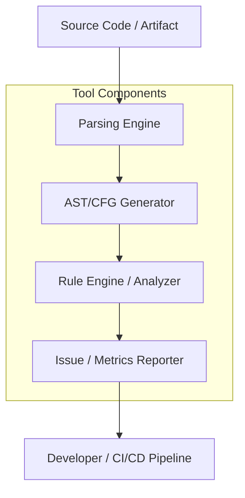
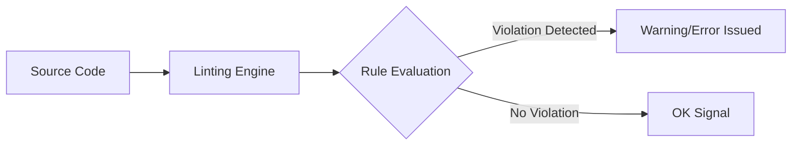
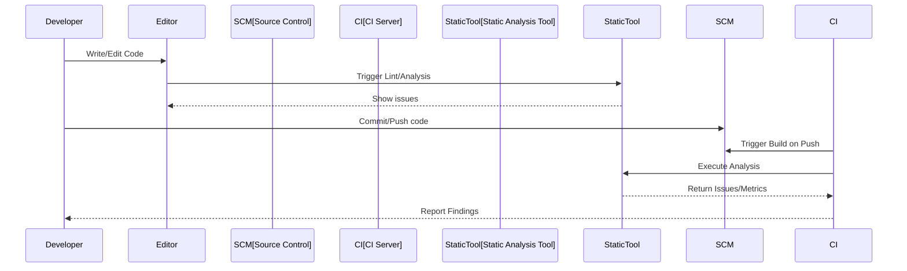
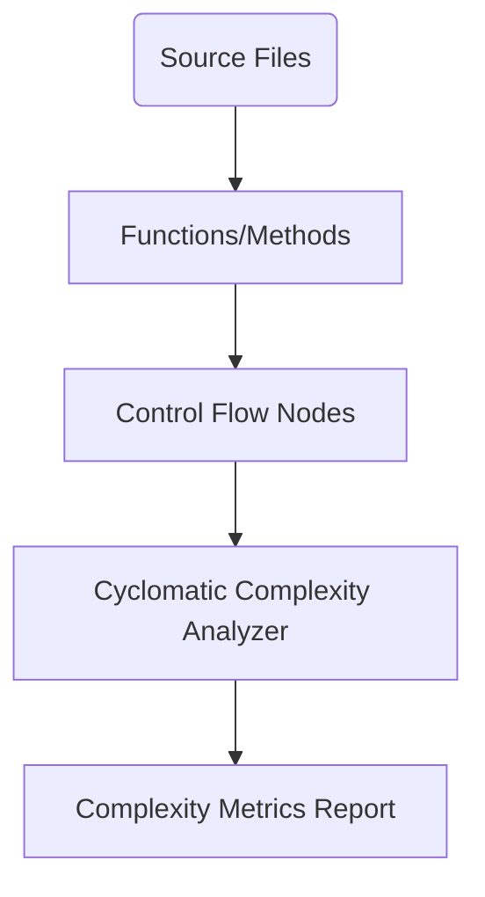
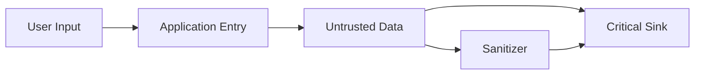

# Static Analysis Fundamentals

## Introduction

Static analysis is the examination of program code and related artifacts without the execution of the code. It is a foundational practice within software quality assurance and software construction, designed to detect defects, assess complexity, enforce standards, and ensure compliance with coding guidelines or regulatory requirements. By analyzing the structure, semantics, and possible execution paths in source code, static analysis tools help engineers identify possible faults, vulnerabilities, or maintainability issues early—often before code reaches production or even runtime testing.

Static analysis contrasts with dynamic analysis, which assesses software behavior during execution. Both are crucial in a comprehensive quality strategy, but static analysis is uniquely suited for early detection, continuous integration, and automated code review pipelines.

## Technical Context and Motivation

Static analysis is routinely employed in modern software engineering to support:

- Early detection of logical, semantic, and stylistic defects
- Assurance of coding standard conformance (e.g., MISRA C, CERT, Google Style Guides)
- Assessment of code complexity, potential maintainability issues, and technical debt
- Enforcement of security guidelines (e.g., OWASP, CWE)
- Automated documentation and visualization of call graphs, dependencies, and data flows

Its applicability spans safety-critical systems, large enterprise codebases, open-source projects, and regulated domains where early verification and auditability are essential.

## Core Concepts

### What Is Static Analysis?

**Definition:**  
Static analysis is the process of analyzing program artifacts—typically source code, bytecode, or binary code—without executing them, to evaluate properties such as correctness, security, maintainability, complexity, standards compliance, and more.

#### Key Types

- **Syntactic Analysis:** Detects syntactic or stylistic violations.
- **Semantic (Flow) Analysis:** Examines program semantics, control flows, and data dependencies.
- **Formal Verification:** Uses mathematical techniques (e.g., model checking, theorem proving) to establish correctness concerning formal specifications.

### Related Terminology

- **Linting:** A process/tool for flagging suspicious or non-conformant constructs based on rules.
- **Code Metrics:** Quantitative measurements such as cyclomatic complexity or code coverage ratios.
- **Abstract Syntax Tree (AST):** A tree representation of the code's syntactic structure, frequently used for analysis.
- **Control Flow Graph (CFG):** A graph representation of all paths that might be traversed through a program during its execution.
- **Data Flow Analysis:** Examines the flow of data through the program to uncover issues like use-before-initialization or untrusted inputs.

## Architecture and Key Components

### Static Analysis Tool Architecture

Most static analysis tools (like SonarQube, ESLint, Clang Static Analyzer, Coverity, or FindBugs) share core architectural components:


*Mermaid Diagram: Generalized Static Analysis Tool Flow*

#### Description of Components

- **Parsing Engine:** Converts code into internal representations (AST, tokens).
- **AST/CFG Generator:** Produces higher-level structural models for rule application.
- **Rule Engine:** Applies rules to models, checking for violations, defects, or risks.
- **Reporter:** Aggregates findings and presents actionable reports or integrates with developer tooling or CI/CD platforms.

### Granularity and Analysis Units

Static analysis can operate at multiple levels:

- **Source File Level:** Analyzes individual files.
- **Module Level:** Examines the interaction of groups of files.
- **Project/System Level:** Assesses global properties, architectural consistency, or cross-cutting concerns.

Some tools specialize in particular layers (e.g., linters for files, architectural analyzers for projects), while others support broad, configurable scopes.

## Static Analysis Techniques

### Syntactic Analysis and Linting

**Syntactic analysis** relies on pattern matching and parse trees to catch:

- Code style inconsistencies
- Redundant or unreachable code
- Missing or extraneous imports
- Deprecated API usage

**Linters** (e.g., ESLint for JavaScript, pylint for Python) are typical tools in this domain. They generally provide configurable rulesets, custom rule support, and integrations with code editors and continuous integration pipelines.


*Mermaid Diagram: Linting Process Flow*

### Semantic and Flow Analysis

Beyond syntax, semantic analysis inspects how data and control move through code, enabling detection of:

- Dead code or infeasible paths
- Null pointer dereferences
- Uninitialized variables
- Resource leaks
- Inconsistent exception handling

Techniques in this domain derive control flow graphs, perform data flow and taint analyses, and often require inter-procedural or whole-program reasoning.

#### Abstract Interpretation

Abstract interpretation is a foundational static analysis technique that reasons about program behavior using abstract domains (e.g., ranges for variables) rather than concrete values. This enables scalable, sound detection of potential runtime faults without exhaustive execution.

#### Model Checking and Theorem Proving

Formal methods check program properties against mathematically specified models, often using temporal logic or automated theorem-provers. While computationally intensive, these methods are crucial for high assurance in safety- or security-critical code. Notable specifications include [MISRA C](https://www.misra.org.uk/) and [SPARK Ada subset](https://www.adacore.com/sparkpro).

## Static Analysis in Practice

### Integration Points and Workflows

Static analysis is most effective when continuously integrated. Common workflows include:

- **Pre-Commit Hooks:** Enforce checks before code is committed.
- **Continuous Integration (CI):** Run full static analysis for every build/pull request.
- **Nightly/Full Builds:** Deeper or more expensive analyses for large-scale or formal checks.
- **IDE Integration:** Immediate feedback while writing code.


*Mermaid Diagram: Static Analysis in the Development Workflow*

#### GitHub Alert
> **Tip:**  
> Static analysis should be used as a *gate* in pull request/push workflows to prevent introduction of high-severity defects into shared or production branches.

### Constraints and Limitations

- **False Positives/Negatives:** No tool achieves perfect precision; balance between strictness and usability is required.
- **Scalability:** Whole-program analysis can be resource-intensive on large codebases.
- **Language Support:** Not all tools support every programming language or dialect.
- **Configuration Complexity:** Highly configurable tools can be both powerful and unwieldy; maintainable rule sets and baselines are essential.

#### GitHub Alert
> **Caution:**  
> Overly aggressive analysis or excessive warnings can lead to "alert fatigue," causing developers to ignore important findings. Tuning rules and severities is crucial.

### Security, Regulatory and Standards Compliance

Static analysis is mandated or recommended in many critical standards, including:

- *ISO/IEC 27001* (information security management)
- *MISRA C/C++* (automotive/military/industrial embedded systems)
- *CERT Secure Coding Standards*
- *DO-178C* (avionics software)
- *IEC 61508* (functional safety)

These standards may specify rule subsets, mandatory checks, or reporting requirements. Many commercial and open-source tools provide built-in or customizable rulesets for standard compliance verification.

### Metrics and Measurement

Static analysis tools often report quantitative metrics, including:

- **Cyclomatic Complexity:** Measurement of the number of linearly independent paths through code. High complexity can indicate risk or maintainability issues.
- **Code Coverage (Static):** Proportion of code covered by syntactic or semantic analysis.
- **Dependency Graphs:** Maps of module, class, or function interdependence.


*Mermaid Diagram: Cyclomatic Complexity Analysis Flow*

## Common Pitfalls

### Misinterpretation of Results

Engineers must distinguish between genuine defects, stylistic concerns, and tool errors:

- **False positives** may distract from real issues.
- **False negatives** (missed defects) can engender false confidence.
- Understanding the meaning and severity of a finding is critical; code review processes should involve human scrutiny.

### Rule Set Management

Rule drift, conflicting rules, and project-specific requirements must be managed:

- **Baselining:** Suppressing long-standing findings for legacy code until actively changed.
- **Custom Rules:** Developing and maintaining organization- or project-specific checks.
- **Tool Updates:** Ensuring rule sets evolve with language, technology, and security landscape changes.

### Scalability and Performance

Larger codebases or more complex rule sets can affect:

- **Build duration in CI/CD pipelines**
- **Interactive feedback speed in IDEs**
- **Cost of full formal analyses**

Mitigations include analysis caching, incremental analysis, sharding (dividing code), and tuning tool configurations.

## Advanced Topics

### Whole-Program vs. Modular Analysis

- **Whole-program analysis** achieves deeper understanding but may not scale for very large systems.
- **Modular or incremental analysis** allows partial, faster analysis at the expense of potentially missing cross-module issues.

### Inter-Procedural and Intra-Procedural Analysis

- **Intra-Procedural:** Only within a single function/procedure.
- **Inter-Procedural:** Follows calls across function/module boundaries for comprehensive defect detection.

```mermaid
flowchart TD
    subgraph ModA[Module A]
        A1[Function foo()]
    end
    subgraph ModB[Module B]
        B1[Function bar()]
    end
    A1 -->|calls| B1
```
*Mermaid Diagram: Inter-Procedural Analysis Example*

### Taint Analysis

Taint analysis tracks the flow of untrusted or user-supplied data through a program, identifying points where such data affect critical instructions or outputs, a common cause of vulnerabilities such as injection attacks.


*Mermaid Diagram: Taint Data Flow Analysis*

## Practical Engineering Considerations

### Tool Selection Criteria

Consider the following when choosing or integrating static analysis tools:

- Language and platform support
- Rule set quality, customization, and extensibility
- Integration with build tools, CI/CD, version control, and IDEs
- False positive/negative rates and learnability
- Support for standards and compliance requirements

### Implementation Challenges

- **Legacy Code:** Introducing static analysis in mature projects may reveal a large backlog of issues; staged rollout and baselining can smooth adoption.
- **Customization:** Effective analysis often requires custom rules and configurations tailored to project conventions and risk profiles.
- **Performance:** Analyze trade-offs between analysis depth, feedback latency, and hardware requirements.

### Continuous Improvement

Treat static analysis as a living part of the development cycle:

- Regularly refine rule sets and severity thresholds
- Continuously educate developers on interpreting and acting upon findings
- Monitor trends in defect types and adjust processes accordingly

## Example Use Cases

- **Prevention of Buffer Overflows and Null Pointer Dereferences:** In C/C++ development, tools like Clang and Coverity can statically detect code that risks overflows or null dereferencing.
- **JavaScript Coding Standards in Web Apps:** Using ESLint or similar ensures code conformance and early detection of anti-patterns or deprecated APIs.
- **EN 50128 Compliance in Rail Automation:** Mandates static code analysis for all safety software components, with detailed reporting and traceability.

## Future Directions and Research

Ongoing topics of formal and applied research include:

- Improved precision and scalability of analysis algorithms
- Automated repair or refactoring suggestions
- Machine learning to reduce false positives and prioritize issues
- Hybrid static-dynamic analysis techniques for higher assurance

## Summary

Static analysis is a vital, formal discipline within modern software engineering, enabling the early, automated detection of defects, code complexity, and compliance violations. The field encompasses a rich array of analyses, methods, and standards, underpinned by mature toolchains and deep theoretical foundations. Its effective practice hinges on appropriate tool integration, judicious interpretation of results, ongoing rule refinement, and alignment with broader quality and compliance strategies. When systematically applied, static analysis drives higher software quality, security, maintainability, and facilitates regulatory conformance across varied domains.