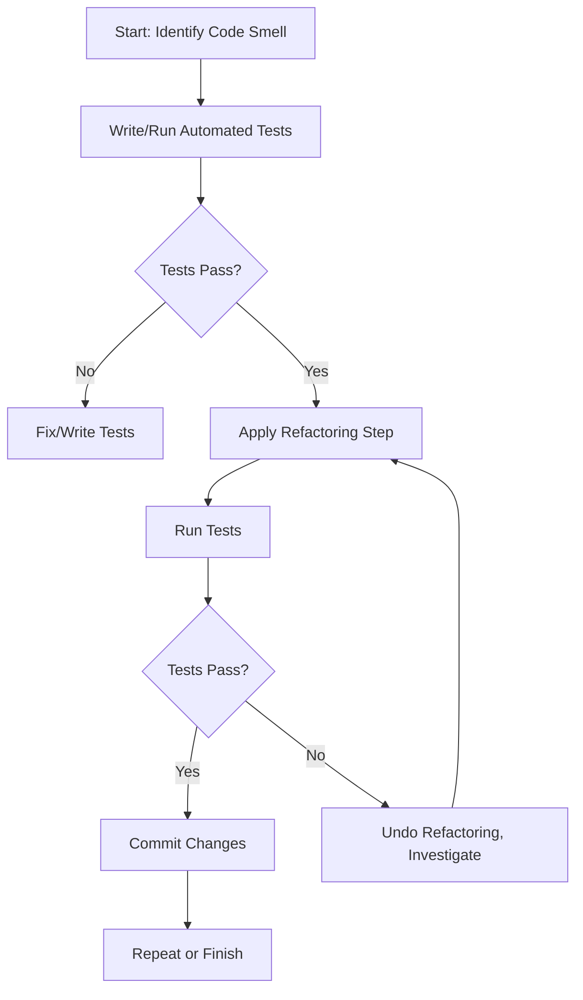
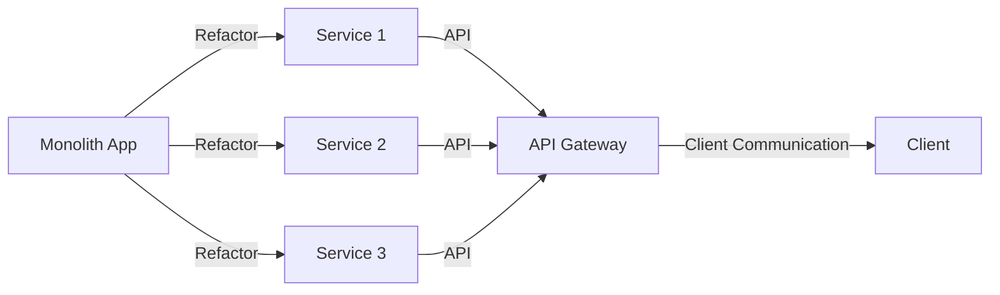

# Refactoring Strategies

## Introduction

Refactoring is the disciplined process of improving the internal structure of existing code without changing its external behavior. This enables software engineers to evolve systems more safely, reduce technical debt, facilitate maintenance, and increase adaptability to new requirements. Refactoring is distinguished from rewriting or adding new features in that its explicit purpose is internal quality improvement while preserving observable behavior.

The concept of refactoring was formalized within object-oriented and agile software development but is applicable across paradigms, languages, and architectures. Its practice is foundational to sustainable software engineering, continuous integration, and test-driven development (TDD).

## Technical Context and Motivation

### Definition of Refactoring

**Refactoring** is the application of disciplined code transformations intended to:
- Enhance code readability,
- Promote extensibility and reusability,
- Simplify testing,
- Reduce duplication,
- Eliminate code smells (indicators of potential deeper problems).

Refactorings must be behavior-preserving. That is, after refactoring, the system must meet exactly the same functional requirements as before.

### Role in Software Maintenance and Evolution

Software maintenance (per IEEE Std 1219-1998 and SWEBOK) includes corrective, adaptive, perfective, and preventive activities. Refactoring is generally viewed as a perfective or preventive maintenance technique—aiming to improve code quality, structure, and maintainability to prevent future problems. Its systematic use can reduce long-term maintenance cost and decrease the risk of introducing defects during enhancement or bug fixing.

### Refactoring and Technical Debt

Refactoring is a key technique in managing technical debt: the implied cost of additional work caused by choosing an easy solution now instead of a better one that would take longer. Regular refactoring helps keep technical debt at manageable levels.

## Core Concepts

### Code Smells

“Code smell” is a metaphor for any symptom in the code that may indicate a deeper problem. Common smells include:
- Duplicated code,
- Long methods,
- Large classes,
- Feature envy,
- Data clumps,
- Divergent change,
- Shotgun surgery,
- Inappropriate intimacy.

Refactoring targets the mitigation or removal of these code smells.

### Catalogue of Refactorings

Refactorings can be classified as:
- **Composing Methods** (e.g., Extract Method, Inline Method)
- **Moving Features Between Objects** (e.g., Move Method, Move Field)
- **Organizing Data** (e.g., Encapsulate Field, Replace Magic Number with Symbolic Constant)
- **Simplifying Conditionals** (e.g., Decompose Conditional, Replace Nested Conditional with Guard Clauses)
- **Making Method Calls Simpler** (e.g., Rename Method, Introduce Parameter Object)
- **Dealing with Generalization** (e.g., Pull Up Method/Field, Push Down Method/Field)

#### Example: Extract Method

The **Extract Method** refactoring consists of taking a piece of code from an existing method and turning it into a new method. This improves readability and encourages reuse.

**Before:**
```java
public void printOwing() {
    printBanner();
    // print details
    System.out.println("name: " + _name);
    System.out.println("amount: " + getOutstanding());
}
```
**After:**
```java
public void printOwing() {
    printBanner();
    printDetails(getOutstanding());
}
private void printDetails(double outstanding) {
    System.out.println("name: " + _name);
    System.out.println("amount: " + outstanding);
}
```

### Granularity: Micro and Macro Refactoring

- **Micro-refactorings** are small, incremental, low-risk changes (e.g., Rename Variable, Extract Method).
- **Macro-refactorings** involve larger-scale transformations, such as modularization, extraction of services, or architectural migrations (e.g., from monolith to microservices).

## The Refactoring Workflow

A disciplined refactoring workflow consists of several steps:

1. **Identify Code Smells**
2. **Ensure Safety with External Tests**
3. **Apply Small, Reversible Transformations**
4. **Verify Behavior After Each Step**
5. **Commit and Document Changes**

### Refactoring Workflow Diagram



### Safety & Test Coverage

The safety of refactoring efforts depends on comprehensive test coverage. Unit, integration, and acceptance tests minimize risk, ensuring that changes do not alter expected behavior.

> **:warning: Warning**
>  
> Insufficient automated test coverage can make refactoring dangerous by allowing regressions to slip through. Always strengthen test suites before major refactorings.

## Common Refactoring Strategies

### Opportunistic Refactoring (“Boy Scout Rule”)

Engineers incrementally improve code whenever they encounter problems during regular work (“always leave the code better than you found it”). This approach is highly compatible with continuous integration and agile methods.

### Planned/Big Bang Refactoring

Larger codebases may accrue so much debt that piecemeal efforts are insufficient. Planned, substantial refactoring tracks are scheduled, often alongside feature work. This tends to be riskier, increases merge conflict likelihood, and should be supported by ample automated tests and developer alignment.

### Preparation and Branching

Major refactorings may require special source control management practices:
- Use feature branches for substantial changes,
- Rebase or merge frequently to avoid massive integration headaches,
- Maintain small, reviewable pull requests.

> **:bulb: Tip**
>
> Avoid refactoring and feature development in the same commit to simplify review, testing, and potential rollback.

## Key Refactorings: Detailed Overview

### Extract Method / Inline Method

Separates concerns, improves readability, and enables reuse. The inverse operation, Inline Method, can be used to collapse overabstraction.

### Rename Variable/Method/Class

Improves clarity and maintainability. Refactoring tools in modern IDEs can safely propagate such changes.

### Replace Temp with Query

Eliminates local variables in favor of method calls, improving encapsulation and reducing error risk.

### Move Method/Field

Moves logic or state to a more appropriate class/module, supporting better object-oriented design or modularity.

### Encapsulate Field

Restricts direct access to data, ensuring proper validation and invariants.

### Replace Conditional with Polymorphism

Transforms large switch/if statements based on type to leverage polymorphic method dispatch, simplifying control flow.

**Note:** Object-oriented languages provide direct support for this; functional paradigms use constructs like higher-order functions.

### Decompose Conditional

Separates complex conditional logic into discrete, self-documenting methods.

### Introduce Parameter Object

Consolidates groups of related parameters into a single class, simplifying interfaces and enabling future extensibility.

### Modularization and Architectural Refactoring

Larger architectural refactorings include:
- Extracting modules or libraries,
- Breaking up monolithic applications,
- Introducing dependency injection,
- Migrating to microservice or service-oriented architectures.

#### Example Architecture Refactoring: Monolith → Microservices



## Tool Support and Automation

### IDEs and Refactoring Tools

Most modern IDEs (IntelliJ, Eclipse, Visual Studio, VS Code, PyCharm, etc.) have built-in or extensible support for many mechanical refactorings, including:
- Rename,
- Extract method/function/class/module,
- Move/Copy,
- Inline,
- Change method signature,
- Encapsulate field.

Automated tools dramatically reduce the risk of small refactorings. Large or cross-cutting changes still demand human judgment and thorough review.

### Static Analysis and Code Quality Tools

Static analysis tools (e.g., SonarQube, ESLint, PMD) can automatically detect common code smells and suggest refactorings.

> **:construction: Note**
>
> Diagram to be added later: visual comparison of code before and after automated refactoring.

### Language Constraints and Compatibility

Some refactorings are language-specific (e.g., introduction of traits or extension methods). Engineers must be aware of:
- Type systems (static vs. dynamic typing),
- Encapsulation mechanisms (public/private/protected),
- Language idioms,
- Backward compatibility considerations (e.g., public APIs).

## Constraints, Assumptions, and Pitfalls

### Constraints

- **APIs & Backward Compatibility:** Public interfaces may not be freely refactored unless a deprecation/compatibility strategy exists.
- **Cross-Team Dependencies:** Code shared across teams/components (SDKs, frameworks) must be refactored more cautiously.
- **Compliance & Auditing:** Regulated environments may require documented change control for refactorings.

### Assumptions

- Sufficient automated test coverage exists or can be developed,
- Developers have access to reliable version control,
- Sufficient understanding of system architecture and dependencies.

### Common Pitfalls

- Refactoring without tests, leading to undetected regressions,
- Mixing refactoring with unrelated features or bug fixes, complicating code review and rollback,
- Incomplete tooling support for dynamic or reflection-heavy code,
- Over-refactoring (“refactoring for refactoring’s sake”), detracting from business value.

> **:no_entry_sign: Caution**
>
> Avoid large, monolithic refactoring efforts without a clear rollback path and explicit business justification.

## Patterns of Refactoring in Modern Software Development

### Continuous Refactoring

Continuous Delivery (CD) and Continuous Integration (CI) models heavily favor frequent, small-scale refactorings. This minimizes merge conflicts and integration pain, while allowing fast feedback.

### Test-Driven Development (TDD) and Refactoring

TDD practitioners often follow the “Red-Green-Refactor” cycle:
1. **Red:** Write failing tests for new functionality.
2. **Green:** Write minimal code to make tests pass.
3. **Refactor:** Clean up the implementation without breaking tests.

This flow ensures that refactoring is interleaved with feature development, promoting sustainable technical quality.

```mermaid
flowchart LR
    R[Write Test (Red)] --> G[Implement (Green)]
    G --> F[Refactor]
    F --> R
```

### Legacy Code and Characterization Tests

When refactoring **legacy code**—systems without sufficient automated tests—the recommended first step is to write “characterization tests” to document the current behavior, enabling safe refactoring.

> **:memo: Note**
>
> Characterization tests help “pin down” existing behavior when specifications may be missing or outdated.

## Refactoring and Software Engineering Standards

- **SWEBOK** Section 6.4.2 frames refactoring as a key activity in perfective maintenance.
- **IEEE Std 14764-2006** and **ISO/IEC/IEEE 14764:2006** describe maintenance processes which include quality improvement and adaptation through refactoring.
- **Agile Manifesto** and **Extreme Programming (XP)** explicitly endorse continuous refactoring.

## Engineering Considerations in Refactoring

### Integration Points

Refactoring must account for:
- Interfaces with external systems or vendors,
- Deployed APIs and contract testing,
- Database schema migrations (may require “expand and contract” strategies).

### Performance Implications

Most refactorings aim to improve design rather than performance. However, performance-neutrality should be ensured; in rare cases, cleaner architectures may introduce overhead. Profiling before and after is recommended for sensitive systems.

### Documentation and Communication

Refactoring changes should be well-documented:
- Update code comments and API docs,
- Communicate changes to dependent teams,
- Version and deprecate public interfaces carefully.

### Code Review and Collaboration

Multi-developer teams should use code reviews or pair programming to vet refactoring changes, ensuring that intent, safety, and design alignment are achieved.

### Automation in CI/CD Pipelines

Automated test and static analysis should be integrated into CI/CD pipelines to catch regressions immediately after refactoring.

## Conclusion

Refactoring is a foundational discipline within software maintenance and evolution, enabling sustainable codebases and aiding in technical debt management. By understanding common code smells, key refactoring operations, workflow best practices, supporting tools, and relevant standards, software engineers can effectively use refactoring as an ongoing engineering activity. Safe, incremental, test-driven refactoring ensures that software systems remain adaptable, reliable, and easier to maintain in the face of continuous change.