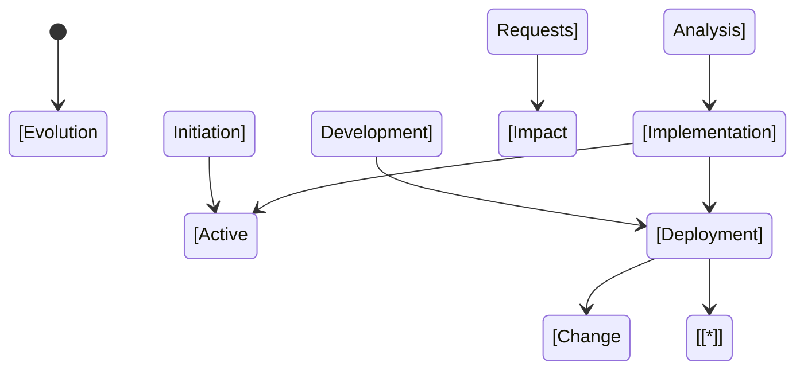
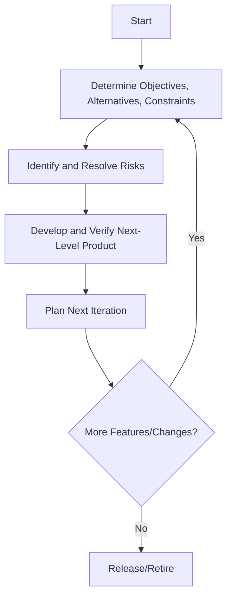
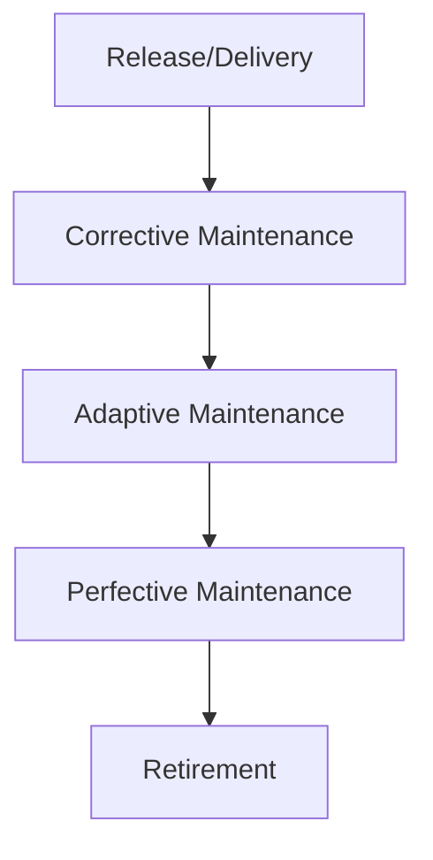
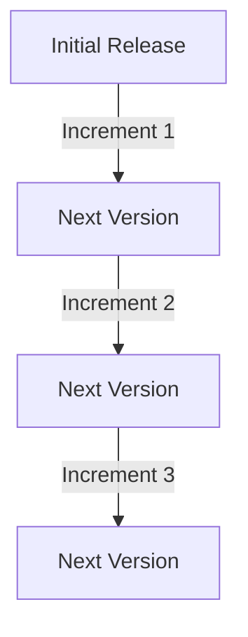
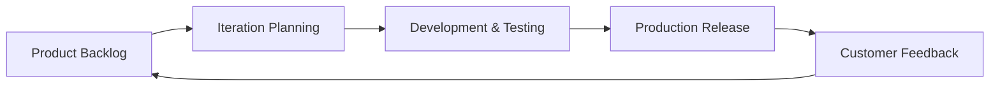
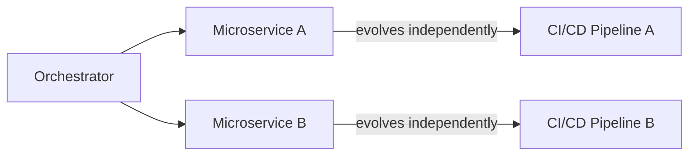

# Software Evolution Models

## Introduction

Software evolution refers to the process by which software systems change over time. These changes may arise from new requirements, defect corrections, performance improvements, technological shifts, regulatory mandates, or shifting business priorities. Unlike physical systems, software is uniquely malleable, yet it is also susceptible to erosion in quality and increasing complexity as it evolves. Understanding how software systems evolve, and managing their lifecycle effectively, is critical for ensuring long-term reliability, maintainability, and business value.

Software evolution models provide frameworks for understanding, predicting, and structuring the ongoing process of software change. This overview details the major software evolution models, examines their practical implications, and provides guidance for their application in engineering contexts.

## The Context for Software Evolution

### Lifecycle Perspective

Traditional software development lifecycles (SDLCs) often emphasize initial development. However, for large and long-lived systems, the post-delivery phase—maintenance and evolution—dominates total lifecycle costs. Empirical studies indicate that maintenance activities often comprise 60–90% of the total cost of a software system.

### Software Maintenance vs. Software Evolution

Software maintenance and software evolution are sometimes used interchangeably, but there is a subtle distinction:

- **Software Maintenance**: Actions taken post-delivery to correct faults, improve performance, or adapt to a changed environment (ISO/IEC 14764).
- **Software Evolution**: Broader process encompassing maintenance but also anticipating and organizing unceasing, fundamental changes.

Software evolution models seek to capture these long-term changes and provide frameworks for their management.

## Key Software Evolution Models

### 1. Lehman's Laws and the E-type Evolution Model

#### Origins and Foundations

M. M. Lehman and colleagues studied long-lived, evolving software systems and observed consistent behavior, leading to the articulation of eight "laws of software evolution." These laws are particularly relevant for "E-type" (Evolving-type) software, i.e., large, operational software constantly modified to meet real-world needs.

#### Lehman's Eight Laws of Software Evolution

1. **Continuing Change**: An E-type system will evolve, or become progressively less satisfactory.
2. **Increasing Complexity**: Structure complexity increases unless work is done to maintain or reduce it.
3. **Self Regulation**: Evolution process is self-regulating; product and process measures tend to stabilize over time.
4. **Conservation of Organizational Stability**: Average effective global activity rate in an evolving system is invariant over time.
5. **Conservation of Familiarity**: Incremental growth remains within bounds that preserve user and stakeholder familiarity.
6. **Continuing Growth**: Functional capability must keep growing to maintain user satisfaction.
7. **Declining Quality**: System quality seems to decline unless rigorously maintained and adapted.
8. **Feedback System**: Evolution processes are multi-level, multi-loop feedback systems.

#### E-type System Evolution Architecture

A simplified state diagram illustrating the software lifecycle according to Lehman's model:

#### Engineering Implications

- Continuous, iterative process: No static end-state.
- Increased cost and effort for maintenance unless actively managed.
- Feedback loops are needed for adaptive planning and resourcing.
- Automation tools for change impact analysis and regression testing are essential.

> **Note**
> Lehman's laws are descriptive, not prescriptive—engineers should use them as heuristics for anticipating maintenance issues and planning resource allocations.

---

### 2. Boehm's Spiral Model of Software Evolution

#### Model Description

The Spiral Model (Barry Boehm, 1986) combines iterative software development with systematic aspects of the waterfall model. It is structured as a spiral, where each loop in the spiral represents a software lifecycle phase.

Key characteristics include:

- **Iterative evolution**: Software grows through repeated cycles (spirals).
- **Risk-driven approach**: Prioritizes identification and mitigation of risks.
- **Stakeholder involvement**: Users are engaged throughout each loop.

#### Spiral Model Flow

#### How It Applies to Evolution

Each cycle allows for revisiting requirements, design, and implementation, supporting continuous evolution and adaptation.

#### Engineering Considerations

- Complex to manage in large, legacy systems.
- Requires robust risk assessment and management processes.
- Supports controlled software growth and stakeholder alignment.
- Can be resource intensive due to repeated cycles and reviews.

> **Caution**
> Without disciplined risk assessment and proper documentation, the spiral model can lead to excessive iterations and schedule overruns.

---

### 3. The Staged Model (Swanson’s Model) of Software Evolution

#### Model Overview

L. Swanson proposed a model of software evolution dividing the software’s lifetime into three maintenance types, recognizing the evolving nature of post-delivery activities:

- **Corrective Maintenance**: Fixing defects.
- **Adaptive Maintenance**: Modifying the system to accommodate changes in the environment (e.g., platforms, interfaces).
- **Perfective Maintenance**: Improving performance, maintainability, or other attributes.

#### Staged Maintenance Lifecycle

Typical *real-world* evolution involves these stages overlapping, as shown in advanced models.

#### Engineering Considerations

- Organizing teams and workflows around maintenance types can improve response time and efficiency.
- Prioritization mechanisms are needed to triage requests between maintenance types.
- Standardized processes improve traceability and plan effectiveness.

---

### 4. The Incremental and Iterative Evolution Models

#### Model Description

Incremental and iterative models treat software evolution as a sequence of incremental improvements. Unlike big-bang or waterfall approaches, these models break down evolution into manageable units called increments or iterations.

- **Incremental**: Functional elements are added incrementally over time.
- **Iterative**: Software is reworked and improved through successive cycles.

#### Typical Incremental Workflow

#### Engineering Considerations

- Supports agility and responsiveness to changing requirements.
- Requires robust versioning, branching, and integration practices (e.g., Git workflows).
- Need for automated testing suites to ensure incremental safety.
- Enables evolutionary architecture and refactoring.

---

### 5. Agile Evolution Models

#### Model Description

Agile methodologies (e.g., Scrum, Extreme Programming) explicitly embrace evolution as a fundamental behavior of software systems. They are characterized by:

- Continuous delivery of business value.
- Short, time-boxed iterations (sprints).
- Continuous refactoring and technical debt management.
- Responsive to changing priorities and requirements.

#### Agile Evolution Diagram

#### Engineering Considerations

- Supports rapid adaptation to business needs.
- High demands on automated testing, CI/CD pipelines, code quality, and team communication.
- Requires effective product ownership and backlog management.

> **Tip**
> Regular refactoring sprints help control system entropy and preserve maintainability.

---

## Comparative Summary of Software Evolution Models

| Model                       | Key Feature               | Typical Use Case                   | Strengths                    | Weaknesses                |
|-----------------------------|---------------------------|------------------------------------|------------------------------|---------------------------|
| Lehman's E-type Laws        | Empirical observation      | Large, enterprise, long-lived      | Predictive, generalizable    | Not actionable alone      |
| Spiral Model                | Risk-driven iteration      | Mission-critical, high-risk        | Robust risk management       | May be overkill for small |
| Staged/Maintenance Types    | Taxonomy by maintenance    | Legacy systems, support contexts   | Clear maintenance taxonomy   | Overlapping task types    |
| Incremental/Iterative       | Sequential increments      | Growing products, SaaS             | Manageable chunks            | Needs solid integration   |
| Agile Evolution Models      | Adaptive, fast response    | Startups, dynamic markets          | High value delivery          | Demands mature practices  |

## Practical Engineering Considerations

### Integration Points

- **Change Request Management**: Integrate with systems tracking defects and feature requests (e.g., Jira, Azure DevOps).
- **Version Control**: Enforce usage of VCS (e.g., Git, SVN) for traceability and parallel changes.
- **Continuous Integration/Delivery**: Integrate automated build, test, and deployment pipelines to detect regressions early.

### Performance Implications

- Evolutionarily-grown software can accumulate technical debt, leading to degraded performance.
- Frequent changes require robust performance monitoring and regression testing.

### Implementation Challenges

- Maintaining architecture coherence as the codebase evolves.
- Balancing corrective, adaptive, and perfective changes.
- Communicating change impact to all stakeholders.

### Common Pitfalls

- **Entropy Accumulation**: Unmanaged change increases system entropy and degrades maintainability.
- **Regression Introduction**: Insufficient impact analysis or testing allows new changes to break existing functionality.
- **Lack of Feedback Loops**: Ignoring user or stakeholder feedback leads to declining value.

> **Warning**
> Failure to invest in architectural refactoring and automated quality checks in evolving systems leads to irreversible software rot.

---

## Standards and References

- **ISO/IEC 14764:2006**: Software Engineering—Software Life Cycle Processes—Maintenance.
- **IEEE 1219-1998**: Standard for Software Maintenance.
- **SWEBOK (Software Engineering Body of Knowledge)**: Chapters on Maintenance and Evolution.
- **RFC 7282**: On Consensus and Humming in software evolution (useful for community-driven evolution decisions).

---

## Modern Relevance and Variations

### Microservices and Continuous Evolution

In modern cloud-native systems, especially microservices-based architectures, software evolution is decentralized. Each service can evolve independently, but system-wide practices remain essential:

Variations include feature toggles, blue-green deployments, and canary releases to limit risk.

### DevOps Impact

DevOps emphasizes integrating development and operations, creating seamless loops for deployment, monitoring, and feedback—expediting software evolution.

---

## Managing Evolution in Practice

- Invest in robust **automated testing** to enable safe, frequent changes.
- Enforce architectural guidelines and code review practices.
- Measure and track technical debt: code complexity, outdated dependencies, duplicated code.
- Document evolution decisions (design records, change logs).
- Modularize software to isolate changes and reduce cross-component impact.

> **Note**
> Diagram to be added later: Evolution workflow in a CI/CD environment.

---

## Conclusion

Software evolution is an intrinsic, perpetual component of the real-world software lifecycle. Understanding and applying evolution models helps engineering teams predict, manage, and control the changes that all software systems inevitably undergo. Selection of the appropriate evolution model (or combination thereof) should be guided by the system’s scale, criticality, organizational context, and business objectives. Successful management of software evolution mitigates risk, contains costs, maintains quality, and extends the useful lifetime of software assets.