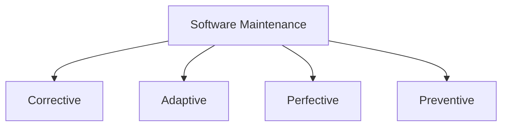
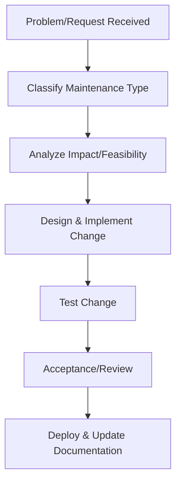
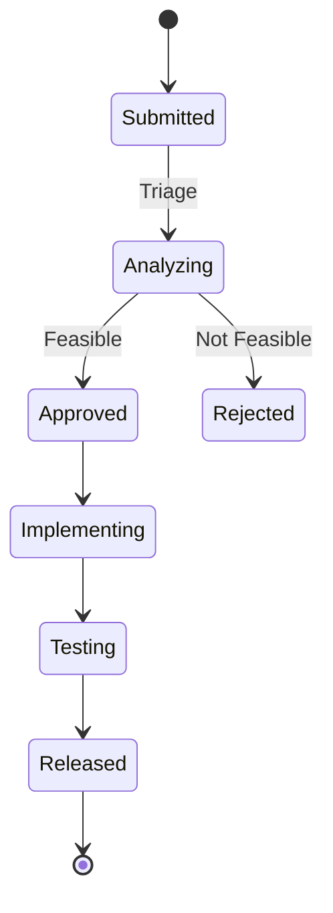
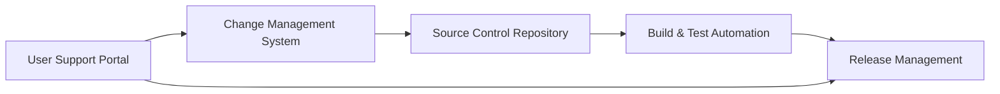

# Software Maintenance Fundamentals

## Introduction: Definition and Technical Context

Software maintenance comprises all activities carried out following the initial delivery of a software product, with the aim of correcting problems, adapting to changes in environment, improving performance, or enhancing functionality. Unlike initial development, maintenance accounts for a substantial proportion of the software lifecycle cost—commonly 60% to 80% for long-lived systems. Its scope and complexity often demand specialized processes, tools, and methodologies distinct from those associated with greenfield development.

The International Organization for Standardization (ISO) and the International Electrotechnical Commission (IEC) provide formal definitions of software maintenance in **ISO/IEC 14764** (Software Engineering — Software Life Cycle Processes — Maintenance) and **ISO/IEC/IEEE 12207**. These form the foundational standards that clarify objectives, activities, and management concerns relevant to maintenance.

## Core Concepts

### Maintenance Categories

Software maintenance activities are typically classified into four primary categories (per IEEE 1219 and ISO/IEC 14764):

- **Corrective Maintenance**: Reactive modification to correct discovered faults or errors.
- **Adaptive Maintenance**: Updates necessitated by changes in the environment, such as operating system upgrades, new hardware, or regulatory adjustments.
- **Perfective Maintenance**: Enhancements to improve performance, maintainability, or other quality attributes, often in response to user feedback.
- **Preventive Maintenance**: Modifications aimed at preventing future problems by improving software reliability or maintainability.

#### Diagram: Types of Software Maintenance

### Maintenance Process Overview

The maintenance process consists of several key activities, generally standardized across organizations and frameworks:

1. **Problem and Modification Identification/Classification**
2. **Analysis**
3. **Design and Implementation of Modifications**
4. **Testing**
5. **Acceptance**
6. **Migration and Deployment**
7. **Documentation Update**

#### Diagram: High-level Maintenance Lifecycle

### Maintenance vs. Development

While development delivers new systems or major expansions, maintenance operates on systems in active use, introducing additional constraints:

- Need to preserve existing behavior and data integrity.
- Limited or unavailable original documentation.
- Coexistence with legacy technology stacks.
- Live data and user base, potentially requiring phased rollouts or rollback strategies.

## Key Components and Architecture Concerns

### Architecture and Maintainability

System architecture significantly affects maintainability. Modular, layered, or service-oriented (e.g., microservices) architectures enhance isolation and reduce maintenance effort, while monolithic or tightly coupled designs impede effective maintenance.

**Common attributes improving maintainability include:**

- Clear separation of concerns.
- Well-defined interfaces/APIs.
- Consistent coding standards and documentation practices.
- Automated regression and integration testing.

### Configuration and Version Management

Robust configuration management is essential to effective maintenance, incorporating:

- **Source Code Version Control**: E.g., Git, Subversion.
- **Change Management Processes**: Tracking requests, states, approvals.
- **Release Management**: Coordinating updates, hotfixes, or patches across environments and deployments.

### Integration Points

Maintenance often involves external dependencies and integration points, such as:

- Third-party APIs.
- Databases or data warehouses.
- Legacy systems.
- Hardware interfaces.

Changes in any of these can trigger adaptive maintenance.

## Practical Workflows and Typical Scenarios

### Maintenance Workflow in Practice

#### Example: Addressing a Production Bug (Corrective Maintenance)

1. **Incident Detection:** Monitoring and user reports trigger investigation.
2. **Triage/Prioritization:** Assess severity, impact, and scope.
3. **Root Cause Analysis:** Use logs, monitoring tools, or debugging to isolate source.
4. **Change Implementation:** Code changes are made following internal processes.
5. **Impact Analysis:** Determine regression risk and testing scope.
6. **Testing & Review:** Automated and manual tests as required.
7. **Release & Communication:** Change is deployed, stakeholders notified, and documentation updated.

### Constraints and Assumptions

- **Backward Compatibility:** Updates must not break existing functionality.
- **Limited Downtime:** Maintenance windows or live updates must minimize user disruption.
- **Regulatory Compliance:** Especially relevant for safety- or security-critical systems.

### Common Variations

- **Hotfix Model:** Emergency patches in response to critical failures, sometimes outside the formal release cycle.
- **Continuous Delivery:** Maintenance changes are integrated in a CI/CD (Continuous Integration/Continuous Delivery) pipeline.
- **End-of-Life Transition:** Planning and executing retirement or migration to successor systems.

## Engineering Considerations

### Performance Implications

Maintenance changes, particularly perfective or adaptive, may impact system performance or introduce new bottlenecks.

:warning: **Warning:** Unanalyzed maintenance changes can degrade system performance or introduce subtle defects. Always perform targeted regression and performance testing for impacted modules.

### Maintainability Metrics

Common metrics to assess maintainability and its improvement include:

- **Mean Time to Repair (MTTR):** Average time taken to resolve defects.
- **Change Request Backlog:** Number and age of unresolved changes.
- **Cyclomatic Complexity:** Indicates code understandability; higher complexity often predicts greater maintenance cost.
- **Defect Density:** Number of defects per module or release.

### Common Pitfalls

- **Insufficient Documentation:** Hinders efficient analysis and implementation of changes.
- **Inadequate Regression Testing:** Raises risk of introducing new defects.
- **Unmanaged Technical Debt:** Accumulates maintenance burden and decreases velocity over time.
- **Poor Configuration Management:** Can result in conflicting changes, lost fixes, or accidental regression.

### Release and Deployment Strategies

Effective maintenance demands robust deployment strategies, including:

- **Blue-Green Deployments:** Reduces downtime and risk during updates.
- **Canary Releases:** Gradual rollout to a subset of users to monitor impact.
- **Rollback Mechanisms:** Essential for reverting changes that cause production issues.

## Standards and Specifications

- **ISO/IEC 14764:** Defines processes, roles, and practices for software maintenance.
- **IEEE 1219:** Process model for software maintenance.
- **ISO/IEC/IEEE 12207:** Framework for software lifecycle processes, including maintenance.
- **ITIL (Information Technology Infrastructure Library):** Widely used for operational support and maintenance incident/problem management in enterprise settings.

## Example Mermaid Diagrams

### Change Request Lifecycle

### Block Diagram: Maintenance Infrastructure

## Special Topics

### Technical Debt and Software Evolution

Maintenance is intimately linked with the management of technical debt—the accumulated cost of expedient decisions, obsolete design, or deferred improvements. Adopting automated quality analysis (static analyzers, linters), code reviews, and periodic refactoring policies are recommended to manage evolution and prevent long-term degradation.

### Refactoring and Re-architecting

Refactoring is a preventive maintenance activity aimed at improving code structure without altering external behavior. Larger-scale architectural changes may fall under re-architecting, requiring significant planning, risk analysis, and possible revalidation of system requirements.

## Conclusion

Sound software maintenance practices are critical for the reliability, adaptability, and sustainability of software systems. Mastery of the core concepts and practical workflows, coupled with awareness of architectural and process implications, equips engineers to effectively support evolving software products.

> :bulb: **Tip:** Embed maintenance considerations—such as modular design, automated testing, and clear documentation—early in the development lifecycle to reduce future maintenance cost and complexity.