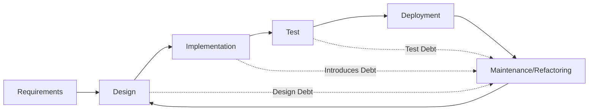
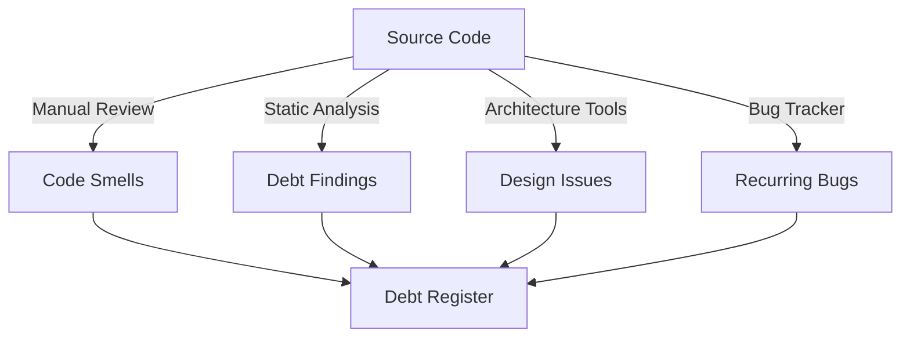
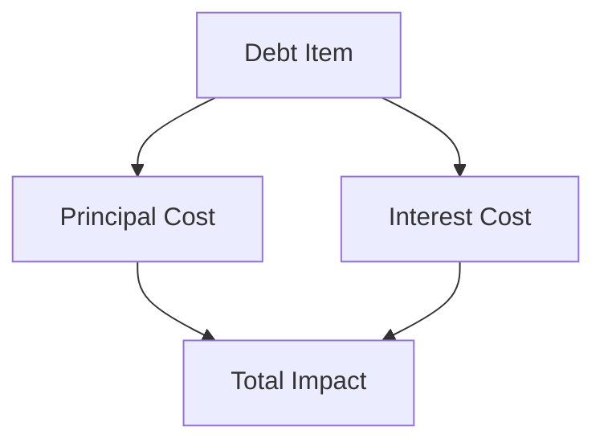
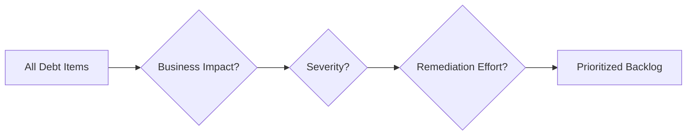
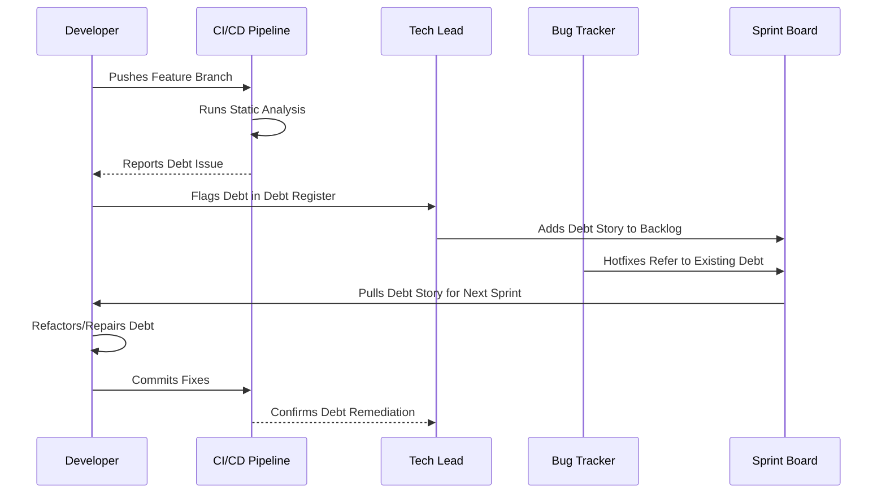

# Technical Debt Management

## Introduction

Technical debt is a core concept in software engineering, denoting the extra development work required in the future as a consequence of expedient or suboptimal design and implementation decisions taken in the present. Like financial debt, technical debt allows organizations to obtain short-term benefits—such as faster delivery or shortcuts in architecture—at the expense of future increased costs in maintenance, scalability, or adaptability.

Technical debt management comprises strategies, processes, and tools for identifying, quantifying, prioritizing, and addressing the ongoing and cumulative impact of technical debt in software systems. This document examines the concept of technical debt, describes standard practices for managing it, and elucidates its relevance in the context of software maintenance, refactoring, and long-term system health.

---

## 1. Understanding Technical Debt

### 1.1 Definition

Technical debt is the implied cost of future rework caused by choosing an easy—or quick—solution now instead of using a better approach that would take longer. The metaphor, introduced by Ward Cunningham in 1992, is now endemic in software engineering and covers a spectrum of issues from simple code smells to architectural anti-patterns.

### 1.2 Types of Technical Debt

Technical debt is classified based on intent and awareness:

- **Deliberate (Strategic) Debt:** Consciously incurred to satisfy business imperatives (e.g., time-to-market).
- **Inadvertent (Unintentional) Debt:** Resulting from ignorance, oversight, or lack of experience.
- **Bit Rot (Entropy) Debt:** Gradual decline in quality due to system evolution, changing requirements, or lack of upkeep.

#### Debt Taxonomy

| Category              | Examples                                      |
|-----------------------|-----------------------------------------------|
| Code Debt             | Duplicated code, missing tests, code smells   |
| Design/Architecture   | Poor modularization, circular dependencies    |
| Documentation Debt    | Outdated or missing documentation             |
| Test Debt             | Incomplete test coverage, flaky tests         |
| Configuration Debt    | Manual deployments, ad-hoc scripts            |

---

## 2. Technical Debt in the Software Lifecycle

### 2.1 Emergence and Accumulation

Technical debt often accumulates during the initial development, but it can also emerge during maintenance, enhancement, or migration phases. Agile methodologies, DevOps practices, and continuous delivery have emphasized the explicit recognition of technical debt as a trade-off in incremental delivery approaches.

### 2.2 Lifecycle Integration

Managing technical debt is not a one-off activity but a continual process integrated with the software development lifecycle (SDLC):

**Diagram:** Technical debt is introduced or identified throughout the SDLC, with maintenance activities cycling back to address accrued debt.

---

## 3. Identifying Technical Debt

### 3.1 Detection Methods

Identification is the foundational step in technical debt management. Approaches include:

- **Manual Code Review:** Inspection by software engineers and architects.
- **Automated Static Analysis:** Tools such as SonarQube, Checkstyle, or static analyzers integrated in CI/CD pipelines.
- **Issue Tracking Patterns:** Inspection of frequent bug reports or repeated hotfixes.
- **Architectural Analysis:** Dependency structure matrices, cyclic dependency detection.

**Diagram:** Multiple detection methods funnel into a central Debt Register for tracking and management.

### 3.2 Symptoms and Indicators

- High cyclomatic complexity
- Large classes or methods (God classes/methods)
- Excessive code duplication
- Architectural violations
- Poor or lacking test coverage
- Frequent need for production hotfixes

---

## 4. Quantifying Technical Debt

### 4.1 Measurement Models

Quantitative assessment supports prioritization. Common quantification approaches:

- **Effort Estimation:** Time or cost required to fix accrued debt items.
- **Complexity Metrics:** Cyclomatic complexity, code churn, bug density.
- **Principal and Interest Model:** 
  - Principal: Estimated cost to remediate a debt item.
  - Interest: Ongoing cost incurred (e.g., extra time debugging, extending, or testing code).

### 4.2 Automated Metrics

Static analysis tools often produce composite scoring (Maintainability Index, Debt Ratio, Technical Debt Ratio), though these scores must be interpreted with caution.

**Diagram:** The total impact of a debt item combines principal (removal cost) and interest (ongoing maintenance cost).

---

## 5. Recording and Tracking Technical Debt

### 5.1 The Debt Register

A central artifact for technical debt management is the **Debt Register**, which logs:

- Description of debt item
- Location in codebase (file/module/class/component)
- Category/type of debt
- Date and context of introduction
- Estimated remediation effort and urgency
- Potential risks or impact areas
- Responsible parties or teams

#### Integration Considerations

Debt Registers can be:

- Spreadsheets (simple/manual)
- Issue tracking systems (e.g., JIRA, Azure DevOps)
- Integrated features in static analysis platforms

### 5.2 Debt Tagging

Some ecosystems support **inline tagging** (e.g., `// TODO: Refactor this`), but these rarely ensure systemic mitigation unless cross-referenced in tracking systems.

---

## 6. Prioritizing Technical Debt

### 6.1 Prioritization Criteria

Factors influencing prioritization:

- **Severity of the impact:** Does the debt cause outages or critical bugs?
- **Frequency of effect:** How often does the debt influence operations?
- **Alignment with business objectives:** Is the debt impeding critical features or compliance?
- **Remediation cost vs. benefit:** Balance between value provided and effort expended.

### 6.2 Risk Assessment

Technical debt creates risk vectors including:

- Increased probability of introducing defects
- Higher onboarding/training costs for new developers
- Inability to meet SLAs or compliance standards

**Tip:** Use risk assessment frameworks adapted from safety engineering or operational risk management to gauge debt prioritization systematically.

**Diagram:** Technical debt items pass through successive prioritization filters to yield a prioritized backlog.

---

## 7. Remediation Strategies

### 7.1 Approaches to Reduction

- **Refactoring:** Systematic improvement of code structure without altering functionality. See Martin Fowler’s catalog.
- **Architecture Rework:** Significant redesign of system structures.
- **Test Augmentation:** Improving/adding test coverage.
- **Documentation and Commenting:** Updating in-code and supporting documents for clarity.
- **Configuration Automation:** Moving from manual processes to automated pipelines.

### 7.2 Planned vs. Opportunistic Remediation

- **Dedicated Remediation Sprints:** Explicit cycles focused solely on debt reduction.
- **Opportunistic Remediation:** Incremental improvement during feature development or bug fixes.

### 7.3 Constraints and Challenges

- **Resource Constraints:** Budget and staffing may not allow full debt repayment.
- **Opportunity Cost:** Remediation may delay delivery of features with immediate business value.
- **Regression Risk:** Refactoring may introduce new defects if not well-tested.

**Warning:** Large-scale remediation always requires comprehensive testing and stakeholder alignment due to potential for unintended side effects.

---

## 8. Organizational and Process Considerations

### 8.1 Technical Debt in Agile and DevOps

Modern practices expect technical debt to be:

- Visible and explicit within the team’s backlog
- Addressed in sprint/iteration planning
- Supported by a culture that balances fast delivery with periodic cleanup

### 8.2 Governance and Stakeholder Communication

- Reporting on technical debt status and trends supports informed decision-making.
- Debt metrics should be included in engineering dashboards and regular reports.

**Note:** Align technical debt metrics and remediation KPIs with broader organizational objectives and compliance mandates when applicable.

---

## 9. Tooling and Automation

### 9.1 Static Analysis and Linting

- Tools such as SonarQube, CodeClimate, ESLint, and PMD automate detection and reporting.
- Integration with CI/CD pipelines ensures debt visibility as part of the ongoing development process.

### 9.2 Architectural Analysis and Visualization

- Tools supporting dependency visualization and metric analysis help identify design/architecture debt.

### 9.3 Automated Debt Tracking

- Some advanced platforms integrate detected issues directly into issue trackers, with APIs for custom workflow integration.

---

## 10. Common Pitfalls and Anti-Patterns

- **Invisible Debt:** Debt not tracked or visible to the team will accumulate uncontrollably.
- **Debt Overload:** Accumulation beyond a “tolerable” threshold, leading to system unreliability or unsustainability.
- **Cosmetic Refactoring:** Superficial activity without addressing root causes.
- **Tool Over-Reliance:** Relying solely on automated tools, missing context-sensitive or architectural-level debt.
- **No Owner or Accountability:** Debt items without responsible parties often linger.

**Caution:** A failure to actively manage technical debt can make systems so brittle as to render adaptation or future evolution impractical.

---

## 11. Case Study: Debt Lifecycle in Practice

**Diagram:** Illustrative lifecycle of a technical debt item from emergence to remediation and closure.

---

## 12. Standards, Specifications, and Best Practices

Though no formal international standard defines technical debt, its principles are incorporated into several normative and best practice frameworks:

- **ISO/IEC 25010:** Product Quality—Maintainability and Modifiability as key attributes.
- **IEEE 14764 (ISO/IEC 14764):** Software Maintenance concepts underlying technical debt management.
- **SWEBOK (Software Engineering Body of Knowledge):** Recognizes technical debt management as part of maintenance engineering.
- **Agile Manifesto:** Encourages technical excellence and good design as enablers for agility.

---

## 13. Summary

Technical debt management is an essential practice in sustaining the health, longevity, and adaptability of software systems. It requires an ongoing commitment to identification, quantification, prioritization, and remediation. Integrating systematic debt management within existing engineering and organizational processes supports both immediate business goals and the long-term robustness of software assets. Failure to do so accumulates costs and risks that can ultimately restrict innovation and responsiveness. By leveraging metrics, automation, and a proactive engineering culture, organizations can control the impact of technical debt and ensure continuous software evolution.

---

**Tip:** Treat technical debt as a critical operational metric—track it, discuss it, and remediate it with the same rigor as defects or outages.