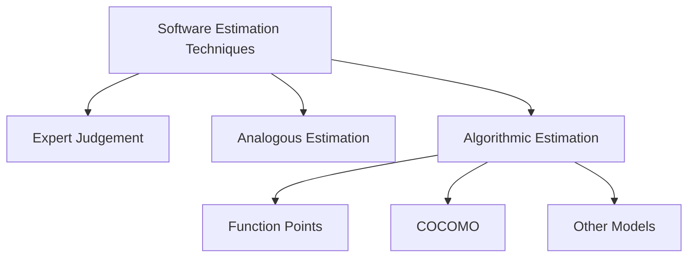
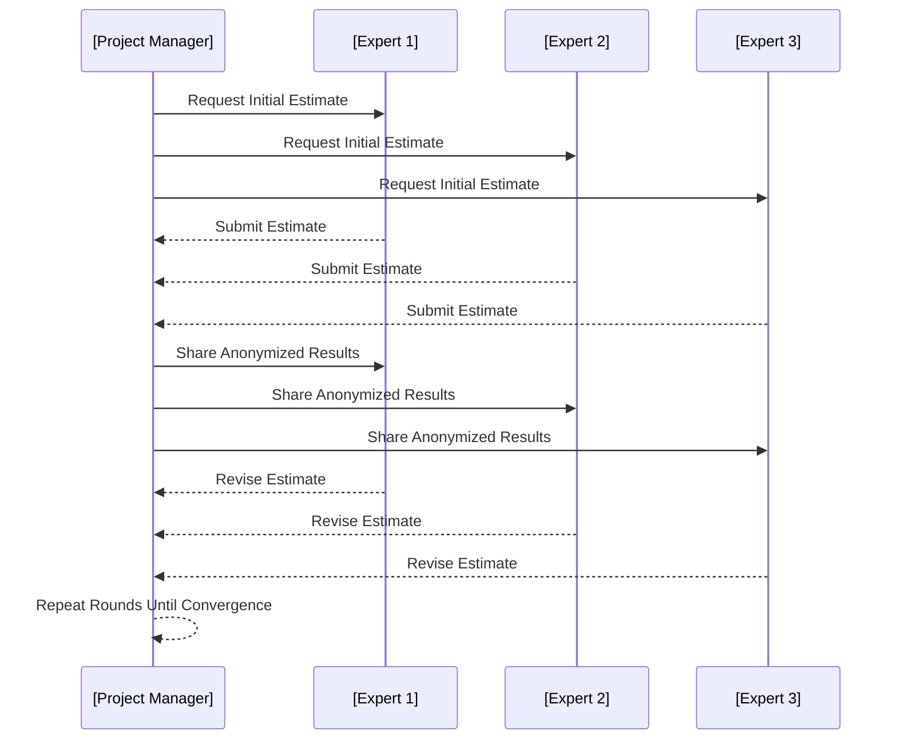
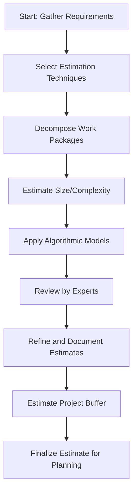

# Introduction

Software estimation techniques enable organizations and engineering teams to forecast the resources required to develop and deploy software systems. Accurate estimation of effort, cost, and schedule remains one of the critical challenges in software engineering. Inefficient estimation may lead to cost overruns, schedule slippage, or even project failure. Thus, systematic approaches and methodologies are necessary to achieve reliable estimates.

This primer introduces engineers to widely used software estimation techniques, with a focus on *Function Points*, *COCOMO*, and *Expert Judgement*. It also addresses estimation workflows, core concepts, types of estimation, and engineering considerations in practical contexts. Standards such as ISO/IEC 20926 (Function Point Counting) and processes outlined in the IEEE Standard for Software Project Management Plans (IEEE 1058) are referenced where relevant.

# 1. Foundations of Software Estimation

Estimation in the software context typically targets the following project attributes:

- **Effort** (person-months or person-hours)
- **Cost** (budgetary expenditure)
- **Schedule** (overall timeline to completion)
- **Size or Scope** (functional requirements, lines of code, or feature counts)

## 1.1 Why Software Estimation Is Challenging

Software estimation exhibits inherent uncertainty due to:

- **Incomplete requirements:** Early in the project lifecycle, requirements are seldom fully specified.
- **Complexity of software systems:** Software often involves emergent behaviors and integration risks.
- **Human factors:** Productivity varies significantly by team composition, expertise, and historical performance.
- **Technological uncertainty:** New technologies, tools, or platforms can introduce unforeseen challenges.

# 2. Classification of Estimation Techniques

Estimation approaches for software projects fall into three broad categories:

1. **Expert Judgement**
2. **Analogous (Comparative) Estimation**
3. **Algorithmic / Model-based Estimation**

Further, estimation methods can operate at various granularity levels (e.g., module, component, system).

## 2.1 Overview: Diagram of Estimation Technique Categories



# 3. Expert Judgement

**Expert judgement** leverages the experience of senior engineers, architects, or domain specialists who estimate based on their knowledge of similar systems, domain intricacies, and historical projects.

## 3.1 Characteristics

- **Inputs:** High-level requirements or user stories.
- **Process:** Consultations, workshops, or reviews, often using structured methods (e.g., Delphi, Planning Poker).
- **Outputs:** Consensus estimates for size, effort, or schedule.

## 3.2 The Delphi Technique

A common expert-based approach is the Delphi method. Multiple rounds of anonymous estimation are gathered, shared, and revised until convergence.



## 3.3 Strengths and Weaknesses

| Strengths                     | Weaknesses                          |
|-------------------------------|-------------------------------------|
| Leverages domain expertise    | Subjective and potentially biased   |
| Useful for novel/unique work  | Estimates can be inconsistent       |
| Fast for small projects       | Not easily reproducible             |

> **Note**
> Expert Judgement is best used when historical data is unavailable or the project is highly innovative.

# 4. Analogous (Comparative) Estimation

Analogous estimation utilizes metrics from completed, similar projects as a baseline for forecasting costs, effort, or duration for new projects. This approach can be semi-formalized with historical project databases or knowledge management systems.

## 4.1 Core Steps

1. Identify one or more completed projects with similar characteristics.
2. Adjust for recognized differences (complexity, scope, technology).
3. Apply scaling factors to effort, cost, and schedule estimates.

> :warning: **Caution**
> Analogous estimation relies heavily on the accuracy and relevance of historical data. Invalid comparisons can result in significant estimation error.

# 5. Algorithmic / Model-Based Estimation

Algorithmic estimation methods apply quantitative models to derive estimates from measurable attributes (inputs) of the software project.

## 5.1 Typical Inputs and Outputs

**Inputs:**
- Estimated system size (lines of code, function points)
- Required reliability
- Product complexity
- Programmer experience
- Target deployment environment

**Outputs:**
- Effort estimate (person-months)
- Project duration
- Cost projection

Two primary, standardized model-based approaches are:

- **Function Point Analysis (FPA)**
- **COCOMO (Constructive Cost Model)**

# 6. Function Point Analysis (FPA)

Function Point Analysis (FPA) evaluates the size of software projects by quantifying their functional requirements, independent of programming language, development methodology, or technology.

## 6.1 Fundamentals of Function Points

**Function Points (FPs)** are computed by assessing the complexity and quantity of:

- External Inputs (EI)
- External Outputs (EO)
- External Inquiries (EQ)
- Internal Logical Files (ILF)
- External Interface Files (EIF)

Each type of function is assigned a weighting factor (Low, Average, High) reflecting its implementation complexity.

## 6.2 Function Point Counting Process

```mermaid
flowchart TD
    A[Identify Functions] --> B[Classify by Type (EI/EO/EQ/ILF/EIF)]
    B --> C[Assess Complexity]
    C --> D[Assign Weighting Factors]
    D --> E[Calculate Unadjusted Function Points]
    E --> F[Apply Value Adjustment Factor]
    F --> G[Total Adjusted Function Points]
```

- The *Value Adjustment Factor* (VAF) considers system characteristics such as data communications, performance, transaction rates, and configurability.
- The final function point count = Unadjusted Function Points × VAF.

**ISO/IEC 20926:2009** defines international standards for function point counting.

## 6.3 Example Calculation

Suppose a system has:
- 10 External Inputs (EI), average complexity (×4)
- 5 External Outputs (EO), high complexity (×7)
- 3 Internal Logical Files (ILF), average (×10)

Unadjusted FP = (10×4) + (5×7) + (3×10) = 40 + 35 + 30 = 105

If VAF = 1.15, then **Total FP = 105 × 1.15 = 120.75**

## 6.4 Practical Considerations

- FPA is effective early in the lifecycle when functional requirements are available.
- Function points support cross-technology comparisons.
- Challenges include subjectivity in classification and evolving requirements.

# 7. COCOMO (Constructive Cost Model)

**COCOMO** is a parametric cost estimation model first published by Barry Boehm in 1981, refined in later versions (COCOMO II). It estimates software development effort based on system size and cost drivers.

## 7.1 COCOMO I Overview

**Main formula:**

```
Effort (PM) = a × (KLOC)^b × ∏(EM_i)
```

Where:
- `PM`: Effort in person-months
- `a`, `b`: Model constants based on project category (Organic, Semi-Detached, Embedded)
- `KLOC`: Thousand Lines of Code
- `EM_i`: Effort multipliers (cost drivers)

## 7.2 COCOMO II Enhancements

COCOMO II adapts the model for modern processes and technologies. Key innovations include:

- *Scale factors* to adjust for team capability, process maturity, and reuse.
- *Effort multipliers* cover product attributes, platform, personnel, and project characteristics.
- Multiple submodels for different process stages (Application Composition, Early Design, Post-Architecture).

## 7.3 COCOMO II Estimation Workflow

```mermaid
flowchart TD
    A[Estimate Size (Function Points or LOC)] --> B[Select Submodel]
    B --> C[Input Scale Factors]
    C --> D[Input Effort Multipliers]
    D --> E[Calculate Person-Months]
    E --> F[Estimate Schedule]
```

## 7.4 Example Effort Calculation

Suppose:
- Estimated code size = 50 KLOC
- Project type: Organic (`a=2.4`, `b=1.05`)
- All effort multipliers = 1 (nominal)

Effort = 2.4 × (50)^1.05 × 1 ≈ 2.4 × 56.23 ≈ 134.95 person-months

## 7.5 Limitations

- Requires early and reasonably accurate size estimation.
- Not well-suited for highly innovative or unstructured projects.
- Productivity rates depend strongly on input calibration and historical data accuracy.

> :bulb: **Tip**
> COCOMO is most effective when your organization maintains reliable historical project data for model calibration.

# 8. Estimation in Practice

## 8.1 Integrated Estimation Workflows

Effective estimation is iterative and collaborative. Modern teams often combine methods:

- **Expert judgement** to establish an initial range.
- **Function point analysis** for sizing.
- **COCOMO II** for parametric estimate refinement.

Estimation supports risk analysis, scheduling, and resource allocation.

## 8.2 Typical Estimation Lifecycle



## 8.3 Key Constraints and Assumptions

- **Data Availability:** Parametric models depend on access to accurate, project-relevant data.
- **Change Management:** Estimates must be updated when requirements, scope, or context change.
- **Tooling:** Automated tools exist for function point analysis and COCOMO calculation (e.g., SEER-SEM, CostXpert).

## 8.4 Common Pitfalls

- Underestimating integration complexity or non-functional requirements
- Neglecting historical calibration (using outdated, irrelevant data)
- Anchoring bias in expert judgement sessions
- Overconfidence in point-estimates; insufficient use of ranges or buffers

# 9. Standards and Industry Practice

- **ISO/IEC 20926**: Function Point Counting Practices
- **IEEE 1058**: Software Project Management Plans
- **SWEBOK (ISO/IEC 19759:2015)**: Software Engineering Body of Knowledge outlines estimation best practices

Many large organizations customize estimation frameworks and maintain proprietary cost models, but most are based on well-known public standards, as described above.

# 10. Engineering Considerations

## 10.1 Integration Points

- **Project Planning:** Estimates drive initial project schedules (Gantt, PERT), budgets, and staffing plans.
- **Resource Management:** Allocation of personnel and toolchains depends directly on forecasted effort.
- **Procurement:** Contractual and outsourcing negotiations reference estimation artifacts.

## 10.2 Performance and Scalability

While estimation itself does not directly impact run-time system performance, underestimated projects are at high risk of performance shortfalls due to late-phase shortcuts.

## 10.3 Implementation Challenges

- Harmonizing estimates across distributed, multi-team, or multi-vendor projects
- Handling dynamic, agile backlogs in iterative (Scrum/Kanban) environments
- Consistent documentation for auditability and future refining

# 11. Modern Variations and Agile Estimation

While classic estimation models were designed for plan-driven development, agile practices emphasize *relative estimation* at the feature/story level using techniques such as story points, t-shirt sizing, and velocity tracking. Many contemporary teams blend agile and model-based approaches, particularly at scale (e.g., SAFe, LeSS frameworks).

> :warning: **Caution**
> Agile estimation techniques are valuable for local team planning but do not replace up-front, organization-wide estimation when legal, contractual, or financial controls require traceable baseline projections.

# Conclusion

Software estimation is a cornerstone of effective software project management, enabling teams to predict effort, cost, and schedule with increasing reliability. Techniques range from expert judgement, through comparative analysis, to algorithmic and parametric models like Function Point Analysis and COCOMO. Each approach has strengths, limitations, and ideal application scenarios, and successful engineering organizations often combine them for maximum estimation robustness. Mastery of estimation techniques is essential for engineers tasked with delivering software on time and within budget, ensuring stakeholder confidence, and proactively managing risk.

# Appendix: Example Estimation Data Table

| Project Attribute         | Value               |
|--------------------------|---------------------|
| Functional Requirements  | 75                  |
| Estimated Function Points| 120                 |
| Estimated KLOC           | 50                  |
| Effort (COCOMO)          | 135 person-months   |
| Project Duration         | 11 months           |
| Average Team Size        | 12                  |

---

> **Note**
> Diagram to be added later: "Relationship of Requirements, Size, Effort, and Cost in Software Estimation" (Block diagram showing transformations from requirements to estimates via sizing and cost modeling steps.)

# References

- ISO/IEC 20926:2009, "Software and systems engineering – Software measurement – IFPUG functional size measurement method"
- IEEE Standard 1058, "IEEE Standard for Software Project Management Plans"
- Boehm, B. (1981). "Software Engineering Economics." (Original COCOMO)
- SWEBOK v3.0 (ISO/IEC 19759:2015), Project Software Estimation Knowledge Area