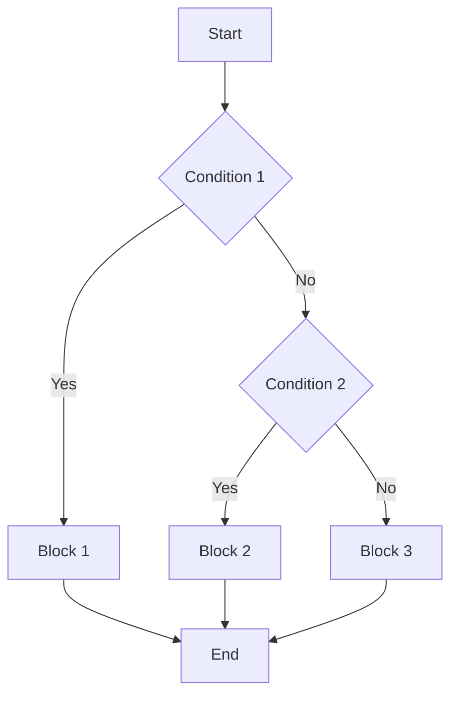
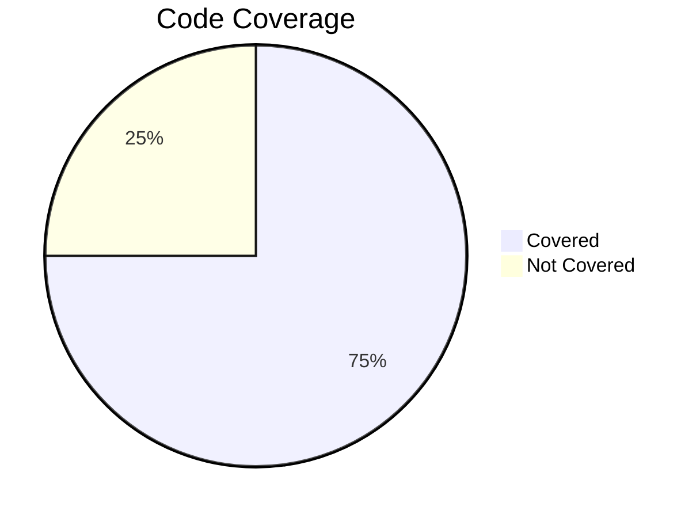
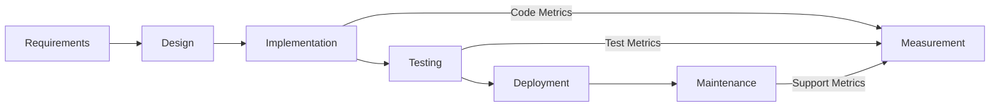

# Software Metrics and Measurement

## Introduction

Software metrics and measurement constitute a systematic, quantitative foundation for evaluating software products, processes, and projects. By applying measurement theory and statistical analysis, software engineers, project managers, and quality assurance teams can monitor, assess, and improve software quality, productivity, and development processes.

This primer provides a comprehensive technical introduction to the theory, practice, and standards of software metrics and measurement, emphasizing practical approaches and foundational concepts relevant to engineering professionals.

---

## 1. Foundations of Software Measurement

### 1.1 Definition and Purpose

**Software measurement** is the process of assigning numbers or symbols to attributes of software entities in a way that describes them according to clearly defined rules. A **software metric** is a quantitative indicator derived from these measurements, used to evaluate specific characteristics of software products, processes, or projects.

**Typical objectives:**
- Assessing software quality traits (reliability, maintainability, etc.)
- Quantifying project progress and status
- Estimating effort, cost, or resources
- Enabling informed management and engineering decisions

### 1.2 Motivation

Modern software engineering relies on empirical evidence for process control and improvement. Metrics provide objective data for:
- Monitoring trends and detecting anomalies,
- Benchmarking against industry standards,
- Supporting process improvement frameworks (e.g., CMMI, ISO/IEC 15504 - SPICE),
- Satisfying regulatory, contractual, or customer requirements.

---

## 2. Measurement Theory and Properties

### 2.1 Measurement Scales

Measurements should adhere to the fundamentals of measurement theory:

- **Nominal**: Categorized data (e.g., defect type), no intrinsic ordering.
- **Ordinal**: Ordered categories (e.g., severity level), no fixed distance.
- **Interval**: Ordered, equal intervals (e.g., temperature in Celsius), no true zero.
- **Ratio**: Ordered, equal intervals, true zero (e.g., source lines of code).

**Correct metric selection and interpretation depend on scale properties.**

### 2.2 Validity and Reliability

- **Validity**: The extent to which a metric measures what it claims.
- **Reliability**: The consistency and repeatability of a measurement.

Measurement programs must ensure both, through careful definition, calibration, and validation.

---

## 3. Classification of Software Metrics

Software metrics can be classified along several axes:

| Metric Type | Description | Examples |
| --- | --- | --- |
| Product Metrics | Attributes of software artifacts | Size, complexity, defect density |
| Process Metrics | Efficiency and effectiveness of development activities | Cycle time, review coverage |
| Project Metrics | Project-level attributes | Effort, schedule, cost variance |

---

## 4. Key Product Metrics

### 4.1 Size Metrics

- **Source Lines of Code (SLOC/LOC):** Counts logical or physical lines in the code. Widely used, but subject to language-specific ambiguities.
- **Function Point Analysis (FPA):** Measures delivered functionality based on system inputs, outputs, inquiries, files, and interfaces (per ISO/IEC 20926).
- **Story Points / Use Case Points:** Agile-oriented estimations of effort, not physical size.

### 4.2 Complexity Metrics

- **Cyclomatic Complexity (McCabe)**: Quantifies the independent paths through program control flow. High complexity may indicate higher defect risk and lower maintainability.

*Mermaid Diagram: Control Flow Graph for Cyclomatic Complexity Calculation*

- **Halstead Metrics:** Evaluate complexity based on operators and operands counts.

### 4.3 Quality Metrics

- **Defect Density:** Number of confirmed defects per unit size (e.g., per KLOC or FP).
- **Code Coverage:** Percentage of code executed by automated tests.

---

## 5. Key Process and Project Metrics

### 5.1 Productivity Metrics

- **Productivity = Output / Input**, e.g., LOC per person-month, Function Points per effort.
- **Velocity (Agile):** Story points completed per iteration.

### 5.2 Schedule and Effort Metrics

- **Earned Value Management (EVM):** Integrates cost, schedule, and scope for project tracking (see ANSI/EIA-748).
    - Planned Value (PV)
    - Earned Value (EV)
    - Actual Cost (AC)
    - Schedule Variance (SV), Cost Variance (CV)

### 5.3 Defect and Reliability Metrics

- **Defect Discovery Rate:** Trends defects over time; also informs reliability growth models.
- **Mean Time To Failure (MTTF):** Time between observed failures in operation.
- **Defect Removal Efficiency (DRE):** Ratio of defects removed prior to release.

---

## 6. Metrics-Driven Workflows

### 6.1 Typical Lifecycle Integration

Software measurement is embedded across the development lifecycle:

*Mermaid Diagram: Integration of Software Measurement Throughout the Lifecycle*

- **Requirements:** Estimation (FP, UCP) and requirements churn
- **Design:** Architecture complexity, interface counts
- **Implementation:** Size and code quality metrics
- **Testing:** Test coverage, defect detection rate
- **Deployment/Maintenance:** MTTR, customer-reported issues

### 6.2 Data Collection and Tooling

- **Manual:** Spreadsheets or standardized forms.
- **Automated:** Static analyzers, code repositories, ALM/CI systems.
- **Hybrid:** Combination; often adherence to IEEE 1061 "Standard for a Software Quality Metrics Methodology."

#### Common Integration Points

- Version control hooks (e.g., for code churn, commit frequency)
- Build pipelines (for test & coverage metrics)
- Issue trackers (for defect density, response times)

> **Note**
> Automated data collection minimizes bias and ensures timeliness, but requires robust process integration.

---

## 7. Standards and Quality Models

- **ISO/IEC 9126 and ISO/IEC 25010:** Software product quality models—define quality attributes (e.g., functionality, reliability, usability).
- **ISO/IEC 15939:** Software Measurement Process—framework for defining, collecting, and analyzing measurement data.
- **IEEE 1061:** Standardized processes for quality metrics.

Many organizations map their internal metrics to such standards for both compliance and benchmarking.

---

## 8. Interpreting and Acting on Metrics

### 8.1 Common Pitfalls

- **Misinterpretation:** Metrics can suggest false conclusions if improperly understood (e.g., equating high code coverage with high quality).
- **Metric Gaming:** Developers may unconsciously (or intentionally) "game" metrics if used as performance targets.
- **Context Ignorance:** Comparing metrics across disparate teams or domains can be misleading.

> :warning: **Warning**
> Relying exclusively on easily obtained metrics (such as LOC or defect counts) often distorts engineering priorities. Always interpret metrics in context.

### 8.2 Statistical Methods

- **Trend Analysis:** Detect regressions or improvements.
- **Control Charts:** Monitor process stability (per Six Sigma/CMMI).
- **Pareto Analysis:** Identify the "vital few" causes of defects.
- **Correlation and Regression:** Explore relationships between engineering activities and outcomes.

### 8.3 Visualization

Effective metrics programs rely heavily on dashboards and visualizations:
- Line and bar charts for trends
- Pie or donut charts for distribution
- Heatmaps for hotspot detection
- Control charts for process stability

> **Note**
> Diagram to be added later: Example control chart for defect counts across releases.

---

## 9. Evolving Practices: Agile and DevOps Metrics

Contemporary software teams often supplement or replace historical metrics with approaches suited to rapid, iterative delivery:

| Traditional Metric | Agile/DevOps Equivalent |
|--------------------|------------------------|
| LOC per month      | Story points, throughput |
| Defect density     | Lead time to restore, escaped defects |
| Test coverage      | Pipeline pass rate, deployment frequency |

- **Flow Metrics:** Cycle time, lead time, work in progress.
- **Deployment Metrics:** Deployment frequency, time to recover, change failure rate (see DORA metrics).

---

## 10. Engineering Considerations

### 10.1 Implementation Challenges

- **Defining precise metrics** that accurately reflect goals and are understood by all stakeholders.
- **Automating data collection** for consistency.
- **Dealing with incomplete or noisy data.**
- **Protecting privacy and maintaining ethical standards** in personal performance measurement.

### 10.2 Common Pitfalls

- **Over-measurement:** Collecting too many metrics dilutes focus.
- **Underutilization:** Failure to act on insights negates value.
- **Single-point metrics:** Overemphasis on productivity or quality at the exclusion of other dimensions.

> :bulb: **Tip**
> Start with a small, clearly aligned set of key performance metrics, and review their usefulness periodically.

---

## 11. Conclusion

Software metrics and measurement offer a quantitative foundation for quality assurance, engineering management, and process improvement. Effective measurement frameworks are grounded in sound theory, utilize relevant standards, and are tailored to the technical and organizational context. Successful engineers recognize both the power and pitfalls of metrics-driven approaches and apply them judiciously to enhance, not hinder, software development outcomes.

---

## Appendix: Key Terms

| Term | Definition |
|------|------------|
| Metric | A quantifiable measure of a software attribute |
| Measurement | The act or result of quantifying an attribute |
| Indicator | Composite information derived from metrics, used in decision-making |
| Product Metric | Measures specific artifact characteristics |
| Process Metric | Measures the effectiveness of process activities |
| Project Metric | Measures overall project attributes |

---

## References

- IEEE Std 1061-1998: IEEE Standard for a Software Quality Metrics Methodology
- ISO/IEC 25010:2011: Systems and software engineering — Systems and software Quality Requirements and Evaluation (SQuaRE) — System and software quality models
- ISO/IEC 20926:2009: Software and systems engineering — Software measurement — IFPUG functional size measurement method
- ISO/IEC 15939:2017: Software Measurement Process
- ANSI/EIA-748: Earned Value Management Systems
- McCabe, T. J. (1976). "A Complexity Measure" (IEEE Transactions on Software Engineering)

---