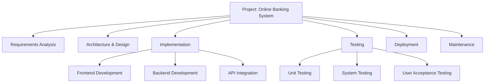
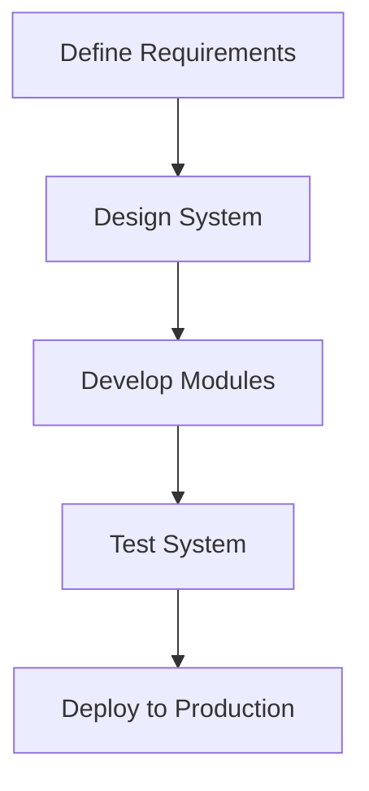
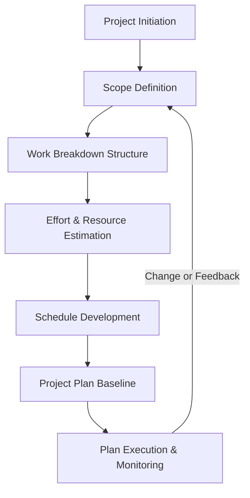

# Software Project Planning

Software project planning is the collection of activities essential to define, estimate, schedule, and manage the tasks required to successfully deliver a software product. It is a foundational discipline within software engineering management, governed by principles outlined in frameworks such as the Software Engineering Body of Knowledge (SWEBOK), IEEE Std 1058 (Software Project Management Plans), and guidebooks like PMBOK (Project Management Body of Knowledge).

Effective software project planning is both a technical and a managerial function. It bridges the translation of business goals into actionable engineering tasks, providing the structure for estimation, resource allocation, risk anticipation, execution, and control. At its core, project planning mitigates uncertainty and maximizes predictability within inherent software development constraints.

---

## 1. Fundamentals of Software Project Planning

### 1.1 Definition and Scope

Software project planning is the process of setting goals, defining project scope, estimating resources and effort, scheduling tasks, and selecting appropriate methodologies to deliver a specific software product within desired constraints (budget, time, quality). It encompasses coordination of human, technological, and financial resources.

**Key objectives:**
- Define **what** is to be built and delivered (scope).
- Estimate **how much** effort and resources are required (estimation).
- Break down the work into manageable components (work breakdown structure).
- Create a realistic, actionable **plan** (schedule, assignment, and monitoring mechanisms).

> [!tip]
> Even when using adaptive or agile methodologies, planning remains a continuous and essential process—planning is not synonymous with rigid up-front design.

### 1.2 Role in the Software Lifecycle

Planning is critical throughout the software lifecycle—from project inception through implementation, testing, deployment, and maintenance. The plan evolves based on change management, risks, and feedback. Common software development life cycle (SDLC) models (waterfall, incremental, agile, spiral) incorporate planning in different forms and at varying cadences.

---

## 2. Core Components

### 2.1 Scoping

#### 2.1.1 Defining Scope

The scope defines the boundaries and deliverables of the project. It details what is included (in-scope) and, often just as importantly, what is excluded (out-of-scope). This is typically formalized in a **Software Requirements Specification (SRS)** or product backlog.

Scope definition often involves:
- Functional and non-functional requirements identification
- Stakeholder analysis
- Business constraints and regulatory considerations

#### 2.1.2 Scope Control

Change in scope ("scope creep") is a primary risk factor for project overruns.
> [!caution]
> Inadequate scope management is a leading cause of project failure and schedule overruns.

A well-maintained scope baseline and formal change management process are essential.

### 2.2 Estimation

Estimation determines the resources (time, budget, personnel, equipment) needed to complete the project or its components. It is inherently uncertain but can be managed through systematic approaches and historical data.

#### 2.2.1 Estimation Techniques

- **Expert Judgment:** Use of experienced engineers or domain experts.
- **Analogous Estimation:** Based on previous, similar projects.
- **Parametric Estimation:** Mathematical models (e.g., function points, lines of code) adjusted by empirical factors.
- **Bottom-Up Estimation:** Decomposing tasks into smaller units and estimating each individually.
- **Planning Poker and Wideband Delphi** (Agile contexts): Collaborative, consensus-based effort estimation.

#### 2.2.2 Estimation Metrics

- **LOC (Lines of Code):** Simple, but less effective early-on.
- **Function Points:** Measures size based on functionality, independent of language or technology.
- **Story Points (Agile):** Relative effort sizing.

Estimation should include anticipated uncertainties, risks, and appropriate contingency.

---

### 2.3 Work Breakdown Structure (WBS)

The WBS is a hierarchical decomposition of the project into smaller, more manageable work items or tasks. Each leaf node represents a work package.

#### 2.3.1 Levels of the WBS

A typical WBS may include:

- **Project/Product Level**: The whole deliverable.
- **Sub-Systems/Modules**
- **Major features/components**
- **Tasks and Subtasks**

#### 2.3.2 Purpose

- Clarifies project structure
- Enables estimation, assignment, and tracking
- Formally connects project activities to deliverables

#### 2.3.3 Typical WBS Example (Mermaid Diagram)

---

### 2.4 Scheduling

Scheduling assigns temporal order and deadlines to tasks, aligning resources and dependencies.

#### 2.4.1 Tools and Representations

- **Gantt Charts:** Visual task timelines.
- **PERT/CPM:** Network diagrams for path and timing analysis.
- **Kanban Boards:** Visual boards for work items in progress.

#### 2.4.2 Dependency Modeling (Mermaid Flowchart)

---

### 2.5 Resource and Risk Planning

**Resource planning** focuses on the allocation of personnel, hardware, software, and infrastructure to tasks. **Risk planning** identifies, assesses, and prepares mitigation strategies for potential obstacles.

> [!note]
> Risk management should be a parallel, continuous process—see "Risk Management in Software Projects" for a comprehensive treatment.

---

## 3. Software Project Planning Workflows

### 3.1 Planning Workflow Overview

Software project planning is typically carried out iteratively, revisiting and refining the plan as requirements are clarified, estimates are revised, and progress is tracked.

#### 3.1.1 High-Level Workflow (Mermaid Diagram)

### 3.2 Iterative and Agile Planning

In agile methodologies (e.g., Scrum, Kanban), planning occurs at multiple levels:
- **Product Roadmap:** Strategic, long-term vision.
- **Release Planning:** Medium-term, sets release objectives.
- **Iteration/Sprint Planning:** Short-term, specific backlog items planned.

Tasks are re-estimated as understanding improves. The principle of **rolling wave planning** is applied, where near-term work is planned in greater detail.

---

## 4. Standards and Best Practices

### 4.1 Relevant Standards

- **IEEE Std 1058:** Software Project Management Plans.
- **IEEE 830 / ISO/IEC/IEEE 29148:** Software Requirements Specifications (SRS).
- **ISO 12207:** Software life cycle processes.
- **PMBOK:** General project management guidelines.

These standards provide templates, recommended contents, and minimum planning artifacts, such as:
- Stakeholder lists
- Requirement baselines
- WBS documentation
- Risk registers
- Resource assignment matrices

### 4.2 Best Practices

- **Stakeholder Involvement:** Engage key stakeholders early and continuously for accurate requirements.
- **Progressive Elaboration:** Accept and manage that estimates and plans will become more accurate as the project evolves.
- **Baseline and Control:** Use baselines for scope, schedule, and cost. Any changes should go through a formal control process.
- **Regular Monitoring:** Frequent review of plan versus actual progress.

---

## 5. Practical Considerations

### 5.1 Integration Points

Integration with requirements management tools, configuration management systems, and communication platforms is critical. Planning software (e.g., MS Project, Jira, Rally, Asana) provides mechanisms for synchronization and reporting across teams.

### 5.2 Performance Implications

- **Underestimation:** Leads to overcommitment, poor quality, and delays.
- **Overestimation:** Can reduce competitiveness and resource utilization.

### 5.3 Implementation Challenges

- **Unclear Requirements:** Vagueness decreases estimation accuracy.
- **Rapidly Changing Scope:** Increases re-planning effort.
- **Resource Constraints:** Limited access to needed personnel or technology.
- **Cultural Barriers:** Poor communication can disrupt planning accuracy.

---

## 6. Common Pitfalls and Mitigations

### 6.1 Common Pitfalls

- **Scope Creep:** Unmanaged expansion of requirements.
- **Optimism Bias:** Underestimating effort due to overconfidence.
- **Lack of Risk Allowance:** Ignoring contingency.
- **Ivory Tower Planning:** Failing to involve implementers.
- **Static Plans:** Not updating plans as information changes.

### 6.2 Mitigation Approaches

- Engage development teams in estimation and breakdown.
- Factor risk buffers and contingencies.
- Enforce baseline and change control.
- Regularly re-evaluate and adapt the plan.

---

## 7. Planning in Modern and Large-Scale Software Engineering

Software project planning adapts in modern contexts:

- **Scaled Agile Frameworks (SAFe, LeSS):** Extend planning across multiple coordinated teams.
- **Distributed/Remote Teams:** Require emphasis on clear documentation and asynchronous coordination.
- **DevOps Integration:** Planning must encompass deployment, monitoring, and operations.

---

## 8. Summary

Software project planning is a structured discipline that underpins successful software engineering efforts. It encapsulates the art and science of defining the right set of activities, estimating their cost and time, allocating resources, and sequencing tasks to achieve business and engineering goals. While the methodologies and technologies continue to evolve, the core principles of estimation, scoping, work breakdown, scheduling, and risk management remain constant. Adherence to industry standards and continual adaptation to project realities are essential for reliable project delivery.

> [!important]
> A comprehensive project plan is not a one-time artifact—it is a living document and a management process that provides direction and resilience in the face of uncertainty. Continuous planning and adjustment distinguish effective teams and successful projects.