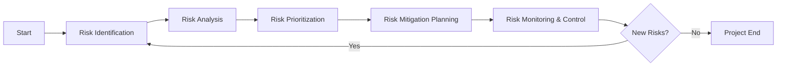
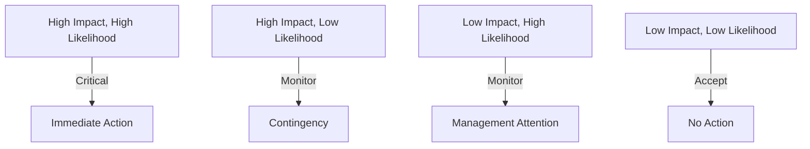
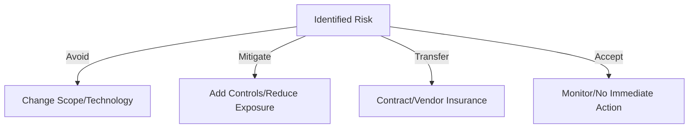
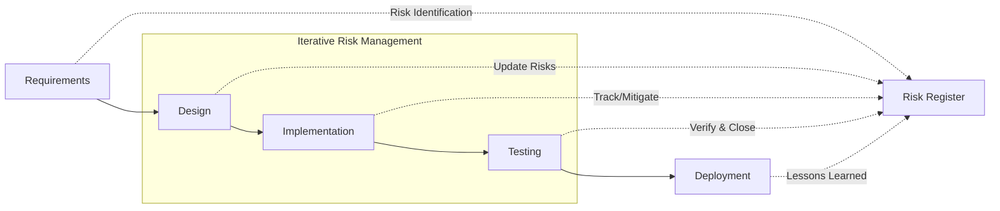
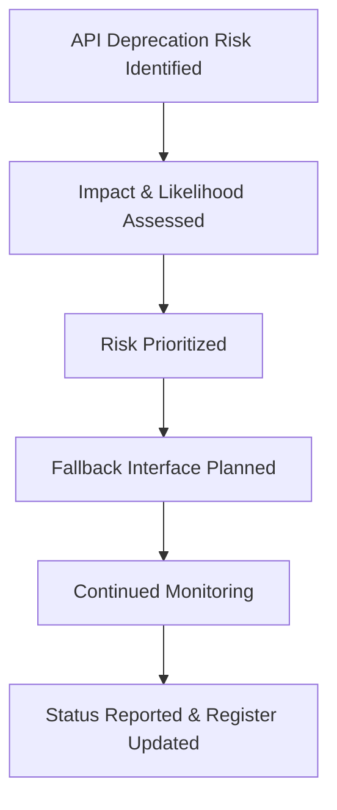

# Risk Management in Software Projects

## Introduction

Risk management is a systematic process for identifying, analyzing, mitigating, and monitoring risks throughout the lifecycle of a software project. It seeks to minimize the impact of uncertain events that could adversely affect the achievement of project objectives. Effective risk management is a cornerstone of successful software engineering, vital for delivering projects on time, within budget, and to specification.

Software projects operate in dynamic environments characterized by evolving requirements, technological changes, resource constraints, dependencies, and human factors. These elements introduce uncertainty, amplifying the significance of structured risk management approaches as defined in standards such as ISO 31000 (Risk Management) and referenced in the Software Engineering Body of Knowledge (SWEBOK).

This overview provides a formal, technical perspective on risk management in software projects, describing its core concepts, processes, practical workflows, engineering considerations, and variations.

---

## 1. Core Concepts in Software Risk Management

### Definition of Risk

Within software engineering, **risk** is the possibility of an event or condition occurring that would have a negative impact on one or more project objectives, including scope, schedule, cost, quality, or security.

A risk is characterized by:

- **Probability (Likelihood):** The chance that the risk event will occur.
- **Impact (Consequence):** The extent of loss or disruption the event may cause.
- **Exposure:** The combination of probability and impact (typically quantified as Risk Exposure = Probability × Impact).

### Types of Risks

Software risks can be broadly categorized as follows:

- **Technical Risks:** Arising from technology, architecture, implementation, scalability, or performance.
- **Project Management Risks:** Related to estimation, planning, scheduling, and control.
- **Organizational Risks:** Resulting from resource availability, organizational structure, or stakeholder alignment.
- **External Risks:** Including regulatory, market, customer, or environmental factors.
- **Security & Compliance Risks:** Pertaining to breaches, vulnerabilities, or non-compliance with standards.

| Risk Type              | Examples                                              |
|------------------------|------------------------------------------------------|
| Technical              | Unproven technology, integration difficulties        |
| Project Management     | Inaccurate estimates, scope creep                    |
| Organizational         | Key personnel turnover, funding delays               |
| External               | Vendor failures, legal changes                       |
| Security & Compliance  | Data breaches, missed regulatory requirements        |

---

## 2. The Risk Management Process

Risk management in software projects follows an iterative lifecycle, integrated with standard project management methodologies (e.g., PMI’s PMBOK, Agile, ISO/IEC/IEEE 12207).

### Key Process Steps

The process typically consists of the following steps:

1. **Risk Identification**
2. **Risk Analysis (Qualitative and Quantitative)**
3. **Risk Prioritization & Assessment**
4. **Risk Mitigation Planning**
5. **Risk Monitoring and Control**
6. **Risk Communication and Documentation** 

#### Mermaid Diagram – Risk Management Lifecycle

---

### 2.1 Risk Identification

**Risk identification** involves systematically detecting and describing risks that could affect the project.

#### Techniques

- **Brainstorming** with cross-functional teams.
- **Checklists** based on historical data (e.g., SWEBOK, CMMI).
- **Expert Interviews** and Delphi method.
- **Assumption Analysis** and scenario analysis.
- **SWOT Analysis** (Strengths, Weaknesses, Opportunities, Threats).

**Deliverables:** Initial risk list or risk register entries, often documented in a **Risk Register**.

#### Practical Considerations

- Risks should be described with clear causes and potential effects (e.g., "If X occurs, then Y can happen, resulting in Z").
- Inclusion of both threats (negative risks) and opportunities (positive risks).
- Identification should be revisited regularly (not a one-time event).

### 2.2 Risk Analysis

#### Qualitative Risk Analysis

Focuses on the subjective prioritization of risks based on impact and likelihood, often using scales (e.g., low, medium, high). This helps filter out low-priority risks for efficient management focus.

#### Quantitative Risk Analysis

Involves numerical estimation of probability and impact, sometimes using statistical models, decision trees, or Monte Carlo simulations. Key methods:

- **Expected Monetary Value (EMV):** Calculated as Probability × Impact.
- **Sensitivity Analysis:** Identifies variables with significant influence on risk exposure.

#### Risk Matrix – Qualitative Assessment Example

Many teams represent the assessment via a **risk matrix** (‘heat map’), plotting likelihood versus impact and coloring zones accordingly.

### 2.3 Risk Prioritization & Assessment

The output of risk analysis is used to rank risks within the risk register. Priority considers both current project phase and overall risk exposure.

- **Top-N Risk List:** Focus on the most significant threats.
- **Risk Appetite:** Distinguish acceptable risks from unacceptable, based on organizational tolerance.

**Risk Register Table (Typical Fields):**

| ID   | Description   | Likelihood | Impact | Exposure | Owner  | Status     | Mitigation Plan |
|------|---------------|------------|--------|----------|--------|------------|-----------------|
| R1   | Data loss     | High       | High   | High     | DevOps | Open       | Daily Backups   |

### 2.4 Risk Mitigation Planning

For significant risks, action plans are developed. Common risk response strategies:

- **Avoidance:** Change plans to negate the risk.
- **Mitigation:** Reduce probability or impact.
- **Transference:** Shift risk to a third party (e.g., via insurance).
- **Acceptance:** Acknowledge and monitor without intervention.

**Example Mitigation Activities:**
- Additional training to address lack of expertise.
- Adopting proven frameworks to reduce tech risk.
- Allocating contingency funds for critical risks.

#### Mermaid Diagram – Risk Response Strategies

> **Note**
>
> Not all risks are controllable. Risk transference and acceptance are legitimate strategies when mitigation is not feasible or cost-effective.

### 2.5 Risk Monitoring and Control

Risk monitoring involves ongoing oversight of risk status and the effectiveness of mitigation actions.

- **Metric Tracking:** Use KPIs (Key Performance Indicators) such as risk burn-down, number of open risks, or near-misses.
- **Periodic Reviews:** Regular risk review meetings (weekly, by sprint, etc.).
- **Trigger Events:** Predefined indicators enabling proactive actions when risks escalate.
- **Change Management:** Update risk logs as project context evolves.

### 2.6 Risk Communication and Documentation

Comprehensive risk documentation facilitates knowledge transfer, stakeholder alignment, and regulatory compliance.

**Mechanisms:**
- **Risk Register** – central, living document.
- **Status Reports** – executive summaries for management.
- **Dashboards** – visual displays for teams.

---

## 3. Risk Management in the Software Lifecycle

Risk management activities should be tightly integrated with project milestones and delivery cycles, whether Waterfall, Agile, or Hybrid methodologies are employed.

### Waterfall vs. Agile Approaches

| Process         | Waterfall                             | Agile                                        |
|-----------------|--------------------------------------|----------------------------------------------|
| Timing          | Risks identified early (front-loading)| Continuous risk identification per iteration |
| Ownership       | Central (Risk Manager/PMO)            | Distributed (Product Owner, Team)            |
| Communication   | Formal, periodic                      | Informal, ongoing (e.g., daily standups)     |

> **Tip**
>
> In Agile, maintaining an up-to-date risk board (physical or virtual) facilitates team awareness and ownership.

#### Mermaid Diagram – Risk Management Touchpoints

---

## 4. Special Considerations and Engineering Practices

### Tools and Integration Points

Software risk management benefits from integration with broader project tools:

- **ALM & PLM Tools:** Built-in risk-tracking modules (e.g., Jira, Azure DevOps, IBM Engineering Lifecycle Management).
- **CI/CD Pipelines:** Automated risk checks for security, compliance.
- **Test Management Suites:** Trace risks to test cases covering mitigation measures.

### Performance and Scalability

- High-frequency risk assessments can impede productivity if not properly calibrated.
- Over-detailed tracking for low-impact risks creates unnecessary overhead; balance rigor with efficiency.

### Implementation Challenges

- Organizational resistance to formal risk processes (culture change).
- Underestimation of less visible risks (e.g., technical debt, security vulnerabilities).
- Difficulty quantifying certain risks (e.g., reputation damage).
- Risk fatigue from excessive focus on long lists of unlikely risks.

> **Caution**
>
> “Risk-blindness” due to optimism bias or lack of risk visibility can threaten project success. Encourage open reporting and regular, structured reviews.

### Common Pitfalls

- **Ignoring Root Causes:** Focusing on symptoms instead of underlying issues.
- **Poor Documentation:** Losing track of identified risks and mitigation actions.
- **Assumption Overload:** Failing to validate critical project assumptions.
- **Siloed Risk Ownership:** Not appointing clear risk owners leads to inaction.

---

## 5. Standards and Frameworks

Several international and industry-specific standards guide risk management practices:

- **ISO 31000:** General framework for risk management; applicable to all industries.
- **PMBOK (Project Management Body of Knowledge):** Provides risk management process groups and best practices.
- **CMMI (Capability Maturity Model Integration):** Addresses risk management within maturity levels.
- **ISO/IEC/IEEE 12207:** Software lifecycle processes including risk considerations.
- **SAFe & Scrum (Agile Frameworks):** Encourage team-level and organizational risk management as part of ceremonies.

---

## 6. Case Example: Risk Register Update Workflow

### Scenario

A software team identifies a risk regarding the stability of a third-party API upon which a critical microservice depends.

#### Workflow Steps

1. **Identification:** Noted during sprint planning.
2. **Analysis:** Determined that if the API is deprecated, system functionality will be severely impacted.
3. **Prioritization:** Rated as “High Impact, Medium Likelihood.”
4. **Mitigation:** Decide to quarantine code and implement a fallback interface within three sprints.
5. **Monitoring:** Track changes to the API’s deprecation policy.
6. **Communication:** Update stakeholders and document risk status at every review.

#### Mermaid Diagram – Example Risk Update Flow

---

## Conclusion

Risk management is a fundamental engineering process throughout software project lifecycles, spanning from planning to delivery and maintenance. The discipline ensures that uncertainties are systematically managed, minimizing threats and enabling better decision-making. Core activities—including risk identification, analysis, prioritization, mitigation, and monitoring—must be tailored to the chosen development methodology, project complexity, and organizational context.

Effective implementation depends on integration with project tools and workflows, ongoing communication, clear documentation, and adherence to established standards. Given the inherent uncertainties in software projects, risk management should not be viewed as a one-off exercise but as an embedded, iterative practice promoting successful project outcomes.