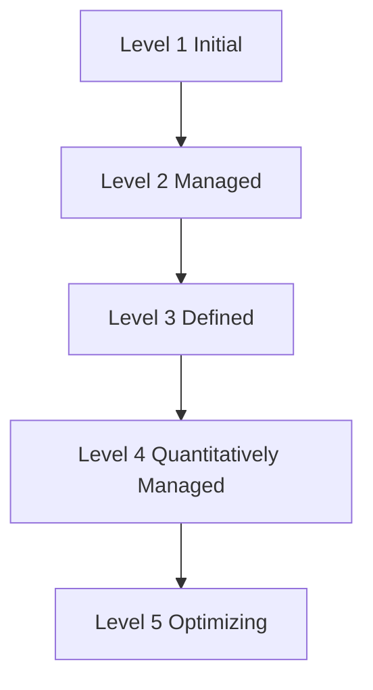
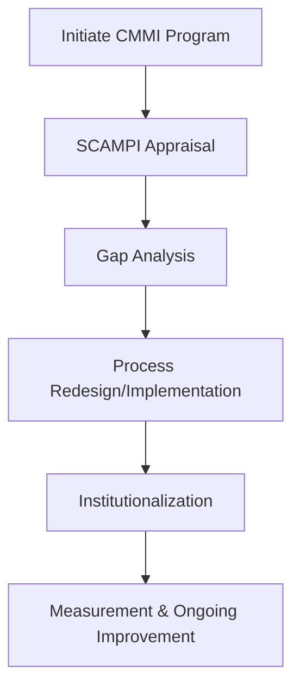
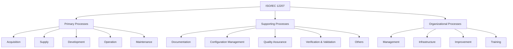
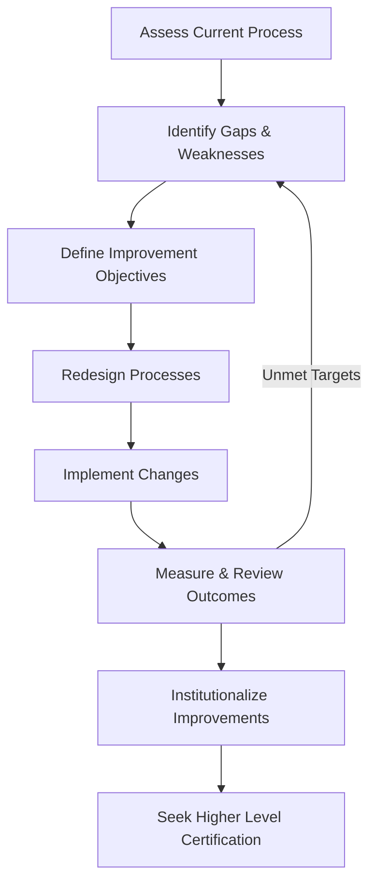

# Process Improvement Models

## Introduction

Process improvement models are structured frameworks that guide organizations in assessing, implementing, and optimizing processes to increase efficiency, effectiveness, and consistency during software and systems engineering. These models are essential for organizations striving for continuous quality improvement, risk reduction, and predictable delivery in complex environments. The impetus for adopting process improvement stems from the need to deliver more reliable software, comply with standards, reduce defects, and respond effectively to stakeholder demands.

Two of the most prominent frameworks in this area are the Capability Maturity Model Integration (CMMI) and ISO/IEC 12207. Both provide a basis for formalizing and systematically improving processes, albeit with different approaches and scopes.

---

## Technical Context and Motivation

### The Need for Formalized Process Improvement

Software engineering is intrinsically complex, encompassing diverse technologies, teams, and activities. Without disciplined processes, organizations are susceptible to miscommunication, quality lapses, missed deadlines, and cost overruns. Informal or ad-hoc methods typically fail to scale as the organizational context becomes more demanding.

Process improvement models address this challenge by:

- Providing reference models for best practices.
- Enabling consistent assessment and benchmarking.
- Offering mechanisms for incremental or staged improvement.
- Facilitating compliance with regulatory, contractual, or business obligations.

### Integration with the Software Engineering Body of Knowledge (SWEBOK)

Process improvement frameworks align closely with Software Quality, Process, and Lifecycle knowledge areas in SWEBOK. They serve as the backbone for establishing organization-wide standards for workflow, measurement, reporting, and optimization.

---

## Core Concepts and Terminology

**Process Improvement** refers to the proactive examination and refinement of existing organizational workflows to achieve better quality, efficiency, or compliance.

Fundamental terms include:

- **Process Assessment:** Evaluation of current practices against a reference model.
- **Process Maturity:** The degree to which processes are defined, managed, measured, and continuously improved.
- **Continuous Process Improvement:** Ongoing efforts to enhance processes using metrics and feedback.

---

## Key Process Improvement Models

### Capability Maturity Model Integration (CMMI)

#### Overview

The Capability Maturity Model Integration (CMMI) is a process improvement approach originally developed by the Software Engineering Institute (SEI) at Carnegie Mellon University. It provides organizations with the essential elements for effective process improvement across a project, division, or entire organization.

**Relevant Standard:** CMMI is maintained as a model, not an international standard, but often aligned with other standards such as ISO/IEC 15504 (SPICE).

#### CMMI Model Structure

CMMI for Development (CMMI-DEV) is the most widely used variant, though models also exist for Services (CMMI-SVC) and Acquisition (CMMI-ACQ). CMMI models are structured around the following concepts:

- **Maturity Levels (Staged Representation):** Indicate the degree of process maturity.
  - Level 1: Initial
  - Level 2: Managed
  - Level 3: Defined
  - Level 4: Quantitatively Managed
  - Level 5: Optimizing
- **Process Areas:** Key practice areas (e.g., Project Planning, Configuration Management, Risk Management).
- **Generic and Specific Goals:** Objectives to satisfy within each process area.
- **Practices:** Actions required to meet goals.

#### CMMI Maturity Levels

- **Level 1 (Initial):** Processes are ad hoc and chaotic.
- **Level 2 (Managed):** Processes are planned, documented, and executed in accordance with policy.
- **Level 3 (Defined):** Processes are well characterized and understood, and are described in standards, procedures, tools, and methods.
- **Level 4 (Quantitatively Managed):** Processes are controlled using data and statistical techniques.
- **Level 5 (Optimizing):** Focus on continuous process improvement.

#### How CMMI Works in Practice

CMMI deployment typically follows these steps:

1. **Appraisal of Current Process:** Using SCAMPI (Standard CMMI Appraisal Method for Process Improvement).
2. **Gap Analysis:** Identifying shortfalls per CMMI practices.
3. **Process Redesign and Implementation:** Developing procedures, documentation, and controls.
4. **Institutionalization:** Ensuring processes are part of organizational culture.
5. **Measurement and Improvement:** Using key performance indicators (KPIs) for ongoing refinement.

#### Engineering Considerations

- **Integration with Existing Processes:** CMMI does not prescribe specific processes but expects alignment with the organization’s business objectives.
- **Scalability:** Suitable for both large and small organizations, but the scope may require tailoring.
- **Documentation Overhead:** Achieving higher maturity levels (3+) can introduce substantial documentation requirements.
- **Tools Support:** Specialized software is available for process documentation, auditing, and measurement.

> [!TIP]
> Organizations should avoid a "checklist" mentality and instead focus on meaningful process improvement aligned with business goals.

---

### ISO/IEC 12207

#### Overview

ISO/IEC 12207, “Systems and Software Engineering — Software Life Cycle Processes,” is an international standard describing the processes required for planning, managing, and engineering software systems. It provides a detailed catalog of processes spanning organizational, technical, and support functions.

**Relevant Standard:** ISO/IEC 12207:2017 is the latest edition as of the knowledge cutoff.

#### ISO 12207 Process Model

The standard organizes software processes into multiple categories:

- **Primary Lifecycle Processes:**
  - Acquisition
  - Supply
  - Development
  - Operation
  - Maintenance
- **Supporting Lifecycle Processes:**
  - Documentation
  - Configuration Management
  - Quality Assurance
  - Verification, Validation, etc.
- **Organizational Lifecycle Processes:**
  - Management
  - Infrastructure
  - Improvement
  - Training

#### Practical Implementation

Organizations align their internal process definitions and product life cycles to the ISO/IEC 12207 framework. The standard:

- Does not enforce a particular life cycle model (e.g., waterfall, agile), but provides the process infrastructure.
- Is often mapped against other standards (e.g., ISO/IEC 15504 for capability assessment).

Typical implementation steps include:

1. **Process Mapping:** Aligning existing processes to ISO 12207-defined processes.
2. **Gap Analysis and Improvement Planning:** Identifying areas not covered or weakly implemented.
3. **Process Deployment:** Updating policies, procedures, and training materials.
4. **Measurement and Audit:** Monitoring process performance, usually in synergy with ISO/IEC 9001 or SPICE assessments.

#### Engineering Considerations

- **Customization:** ISO 12207 allows tailoring to fit organization’s project types, sizes, and regulatory environments.
- **Documentation:** Requires clear documentation of process tailoring decisions.
- **Auditability:** Facilitates third-party audits for certification or compliance.
- **Integration with Quality Management Systems (QMS):** Commonly integrated alongside ISO 9001.

> [!Caution]
> Misinterpreting process tailoring permissions as license to omit necessary controls can threaten quality and compliance.

---

## Comparison: CMMI vs ISO/IEC 12207

| Aspect                              | CMMI                                      | ISO/IEC 12207                                       |
|--------------------------------------|--------------------------------------------|-----------------------------------------------------|
| Nature                              | Process improvement model                  | International process standard                      |
| Origin                              | SEI, Carnegie Mellon                       | ISO/IEC                                             |
| Primary Focus                       | Process maturity and staged improvement    | Comprehensive lifecycle process definition          |
| Approach                            | Maturity levels, best practices            | Mandatory and optional process clauses              |
| Assessment/Audit                    | SCAMPI and CMMI appraisals                 | ISO audits, integrated with ISO/IEC 15504           |
| Typical Use                         | Process optimization, benchmarking         | Compliance, process harmonization, systems approach |
| Compatibility                       | Maps to ISO standards                      | Can be mapped to CMMI and other frameworks          |

---

## Related Models and Standards

- **ISO/IEC 15504 (SPICE):** A process assessment model, compatible with both CMMI and ISO/IEC 12207, provides a quantitative assessment framework.
- **ISO 9001:** Focuses on quality management, often implemented alongside ISO 12207.
- **Lean, Six Sigma:** Popular general business process improvement methodologies adapted for software engineering.
- **Agile Approaches:** Emphasize evolutionary improvement; frameworks such as Scrum recognize empirical process improvement.

---

## Common Process Improvement Workflow

---

## Implementation Challenges and Pitfalls

- **Resistance to Change:** Cultural inertia can undermine formal process adoption.
- **Over-Engineering:** Excessive documentation and bureaucracy can impede agility and innovation.
- **Misalignment:** Processes not aligned with organizational goals provide little value.
- **Lack of Sponsorship:** Top management support is critical for successful improvement.

> [!Warning]
> Failure to balance rigor of process with organizational agility can lead to reduced productivity and demotivation among engineers.

---

## Practical Engineering Considerations

### Integration Points

- **Toolchain Integration:** Automated tracking (e.g., for configuration management and defect tracking) enhances process effectiveness and data accuracy.
- **Metrics and KPIs:** Continuous measurement of defects, rework, lead times, and compliance rates underpins process evaluation.
- **Cross-Model Mapping:** Organizations often “harmonize” ISO 12207 and CMMI with internal policies and external customer requirements.

### Performance and Scalability

- **Incremental Deployment:** Adopt improvement initiatives in phases to minimize disruption and allow feedback-driven refinement.
- **Tailoring:** Modify model prescriptions to account for project size, regulatory context, and business domain.

### Certification and Appraisals

- **Audit Preparation:** Maintain clear, up-to-date documentation for each process and tailor sufficiently to demonstrate compliance.
- **Continuous Evidence Collection:** Embed periodic review cycles to ensure assessment readiness.

> [!Note]
> Diagram to be added later: Example mapping of a software team's workflow to primary ISO 12207 process categories.

---

## Conclusion

Process improvement models such as CMMI and ISO/IEC 12207 are foundational to building and maintaining world-class software engineering organizations. By providing rigor, transparency, and a reference point for organizational learning, these models enable continuous advancement in quality assurance, risk reduction, and business value delivery. Successful implementation depends on thoughtful integration, pragmatic tailoring, and organizational commitment to both the spirit and the letter of improvement frameworks.

Process improvement is not an end state but a journey. Engineering organizations benefit most when these models are used to foster a culture of learning, discipline, and adaptation capable of meeting both current and future challenges within the rapidly evolving field of software engineering.