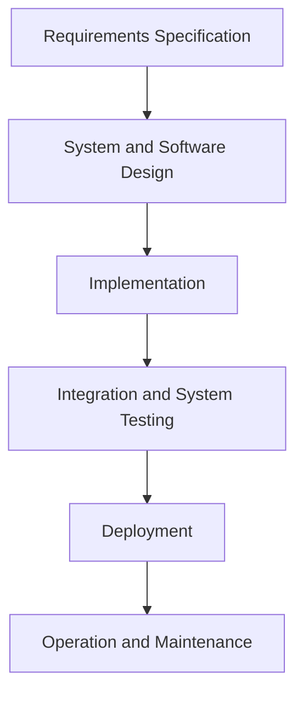
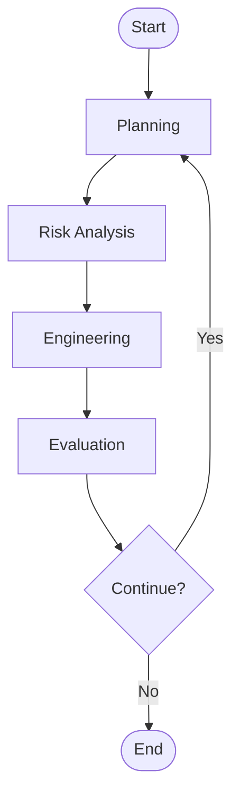
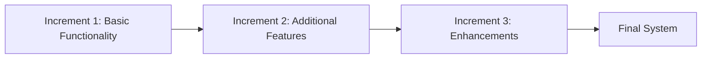
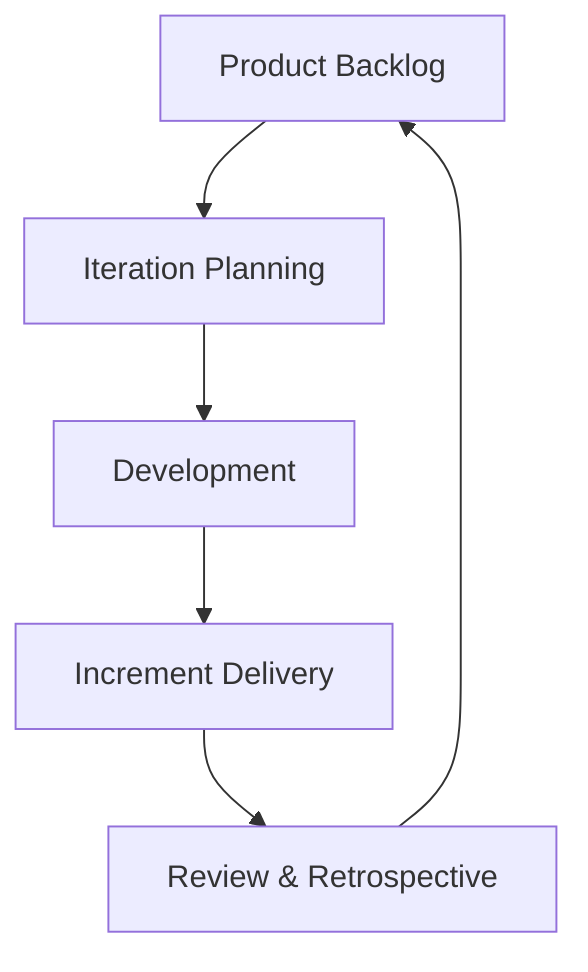

# Software Development Life Cycles

## 1. Introduction

A **Software Development Life Cycle** (SDLC) is a structured process that governs the engineering, development, and maintenance of software systems. SDLC frameworks formalize the set of activities required to transform needs and requirements into a tested, operational software product. Effective application of an SDLC model is essential for ensuring quality, predictability, cost control, and risk management throughout the software engineering process.

SDLC models define the sequence and structure of engineering tasks such as requirements analysis, design, implementation, verification, deployment, and maintenance. The choice of SDLC model determines project workflow, documentation requirements, quality assurance approaches, and responsiveness to changes. Understanding the variety of SDLC paradigms enables engineering teams to select or tailor models that best meet the needs of their specific domain, organization, or project.

This primer provides a technical overview of major SDLC models in current and historical use—including waterfall, spiral, V-model, incremental, agile, and hybrid approaches—and discusses their architecture, benefits, constraints, and practical engineering implications.

---

## 2. Core Concepts and Terminology

- **Phase:** A logical grouping of software engineering activities (e.g., requirements, design, coding).
- **Iteration:** A cyclic execution of a subset of SDLC phases on a smaller scope (e.g., specific feature or module).
- **Milestone:** A significant event that marks the completion of related activities within the SDLC.
- **Deliverable:** A tangible outcome produced during or at the end of a phase/iteration (e.g., design documents, source code).
- **Verification/Validation:** Processes for ensuring the software meets (verification) and satisfies (validation) requirements and stakeholder expectations.

Most SDLC models share a set of canonical activities:

1. **Requirement Specification**
2. **System and Software Design**
3. **Implementation and Unit Testing**
4. **Integration and System Testing**
5. **Deployment**
6. **Operation and Maintenance**

---

## 3. Overview of Major SDLC Models

The engineering literature recognizes several primary SDLC models, each with distinct architectures supporting different domains, risk profiles, and delivery requirements:

- **Waterfall**
- **Spiral**
- **V-Model**
- **Incremental**
- **Agile**
- **Hybrid/Custom Models**

The following sections describe each model in detail.

---

## 4. The Waterfall Model

### 4.1. Definition & Structure

The **Waterfall Model** is the earliest and most linear SDLC approach. Its structure is strictly sequential—each phase is completed in full before moving to the next. There is typically little to no feedback or overlap between phases.

#### Mermaid Diagram: Waterfall Model Overview



### 4.2. Workflow and Characteristics

- **Phase-based progression**: No phase begins before the previous completes.
- **Documentation-heavy**: Each stage produces defined artifacts that form the basis for subsequent work.
- **Change management**: Changes after phase completion are expensive and discouraged.

### 4.3. Typical Usage & Constraints

Used effectively when:

- Requirements are well understood and unlikely to change.
- Domain is stable (e.g., embedded systems, safety-critical software).
- Compliance with process standards (e.g., ISO/IEC 12207) is required.

#### Engineering Considerations

> **:warning: Caution**
> Requirements errors or changes detected late can cause substantial rework/expense.

**Pitfall:** Lack of accommodation for feedback or change after phase completion makes Waterfall brittle in dynamic or uncertain domains.

---

## 5. The Spiral Model

### 5.1. Definition & Structure

The **Spiral Model** blends iterative development with systematic risk analysis. Each trip around the spiral represents a project phase, with assessment and mitigation of risks the central organizing principle.

#### Mermaid Diagram: Spiral Model Phases



### 5.2. Workflow and Characteristics

- **Cyclic structure**: Each iteration refines understanding and implementation.
- **Explicit risk-driven approach**: Risk identification and mitigation guide activity selection.
- **Prototyping**: Early versions and models validate requirements and technology choices.

### 5.3. Typical Usage & Constraints

Best suited for:

- Large, high-risk projects where requirements are complex or poorly defined.
- Environments requiring regular prototyping, customer feedback, or evolving risk profiles.

#### Engineering Considerations

> **:bulb: Tip**
> Early and continuous stakeholder involvement essential for risk identification and feedback.

**Integration Points:** Each cycle can introduce or resolve architectural integration challenges as design matures.

---

## 6. The V-Model (Verification and Validation Model)

### 6.1. Definition & Structure

The **V-Model** extends the Waterfall paradigm by mapping each development phase to a corresponding testing phase, forming a "V" shape that emphasizes verification and validation at every level.

#### Mermaid Diagram: V-Model Structure

```mermaid
flowchart TD
    A[Requirements Specification] --> B[System Design]
    B --> C[Architectural (High-Level) Design]
    C --> D[Module (Detailed) Design]
    D --> E[Implementation]
    E --> F[Unit Testing]
    F --> G[Integration Testing]
    G --> H[System Testing]
    H --> I[Acceptance Testing]

    A -- Verifies --> I
    B -- Verifies --> H
    C -- Verifies --> G
    D -- Verifies --> F
```

### 6.2. Workflow and Characteristics

- **Parallel test development**: Testing activities and artifacts are developed alongside their corresponding development activities.
- **Quality focus**: Emphasis on defect detection early in the lifecycle.
- **Traceability**: Explicit mapping between requirements/design documents and test plans/cases.

### 6.3. Typical Usage & Constraints

Used where:

- High assurance or regulated environments (e.g., aerospace/defense, medical devices).
- Comprehensive requirements and detailed test planning are feasible.

#### Engineering Considerations

> **:mag: Note**
> Requirements traceability matrices are critical for effective V-Model application and may be required by standards (e.g., DO-178C, ISO 62304).

---

## 7. The Incremental Model

### 7.1. Definition & Structure

The **Incremental Model** decomposes the system into smaller modules or increments, each delivering part of the full functionality. Increments are developed, integrated, and delivered sequentially or in parallel.

#### Mermaid Diagram: Incremental Model Workflow



### 7.2. Workflow and Characteristics

- **Partial product delivery:** Each increment yields an operational subset of the system.
- **Overlap:** Planning, design, and implementation may be staggered and overlapped across increments.
- **Feedback loop:** Stakeholder feedback on early increments guides later increments.

### 7.3. Typical Usage & Constraints

Effective for:

- Projects with evolving requirements.
- Scenarios that benefit from early delivery of partial solutions.

#### Engineering Considerations

> **:information_source: Tip**
> Modular architecture and clear interfaces are enablers for successful incremental delivery.

**Pitfall:** Poor increment planning can lead to architectural degradation (e.g., "Big Ball of Mud" anti-pattern).

---

## 8. Agile Process Models

### 8.1. Definition & Structure

**Agile** is not a single SDLC but a family of frameworks (e.g., Scrum, Extreme Programming, Kanban) characterized by short, iterative cycles, strong stakeholder collaboration, and adaptive planning. Agile models prioritize delivering small increments of value, frequent reassessment, and responsiveness to change.

#### Mermaid Diagram: Generic Agile Iteration



### 8.2. Workflow and Characteristics

- **Iterations (Sprints):** Deliver a potentially shippable product increment every 2-4 weeks.
- **Continuous feedback:** Stakeholders regularly interact with the team to shape direction.
- **Adaptive:** Requirements and design emerge and evolve throughout the process.
- **Self-organizing teams:** Engineering teams decide how best to accomplish work within iteration constraints.

### 8.3. Typical Usage & Constraints

Agile models are suitable for:

- Projects where requirements are uncertain or change frequently.
- Organizations prioritizing rapid value delivery and adaptability.
- Teams capable of close, ongoing collaboration.

#### Engineering Considerations

> **:warning: Caution**
> Agile requires significant cultural and organizational commitment. Lack of stakeholder engagement or executive support can undermine adoption.

**Integration Points:** Continuous integration and automated testing pipelines (as per ISO/IEC/IEEE 29119) support frequent builds and quality assurance.

**Pitfall:** Agile is often less effective when applied to highly regulated domains requiring formal documentation and upfront planning.

---

## 9. Hybrid and Custom Life Cycles

### 9.1. Definition & Rationale

**Hybrid Life Cycles** combine elements from multiple SDLC models to address the unique needs of a project or organization. Common hybrids include blending Waterfall planning with Agile delivery ("Water-Scrum-Fall") or overlaying iterative cycles onto the V-Model for regulated Agile.

### 9.2. Example Hybrid Workflows

#### Mermaid Diagram: Hybrid (Plan-driven + Agile) Model

```mermaid
flowchart TD
    PLAN[Project Planning (Waterfall)]
    PLAN --> ARCH[Architecture & High-level Design]
    ARCH --> AGILE[Agile Iterations: Design/Build/Test/Deploy]
    AGILE --> INTEG[System Integration & Final Validation]
    INTEG --> OPS[Deployment & Maintenance]
```

### 9.3. Engineering Considerations

- **Integration:** Synchronization points required where plan-driven and agile teams interact.
- **Quality and compliance:** Hybrid models often use phased gates or documentation layers to ensure regulatory compliance amid agile execution.
- **Customization:** Process tailoring should be explicitly documented and periodically reviewed against project and organizational goals.

> **:bulb: Tip**
> Hybrid approaches work best when roles, responsibilities, and artifacts for each SDLC facet are clearly defined and communicated.

---

## 10. Practical Engineering Topics

### 10.1. Selection Criteria and Decision Factors

Key considerations when selecting or tailoring an SDLC model:

- **Requirements stability and clarity**
- **Project scale and duration**
- **Risk and safety profiles**
- **Regulatory and standards compliance**
- **Stakeholder engagement patterns**
- **Organizational culture and maturity**
- **Engineering team distribution and skillset**

### 10.2. Process Tailoring and Continuous Improvement

SDLs can and should be tailored, combining best-fit elements from baseline models and agreed upon at project launch. Process improvement models such as **Capability Maturity Model Integration (CMMI)** support systematic evaluation and enhancement of SDLC operations.

### 10.3. Documentation, Traceability, and Toolchain Integration

Modern SDLCs can be augmented with:

- **Requirements management systems** (e.g., IBM DOORS, Atlassian Jira)
- **Version control systems** (e.g., Git, Subversion)
- **Automated build and test pipelines** (e.g., Jenkins, GitLab CI)
- **Continuous integration/deployment (CI/CD) frameworks**
- **Traceability matrices** for auditability

> **:octagonal_sign: Warning**
> Inadequate traceability or lack of audit trails may lead to non-conformance in regulated industries.

### 10.4. Performance and Risk Management

Proactive identification and management of:

- **Technical risks** (e.g., scalability, integration complexity)
- **Product risks** (e.g., missed requirements, defects)
- **Resource and schedule constraints**

The Spiral Model and hybrid risk-driven models enable formal risk mitigation cycles.

---

## 11. SDLCs in the Context of Standards

- **ISO/IEC 12207:** Software life cycle processes; defines a process framework for software engineering.
- **ISO/IEC/IEEE 15288:** System life cycle processes; covers software within broader system engineering.
- **IEEE 1074:** Standard for developing life cycle processes; identifies process selection and tailoring.
- **CMMI-DEV:** Process improvement model assessing SDLC maturity and capability.

These standards provide guidance for aligning SDLC practices with organizational and regulatory requirements.

---

## 12. Summary Table: Comparison of Major SDLC Models

| SDLC Model           | Typical Usage                      | Change Management      | Risk Handling    | Documentation      | Regulatory Fit     |
|----------------------|------------------------------------|-----------------------|------------------|--------------------|--------------------|
| Waterfall            | Stable, well-understood projects   | Difficult, late-stage | Low              | Heavy              | High               |
| Spiral               | Large/high-risk, evolving projects | Moderate, per cycle   | Central focus    | Moderate           | Variable           |
| V-Model              | High-assurance, regulated domains  | Difficult, late-stage | Some             | Heavy              | Very high          |
| Incremental          | Modular, evolving requirements     | Easier, per increment | Moderate         | Medium             | Medium             |
| Agile                | Rapid change, evolving needs       | Easy, continuous      | Lightweight      | Light, evolving    | Low/medium         |
| Hybrid               | Complex, mixed requirements        | Variable              | Variable         | Variable           | Variable           |

---

## 13. Conclusion

The software development life cycle is a central construct of modern software engineering, providing structure, discipline, and predictability to the process of building, validating, and maintaining reliable software systems.

Familiarity with major SDLC models—including their architectures, advantages, and constraints—enables engineering teams to apply the right methodologies to their context, adapt models to fit their needs, and integrate quality assurance and risk management throughout the project.

Successful application of SDLCs depends not just on the choice of model but also on disciplined engineering, tool support, stakeholder collaboration, and adherence to applicable standards.

---

## 14. Visual Index

- Waterfall Model Overview – see Section 4.1
- Spiral Model Phases – see Section 5.1
- V-Model Structure – see Section 6.1
- Incremental Model Workflow – see Section 7.1
- Generic Agile Iteration – see Section 8.1
- Hybrid (Plan-driven + Agile) Model – see Section 9.2

> **:memo: Note**
> Additional diagram types (such as state diagrams for process transitions or sequence diagrams for engineering workflow handoffs) may be added to further clarify process steps or integration points.

---

**End of document.**