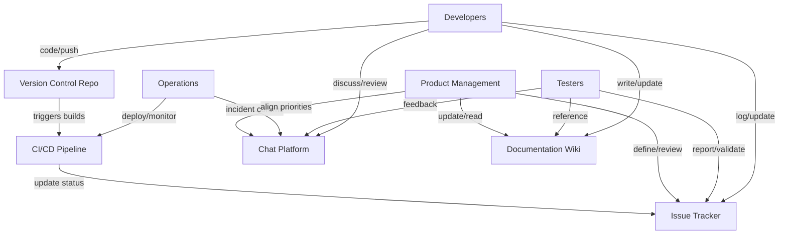
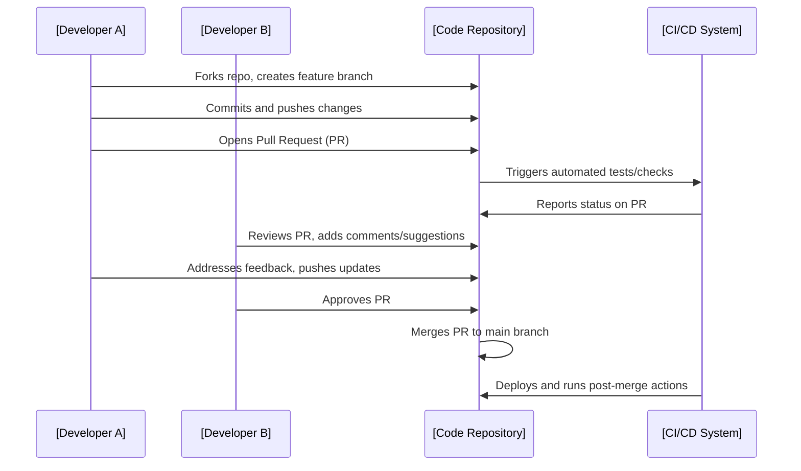

# Collaboration and Team Communication

## Introduction

Collaboration and effective team communication are fundamental to successful software delivery. In professional engineering practice, these activities underpin every phase of the software development lifecycle (SDLC), including requirements gathering, design, implementation, validation, deployment, maintenance, and continuous improvement. This introduction defines core terminology, describes essential practices, and outlines the workflows and technologies engineers encounter when collaborating in distributed or co-located teams.

## Technical Context

Modern software engineering depends heavily on collaboration among individuals and teams with diverse expertise and responsibilities (e.g., developers, testers, operations, security, product management, and stakeholders). The complexity and distributed nature of contemporary software—often involving microservices, cloud computing, and global user bases—demand robust, reliable communication and documentation mechanisms to mitigate misunderstandings, ensure alignment, and deliver high-quality systems.

Collaboration is not restricted to interpersonal interactions, but is also mediated by technical tools and processes that coordinate shared work products: source code, documentation, specifications, configuration files, and more.

## Core Concepts

### Communication

Communication is the process of exchanging information, requirements, ideas, and feedback among team members and stakeholders. Communication channels and practices in software projects include:

- **Synchronous communication:** Real-time exchanges (e.g., meetings, video conferences, phone calls, real-time chat).
- **Asynchronous communication:** Non-instantaneous methods (e.g., email, issue trackers, code review comments, documentation).

Effective communication practices enable shared understanding, fast issue resolution, and alignment around priorities and objectives.

### Collaboration

Collaboration in this context refers to working cooperatively toward shared engineering goals, often involving:

- Joint development of code and artifacts
- Pair or mob programming sessions
- Collective ownership of responsibilities
- Peer review and feedback cycles
- Cross-functional coordination (e.g., between development and operations in DevOps)

### Documentation

Clear, accessible documentation is central to both communication and collaboration. Documentation includes technical specifications, code comments, process guides, meeting notes, diagrams, and other artifacts that help teams share knowledge, reduce onboarding friction, and preserve organizational memory.

### Team Structures

Software delivery may involve various team configurations:

- **Co-located teams:** Members work in the same physical location.
- **Distributed (or remote) teams:** Members work from different locations and/or time zones.
- **Cross-functional teams:** Teams are composed of members with a variety of skillsets (e.g., engineers, QA, UX, security).
- **Matrix organizations:** Members report to multiple managers or technical leads, often spanning multiple projects.

Each configuration imposes unique demands on communication and coordination methods.

## Key Components and Relevant Architecture

### 1. Communication Tools and Protocols

A range of digital tools facilitate collaboration and communication in engineering teams. Common examples and their primary functions include:

- **Version Control Systems (VCS):** Coordinate code changes and merge contributions (e.g., Git, Mercurial).
- **Collaboration Platforms:** Host conversations, notifications, and project documentation (e.g., Slack, Microsoft Teams, Mattermost).
- **Issue Trackers:** Manage work items, bug reports, tasks, and feature requests (e.g., Jira, GitHub Issues).
- **Wikis/Knowledge Bases:** Centralize long-form documentation and process guides (e.g., Confluence, MediaWiki).
- **Continuous Integration/Continuous Delivery (CI/CD) Tools:** Surface feedback on codebase health and deployment status (e.g., Jenkins, GitLab CI/CD, GitHub Actions).

#### Example: Communication Architecture in a Software Project

### 2. Team Workflows

Common collaboration workflows in software engineering include:

- **Agile ceremonies:** Regular meetings such as stand-ups, sprint planning, and retrospectives to ensure team alignment (per standards like Scrum/Agile Manifesto).
- **Code reviews:** Peer assessments of code changes prior to integration, facilitated through VCS pull requests or merge requests.
- **Pair programming:** Two developers work together at one workstation, sharing problem-solving and code ownership.
- **Pull Request Workflows:** Contributors submit proposed changes which the team reviews, discusses, and merges, often incorporating automated checks and feedback.

#### Example: Pull Request Collaboration Flow

### 3. Documentation Practices

Effective documentation supports both collaboration and communication. It should be:

- **Accessible:** Easily discoverable and searchable.
- **Living:** Updated as systems and processes evolve.
- **Structured:** Clearly organized, using accepted patterns (e.g., README, ADRs—Architecture Decision Records).
- **Versioned:** Managed alongside code where possible (cf. Docs-as-Code approaches).

**Docs-as-Code**, for example, treats documentation as a version-controlled asset, enabling collaborative editing, reviews, and integration with CI/CD workflows.

## Practical Engineering Considerations

### Integration Points

- **Toolchain compatibility:** Seamless integration between code repositories, issue trackers, CI/CD, and communication platforms reduces friction and context-switching.
- **APIs and Webhooks:** Many tools support extensibility via APIs or webhooks, allowing custom notifications, automations, or status reporting.
- **Single Source of Truth:** Maintaining clear ownership of key artifacts (whether code, documentation, or process) reduces ambiguity and confusion.

### Performance Implications

- **Latency in distributed teams:** Time zone differences and asynchronous workflows may introduce delays in communication and decision making. Intentional use of asynchronous documentation and clear expectations can partly mitigate this impact.
- **Scaling team processes:** As team size grows, formalization and process automation reduce bottlenecks but can also introduce procedural overhead that must be balanced against flexibility.

### Implementation Challenges

- **Onboarding new members:** Quality onboarding materials (including up-to-date process and system documentation) are crucial for accelerating ramp-up.
- **Consistent use of tools:** Without clear guidelines, teams risk fragmentation—using different communication or tracking tools inconsistently can slow progress and obscure work ownership.
- **Information overload:** Excessive notifications, poorly organized documentation, or unclear communication channels can inhibit effectiveness.
- **Cultural barriers:** Differences in communication norms, language, and organizational culture can impede clear understanding.

### Common Pitfalls

> [!CAUTION]
> **Over-reliance on informal communication:** Critical technical decisions or requirements discussed solely in unlogged chat threads are prone to being misunderstood or forgotten. Always document essential agreements and rationale in traceable, accessible locations.

> [!TIP]
> **Establishing communication conventions:** Explicitly define primary communication channels (e.g., “All design decisions must be discussed over documented issues; code reviews occur via pull requests; urgent notifications via chat”) to avoid ambiguity.

> [!WARNING]
> **Ignoring documentation:** Outdated or missing documentation results in knowledge silos and future maintenance challenges. Embed documentation update requirements into development and review processes.

### Standards and Specifications

- **RFC 2119:** Defines requirement levels for technical communication ("must", "should", "may", etc.), establishing clear expectations in documentation and specifications.
- **ISO/IEC/IEEE 12207:** International standard for software life cycle processes, covering documentation and communication responsibilities.
- **IEEE 829, 830, et al.:** Address software test and requirements documentation standards, supporting clarity and traceability in collaborative engineering.
- **Agile Manifesto:** Establishes guiding principles of communication, collaboration, and responsiveness in software development.

## Common Variations and Evolving Practices

- **Remote-first vs. hybrid models:** Some organizations emphasize asynchronous, documented workflows (e.g., written proposals over meetings).
- **Docs-as-Code:** Merging source code and documentation pipelines to maintain synchronization and enable automated publishing and validation.
- **Real-time collaborative editing:** Tools such as Google Docs, Notion, or shared online whiteboards facilitate synchronous editing and brainstorming, bridging the gap for distributed teams.
- **Automated meeting notes and transcript generation:** Speech-to-text technology may supplement traditional documentation, though privacy and accuracy must be considered.

> [!NOTE]
> Diagram to be added later: Sample swimlane diagram of a distributed incident response workflow.

## Conclusion

Collaboration and team communication are multifaceted, touching every element of software delivery. Effective practices balance synchronous and asynchronous methods, written and verbal exchanges, and formal and informal channels. By leveraging purpose-built tools, adhering to industry standards, and cultivating clear conventions, engineering teams improve their alignment, agility, and ability to deliver resilient software systems. Attention to documentation, review practices, and communication conventions further supports onboarding, knowledge sharing, and long-term sustainability.

Engineers entering modern software teams must develop fluency in both technical collaboration tools and interpersonal communication practices, recognizing that engineering outcomes depend as much on shared understanding and cooperative work as on technical expertise.