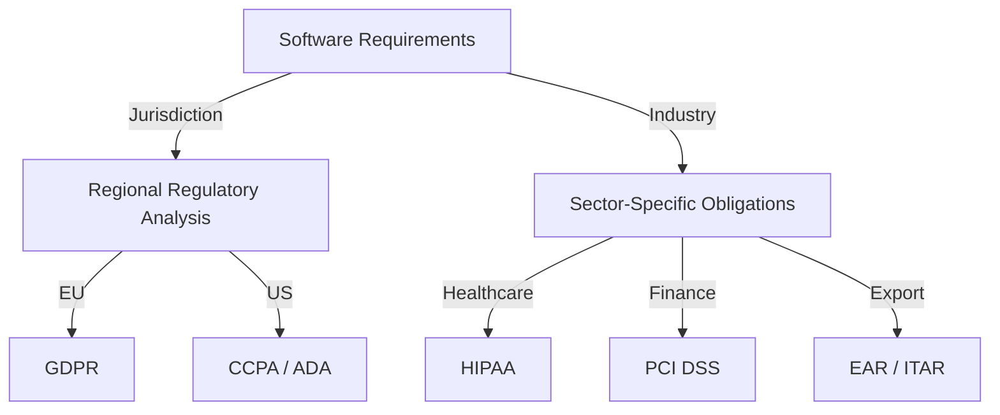
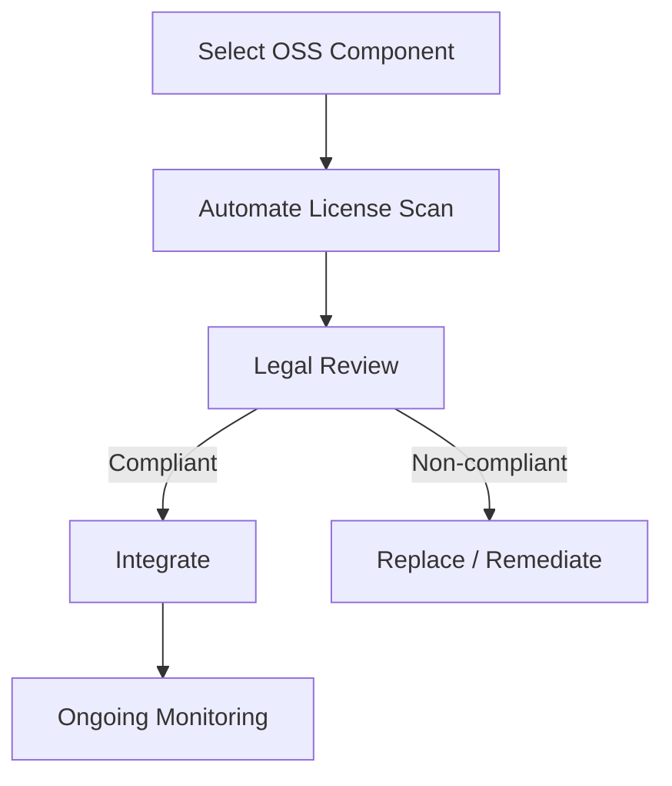

# Legal and Licensing Considerations

Legal and licensing considerations are core components of professional software engineering. These factors shape the development, distribution, and use of software, influencing architecture, workflow, and organizational risk. From intellectual property (IP) protection to regulatory compliance and diverse licensing models, engineers must understand and manage constraints imposed by law and by licensing obligations in both commercial and open environments.

## 1. Intellectual Property (IP) in Software Engineering

### 1.1 IP Definitions and Relevance

**Intellectual property** refers to creations of the mind, which in software includes code, algorithms, documentation, user interfaces, and design artifacts. Legal mechanisms protect IP to encourage innovation and investment.

Primary forms of IP relevant to software:
- **Copyright:** Protects expression (source code, written documentation, user interfaces).
- **Patent:** Protects inventions—novel processes, algorithms, or technical solutions.
- **Trademark:** Protects branding elements—names, logos, and symbols (not technical content).
- **Trade Secret:** Protects proprietary information maintained as confidential (e.g., confidential source, algorithms, or business logic).

### 1.2 Practical Application

Engineers should conduct due diligence to:
- Confirm ownership or proper licensing of all code and third-party dependencies.
- Maintain records evidencing the creation, acquisition, and use of IP.
- Avoid using reverse-engineered code or algorithms where this may violate existing rights.

```mermaid
flowchart TD
    A[Software Project] --> B[Identify IP Assets]
    B --> C{Type of IP}
    C -->|Code| D[Copyright]
    C -->|Algorithms| E[Patent (if novel)]
    C -->|Brand| F[Trademark]
    C -->|Confidential Logic| G[Trade Secret]
```

## 2. Software Licensing Models

### 2.1 Definition

A **software license** is a legal instrument detailing permissions and restrictions regarding the use, modification, and distribution of software. Understanding license terms ensures legal compliance and minimizes organizational risk.

### 2.2 Major Licensing Models

#### a. Proprietary Licenses

Software is distributed under restrictive terms, retaining full IP ownership. Users typically acquire limited rights (often non-transferable and non-exclusive), prohibiting redistribution or modification.

#### b. Open Source Licenses

Open Source Initiative (OSI) and Free Software Foundation (FSF) define open source as software distributed with source code and rights to use, modify, and distribute.

**Major Open Source License Categories**:

- **Permissive:** Minimal restrictions (e.g., MIT, Apache 2.0, BSD). Allows integration into proprietary projects with few obligations.
- **Copyleft:** Requires derived works to adopt same license terms (e.g., GPL, AGPL). Imposes requirements on distribution of modifications.
- **Weak Copyleft:** Intermediate; limits scope of copyleft clauses (e.g., LGPL).

#### c. Dual/Multi-Licensing

Some projects use multiple licenses to accommodate open and commercial use cases. Organizations may choose the model best suited for their risk profile or business need.

```mermaid
flowchart LR
    A[Software License Category]
    A --> B[Proprietary]
    A --> C[Open Source]
    C --> D[Permissive (MIT, BSD, Apache)]
    C --> E[Copyleft (GPL, AGPL)]
    C --> F[Weak Copyleft (LGPL)]
    A --> G[Dual / Multi-Licensing]
```

### 2.3 License Compatibility and Cascading Effects

Combining code with incompatible licenses may introduce legal risk. License obligations can "cascade" when codebases are merged, especially with copyleft licenses, affecting downstream use, redistribution, or commercial sale.

**Caution**
> Always verify license compatibilities during integration to avoid inadvertent violations. Consult SPDX identifiers and use license scanning tools for automation.

### 2.4 Machine-Readable Licensing

Efforts such as Software Package Data Exchange (SPDX) and OpenChain standardize how license information is expressed, supporting compliance automation for complex dependency graphs.

## 3. Regulatory and Compliance Frameworks

### 3.1 Overview

In addition to IP law, software is affected by regional and sector-specific regulation. Engineers must understand and identify applicability based on project scope and deployment geography.

#### a. Data Protection and Privacy

- **GDPR (EU):** Governs personal data handling in the European Union, imposing requirements for data erasure, portability, audit, and security by design.
- **CCPA (California):** Similar requirements for California-based users.

#### b. Export Controls

- **U.S. Export Administration Regulations (EAR):** Controls on cryptography and certain algorithms.
- **International Traffic in Arms Regulations (ITAR):** More restrictive for military applications.

#### c. Accessibility Standards

- **ADA (U.S.), EN 301 549 (EU):** Requirements for accessible software interfaces.

#### d. Industry-Specific Compliance

- **HIPAA:** Mandates data protection in the U.S. healthcare sector.
- **PCI DSS:** Governs payment card data handling.



### 3.2 Compliance Workflows

Typical regulatory compliance workflow:
1. **Identification:** Legal review to determine applicable regulations.
2. **Gap Analysis:** Assess current system against obligations.
3. **Implementation:** Integrate necessary technical and organizational controls.
4. **Monitoring:** Periodic audits and compliance reporting.

**Tip**
> Integrate compliance requirements early in project planning to minimize rework and ensure feasibility.

## 4. Engineering Workflows and Practical Considerations

### 4.1 Open Source Compliance Workflow

A typical engineering workflow for open source compliance includes:

1. **Component Selection**
    - Analyze functionality and license before integration.
2. **Automated Scanning**
    - Use tools (e.g., FOSSology, Black Duck, Snyk) for license scans.
3. **License Approval**
    - Enforce organizational license policies.
4. **Attribution and Documentation**
    - Include LICENSE files; maintain third-party notices.
5. **Ongoing Monitoring**
    - Track changes and new obligations across releases.



### 4.2 Design-Time Integration Points

- **Dependency Management:** Specify legal constraints in package manifests (e.g., `package.json`, `requirements.txt`).
- **CI/CD Pipelines:** Integrate license scanning and compliance verification as automated quality gates.
- **Code Contribution:** Require DCO (Developer Certificate of Origin) or CLA (Contributor License Agreement) for contributions.

### 4.3 Common Pitfalls

- **Unaware use of restrictive licenses** (e.g., integrating GPL into proprietary code may trigger mandatory open-sourcing).
- **Non-compliance with data protection regulations** leading to severe financial penalties.
- **Assuming software is unencumbered** simply because it is available online; always trace license provenance.
- **Neglect of license updates**; licenses can change retroactively, especially with open source dependencies.

**Warning**
> Non-compliance can result in litigation, forced disclosure of proprietary code, product withdrawal, or substantial regulatory fines.

## 5. Core Standards, Protocols, and Tools

- **SPDX (ISO/IEC 5962):** Formal standard for software bill of materials (SBOM), expressing license, origin, and dependency metadata.
- **OpenChain (ISO/IEC 5230):** Standard for open source compliance program management.
- **OSI/FSF Definitions:** Reference for open source/free licenses.
- **Package Manifest Standards:** e.g., NPM, PyPI, Maven, which express license metadata.
- **RFC 2119:** Defines requirement levels (MUST, SHOULD, etc.) often referred in licenses and technical specifications.

## 6. Typical Variations and Evolving Landscape

- **SaaS Licensing:** Software delivered as a service may introduce new legal models focused on terms of service, service level agreements (SLAs), and data processing agreements.
- **Cloud-Native and Containers:** Container images package multiple dependencies, making license compliance more complex but also more automatable.
- **AI and Data Licensing:** Growing use of machine learning and data-driven models introduces new considerations for datasets, training material, and output IP.

## 7. Summary

Legal and licensing considerations are integral to the software engineering lifecycle. They span technical design, acquisition of dependencies, integration, distribution, and operations. Adherence requires foundational knowledge of IP law, license models, and compliance frameworks. Practitioners must leverage tools and standards to automate and audit compliance, engineer for regulatory obligations from the outset, and manage risk proactively. Failing to observe these constraints may lead to significant technical, financial, and legal repercussions.

**Note**
> For recurring compliance tasks and updates, maintain organizational checklists and leverage governance-oriented CI/CD integrations. Diagram to be added later for compliance management lifecycle.