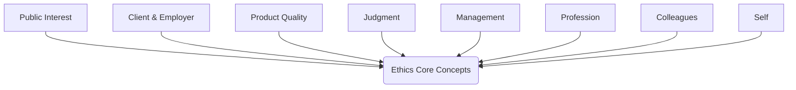
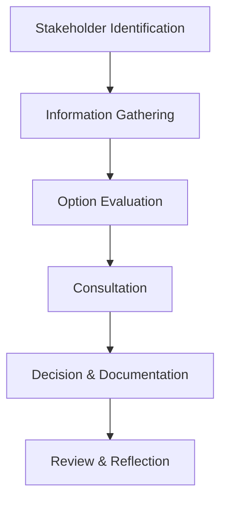
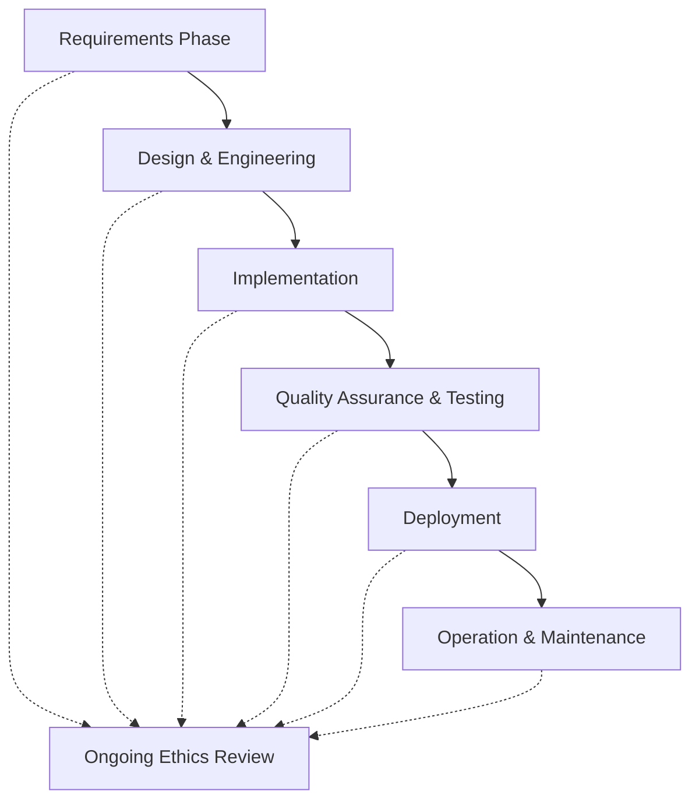

# Introduction to Software Engineering Ethics

Software engineering ethics encompasses the principles and standards governing the professional conduct of software engineers. These ethics address responsibilities to the public, clients, employers, and the profession itself, ensuring the integrity, reliability, and societal impact of software systems. As software-driven systems continue to permeate critical infrastructures and everyday life, ethical considerations have become an indispensable part of professional practice within computing and engineering disciplines.

Software engineering ethics are codified in various professional codes, international standards, and recommended practices, shaping the behavior, decision-making, and quality benchmarks engineers are expected to uphold.

---

## The Role of Ethics in Software Engineering

Ethics in software engineering refer to accepted moral principles that govern professional behavior throughout the software development lifecycle. Unlike technical requirements or specifications, ethical considerations are concerned with the impact of engineering decisions on individuals, organizations, and society at large. Ethical conduct is essential not only for social responsibility but also for maintaining public trust, safeguarding user interests, and mitigating risks arising from software malfunctions or misuse.

### Motivation for Ethical Practice

- **Societal Impact**: Software artifacts influence the operation of transportation, communications, healthcare, education, law, finance, and more. Unethical practices can have severe consequences, including harm to human life and welfare.
- **Professional Integrity**: Ethical conduct upholds the reputation of the engineering profession and fosters trustworthy relationships among stakeholders.
- **Legal and Regulatory Compliance**: Adherence to ethical codes often aligns with legal obligations, industry standards, and policy guidelines.

---

## Core Concepts and Principles

Software engineering ethics are grounded in several universal principles recognized by professional organizations and standardized codes of conduct. The most referenced frameworks include the IEEE/ACM Software Engineering Code of Ethics and Professional Practice, ISO/IEC standards, and broader engineering codes.

### Fundamental Principles

1. **Public Interest**
   - Prioritize the interests of society, the public, and the environment.
2. **Client and Employer**
   - Act in the best interests of clients and employers, consistent with the public interest.
3. **Product Quality**
   - Ensure that software products and modifications meet the highest professional standards possible.
4. **Judgment**
   - Maintain integrity and independence in professional judgment.
5. **Management**
   - Promote ethical approaches in software development and maintenance management.
6. **Profession**
   - Advance the integrity and reputation of the profession.
7. **Colleagues**
   - Support peers in ethical conduct.
8. **Self**
   - Participate in lifelong learning and promote ethical practices.

#### Mermaid Diagram: High-Level Ethics Principles Flow

---

## Codes of Ethics and Relevant Standards

Several professional associations and international bodies have codified software engineering ethics:

- **IEEE/ACM Software Engineering Code of Ethics and Professional Practice**: Provides detailed guidance for ethical decision-making within the discipline.
- **ISO/IEC 12207 (Software Life Cycle Processes)**: Defines processes supporting software engineering, referencing ethical obligations in stakeholder engagement and quality assurance.
- **ACM Code of Ethics and Professional Conduct**: Addresses broader issues within computing, including honesty, respect, and fairness.

These documents divide ethical duties into broad principles, sub-principles, and actionable responsibilities.

---

## Key Components of Software Engineering Ethics

### 1. Responsibility and Accountability

Engineers are personally responsible for their work's outcomes and the decisions taken during design, implementation, deployment, and maintenance. This includes:

- Addressing foreseeable risks and taking preventive actions.
- Reporting defects and system vulnerabilities promptly and transparently.
- Refusing to participate in projects with unreasonable risks to users or the public.

### 2. Integrity and Honesty

Ethical practitioners:

- Provide honest estimations, without concealing limitations or shortcomings.
- Accurately represent qualifications, experience, and the feasibility of technical solutions.
- Disclose conflicts of interest that could influence professional decisions.

### 3. Confidentiality and Privacy

Engineers frequently handle sensitive data or intellectual property. Ethical considerations include:

- Preserving the confidentiality of proprietary or classified information.
- Adhering to privacy laws and data protection acts, such as GDPR.

### 4. Quality, Safety, and Security

Engineers must ensure:

- Software is developed and maintained to minimize risks and maximize reliability, safety, and security.
- Robust processes for testing, validation, and verification.
- Compliance with applicable standards (e.g., ISO/IEC 25010 for software quality).

### 5. Respect for Intellectual Property

This covers:

- Compliance with software licensing agreements (e.g., GPL, MIT, Apache).
- Avoidance of plagiarism and proper attribution for third-party code or ideas.

### 6. Fairness and Non-Discrimination

Engineers should:

- Ensure systems do not propagate bias or discriminatory outcomes.
- Foster accessibility and inclusivity in software products.

---

## Ethical Decision-Making in Practice

Software engineers regularly face complex situations with significant ethical components. A structured approach to ethical decision-making improves outcomes and supports professional integrity.

### Typical Ethical Decision Workflow

1. **Identify Stakeholders and Interests**
   - Who is affected, and what are the relevant values?
2. **Gather Relevant Information**
   - Technical requirements, legal constraints, business objectives, and social or cultural expectations.
3. **Evaluate Potential Actions**
   - Consider options using established codes and principles.
4. **Consult with Peers or Supervisors**
   - Discuss ambiguous or high-impact issues collaboratively.
5. **Make and Document a Decision**
   - Record rationale, actions taken, and communicated messages.
6. **Review and Reflect Post-Action**
   - Assess outcomes and refine future practices.

#### Mermaid Diagram: Decision-Making Flow

---

## Common Scenarios and Ethical Challenges

| Scenario                          | Ethical Challenge                       | Common Pitfalls           |
|------------------------------------|-----------------------------------------|---------------------------|
| Security vulnerability disclosure  | Timely reporting vs. reputation risk    | Concealing or delaying disclosure |
| Project estimation                 | Balancing optimism and realism          | Overpromising, underestimating    |
| Handling user data                 | Privacy and consent                     | Storing or sharing without authorization |
| Intellectual property reuse        | License compliance                      | Plagiarism, license violations    |
| Automated decision-making systems  | Fairness and bias                       | Discriminatory outcomes, lack of transparency |

---

## Practical Engineering Considerations

### Integration Points

- **Policy alignment**: Ethical guidelines must be mapped to organizational policies, legal obligations, and technical processes.
- **Collaboration**: Interdisciplinary work with legal, security, and compliance teams is often required.
- **Tooling**: Support via static analysis tools, automated compliance checks, and secure development environments.

### Performance Implications

- **Trade-offs**: Stronger security and privacy features may increase computational cost or complexity.
- **Quality gates**: Ethical requirements may necessitate additional validation or review steps, impacting schedules.

### Implementation Challenges

- **Ambiguity**: Many ethical dilemmas have unclear or competing interests; not all scenarios are covered by codes.
- **Cultural Context**: Global teams may face differing legal, social, and ethical expectations.

### Common Pitfalls

- Overlooking indirect or downstream impacts of engineered systems.
- Prioritizing short-term goals or expedience over broader ethical obligations.
- Treating codes and checklists as sufficient without critical reflection.

> **GitHub Alert**
> **Warning:** Ethical oversights in software engineering can lead to legal action, loss of public trust, and significant harm. Engineers must proactively identify and address ethical risks at every stage of development.

---

## Summary Architecture of Ethical Software Engineering Practice

A high-level overview of how ethical considerations are embedded in software engineering processes:

---

## Conclusion

Ethics are fundamental to the responsible practice of software engineering. Engineers are entrusted by society to build robust, reliable, and safe systems, requiring not only technical competence but also an ongoing commitment to ethical standards. By adhering to established codes, applying structured decision-making processes, and maintaining vigilance in the face of evolving challenges, software engineers uphold the public good, foster trust, and advance the profession. Integrating ethical considerations within every phase of the software lifecycle is critical to achieving professional excellence in contemporary software engineering.