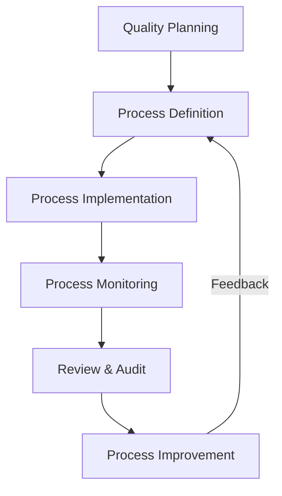
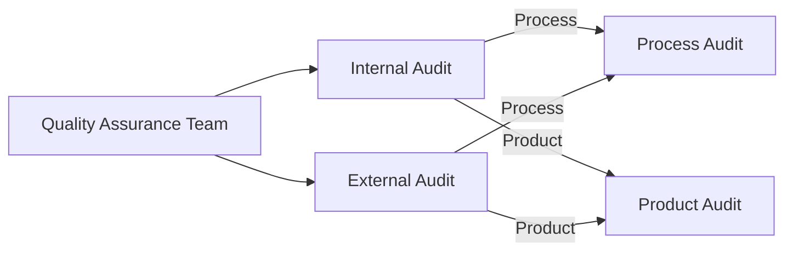
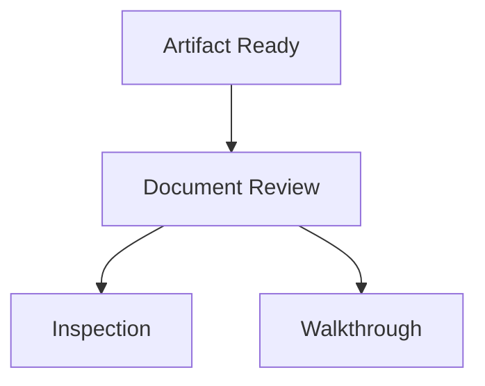
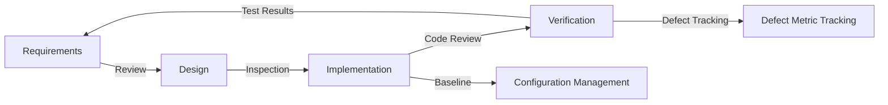

# Software Quality Assurance

## Introduction

Software Quality Assurance (SQA) refers to the set of systematic activities, planned and implemented within a software development process, to provide confidence that software products conform to specified requirements, standards, and procedures. SQA is a major area of the Software Engineering Body of Knowledge (SWEBOK) and an essential component of robust software engineering practice.

SQA encompasses the entire software development lifecycle, aiming to prevent defects with proactive methods. Core SQA activities include audits, reviews, inspections, process monitoring, and adherence verification. These activities complement, but are not limited to, software testing.

## Definition and Technical Context

SQA is defined by IEEE Std 730: "A planned and systematic pattern of all actions necessary to provide adequate confidence that an item or product conforms to established technical requirements."

SQA is considered a superset discipline, incorporating:

- _Process assurance_: Ensuring the correct software processes are followed.
- _Product assurance_: Verification and validation that software artifacts meet requirements.
- _Compliance assurance_: Demonstrating adherence to standards such as ISO/IEC 9001, ISO/IEC 12207, IEEE 730, or CMMI.

SQA applies to all stages of the software lifecycle: requirements, design, implementation, verification, release, and maintenance.

## Core Concepts and Key Components

### The SQA Framework

SQA is typically organized into a comprehensive framework comprising the following key elements:

- **Quality Planning**: Defining quality goals, metrics, and activities at project inception.
- **Quality Control**: Activities that monitor and verify software artifacts and processes.
- **Quality Assurance**: Systematic process-based strategies for process improvement, conformance evaluation, and defect prevention.

#### SQA Process Overview

_SQA Process Flow: Quality Planning through Continuous Process Improvement_

### SQA Roles and Responsibilities

- **SQA Team/Group**: Responsible for defining, planning, and auditing quality processes.
- **Project Management**: Accountable for integrating SQA into project plans.
- **Developers/Technical Staff**: Responsible for adhering to standards and participating in reviews.
- **Auditors**: Independently verify process and product conformance.

### Quality Processes and Techniques

**Key SQA techniques** include, but are not limited to:

1. **Audits**
2. **Reviews**
3. **Inspections**
4. **Walkthroughs**
5. **Verification & Validation (V&V)**
6. **Configuration Management**
7. **Defect Prevention and Tracking**
8. **Metrics Collection and Analysis**

Each is described below.

---

## SQA in Practice

### Quality Planning

Quality planning establishes the necessary SQA activities and measurable quality objectives. Quality planning typically involves:

- Identifying applicable standards (e.g., ISO 9001, ISO 25010, IEEE 730).
- Defining software requirements and quality criteria.
- Selecting appropriate metrics (e.g., defect density, mean time to failure).
- Determining audit and review schedules.

**Engineering Consideration:** Poor upfront planning results in misaligned quality goals and introduces ambiguity in conformance measurement.

### Standards and Process Definition

Organizations define SQA processes via quality management frameworks, standards, and documented procedures:

- **Standards:** ISO/IEC 9001 (Quality Management), ISO/IEC 12207 (Software Lifecycle Processes), IEEE 730 (Software Quality Assurance Plans).
- **Models:** Capability Maturity Model Integration (CMMI) provides frameworks for process improvement, mapping SQA activities to levels of organizational maturity.

### Audits

**Software audits** are independent assessments to ensure that software processes and artifacts conform to specified standards and policies.

#### Types of Audits

- **Internal Audits**: Performed by the development organization.
- **External Audits**: Conducted by customers, certifying agencies, or regulatory bodies.
- **Process Audits**: Examine adherence to defined processes.
- **Product Audits**: Examine delivered artifacts (e.g., code, documentation, binaries).

_Audit Taxonomy in SQA_

**Typical Steps:**

1. **Preparation**: Define scope, objectives, and checklists.
2. **Execution**: Collect evidence and compare with requirements.
3. **Reporting**: Document findings, non-conformances, and recommendations.
4. **Follow-up**: Verify corrective actions.

> :warning: **Caution:** Audits should be independent to prevent bias and ensure objectivity.

#### Common Audit Pitfalls

- Incomplete or outdated checklists
- Non-actionable audit findings
- Lack of follow-up on corrective actions
- Overemphasis on documentation over substantive assessment

### Reviews, Inspections, and Walkthroughs

**Reviews** are peer-based processes for evaluating software artifacts, often before formal testing begins. Types include requirements reviews, design reviews, code reviews, and test plan reviews.

**Inspections** are rigorous, formalized review techniques with predefined roles (moderator, reader, recorder, author) and checklists. They focus on defect detection and removal.

**Walkthroughs** are less formal; the author leads team members through an artifact to solicit feedback.

_Artifact Evaluation Path: Reviews, Inspections, and Walkthroughs_

**Engineering Note:**
- Efficient SQA teams often standardize checklists and review templates.
- Modern tools enable online, asynchronous code reviews and artifact annotation.

### Verification and Validation (V&V)

**Verification** checks whether the software product is being built correctly according to specifications.

**Validation** checks whether the right product is being built for the users' needs.

V&V are not restricted to testing but include activities throughout the lifecycle, such as requirements analysis, design review, static analysis, and acceptance testing.

_V&V Traceability from Specification to User Needs_

> :bulb: **Tip:** Integrating verification steps into daily development (e.g., via CI pipelines) can rapidly surface defects.

### Configuration Management

SQA relies on effective configuration management (CM) to ensure traceability, reproducibility, and control of software artifacts.

Core CM activities include:

- Version control (e.g., Git, Subversion)
- Baseline management
- Change control and approval processes
- Build management

Proper CM underpins all SQA activities by providing accurate audit trails and artifact integrity.

### Metrics Collection and Analysis

SQA effectiveness is highly dependent on quantifiable data.

**Common SQA Metrics:**

| Metric               | Purpose                           | Example Tool/Context       |
|----------------------|-----------------------------------|---------------------------|
| Defect Density       | Track quality over time           | Bug tracker, code scans   |
| Mean Time to Failure | Operational reliability           | Reliability testing       |
| Requirements Coverage| Completeness                      | Test management tool      |
| Review Effectiveness | Process improvement               | Review platforms, logs    |

Data collection should be automated wherever possible, and must include feedback into planning and improvement processes.

---

## SQA Lifecycle and Workflow Integration

SQA activities are embedded into the standard software lifecycle. The following diagram illustrates typical integration points.

_SQA Activities Embedded in the Software Development Lifecycle_

**Workflow Integration Considerations:**

- **Continuous Integration/Continuous Deployment (CI/CD):** SQA practices can be partially automated in pipelines (e.g., static analysis, automated tests, artifact traceability).
- **Agile and DevOps:** SQA must adapt to incremental, iterative delivery; practices such as story acceptance criteria, sprint reviews, and Definition of Done become crucial.
- **Regulated Domains:** In safety-critical or compliance-driven contexts (e.g., medical, automotive), SQA activities and artifact retention become legally enforceable.

---

## Practical Engineering Considerations

### Integration Points

- **Toolchain Integration:** SQA tools must integrate seamlessly with development environments, version control, and issue trackers.
- **Process Tailoring:** Overly rigid SQA processes can impede agility and increase overhead, whereas insufficient rigor increases risk.
- **People and Training:** The effectiveness of SQA depends as much on skilled practitioners and a culture of quality as on documented processes.

### Performance Implications

- **Efficiency vs. Thoroughness:** High-assurance systems require more thorough SQA (manual inspections, formal methods), which affects delivery timelines and project cost.
- **Automation:** Automating quality checks (e.g., code style, static analysis, build verification) boosts efficiency but cannot replace human judgment in complex reviews.
- **Scalability:** SQA approaches must scale from small teams (lightweight processes) to large projects (formal reviews, dedicated SQA groups).

### Implementation Challenges

- **Resistance to Change:** Teams may perceive SQA as bureaucratic or intrusive; successful adoption depends on buy-in and demonstrated value.
- **Artifact Overhead:** Excessive documentation requirements can be burdensome. SQA artifacts should be right-sized and focused on actionable outcomes.

### Common Pitfalls

- **Checklist Fatigue:** Long, generic checklists diminish review effectiveness; custom-tailored, concise lists are preferable.
- **Superficial Conformance:** Compliance "in name only"—meeting the letter but not the spirit of standards—defeats the purpose of SQA.
- **Isolated SQA Teams:** SQA must be integrated, not siloed; close collaboration with developers and stakeholders yields better results.

> :warning: **Caution:** SQA is not a substitute for robust software testing. Both must be applied in concert to achieve required assurance levels.

---

## SQA in Different Domains and Development Models

### Waterfall vs. Iterative/Agile

- **Waterfall**: SQA often formalized, with explicit phase-gate reviews and documentation.
- **Agile/DevOps**: SQA practices distributed throughout iterations—peer reviews, automated checks, and frequent demos take precedence over heavyweight documentation.

### Industry-Specific SQA Requirements

- **Safety-Critical** (e.g., aerospace, medical, automotive):
  - Adherence to standards such as DO-178C, IEC 62304, ISO 26262.
  - SQA evidence (traceability matrices, audit records) may be subject to regulatory review.
- **Enterprise/Consumer Software**:
  - SQA is often balanced for speed-to-market vs. maintainability and SLA requirements.

---

## Summary

Software Quality Assurance is an integral, process-driven discipline in professional software engineering, encompassing all lifecycle activities aimed at achieving and demonstrating confidence in software products. Through systematic planning, reviews, audits, verification activities, and continuous process improvement, SQA reduces risks, prevents defects, and fosters compliance with both internal standards and external regulations.

**Key Points for Engineers:**

- SQA is comprehensive: it covers the who, what, when, and how of quality, not just testing.
- SQA activities must be tailored to organizational context, project scale, and domain risks.
- Effective integration with development workflows and toolchains is critical.
- Automation enhances efficiency, but human judgment remains essential, especially for complex requirements.
- A sustained culture of quality, enabled by SQA, improves both immediate project outcomes and long-term organizational capability.

---

> :information_source: **Note:** Diagram to be added later: Example SQA Metrics Dashboard for Project Oversight.