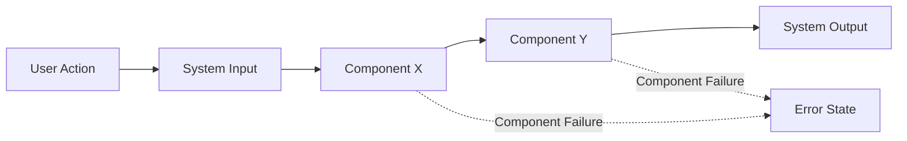
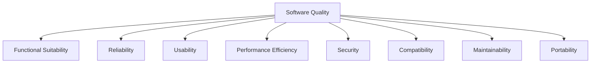
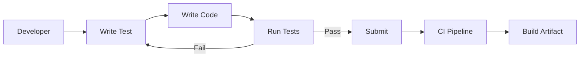
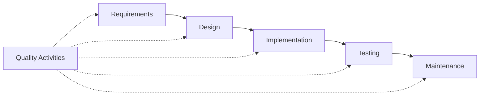

# Software Quality Fundamentals

## 1. Introduction

Software quality is a multidimensional concept that encompasses the degree to which a software product fulfills specified requirements, satisfies user needs, and is robust against failure, change, and unforeseen circumstances. The discipline of software quality covers processes, metrics, standards, and best practices to ensure that software systems are reliable, correct, robust, and maintainable throughout their life cycle.

Understanding software quality is essential for engineers, as decisions made during architecture, design, implementation, and maintenance directly impact the delivered quality attributes. This primer introduces software quality fundamentals, focusing on the related core concepts and their practical engineering implications.

## 2. Definition and Context

### 2.1. What Is Software Quality?

Software quality is the degree to which a software product meets both its functional and non-functional requirements. It is evaluated based on:

- **Conformance to specification** (does it do what is required?)
- **Fitness for use** (does it satisfy actual user needs and expectations?)

It applies to all software artifacts, spanning source code, binaries, documentation, configurations, and deployment blueprints.

### 2.2. Place in the Software Engineering Body of Knowledge (SWEBOK)

Within SWEBOK, software quality is a foundational aspect that interacts with all major knowledge areas:

- **Software requirements and design**
- **Coding and construction**
- **Testing and maintenance**
- **Quality assurance and process improvement**

Quality considerations must be addressed holistically and continuously through all phases of software engineering.

---

## 3. Core Quality Concepts

Modern software quality frameworks decompose overall product quality into key sub-characteristics, typically following international standards such as ISO/IEC 25010.

### 3.1. Correctness

**Correctness** refers to the extent that software conforms to its specified functional requirements.

- **Key Focus**: Does the system produce the expected outputs for valid inputs under stated preconditions?
- **Assessment Criteria**:
  - Satisfaction of use cases and user stories
  - Conformance to formal specifications or contracts
  - Pass rate of functional test cases

Correctness forms the basis of validating software, but correctness alone is not sufficient for overall quality.

### 3.2. Reliability

**Reliability** is the probability that software will function without failure under stated conditions for a specified period.

- **Key Focus**: How consistently and predictably does the system operate?
- **Assessment Criteria**:
  - Mean Time Between Failures (MTBF)
  - Failure rate in operational environments
  - Recovery from transient faults

#### Reliability Block Diagram (Mermaid)

### 3.3. Robustness

**Robustness** is the ability of software to function correctly in the presence of invalid inputs or stressful environmental conditions.

- **Key Focus**: Can the system handle unexpected or extreme conditions gracefully?
- **Assessment Criteria**: 
  - Error handling and exception safety
  - Boundary condition management
  - Failsafe behavior under load, resource constraints, or misuse

### 3.4. Maintainability

**Maintainability** refers to the ease with which software can be modified to correct faults, improve performance, or adapt to new requirements.

- **Key Focus**: How efficiently can engineers update, fix, and evolve the system?
- **Assessment Criteria**:
  - Modularity and code organization
  - Readability and documentation quality
  - Testability and ease of verification
  - Dependency management

---

## 4. Software Quality Models and Standards

### 4.1. ISO/IEC 25010

The [ISO/IEC 25010](https://iso.org/standard/35733.html) international standard defines a model for software product quality and system quality in use, listing key characteristics and sub-characteristics:

- Functional suitability (includes correctness)
- Reliability
- Usability
- Performance efficiency
- Security
- Compatibility
- Maintainability
- Portability

#### Mermaid Diagram: Quality Characteristics Relationships

### 4.2. IEEE 730: Software Quality Assurance Plans

The IEEE 730 standard describes elements for quality assurance (QA) processes and documentation required for software projects, reinforcing systematic planning of quality activities.

### 4.3. Other Relevant Standards

- **ISO 9001:** Quality management systems—with applications to software organizations.
- **CMMI for Development:** Maturity models for process improvement and quality management.

---

## 5. Defining and Measuring Quality

### 5.1. Quality Requirements and Non-Functional Requirements (NFRs)

Non-functional requirements (NFRs) specify quality goals such as performance, usability, and reliability, complementing functional requirements.

#### Example NFRs Table

| Requirement Type  | Example Statement                                        |
|-------------------|---------------------------------------------------------|
| Reliability       | "System uptime must be at least 99.95% per year."       |
| Maintainability   | "All modules must have cyclomatic complexity < 10."     |
| Robustness        | "All API endpoints return meaningful error codes."       |
| Correctness       | "Output must match the business rules specification."   |

### 5.2. Quality Metrics

To objectively assess software quality, projects use established metrics, such as:

- **Defect Density**: Defects per KLOC (thousand lines of code)
- **Code Coverage**: Percent of code exercised by automated tests
- **MTTR/MTTF**: Mean Time To Repair/Failure
- **Cyclomatic Complexity**: Structural code complexity
- **Change Failure Rate**: Percentage of deployments causing failures

### 5.3. Quality Assurance (QA) vs. Quality Control (QC)

- **QA**: Process-oriented, focusing on building quality into the product through standards, reviews, and practices.
- **QC**: Product-oriented, focusing on inspection and testing to detect defects.

---

## 6. Key Engineering Workflows for Quality

### 6.1. Verification and Validation (V&V)

- **Verification:** Ensures the product is built correctly (conforms to specs).
- **Validation:** Ensures the right product is built (meets user needs).

### 6.2. Test-Driven Development (TDD) and Continuous Integration (CI)

- **TDD:** Writing test cases before code to ensure correctness and improve maintainability.
- **CI:** Automated build and test cycles on each integration to catch quality issues early.

### 6.3. Code Review and Static Analysis

- **Peer Review:** Manual inspection of code for correctness, style, and maintainability.
- **Static Analysis Tools:** Automated checks for defects, vulnerabilities, and code smells.

### 6.4. Quality Gates in DevOps Pipelines

Quality gates are automated enforcements at key stages (commit, merge, deploy) to control what build artifacts advance through the pipeline, based on specified quality thresholds.

---

## 7. Common Constraints and Assumptions

- **Resource Constraints:** CPU, memory, network limits can impact performance and robustness.
- **Evolving Requirements:** Business/domain changes require maintainable and adaptable software.
- **Human Factors:** Quality is also dependent on developer skills, tooling, and culture.
- **Legacy Systems:** Integration or migration can introduce quality risks from older architectures.

---

## 8. Typical Variations and Trade-Offs

### 8.1. Overemphasis on a Single Quality Aspect

Focusing solely on one attribute (e.g., performance) may compromise others (e.g., maintainability).

### 8.2. Contextual Prioritization

- High-reliability environments (e.g., aviation, healthcare) may require formal verification and extensive testing.
- Startups may prioritize fast iterations over exhaustive quality processes.

### 8.3. Technical Debt

Intentional compromises for rapid delivery may accumulate deferred quality work (technical debt), which must be monitored and eventually resolved to maintain long-term system health.

---

## 9. Practical Considerations and Pitfalls

> **:warning: Alert:**  
> Failing to enforce quality criteria in early design and requirements phases often results in significant downstream costs and reduced maintainability.

### 9.1. Integration Points

- **APIs and Interfaces:** Strict conformance to contracts is critical for correctness and robustness.
- **Third-Party Dependencies:** Quality of upstream components directly affects your software.

### 9.2. Performance Implications

- Excessive abstraction and indirection can reduce maintainability but may also impact run-time performance.
- Defensive programming and runtime checks improve robustness but may incur overhead.

### 9.3. Implementation Challenges

- **Ambiguous Requirements:** Lead to inconsistent interpretations and correctness issues.
- **Incomplete Test Coverage:** High-risk areas remain undetected without comprehensive testing.
- **Insufficient Error Handling:** Can compromise robustness and reliability, especially in distributed systems.

### 9.4. Common Pitfalls

- Neglecting documentation, hindering maintainability.
- Overreliance on manual testing, missing subtle defects.
- Misinterpreting "works on my machine" as a sign of reliability.

---

## 10. Software Quality Life Cycle Integration

Software quality is not an afterthought; it must be embedded into all software process activities:

---

## 11. Summary Table: Mapping Core Quality Attributes to Practices

| Quality Attribute    | Typical Practices                       | Relevant Metrics            |
|----------------------|-----------------------------------------|-----------------------------|
| Correctness          | Unit/integration tests, code review     | Test pass rate, defects found|
| Reliability          | Fault injection, monitoring, redundancy | MTBF, failure rate          |
| Robustness           | Input validation, exception handling    | Number of unhandled errors  |
| Maintainability      | Code modularity, documentation, refactor| Change lead time, complexity|

---

# 12. Conclusion

A high-quality software system meets explicit requirements, remains dependable under adverse conditions, and is cost-effective to maintain and evolve. Quality attributes such as correctness, reliability, robustness, and maintainability serve as benchmarks for engineering practices, architectural decisions, and process choices. Adherence to quality standards, rigorous measurement, and incorporation of quality activities throughout the software development life cycle are essential to deliver resilient and adaptable software solutions. 

Understanding and applying these software quality fundamentals will enable engineers to build software systems that not only work as intended, but can also be trusted and sustained over time.