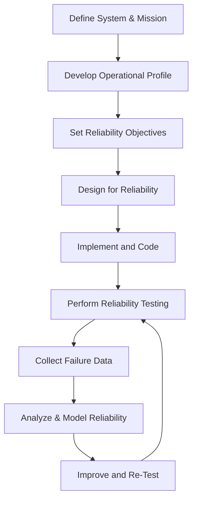
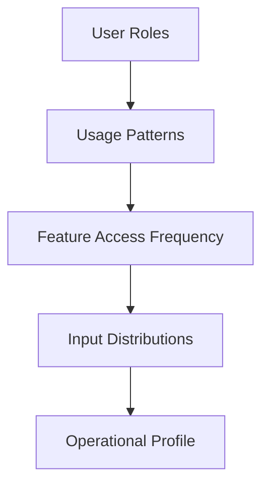
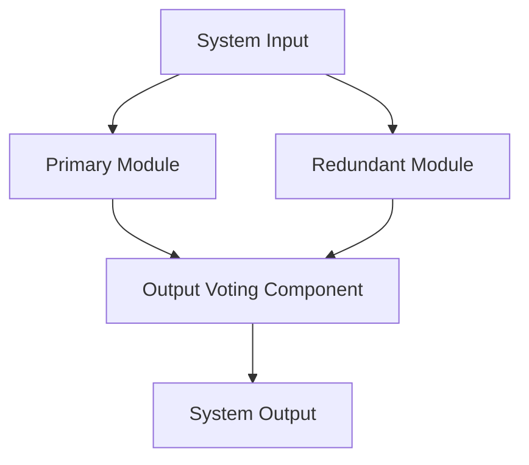
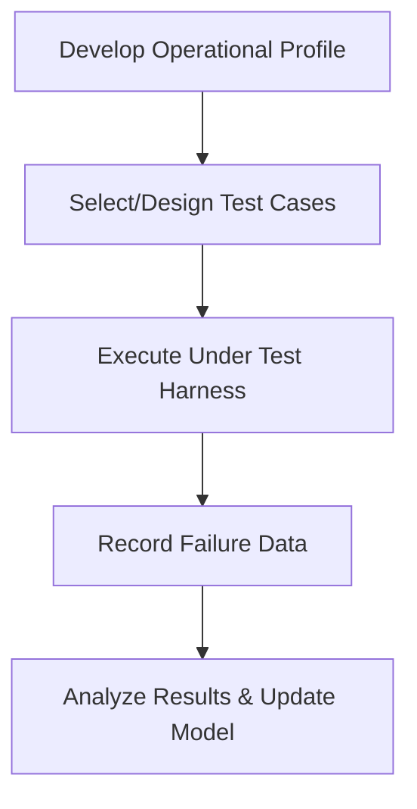

# Software Reliability Engineering

## 1. Introduction and Definition

Software Reliability Engineering (SRE) is a systematic discipline concerned with evaluating, predicting, and improving the reliability of software systems. Reliability, in a software context, is defined as the probability that software will function without failure under specified conditions for a designated period of time. Unlike hardware, where failures are usually attributed to physical degradation, software failures mostly stem from latent faults in design, implementation, or environment interactions.

SRE as a subfield emerged in research and mission-critical industries such as aerospace, defense, embedded systems, telecommunications, medical devices, and financial infrastructure, where failure consequences are severe. Today, SRE practices are equally relevant for safety-critical, enterprise-grade, high-availability, and consumer software systems at scale.

Software Reliability Engineering draws from the fields of probability, statistics, quality assurance, software process engineering, systems engineering, and formal methods. It is differentiated from general software quality engineering by its specific, quantitative focus on failure behavior and operational dependability of software over time.

## 2. Core Concepts and Terminology

### 2.1 Reliability

**Reliability (R(t))** is defined as the probability that software operates without failure for a time interval `[0, t)` under specified conditions:

\[
R(t) = P(\text{no failure in } [0, t))
\]

### 2.2 Failure, Fault, and Error

- **Failure:** The observable non-conformance of software to its specified behavior.
- **Fault (Defect/Bug):** A latent defect or bug in software that may cause a failure during execution.
- **Error:** The incorrect internal state that can result from a fault and may lead to failure.

### 2.3 Mean Time Metrics

- **Mean Time to Failure (MTTF):** Expected time to the first (or next) failure.
- **Mean Time to Repair (MTTR):** Expected time to restore service after failure.
- **Mean Time Between Failures (MTBF):** Time between successive failures; typically, MTBF = MTTF + MTTR.

### 2.4 Fault Tolerance

Refers to techniques that ensure continued service in spite of failures (e.g., redundancy, error detection/correction, graceful degradation).

### 2.5 Operational Profile

A statistical representation of how users interact with the system, encompassing input distributions, feature usage frequencies, and environmental characteristics. The operational profile models realistic software usage and is essential for accurate reliability assessment.

### 2.6 Failure Intensity

The frequency of failures per unit time, typically denoted as λ (lambda). Reducing failure intensity is a core objective of SRE.

## 3. SRE Process Overview

Software Reliability Engineering is a quantitative, iterative process that typically involves the following high-level steps:

**Figure:** SRE Process Lifecycle

- The process is iterative, especially during testing, modeling, and improvement cycles.

## 4. Reliability Modeling and Prediction

### 4.1 Objectives

Reliability modeling seeks to provide quantitative predictions of software reliability, guide engineering improvements, and support critical release decisions.

### 4.2 Classifications of Models

- **Black-Box Models:** Treat the software as an opaque system, using external failure data to fit statistical models (e.g., Musa model, Jelinski-Moranda model).
- **White-Box Models:** Leverage knowledge of software structure, such as control flow and module interactions, to predict reliability from the inside (e.g., path-based, architecture-based models).

#### Table: Model Types and Contexts

| Model Type      | Inputs          | Typical Use Cases                        |
|-----------------|----------------|------------------------------------------|
| Black-Box       | Failure logs    | System-level reliability prediction      |
| White-Box       | Code structure, module reliability | Component-based systems     |
| Hybrid          | Both            | Mixed-criticality, complex architectures |

### 4.3 Common Black-Box Reliability Growth Models

#### Musa-Okumoto Model

A widely used nonhomogeneous Poisson process (NHPP) model where failure intensity decreases exponentially as faults are removed.

\[
\lambda(t) = \lambda_0 e^{-\theta t}
\]

Used to estimate:
- Number of inherent faults
- Expected failure rate at future points

#### Jelinski-Moranda Model

Assumes a fixed (initially unknown) number of faults in software, each independent and equally likely to cause a failure.

\[
\lambda_n = \phi (N - n + 1)
\]

Where:
- \( N \): Initial number of faults
- \( n \): Number of observed failures
- \( \phi \): Per-fault hazard rate

#### Goel-Okumoto Model

Another NHPP model similar to Musa-Okumoto but uses a different mathematical approach to model failure rates over time.

### 4.4 Data Requirements

Accurate reliability modeling requires detailed, time-stamped failure/incident logs mapped to usage time or operation count (CPU seconds, transaction count, etc.).

> [!CAUTION]
> Unrepresentative test data, incomplete operational profiles, or measurement artifacts may lead to unreliable model predictions.

## 5. Operational Profiles and Realistic Testing

### 5.1 Purpose

Operational profiles bridge the gap between laboratory test cases and field usage, allowing reliability measurements and predictions to reflect actual operational risk.

### 5.2 Construction Steps

1. Identify user roles and usage environments.
2. List principal functions and their usage frequencies.
3. Determine input distributions for each function.
4. Model transitions and dependencies between usage patterns.

**Figure:** Operational Profile Construction

### 5.3 Role in Testing

Test cases should be exercised in proportion to the operational profile. This ensures that highly-used functions are stressed more during reliability testing, directly tying failure intensity metrics to operational risk.

## 6. Analysis and Metrics

### 6.1 Failure Data Collection

Key elements:
- Time of failure occurrence (wall time, CPU hours, transactions)
- Failure type/severity
- State and context (inputs, configuration, environmental variables)

### 6.2 Key Reliability Metrics

| Metric                         | Description                                 |
|--------------------------------|---------------------------------------------|
| **Failure Intensity (λ)**      | Failures per unit time                      |
| **Reliability Function R(t)**  | Probability of zero failures in [0, t)      |
| **Availability (A)**           | Fraction of time system is operational      |
| **Defect Density**             | Faults per KLOC (thousand lines of code)    |
| **Uptime/Downtime**            | Aggregated operational/non-operational time |
| **Service Level Objective (SLO)** | Targeted availability/reliability goal      |

> [!TIP]
> In safety- or mission-critical systems, failure rate metrics are often reported in failures per billion (10^9) hours.

### 6.3 Reporting and Visualization

- Reliability growth curves (failure intensity over testing time)
- MTBF tracking over multiple releases
- Confidence intervals for reliability metrics

**Note**: Diagram to be added later showing a generic "Reliability Growth Curve".

## 7. Fault Tolerance and Error Handling

### 7.1 Principles

Fault tolerance aims to provide system service continuity in the presence of faults and is achieved through architectural and implementation-level techniques.

### 7.2 Common Patterns

- **Watchdog Timers:** Detect and recover from hangs or stuck loops.
- **Error Detection/Correction:** Checksums, assertions, and redundancy techniques.
- **Graceful Degradation:** Partial service delivery during component failure.
- **N-Version Programming:** Independent simultaneous implementation of the same specification, with output voting.

**Figure:** N-Version Programming Pattern in Fault-Tolerant Software

> [!WARNING]
> Fault tolerance introduces complexity. Inadequate error propagation handling or weak isolation between redundant modules may negate reliability gains.

## 8. Engineering for Reliability

### 8.1 Design-Time Techniques

- **Defensive Programming:** Anticipate and guard against unexpected inputs and states.
- **Error Isolation:** Use component boundaries, process isolation, and sandboxing.
- **Fail-Safe Defaults:** Default to safe or failsafe modes on error.
- **Formal Methods:** Apply specification, modeling, and automated verification for key functions (see ISO/IEC/IEEE 24765).

### 8.2 Implementation Strategies

- Rigorous static analysis, dynamic analysis, and code reviews targeting reliability-impacting defects.
- Adherence to coding standards for reliability (e.g., MISRA for C, CERT Secure Coding for C/C++, ISO/IEC 26262 for functional safety).

### 8.3 Testing Methods

- **Reliability Testing:** Repeated, extended operation under operational profile conditions to induce failures.
- **Stress/Load Testing:** Test under extreme load or resource exhaustion to observe fault modes.
- **Fault Injection:** Deliberate introduction of faults (e.g., simulated exceptions, memory failures).
- **Regression Testing:** Continuously test previously fixed defects.

**Figure:** Workflow of Reliability-Focused Testing

## 9. Standards and Models in SRE

### 9.1 International Standards

- **IEEE 1633:** Recommended Practice on Software Reliability
- **ISO/IEC/IEEE 24765:** Systems and software engineering — Vocabulary
- **IEC 61508/ISO 26262:** Safety-related systems standards, including software reliability requirements
- **DO-178C:** For airborne systems, with reliability and assurance practices
- **ISO/IEC 9126 / ISO/IEC 25010:** Software product quality models, with reliability as a key attribute

### 9.2 Industry Practice

Adherence to sector-specific standards frequently dictates reliability assurance methods, reporting, and SRE process maturity.

## 10. Practical Engineering Considerations

### 10.1 Integration Points

- **CI/CD:** Integrate reliability tests in continuous integration pipelines for early defect discovery.
- **Monitoring/Observability:** Employ production-grade logging, metrics collection, and alerting for in-field reliability data.
- **Incident Management:** Tightly couple SRE with incident response/remediation processes.

### 10.2 Performance Implications

- Some reliability mechanisms (e.g., redundancy, comprehensive logging) can add overhead. Balancing reliability with performance and resource consumption is critical.
- Real-time and embedded systems require tailored approaches due to strict resource limits.

### 10.3 Implementation Challenges

- Accurately capturing representative operational profiles is non-trivial, especially in evolving or multi-tenant systems.
- The "long-tail" effect: infrequent but severe failures are often the hardest to model and mitigate.

> [!NOTE]
> Post-release metrics and field data are vital for refining reliability models and predicting future behavior, especially in iterative/agile development.

### 10.4 Common Pitfalls

- Over-reliance on superficial test coverage instead of operational profile-based testing.
- Failure to treat reliability as an end-to-end (system-wide) concern, leading to vulnerable integration points.
- Underestimating the impact of software configuration errors and environmental dependencies.

## 11. Variations and Advanced Topics

### 11.1 Architectural Reliability Analysis

- **Component-based Models:** Assess independent module/component reliabilities to infer system-level reliability via architectural diagrams, Markov models, or dependency graphs.

**Note**: Diagram to be added later illustrating "Component Dependency Graph for System Reliability".

### 11.2 Microservices and Cloud-Native Reliability

- Distributed, loosely-coupled systems introduce new reliability challenges, e.g., network partitions, eventual consistency, cascading failures.
- Resilience patterns (circuit breakers, bulkheads) and chaos engineering extend SRE principles to dynamic, elastic architectures.

### 11.3 Machine Learning in Reliability

- Predictive analytics for incident forecasting and automated anomaly detection.
- Application of AI/ML to failure classification and root cause analysis.

## 12. Summary

Software Reliability Engineering is an integrated, quantitative discipline vital to the development and operation of dependable software systems. By employing operational profiles, rigorous reliability modeling, empirical failure data, and robust architectural/implementation techniques, engineers can systematically predict, measure, and improve system reliability. Adopting SRE practices in both critical and large-scale systems is essential to mitigate operational risk and meet stringent dependability requirements, as codified in industry standards and best practice frameworks.

---

*This technical primer provides a high-level, structured introduction; further depth is available in domain-specific literature and referenced standards.*