# Requirements Elicitation Techniques

## 1. Introduction

Requirements elicitation is a foundational activity in software and systems engineering. It involves systematically identifying, capturing, and clarifying the needs and constraints of stakeholders, systems, and contextual environments. The process aims to produce a clear, complete, and accurate set of requirements that will direct subsequent architectural, design, and development efforts.

Requirements elicitation is a subdomain of requirements engineering, which also includes analysis, specification, validation, and management. Effective elicitation reduces the likelihood of system failures arising from misunderstood or missing requirements and aligns delivered solutions with stakeholder expectations.

## 2. Technical Context

Requirements elicitation is performed at the early stages of the software development lifecycle (SDLC), as outlined by frameworks such as SWEBOK (Software Engineering Body of Knowledge) and methodologies including waterfall, iterative, and agile models. Regardless of methodology, failure to conduct proper elicitation can propagate errors that become costlier to correct in later stages.

Elicitation not only gathers requirements directly from end users but also investigates relevant regulations, standards, existing systems, and business objectives. Stakeholders may include customers, users, domain experts, business analysts, regulators, and technical teams.

## 3. Core Concepts

### 3.1 What is Elicitation?

Elicitation encompasses activities and techniques used to discover, extract, and refine requirements from all available sources. This requires more than passive collection—engineers must actively engage, interpret, question, and corroborate stakeholder input. Elicitation bridges the gap between what stakeholders think they need, what they want, and what is technically feasible.

### 3.2 Sources of Requirements

- **Stakeholders:** Individuals or organizations affected by or having influence over the system.
- **Existing Systems:** Current operational systems and legacy platforms.
- **Business Processes:** Documents and workflows underlying the organization.
- **Domain Constraints:** Industry regulations, standards, and technical limitations.

### 3.3 Functional and Non-Functional Requirements

Both functional (what the system should do) and non-functional (how the system performs or is constrained) requirements must be elicited.

- **Functional:** features, data, operations, interactions.
- **Non-Functional:** performance, reliability, security, compliance, usability.

## 4. Elicitation Techniques Overview

There is no universal technique suitable for every project; often, a combination is used to maximize coverage and accuracy. The most commonly applied techniques are:

- Interviews
- Workshops
- Observation
- Document Analysis
- Surveys and Questionnaires
- Prototyping
- Brainstorming
- Use Case and Scenario Modelling
- Reverse Engineering
- Focus Groups

### 4.1 Technique Selection Criteria

Selecting appropriate techniques depends on:

- Project size and complexity
- Organizational culture
- Stakeholder availability and diversity
- Regulatory environment
- Time and budget constraints

**Tip**
> Combine complementary techniques to mitigate risks of incomplete, erroneous, or biased requirements.

## 5. Description of Main Techniques

### 5.1 Interviews

#### Definition

A systematic, goal-oriented conversation with stakeholders to gather detailed information. Interviews may be structured (scripted), semi-structured (guided), or unstructured (open-ended).

#### Workflow

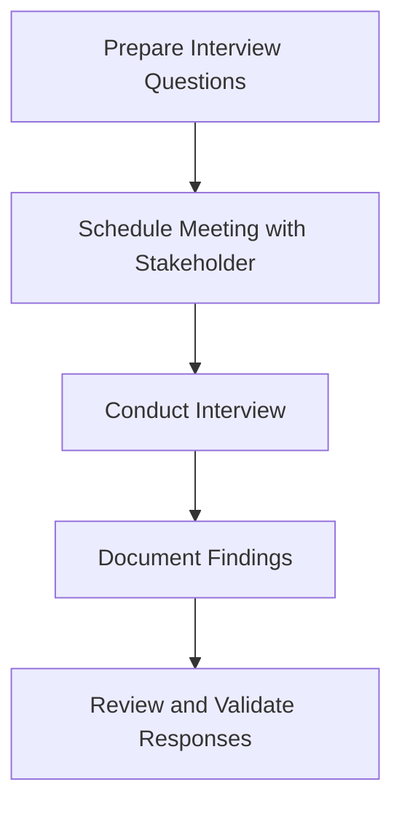

#### Engineering Considerations

- Select subject-matter experts relevant to system context.
- Avoid leading questions; aim for open-ended dialogue.
- Record or transcribe sessions for traceability.
- Use checklists to ensure topic coverage.

**Caution**
> Interview bias, poor note-taking, or lack of stakeholder engagement can lead to inaccurate requirements.

---

### 5.2 Workshops

#### Definition

Collaborative group sessions involving stakeholders and project team members to elicit, consolidate, and prioritize requirements interactively (also known as JAD—Joint Application Development sessions).

#### Workflow

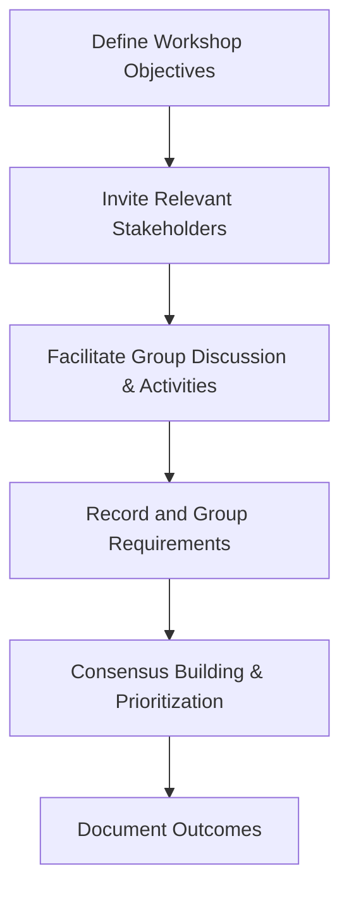

#### Engineering Considerations

- Assign a skilled facilitator to control discussion and resolve conflicts.
- Use visual aids (whiteboards, sticky notes, diagrams) to foster engagement.
- Workshops are effective for resolving ambiguities and prioritizing features but require careful time and participant management.

---

### 5.3 Observation

#### Definition

Studying end-user behavior in the operational environment to uncover implicit needs and workflow issues.

#### Types

- **Passive Observation:** Watch users perform their tasks.
- **Active Observation:** Participate or simulate the role of the user.

#### Workflow

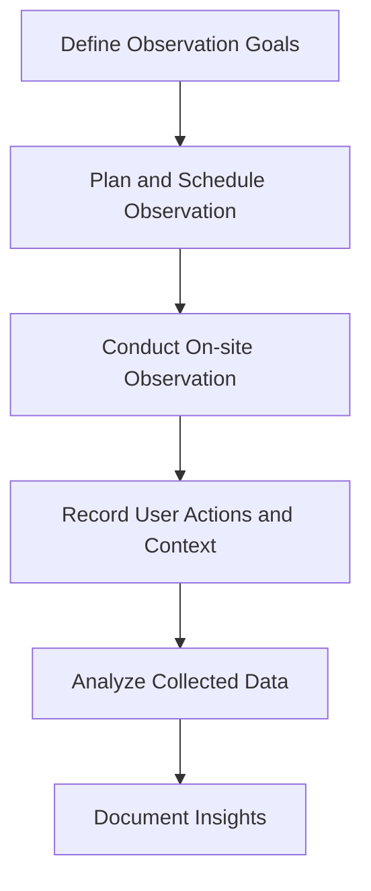

#### Engineering Considerations

- Non-intrusive techniques yield more natural behaviors.
- Ethical considerations: always inform observed parties.
- May uncover tacit knowledge not articulated in interviews.

---

### 5.4 Document Analysis

#### Definition

Reviewing existing documentation—such as system manuals, process flows, contracts, solution architectures—to extract requirements and constraints.

#### Typical Documents

- Business process documentation
- Policy manuals
- Technical specifications
- Legal and compliance documents

#### Workflow

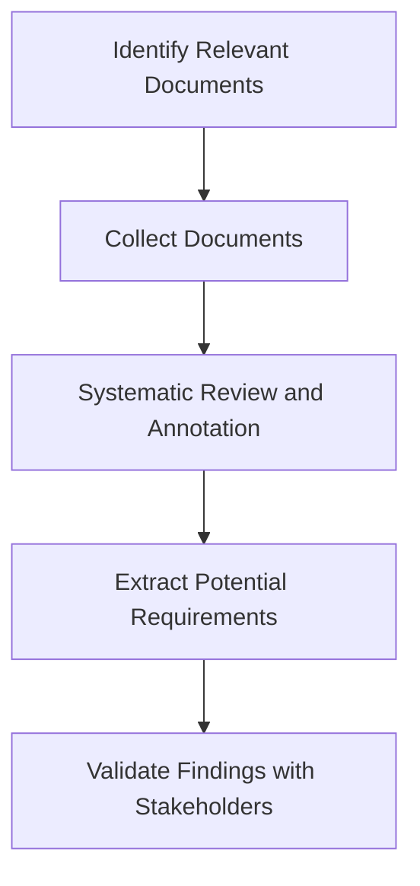

#### Engineering Considerations

- Ensures legal, regulatory, and business requirements are not overlooked.
- May be limited by document accuracy or currency.

---

### 5.5 Surveys and Questionnaires

#### Definition

Structured forms distributed to multiple stakeholders to collect quantitative and qualitative data efficiently.

#### Workflow

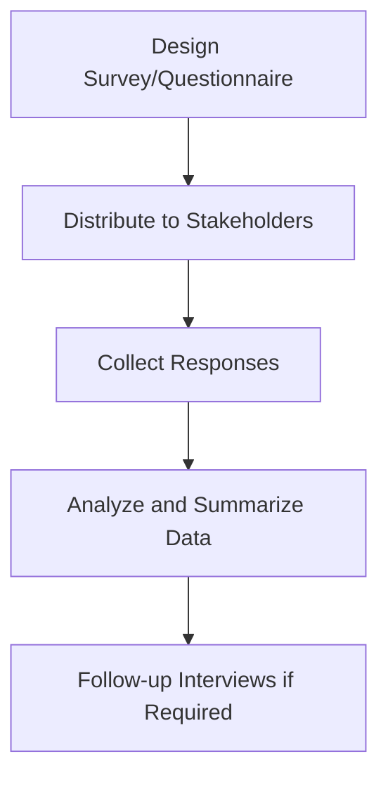

#### Engineering Considerations

- Efficient with widely distributed or large stakeholder groups.
- May yield shallow insights if poorly constructed or if response rates are low.

**Note**
> Use follow-ups to clarify ambiguous or non-uniform responses.

---

### 5.6 Prototyping

#### Definition

Developing partial, preliminary versions of the system (mock-ups, wireframes, interactive sketches, or throwaway prototypes) to elicit requirements through demonstration and user feedback.

#### Types

- Low-fidelity (paper prototypes, wireframes)
- High-fidelity (interactive screens, limited functionality systems)

#### Workflow

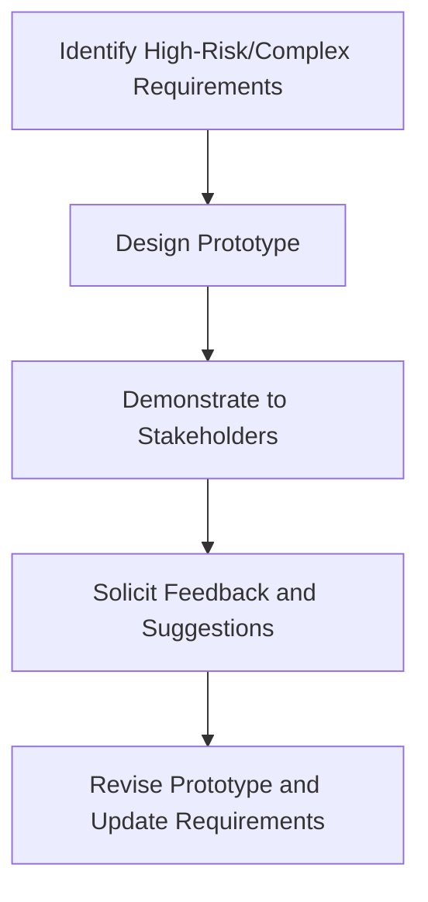

#### Engineering Considerations

- Clarifies misunderstood or abstract requirements.
- Reduces risk of building incorrect functionality.
- Risk of stakeholders fixating on UI details early in the process.

---

### 5.7 Brainstorming

#### Definition

A group creativity technique to generate a broad set of ideas, requirements, or solutions in a short time.

#### Workflow

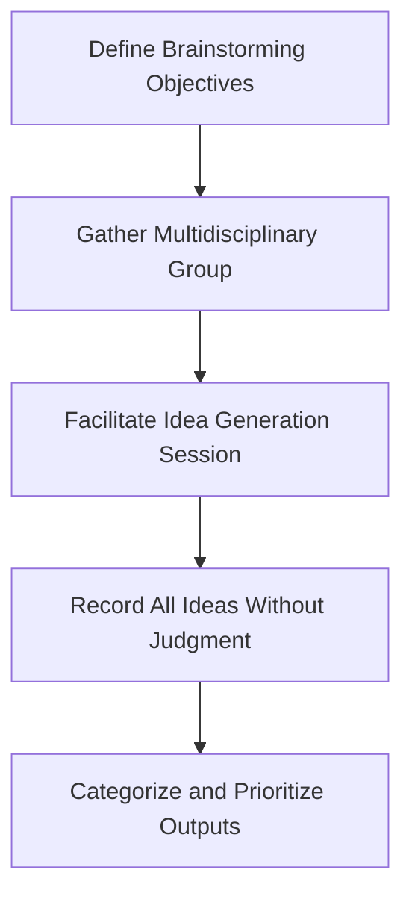

#### Engineering Considerations

- Encourages creative and out-of-the-box thinking.
- Must be followed by rational analysis and validation.

---

### 5.8 Use Case and Scenario Modelling

#### Definition

Describing system interactions from the user perspective to capture required functionality. Use cases define actors, triggers, interactions, and outcomes.

#### Example Use Case Diagram

```mermaid
usecase
actor User as U
actor Admin as A
system System as S
U --> (Login)
U --> (Submit Request)
A --> (Approve Request)
S --> (Generate Report)
U --> (Generate Report)
```

#### Engineering Considerations

- Use cases are a bridge to specification and system design.
- Particularly useful in systems where user interaction is central.

---

### 5.9 Reverse Engineering

#### Definition

Deriving requirements from analysis of the behavior or code of existing systems, especially when documentation is poor or missing.

#### Workflow

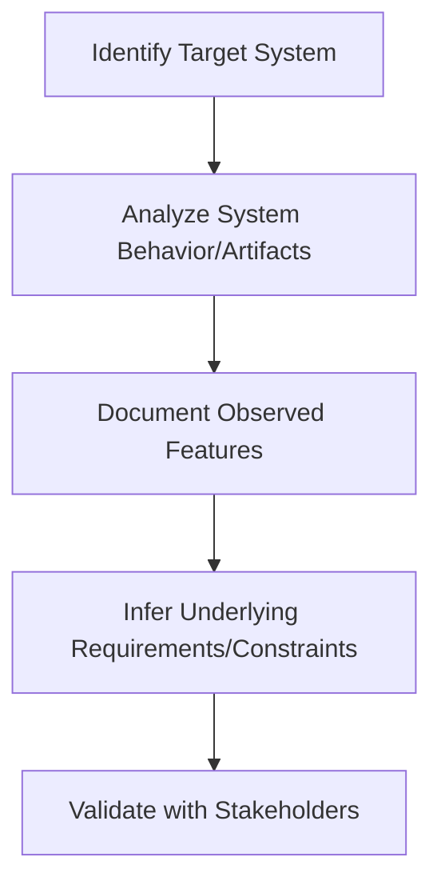

#### Engineering Considerations

- Essential for legacy replacements or integrations.
- Time-consuming; completeness can be difficult to achieve.

---

### 5.10 Focus Groups

#### Definition

Facilitated discussions with a group of representative stakeholders (e.g., end-users, customers) to extract attitudes, preferences, and expectations about the system.

#### Workflow

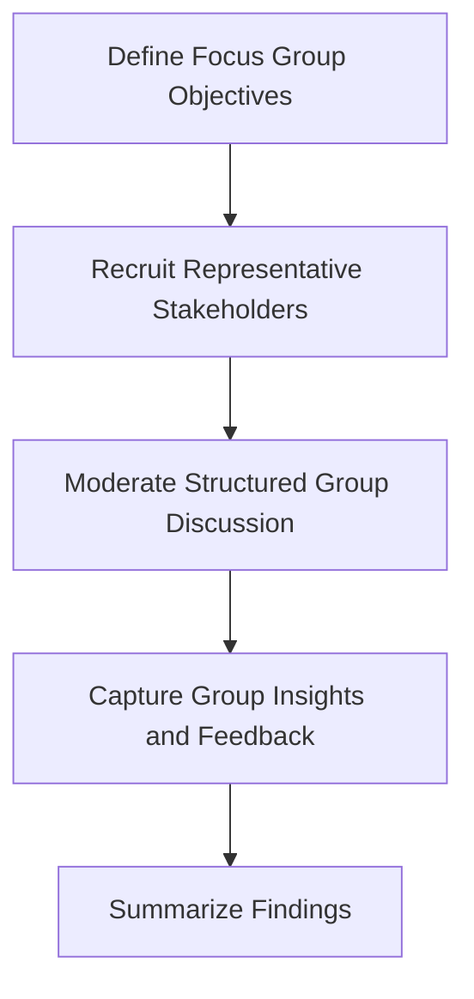

#### Engineering Considerations

- Useful for gathering perception-based or qualitative requirements.
- Groupthink or domination by vocal members can skew results.

---

## 6. Cross-Cutting Concerns

### 6.1 Stakeholder Management

Identify, analyze, and engage stakeholders continuously:

- Use RACI matrices (Responsible, Accountable, Consulted, Informed) to clarify stakeholder roles.
- Track influence and interest to manage communication strategies.

### 6.2 Requirements Traceability

Maintain traceability from elicitation through to specification, design, and testing. Traceability matrices (as per ISO/IEC/IEEE 29148:2018 — Requirements Engineering) help ensure all requirements are addressed and validated.

### 6.3 Handling Conflicts and Ambiguity

Conflicts among requirements or stakeholders are common. Use workshops, negotiation, and decision modeling techniques to resolve discrepancies. Maintain documentation of rationales for major decisions.

**Warning**
> Unresolved conflicts or ambiguity in early elicitation will propagate defects downstream, increasing costs of correction.

---

## 7. Practical Workflow Integration

### 7.1 Example Elicitation Workflow in Software Development

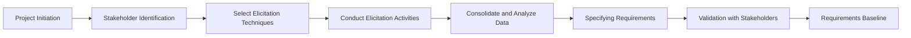

**Caution**
> Iterative cycles are common, especially in agile and incremental lifecycles, where requirements continue evolving based on feedback.

### 7.2 Integration Points

- Business analysis and system architecture
- User experience (UX) research and usability engineering
- Compliance and risk management

---

## 8. Constraints and Challenges

- **Stakeholder Unavailability:** Scheduling and engagement challenges may impact depth and quality of elicitation.
- **Organizational Politics:** Power dynamics can distort requirement priorities.
- **Incomplete Knowledge:** Stakeholders may not fully understand their own processes or future needs.
- **Cultural and Language Barriers:** Especially relevant in international or cross-functional teams.
- **Time and Budget Limitations:** May restrict which techniques can be used and to what depth.

---

## 9. Standards and Specifications

- **SWEBOK V3.0, Section 2.2 (Requirements Elicitation):** Comprehensive summary of elicitation processes and recognized techniques.
- **ISO/IEC/IEEE 29148:2018:** Systems and Software Engineering — Life Cycle Processes — Requirements Engineering.
- **BABOK (Business Analysis Body of Knowledge), v3, Chapter 4:** Techniques for business analysis and requirements elicitation.

---

## 10. Common Engineering Pitfalls

- Omitting key stakeholder groups from early activities.
- Prolonged elicitation with diminishing returns (a.k.a. analysis paralysis).
- Overreliance on a single technique or document source.
- Insufficient documentation of rationales, decisions, and out-of-scope items.
- Neglecting non-functional aspects or regulatory constraints.

---

## 11. Summary Diagram: Elicitation Techniques in Context

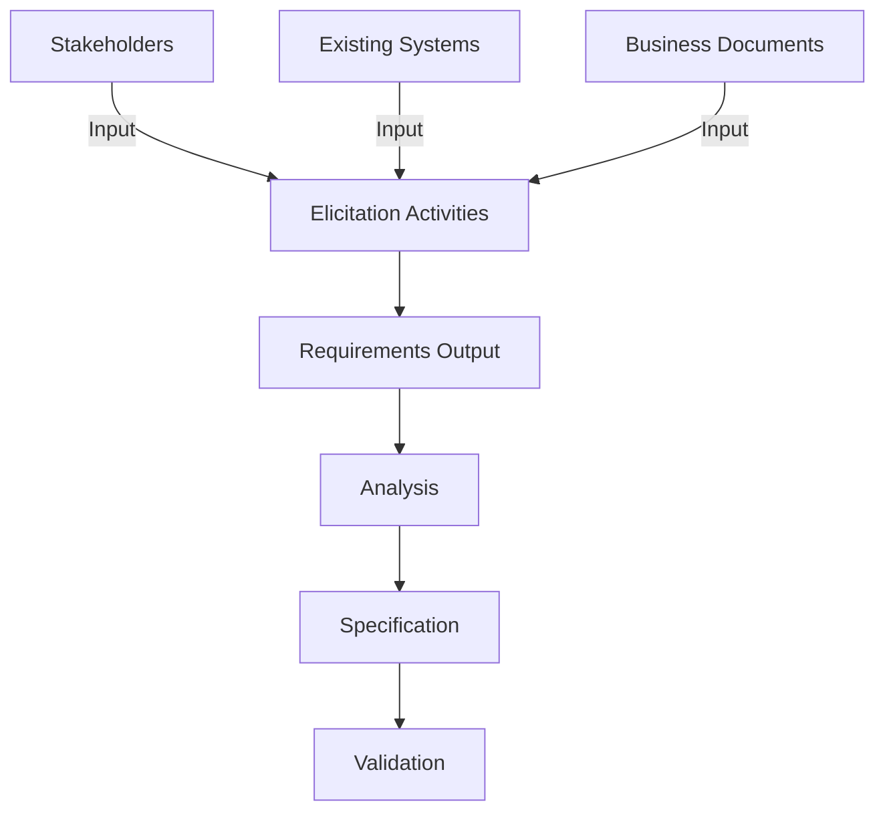

---

## 12. Conclusion

Requirements elicitation techniques form the critical first step in requirements engineering, establishing clear communication lines among stakeholders and capturing the necessary information to design and implement systems that address real needs and constraints. A robust elicitation process incorporates multiple, complementary techniques adapted to project context, leverages standardized guidelines, and considers practical workflow integration and the organizational environment. Mastery of elicitation underpins the success of software engineering practice and directly influences system quality and user satisfaction.

---