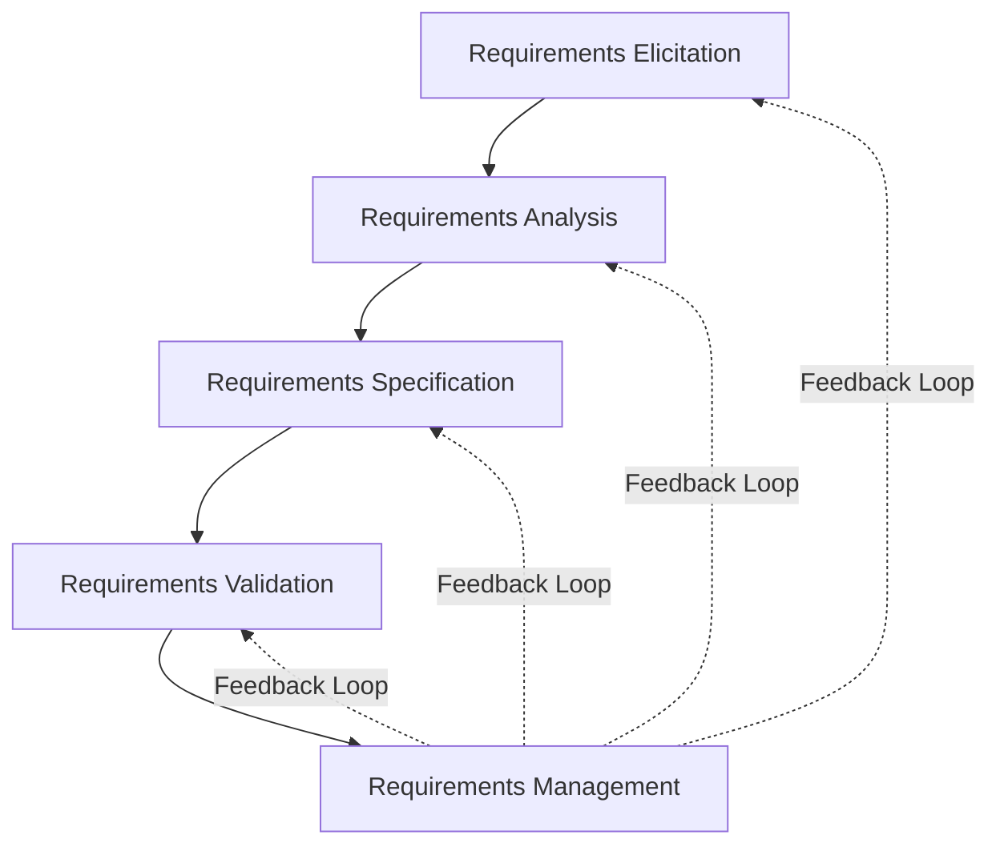
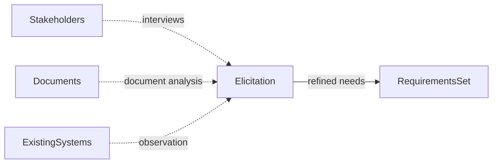
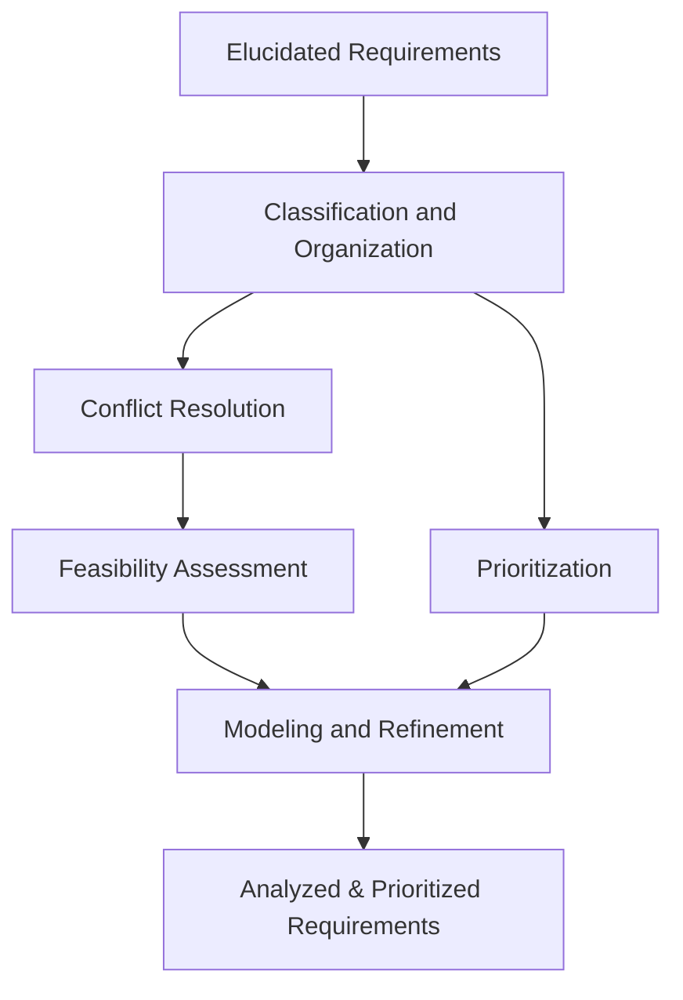
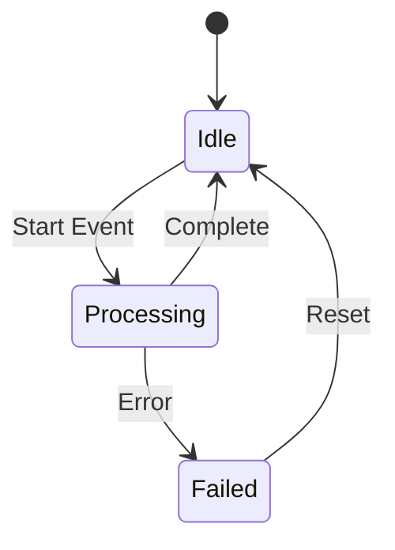
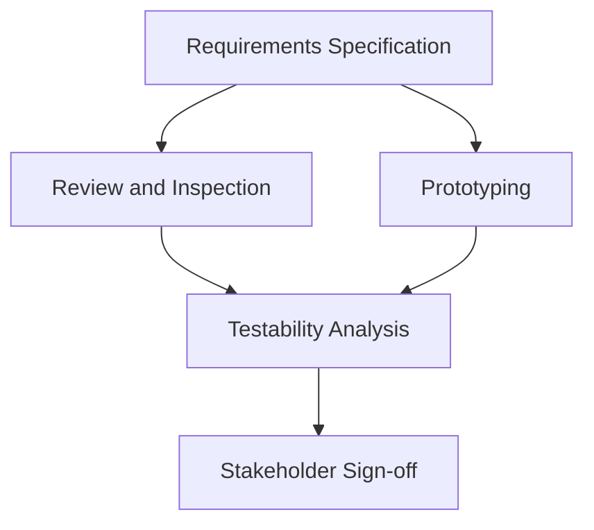
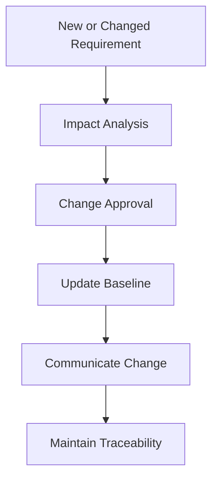
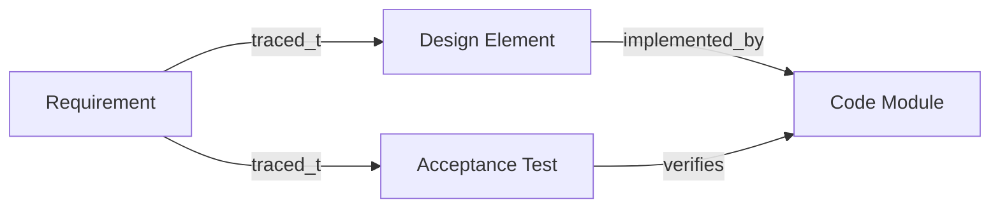
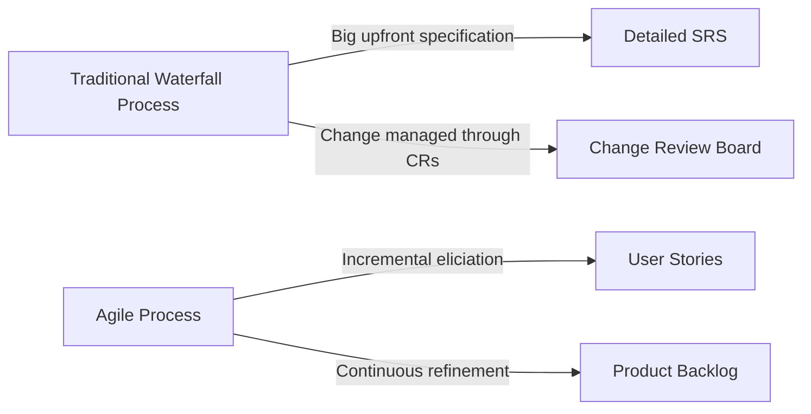

# Requirements Engineering Fundamentals

## 1. Introduction

Requirements engineering (RE) is a systematic process that encompasses the activities and tasks necessary to identify, elicit, analyse, specify, validate, and manage the requirements of a software system. These requirements serve as the foundation for software development, guiding system architecture, design, testing, and maintenance.

In the context of software engineering, requirements engineering bridges the gap between stakeholders (such as users, customers, regulators, and sponsors) and development teams, translating needs and constraints into actionable and verifiable specifications.

Requirements engineering is integral to all software development life cycle (SDLC) models, from traditional waterfall to modern iterative and agile frameworks. Its application mitigates project risks, ensures alignment with business objectives, improves solution quality, and facilitates project management and traceability.

## 2. Key Concepts of Requirements Engineering

### 2.1 Requirements

**Requirements** are statements of needs, constraints, or capabilities that a system must satisfy or possess to fulfill stakeholder expectations or comply with external regulations. Software requirements commonly fall into three major categories:

- **Business Requirements:** High-level objectives, goals, and needs of the organization or customer.
- **Stakeholder Requirements:** Specific needs and constraints expressed by stakeholders.
- **System (Solution) Requirements:** Detailed characteristics, behaviors, and properties of the software system.  
  - **Functional Requirements:** What the system should do (functions, use cases, services).
  - **Non-Functional Requirements:** How the system should behave (performance, security, usability, reliability, scalability, etc.).

### 2.2 Requirements Engineering Activities

Requirements engineering comprises five major activities:

1. **Elicitation:** Discovery and collection of requirements from stakeholders and other sources.
2. **Analysis:** Refinement and organization of requirements to resolve ambiguities, conflicts, and incompleteness.
3. **Specification:** Documentation of requirements in structured, precise, and testable formats (e.g., Software Requirements Specification [SRS]).
4. **Validation:** Ensuring requirements accurately represent stakeholder intent and are feasible, testable, unambiguous, and consistent.
5. **Management:** Ongoing control and adaptation of requirements throughout the project life cycle, including change handling and traceability.

*Diagram: The iterative nature of requirements engineering activities and feedback loops*

### 2.3 Core Principles

- **Early and Continuous Stakeholder Involvement:** Stakeholder engagement is essential to identify requirements, resolve conflicts, and ensure alignment.
- **Clarity and Precision:** Requirements must be stated unambiguously and without unnecessary generality.
- **Testability:** Requirements are verifiable if they can be objectively tested.
- **Traceability:** Each requirement should be traceable to its source, and dependencies among requirements should be explicit.
- **Change Management:** Requirements are subject to change and must be controlled systematically.

## 3. Requirements Elicitation

### 3.1 Definition and Purpose

Elicitation is the process of discovering requirements through direct communication with stakeholders, analysis of documentation, and examination of existing systems or domain knowledge. Its goal is to capture all relevant requirements, both stated and implicit, with accuracy and completeness.

### 3.2 Techniques

- **Interviews:** Structured or unstructured conversations with stakeholders.
- **Workshops and Focus Groups:** Collaborative sessions for group requirement gathering and consensus building.
- **Observation:** Studying users in their operational environment.
- **Questionnaires and Surveys:** Useful for large stakeholder groups.
- **Document Analysis:** Extracting requirements from existing manuals, system documentation, and regulations.
- **Prototyping:** Building models or mock-ups to elicit feedback.
- **Use Case Modelling:** Scenarios and user stories describe interactions and clarify needs.

*Diagram: Inputs to requirements elicitation*

### 3.3 Elicitation Challenges

- Stakeholders may be unable to articulate needs clearly.
- Requirements may be incomplete, implicit, or conflicting.
- Communication barriers, cultural factors, and domain complexity can create misinterpretation.

> [!caution]
> Successful elicitation demands strong communication, facilitation, and domain knowledge.

## 4. Requirements Analysis

### 4.1 Definition and Objectives

Requirements analysis involves structuring, classifying, prioritizing, and refining elicited requirements. Its objectives are to clarify ambiguities, identify redundancies, resolve inconsistencies, analyse feasibility, and prioritize features for implementation.

### 4.2 Typical Analysis Tasks

- **Classification and Organization:** Grouping requirements (by feature, user, subsystem, etc.).
- **Conflict Resolution:** Identifying and mitigating contradictory requirements.
- **Feasibility and Risk Assessment:** Determining technical, financial, or operational constraints.
- **Prioritization:** Ranking requirements by business value, risk, or stakeholder importance.
- **Modeling:** Using tools such as data flow diagrams, entity-relationship diagrams, or state machines.

*Diagram: Requirements analysis workflow*

### 4.3 Common Pitfalls

> [!warning]
> - Failing to identify dependencies or hidden constraints can cause later rework.
> - Over-prioritizing low-impact features wastes effort and delays critical path items.

## 5. Requirements Specification

### 5.1 Definition

Specification involves producing concise, organized, unambiguous documentation of requirements, typically in the form of a Software Requirements Specification (SRS), user stories, or models. Specifications enable communication between engineering teams, stakeholders, and external parties.

### 5.2 Characteristics of Good Requirements

- **Correct:** Accurately reflects intended functionality or constraint.
- **Unambiguous:** One possible interpretation only.
- **Complete:** All necessary information is provided.
- **Consistent:** No conflicting requirements.
- **Verifiable:** It is possible to confirm implementation or fulfillment.
- **Modifiable:** Organized to allow easy changes.
- **Traceable:** Can be linked to source and subsequent design elements.

### 5.3 Forms of Specification

#### 5.3.1 Natural-Language Documents

Plain-language descriptions, structured by section, feature, or use case. Common drawbacks include ambiguity and inconsistent interpretation.

#### 5.3.2 Structured Natural Language

Limited or controlled language templates such as EARS (Easy Approach to Requirements Syntax) reduce ambiguity:

- "The [system/component] shall [do something] when [condition]."

#### 5.3.3 Semi-Formal and Formal Specifications

- **Use Case Specifications:** Detailed interaction scenarios.
- **UML Diagrams:** Use case, sequence, class, or activity diagrams.
- **State Machines:** Behavior models for complex systems.
- **Mathematical Notation:** For critical, high-integrity systems (e.g., Z, B-Method, Alloy).

*Diagram: Example state machine for a component lifecycle*

### 5.4 Reference Standards

- **IEEE 830:** Recommended Practice for Software Requirements Specifications
- **ISO/IEC/IEEE 29148:** Systems and software engineering — Life cycle processes — Requirements engineering

> [!tip]
> Structure specifications to support traceability and compliance with standards.

## 6. Requirements Validation

### 6.1 Purpose

Validation ensures requirements reflect stakeholder intentions, are achievable, and can be tested within given constraints. It occurs through review sessions, inspections, prototyping, and test case design.

### 6.2 Validation Activities

- **Reviews and Inspections:** Group walkthroughs scrutinize requirement documents for errors and omissions.
- **Prototyping:** Early versions or simulations reveal misunderstandings.
- **Testability Analysis:** Ensures that requirements are measurable and verifiable.
- **Stakeholder Sign-off:** Formal acceptance signals agreement.

*Diagram: Requirements validation pathway*

> [!important]
> Validation is not a one-time activity; it must be revisited in response to requirement changes or discovery of defects.

### 6.3 Common Validation Challenges

- Overlooking stakeholder input or missing edge cases.
- Failing to enforce traceability, causing drift from business objectives.
- Insufficient validation of non-functional requirements.

## 7. Requirements Management

### 7.1 Overview

Requirements management is the set of processes that ensure requirements are controlled, updated, and communicated throughout the SDLC. It maintains the relationships between evolving requirements, design, implementation, and test artifacts.

### 7.2 Change Control

Requirements are subject to change due to evolving stakeholder needs, new technology, or defect discovery. Formal change management involves:

- **Impact Analysis:** Assessing technical, cost, and schedule implications.
- **Change Approval:** Review and authorization by designated stakeholders.
- **Versioning and Baselines:** Tracking stable sets of requirements and their evolution.
- **Communication:** Disseminating updates across all relevant teams.

*Diagram: Requirements change and management flow*

### 7.3 Traceability

Traceability is the ability to establish and maintain cross-references between requirements and related design, code, and tests. A traceability matrix helps ensure all requirements are implemented and verified.

*Diagram: Sample traceability relationships*

> [!info]
> Modern application life cycle management (ALM) and product management tools offer built-in traceability and change control.

## 8. Requirements Engineering in Modern Development Processes

### 8.1 Traditional vs. Agile Requirements

- **Traditional (Waterfall):** Emphasizes comprehensive up-front requirements specification, with change control processes governing updates. Specifications often use detailed SRS documents and formal review cycles.
- **Agile/Iterative:** Relies on continuous discovery, incremental specification, and ongoing dialogue with stakeholders. Requirements are typically captured as user stories, acceptance criteria, and backlog items, with lightweight documentation.

*Diagram: Requirements handling in traditional vs. agile models*

### 8.2 Implications for Engineering

- **Integration Points:** Requirements function as binding contracts for integration across teams and services.
- **Performance:** Poor or ambiguous requirements propagate defects, slow integration, or cause re-work.
- **Implementation Challenges:** Requirement volatility and misunderstanding are primary causes of project failure.
- **Tool Support:** Automated requirements management, version control, and traceability are critical for scale.
- **Regulatory Compliance:** In regulated domains (medical, automotive, aerospace), requirements must satisfy standards and auditability demands.

## 9. Common Requirements Engineering Challenges

### 9.1 Volatility and Change

- Market, organizational, and technical factors cause requirements to change during development. Effective management and communication mitigate project destabilization.

### 9.2 Ambiguity and Incompleteness

- Unclear or incomplete requirements lead to misinterpretation and defects. Structured elicitation, iterative validation, and semi-formal modeling improve clarity.

### 9.3 Conflicts and Prioritization

- Stakeholder priorities may clash. Resolutions often require negotiation, compromise, and careful prioritization based on value, risk, and feasibility.

### 9.4 Traceability and Documentation Debt

- Inadequate traceability impedes project tracking, compliance, and maintenance—especially in large or distributed teams.

> [!important]
> Neglecting requirements engineering at scale impairs predictability, compliance, and long-term software maintainability.

## 10. Summary and Engineering Best Practices

Requirements engineering forms the backbone of successful software projects by providing a disciplined approach to discovering, analysing, specifying, validating, and managing requirements. Regardless of the process model—traditional or agile—the essence lies in continual stakeholder communication, clarity and precision in documentation, systematic validation, and rigorous change control with traceability.

**Engineering Best Practices:**

- Involve all relevant stakeholders early and throughout the project.
- Use appropriate specification methods and notations for your domain and project scale.
- Employ peer reviews and validation techniques to identify defects early.
- Automate requirements management, change tracking, and traceability where feasible.
- Integrate requirements activities with design, development, and testing workflows.
- Plan for requirements volatility; embrace change as an inherent aspect of complex software systems.

> [!tip]
> Well-executed requirements engineering prevents costly defects, improves solution fit, speeds delivery, and increases user satisfaction.

---

This primer provides medium-depth coverage aligned with SWEBOK recommendations and relevant standards. It equips software engineers to apply requirements engineering fundamentals as a discipline within their software projects, fostering quality, predictability, and maintainability.