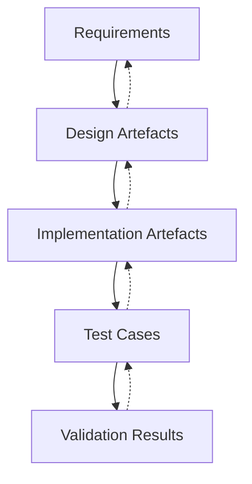
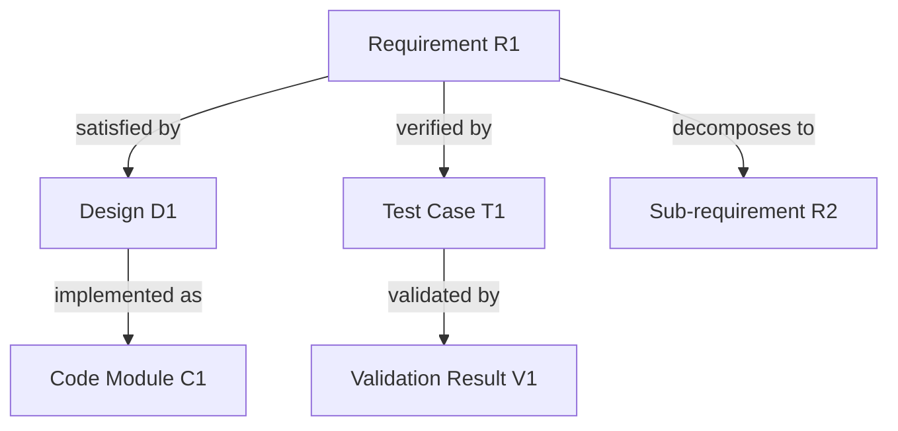
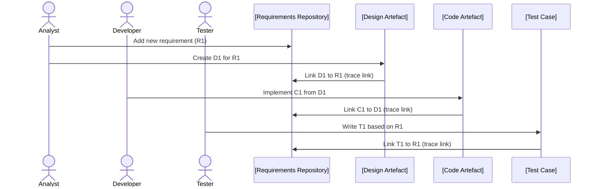

# Requirements Traceability

## Introduction

Requirements traceability is a foundational discipline in requirements engineering that ensures every stated requirement is accounted for throughout the software development lifecycle (SDLC). Traceability links requirements to related artefacts—such as design documents, implementation items (e.g., code modules), test cases, and validation results—enabling systematic impact analysis, change management, compliance demonstration, and quality assurance.

Requirements traceability is referenced and recommended by numerous standards, including ISO/IEC/IEEE 29148 (Requirements Engineering), ISO/IEC/IEEE 12207 (Software Lifecycle Processes), and automotive and medical device standards (e.g., ISO 26262, IEC 62304).

## Purpose and Rationale

Traceability reinforces project control by providing:

- **End-to-end visibility** – Verification that all requirements are designed, implemented, and validated.
- **Change Impact Analysis** – Rapid determination of what must be altered in response to requirement changes.
- **Compliance and Audit Support** – Objective demonstration for stakeholders or regulatory authorities.
- **Quality Assurance** – Mitigation of risks attached to missing, untested, or unimplemented requirements.

Traceability is particularly critical in regulated or safety-critical domains but is relevant to all disciplined software engineering efforts.

## Core Concepts

### Definitions

- **Traceability Link**: A documented and maintained association between two artefacts (e.g., from a requirement to a test case).
- **Forward Traceability**: The ability to trace requirements towards implementation, testing, and validation artefacts.
- **Backward (Reverse) Traceability**: The ability to trace derived artefacts (e.g., code, test case) back to their originating requirements.
- **Bidirectional Traceability**: Ensures links are maintained in both forward and backward directions.

### Artefact Types Involved

The primary artefact classes typically participating in traceability include:

| Artefact                | Example                                          |
|-------------------------|--------------------------------------------------|
| Requirement             | User story, use case, specification clause       |
| Design                  | System architecture, UML diagrams, data models   |
| Implementation          | Source code files, modules, configurations      |
| Test Artefacts          | Test cases, test scripts, test plans             |
| Validation Artefacts    | Test results, review records, validation reports |

## Requirements Traceability Matrix (RTM)

An RTM is a tabular representation that records and visualizes the relationships between requirements and other artefacts. It may be built and maintained in a spreadsheet, a dedicated requirements management tool, or as part of an Application Lifecycle Management (ALM) platform.

**Diagram:** Artefact Traceability Relationships (End-to-End Bidirectional Links)

## Traceability Levels and Granularity

### Levels

1. **High-Level (Feature or Epic Traceability)**
   - Traces major features or epics through design and verification.
   - Suitable for high-level overviews and management reporting.

2. **Low-Level (Requirement Traceability)**
   - Traces fine-grained, often atomic requirements (e.g., SRS clauses).
   - Necessary for compliance, detailed change impact, and defect analysis.

### Granularity Considerations

- Excessively coarse granularity (e.g., tracing entire documents) loses analytical value.
- Excessively fine granularity (e.g., individual lines of code) risks maintenance overhead.

**Tip**
> Choose traceability granularity based on risk, project criticality, regulatory requirements, and available tool support.

## Types of Traceability Links

The relationships that may be tracked include (but are not limited to):

- **Satisfies**: Design / code items that fulfill a requirement.
- **Verifies**: Test artefacts that verify a requirement.
- **Depends On / Precedes / Derives**: Relationships expressing requirement dependencies, derivations, or sequencing.
- **Decomposes**: Parent-child links expressing decomposition into sub-requirements.

**Diagram:** Example Traceability Relationships for a Single Requirement

## Traceability Workflow in Practice

### Establishing Traceability

1. **Requirement Elicitation**:
    - Requirements are uniquely identified and catalogued in a requirements repository.
2. **Trace Link Establishment**:
    - As artefacts are developed (designs, code, tests), explicit trace links are created (manually or automatically) in the repository/tooling.
3. **Trace Link Maintenance**:
    - When artefacts or requirements change, maintain consistency by updating trace links and detecting broken relationships.
4. **Analysis and Report Generation**:
    - Generate traceability matrices or gap analysis reports for internal reviews, inspections, or external audits.
5. **Verification and Validation**:
    - Demonstrate via traceability that all requirements have been implemented and verified.

**Diagram:** Simplified Traceability Workflow

## Traceability and Change Impact Analysis

One of the primary advantages of requirements traceability is enabling impact analysis when requirements change.

For instance, if a requirement is updated, traceability allows engineers to quickly identify:

- Which design components must be revisited
- Which code modules may require modification
- Which test cases must be updated or retested

Conversely, if a defect is found in a specific implementation, traceability enables backward navigation to the original impacted requirement(s).

**Diagram:** Change Impact Propagation

## Methods and Tools

### Manual Methods

- Traditional documents (spreadsheets, tables) with traceability ID columns.
- Practical for small projects, but error-prone and labor-intensive for iterative or large-scale development.

### Automated and Integrated Tool Support

- **Requirements Management Tools**: IBM DOORS, Jama Connect, Polarion, Jira (with plugins), Helix RM, etc.
- **ALM Suites**: Integration with source control, change management, testing, and defect tracking.
- Features include visual traceability trees, gap analysis, automatic link updates, consistency checks, and versioning.

**Note**
> Diagram to be added later: Example traceability tree visualization as rendered by an RM tool.

### Integration with DevOps Toolchains

- Some modern CI/CD pipelines automate the linking of work items, code branches, and build/test artefacts back to requirements.
- REST APIs and automation scripts can maintain trace links programmatically, increasing consistency.

## Challenges and Pitfalls

### Common Pitfalls

- **Orphan Requirements**: Requirements with no trace to implementation or test artefacts.
- **Gold Plating**: Implementation or features with no trace to any documented requirement.
- **Traceability Gaps**: Broken or outdated links due to artefact or requirement changes.
- **Excessive Overhead**: Overly fine granularity or lack of tool support results in unsustainable traceability processes.

### Trade-offs

- **Completeness vs. Effort**: More complete traceability demands greater initial and maintenance effort, which should be balanced against project risks and regulatory needs.
- **Automation vs. Human Judgment**: Automated trace generation is valuable but may not always capture nuanced or implicit relationships.

### Engineering Considerations

- **Tool Interoperability**: Tool choice and data model alignment impact traceability visibility across the SDLC.
- **Unique Identifiers**: Artefacts must have unique, persistent IDs for trace link stability.
- **Versioning and Baselines**: Trace links should be maintained across requirement and artefact versions; baselining avoids confusion during change.

**Caution**
> Insufficient traceability can lead to costly defects, non-compliance, and project overruns, especially in regulated industries.

## Traceability in Agile and Hybrid Methodologies

Traceability was historically seen as “heavyweight” and associated mainly with plan-driven models. However, even in Agile contexts, some level of traceability is generally required, especially for:

- Large-scale Agile (e.g., SAFe, LeSS) where feature/epic-to-story correlations must be tracked.
- Compliance with external regulations, safety, or contractual obligations.

Modern Agile tooling increasingly supports lightweight, incremental traceability (e.g., mapping user stories to automated test cases or code commits).

## Traceability and Standards

### Recognized Standards Touching Traceability

- **ISO/IEC/IEEE 29148**: Specifies processes and practices for requirements engineering, including traceability.
- **ISO/IEC/IEEE 12207**: States requirements for links and audits across all SDLC artefacts.
- **IEC 62304 (Medical Devices), ISO 26262 (Automotive)**: These industry standards mandate traceability from requirements through risk analysis, design, implementation, and verification.
- **CMMI (Capability Maturity Model Integration)**: Adopts traceability as a process area, emphasizing both forward and backward trace.

**Alert**
> In regulated sectors, traceability is not optional. Projects may be rejected or penalized for poor trace link maintenance.

## Traceability Metrics

To assess the sufficiency of traceability, organizations may track:

- **Coverage**: % of requirements traced forward to design/implementation/test artefacts.
- **Completeness**: % of implementation artefacts traced back to requirements.
- **Gap Count**: Number of unlinked (orphan) requirements/artefacts.
- **Trace Link Integrity**: Frequency of broken or invalid trace links.

Tracking and periodic reporting on these metrics reduces compliance and delivery risk.

## Summary

Requirements traceability systematically connects requirements to downstream and upstream artefacts throughout the software lifecycle. Its primary value is in ensuring nothing is omitted or unnecessarily added, simplifying the analysis of change, ensuring product quality, and facilitating compliance. Traceability should be implemented with a level of rigour and automation commensurate with project risks, stakeholder and regulatory demands, and technical feasibility. Properly engineered traceability significantly improves project outcomes, auditability, and long-term maintainability.

---

**End of document.**
