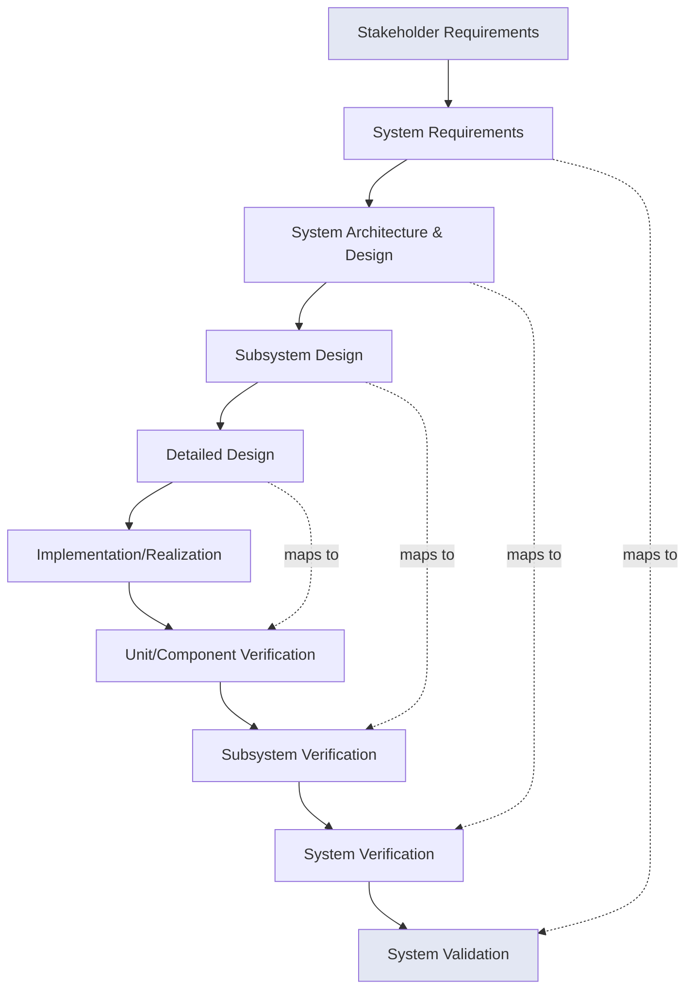
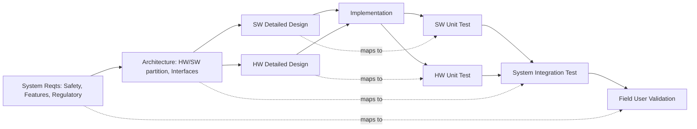

# V-Model for Systems Engineering

## Introduction

The V-Model for systems engineering is a rigorous framework for managing complex system development through structured process stages that explicitly link design phases with their corresponding verification and validation (V&V) activities. By organizing the lifecycle into two complementary branches, the V-Model ensures systematic tracking of requirements, disciplined decomposition and integration, and continuous assurance that engineering products meet stakeholder needs. Its broad applicability spans industries such as aerospace, defense, automotive, rail, industrial automation, and beyond.

## Context and Motivation

Systems engineering involves the interdisciplinary approach to the realization, operation, and retirement of complex systems. Given the risks inherent in large-scale integration, ambiguous requirements, and multifaceted stakeholder environments, there is a critical need for lifecycle models that can manage complexity, trace requirements, and minimize late-stage defects. The V-Model addresses these risks by providing a blueprint that:

- Visually and procedurally links each design step with its corresponding test and validation,
- Emphasizes the importance of requirements traceability,
- Facilitates early defect detection,
- Offers clear mapping between system decomposition and integration activities.

The V-Model is most often referenced in standards including **INCOSE Systems Engineering Handbook**, **ISO/IEC/IEEE 15288:2015 (System Life Cycle Processes)**, and industry process models such as **Automotive SPICE** and **ECSS (European Cooperation for Space Standardization)**.

## Core Concepts and Structure

### Basic Structure of the V-Model

The V-Model is named for its characteristic “V” shape, with the left arm representing system decomposition and definition (analysis and design), the base representing implementation (or realization), and the right arm encompassing system integration and confirmation (testing and validation).

Below is a high-level depiction of the generic V-Model structure:



**Interpretation:**
- **Left Side:** Top-down decomposition—from stakeholder needs and requirements, through design at progressively finer detail.
- **Base:** System implementation or coding/manufacture.
- **Right Side:** Bottom-up integration and verification—starting with unit/component testing and building up to full system validation.
- **Cross-Links:** Each decomposition step on the left is paired with a matching verification or validation step on the right.

### Terminology

- **Verification:** Did we build the system right? (Satisfies specified requirements.)
- **Validation:** Did we build the right system? (Fulfills stakeholder intent in the intended environment.)
- **Decomposition:** Splitting the system into successively smaller subsystems/components for detailed design or requirement allocation.
- **Integration:** Progressive assembly and test of components/subsystems back to the overall system.

## Key Components and Lifecycle Stages

### 1. Requirements Decomposition (Left Arm)

- **Stakeholder Requirements Analysis**  
  Eliciting user, customer, and regulatory requirements in clear, testable terms. This forms the operations concept and capability definition.
- **System Requirements Definition**  
  Translating stakeholder wants into formal system requirements, possibly in a System Requirements Specification (SyRS). Maintains traceability to stakeholders.
- **System Architecture and Design**  
  Partitioning the system into functional blocks and interfaces.
- **Subsystem/Component Design**  
  Allocating requirements and design details to subsystems—mechanical, electrical, software, etc.
- **Detailed Design**  
  Finalizing everything needed for realization, such as construction plans, code, drawings, and interface control documents (ICDs).

### 2. Implementation (Bottom of the V)

- **Realization/Implementation/Construction**  
  Actual building, coding, procurement, fabrication, or construction of the system elements.

### 3. Integration and Verification (Right Arm)

- **Unit (Component) Verification**  
  Testing that individual hardware/software units meet their detailed design and requirements.
- **Subsystem Verification**  
  Integrating components into subsystems and verifying their correct functioning.
- **System Verification**  
  Assembling subsystems into the full system and conducting verification against system-level requirements.
- **System Validation**  
  Demonstrating, often with end users, that the system satisfies the original stakeholder intent and performs in the real-world context.

## Illustrative Example: V-Model Applied to a Vehicle Embedded System



## Variants and Adaptations

### V-Model Extensions and Customizations

While the V-Model is widely cited, adaptations are common to handle project-specific goals and domain requirements:

- **Hybrid Models:** V-Model combined with iterative/incremental or agile techniques for complex or evolving requirements, e.g., "V-Model XT," "Vee plus spiral," or "Double Vee Model."
- **Multiple V’s:** Used for Systems of Systems, where each constituent system follows its own V-Model coordinated within a higher-level integration V (see ISO/IEC 15288 Annex F).
- **Concurrent Engineering:** Allows for overlapping phases for faster development cycles.
- **Supplier Integration:** In distributed or supplier-driven developments, additional “Vs” may be used to represent supplier-specific V&V activities.

> **Note**  
> For diagrams showing advanced adaptations like the Double Vee Model, diagram to be added later.

## Verification and Validation in Depth

### Verification

Verification processes answer, “Are we building the system right?” Typical activities include:

- Inspections
- Reviews (Design, Code, Specification)
- Unit Testing
- Interface Testing
- Integration Testing
- Formal Analyses (e.g., static analysis, model checking)

Tracing requirements through development artifacts (requirements matrices, traceability tools) is vital.

### Validation

Validation addresses, “Are we building the right system?” Examples include:

- User acceptance testing (UAT)
- Field operational demonstrations or pilots
- Simulations in realistic environments
- Regulatory/standards compliance assessments

Validation should not be deferred until late phases; prototyping, simulation, or stakeholder reviews can facilitate early validation activities.

```mermaid
flowchart TD
    StakeReq[Stakeholder Requirements]
    SysReq[System Requirements]
    Design[Design Artifacts]
    Impl[Implementation]
    Verif[Verification Activities]
    Valid[Validation Activities]

    StakeReq --> SysReq --> Design --> Impl
    Verif -.> SysReq
    Verif -.> Design
    Valid -.-> StakeReq
```

## Typical Workflows and Engineering Practices

### Systematic V-Model Workflow

1. **Requirements Capture:** Elicit and document all needs and constraints.
2. **Requirement Derivation and Allocation:** Allocate requirements across system hierarchy; maintain bidirectional traceability.
3. **Architecture and Detailed Design:** Decompose into architectures and detailed subsystem/component descriptions.
4. **Implementation/Realization:** Build, procure, or code.
5. **Verification (Correspondence):** At each build-up stage, conduct verification against the requirements originated at the corresponding decomposition stage.
6. **Validation (User Acceptance):** Demonstrate realized system performs acceptably in its operational context.

> **Caution**
> Neglecting traceability between requirements and V&V activities can result in gaps, missed tests, or unproven compliance—major project risk.

### Integration Points & Tool Support

- Integration with **Model-Based Systems Engineering (MBSE):** Tools (e.g., SysML, MagicDraw) automate traceability and design artifact generation.
- Requirements management platforms (e.g., IBM DOORS, Jama) enforce traceability, change impact analysis, and coverage metrics.
- Continuous Integration (CI) and Automated Testing: In modern projects, right-arm V&V activities are often connected to build servers and test automation.

### Performance, Constraints, and Assumptions

- **Documentation Overhead:** V-Model is documentation-heavy; suitable for regulated or high-assurance domains, less adaptable in fast-changing requirements.
- **Sequential Nature:** Classical V-Model implies stages are largely completed before moving forward—may be suboptimal for highly innovative or agile contexts.
- **Assumed Stability:** Works best where requirements are relatively stable and well-understood upfront.
- **Late Discovery Risk:** If requirement errors are not detected early, cost to fix increases sharply in later V phases (cf. Boehm’s “cost of change curve”).

## Key Standards, Process Models, and Guidance

- **ISO/IEC/IEEE 15288:2015:** International standard for system life cycle processes; defines terms, process areas, and typical lifecycle “V.”
- **INCOSE Systems Engineering Handbook:** Key industry reference providing V-Model workflows, artifacts, and best practices.
- **Automotive SPICE**, **ECSS**, **ARP4754A (Aerospace)**: Industry standards codifying V-Model variants and adaptations.
- **CENELEC EN 50126/50128/50129 (Rail):** Lifecycle processes including V-Model use for safety-related systems.

## Common Pitfalls and Practical Engineering Considerations

- **Over-Fixation on Sequential Phases:** Real projects may require iterations, backtracking, and overlap; the V-Model should be flexibly applied.
- **Traceability Lapses:** Weak requirement-to-test traceability leads to gaps, duplicated testing, or regulatory compliance failures.
- **Late Integration and Test Bottlenecks:** If design and unit phases lack sufficient prototyping, system integration may expose late-breaking defects.
- **Assumption of Requirement Stability:** In practice, requirements often evolve; rigid V-Model may struggle unless adaptation mechanisms are in place.
- **Documentation Overload:** Excessive documentation may hinder agility in projects not requiring exhaustive traceability or regulatory proof.
- **Vendor and Supply Chain Alignment:** Integrating supplier activities into a cohesive V demands rigorous interface management and V&V transparency.

> **Tip**
> For projects in dynamic or agile environments, consider hybridizing the V-Model with incremental, iterative, or spiral approaches to enable managed change and feedback.

## Summary: Role and Value of the V-Model

The V-Model for systems engineering remains a foundational model for the disciplined development and assurance of complex, engineered systems. It balances top-down design with bottom-up verification and validation, maintains clear mapping of requirements throughout the lifecycle, and mitigates project risk by ensuring systematic coverage of all design decisions.

For engineers, an operational understanding of the V-Model is essential for:

- Achieving regulatory and customer traceability requirements,
- Mapping requirements directly to V&V activities,
- Planning structured integration and testing phases,
- Managing risk by reducing ambiguity and missed requirements.

While emerging models (Agile, DevOps, MBSE) offer alternative or complementary paradigms, the V-Model continues to underpin best practice in systems engineering disciplines, especially where system complexity, assurance, or criticality are major concerns.