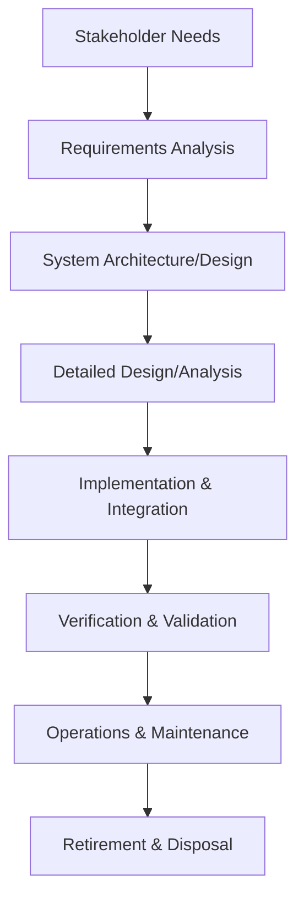
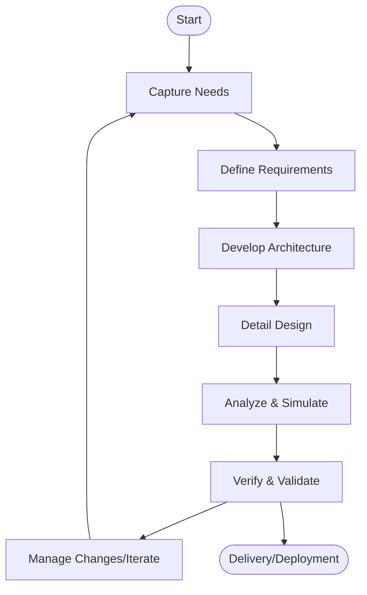
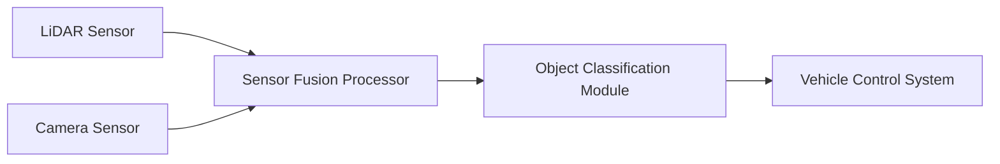
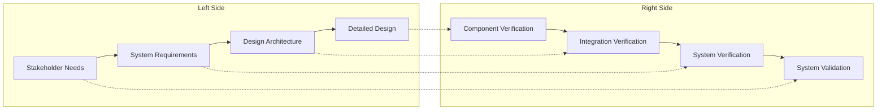

# Model-Based Systems Engineering (MBSE): A Technical Primer

## 1. Introduction

Model-Based Systems Engineering (MBSE) is a formalized approach to systems engineering that centers on the use of rigorous models to support system specification, design, analysis, verification, and validation activities, beginning in the conceptual design phase and continuing throughout development and life cycle. It replaces (or supplements) traditional document-centric methods, providing improved traceability, consistency, automation, and communication among stakeholders.

Historically, systems engineering has managed complexity via extensive text-based documentation, leading to challenges in consistency, maintainability, and integration with evolving system and stakeholder requirements. MBSE addresses these issues using models as the central artifacts governing the engineering process.

## 2. Definition and Context

**Model-Based Systems Engineering (MBSE):**
MBSE refers to a systems engineering methodology in which models serve as the primary means of information exchange, rather than informal documents. A "model" in MBSE is a formal, digital representation of the structure, behavior, requirements, interfaces, and constraints of the system, supporting automated analysis, design synthesis, verification, and collaboration across engineering disciplines.

### MBSE in the Systems Engineering Landscape

MBSE extends traditional systems engineering activities, aligning closely with well-established frameworks and standards such as:

- **INCOSE SE Handbook** — International reference for systems engineering processes
- **ISO/IEC/IEEE 15288** — Systems and software engineering: System life cycle processes
- **OMG SysML (Systems Modeling Language)** — Standardized modeling language for system architecture and engineering
- **V-Model** — Lifecycle process model emphasizing verification and validation

MBSE is not tied to a single language or tool; it is a methodology that can encompass various practices and modeling techniques, as long as the models are formal, explicit, and integral to the engineering workflow.

## 3. Core Principles of MBSE

MBSE is characterized by several foundational principles:

- **Centrality of the Model:** The system model is the primary source of truth, instead of scattered text documents.
- **Formalism:** Models are constructed with well-defined semantics (e.g., using SysML), enabling unambiguous interpretation and automation.
- **Lifecycle Integration:** Models span the entire lifecycle—requirements, design, analysis, implementation, verification, and validation.
- **Interoperability:** Models are exchangeable across tools and stakeholders, adhering to standards for seamless collaboration.
- **Traceability:** Model elements are traceable from requirements through implementation, enhancing impact assessment and change control.

## 4. MBSE Concepts and Model Architecture

### 4.1 System Modeling Lifecycle

MBSE organizes system models to correspond with engineering phases:

- **Stakeholder Needs:** Capture stakeholder expectations and objectives.
- **Requirements Analysis:** Extract and formalize system-level requirements.
- **Architecture/Design:** Develop system structure, interfaces, and behaviors.
- **Detailed Design/Analysis:** Refine components and subsystems, analyze properties.
- **Implementation & Integration:** Guide realization, assemble components.
- **Verification & Validation:** Ensure the system meets requirements and expectations.
- **Operations, Maintenance, Retirement:** Support in-service changes and end-of-life.

### 4.2 Types of Models

- **Structural Models:** Describe the hierarchical decomposition, relationships, and interfaces of system components (e.g., block diagrams).
- **Behavioral Models:** Represent dynamic aspects, such as state machines, activities, and sequences.
- **Requirements Models:** Formalize functional, performance, and non-functional requirements.
- **Parametric Models:** Capture quantitative constraints, equations, and performance analyses.
- **Traceability Models:** Link requirements through architecture, design, and verification elements.
- **Viewpoints/Views:** Provide stakeholder-specific perspectives of the system, using different model overlays.

### 4.3 SysML and Modeling Standards

The Object Management Group’s SysML is the most widely-used language standard in MBSE, extending UML to support systems-level concepts. SysML supports:

- **Block Definition Diagrams (BDDs):** Structure
- **Internal Block Diagrams (IBDs):** Component interconnections
- **Requirement Diagrams:** Requirement capture and relationships
- **Activity Diagrams:** Behavior and process flow
- **Sequence Diagrams:** Interactions and messages
- **State Machine Diagrams:** State-based behaviors
- **Parametric Diagrams:** Analytical and constraint models

Other relevant standards include:

- **ISO/IEC/IEEE 42010:** Architecture description
- **STEP AP233:** Data exchange for systems engineering
- **OMG UML (Unified Modeling Language):** Base language for SysML

## 5. MBSE Methodologies and Processes

Multiple methodologies can implement MBSE principles, shaped by organizational context and tool ecosystems. Typical MBSE-enabled processes include:

### 5.1 System Model Architecture

Most MBSE approaches advocate a layered, hierarchical structure:

- **Needs and Goals:** High-level business or mission objectives
- **Requirements Model:** Explicit requirements, traceable to needs
- **Logical Architecture:** Abstract functions, logical components
- **Physical Architecture:** Concrete subsystems, hardware/software elements
- **Detailed Design:** Implementation specifics for each physical component

### 5.2 Model-Centric Engineering Workflow

A generic MBSE-driven workflow employs iterative development, verification, and validation of models:

**Note:** The workflow is cyclical, with feedback and change management loops supporting agility and continuous improvement.

#### Key Engineering Steps

- **Needs Capture:** Collaborate with stakeholders to identify high-level intent.
- **Requirements Definition:** Author, refine, and validate requirements in the model.
- **Architecture/Design Modeling:** Structure, behavior, and allocation representation.
- **Analysis and Simulation:** Evaluate system performance and correctness using model-driven simulation and formal verification.
- **Verification and Validation (V&V):** Link test cases, verification procedures, and validation criteria to model elements.
- **Change Management and Traceability:** Impact analysis, configuration, and error correction within the model.

## 6. Tooling and Integration

### 6.1 MBSE Tool Ecosystem

MBSE relies on specialized tools for model creation, management, analysis, and integration with other engineering environments. Common capabilities include:

- Graphical and textual diagramming (e.g., SysML editors)
- Model repository and version control
- Requirements management and bidirectional traceability
- Co-simulation, parametric analysis, code synthesis
- Integrations with CAD, PLM, ALM, simulation, and software development tools

**Popular MBSE tools:** Cameo Systems Modeler, IBM Rational Rhapsody, Siemens Polarion, PTC Integrity Modeler, Enterprise Architect, Capella.

### 6.2 Model Interchange and Interoperability

Standardized model exchange formats and APIs enable interoperability between tools and across teams:

- **XMI (XML Metadata Interchange):** For exchanging UML/SysML models
- **STEP AP233:** Engineering data exchange between MBSE and CAD/PLM
- **ReqIF (Requirements Interchange Format):** Requirements data synchronization
- **OSLC (Open Services for Lifecycle Collaboration):** REST-based integrations

Integration challenges include semantic mismatches, tool incompatibilities, version drift, and loss of fidelity in format translations.

> :warning: **Warning**
> Inter-tool model exchange can introduce subtle inconsistencies if model semantics are not preserved or if tools interpret constructs differently. Always validate post-exchange models against the original.

### 6.3 Systems Engineering Integration

MBSE is most effective when tightly coupled with:

- **Requirements Management:** Unified and traceable requirements linked to the model
- **Software Engineering:** Co-modeling with software architecture and auto-generation where practical
- **Hardware Design:** Integration with ECAD/MCAD via model mappings or co-simulations
- **Verification and Validation:** Direct traceability from V&V cases to modeled requirements and interfaces

### 6.4 Digital Thread and Digital Twin

MBSE provides the foundation for:

- **Digital Thread:** End-to-end data continuity across the lifecycle via model traceability
- **Digital Twin:** The in-service instantiation of a system model integrated with operational data, supporting monitoring and predictive analytics

## 7. Example: MBSE of an Autonomous Vehicle Subsystem

An illustrative MBSE workflow for a perception subsystem of an autonomous vehicle:

1. **Capture Needs:** Ensure the perception subsystem can detect and classify objects in real-time to support safe navigation.
2. **Requirements Model:**
   - Functional: "Detect objects within 50 m radius"
   - Performance: "Update rate > 20 Hz"
   - Constraints: "Operate in all weather conditions"
3. **System Architecture Model:**
   - Decompose into sensors (LiDAR, camera), fusion processor, communications controller
   - Specify interfaces and data flows

4. **Behavioral Model:**
   - Sequence diagrams model sensor polling, data fusion, message passing
   - State machine diagrams for operational modes (Init, Scan, Error, Shutdown)
5. **Parametric Model:**
   - Constraints on latency, object identification accuracy, power consumption
6. **Verification and Traceability:**
   - Test cases linked to requirements (e.g., simulated scenarios for detection rate)
   - Traceability matrices within the model
7. **Analysis and Refinement:**
   - Monte Carlo simulations in the model to assess detection under varying conditions
   - Iterate architecture and constraints

## 8. MBSE and the V-Model

The MBSE approach maps directly onto the V-Model of systems engineering. Models support:

- Left-side (decomposition): Modeling requirements and system architecture
- Right-side (integration): Modeling tests, verification, and safety analysis

Model elements are used both for decomposition (requirements and architecture) and for synthesis/testing (test cases, simulation, verification).

## 9. Benefits and Engineering Impact

MBSE offers a range of engineering benefits:

- **Improved Communication**: Visual and formal models promote understanding among multi-disciplinary teams.
- **Consistency and Change Management:** Single-source-of-truth models reduce ambiguity and facilitate controlled evolution.
- **Automated Analysis & Verification:** Models can be checked for correctness, completeness, and compliance via automated tools.
- **Lifecycle Traceability:** Full traceability from requirements to implementation and verification mitigates risk and supports certification.
- **Reuse:** Models or model fragments can be reused across projects, domains, or product lines.

> :bulb: **Tip**
> Adoption is more effective when MBSE is phased in incrementally, focusing first on high-leverage aspects such as requirements traceability and architecture modeling.

## 10. Practical Considerations, Challenges, and Pitfalls

Despite its promise, MBSE adoption presents significant technical and organizational challenges.

### 10.1 Practical Integration Considerations

- **Tool Proliferation:** Diverse toolchains can fragment model information and reduce interoperability.
- **Legacy Systems:** Many engineering organizations maintain legacy document-centric artifacts requiring integration/mapping to new models.
- **Cultural Buy-in:** Transitioning to model-centric practices requires buy-in across engineering, management, and support organizations.
- **Scalability:** Models of large, complex systems can become unwieldy; modularity and abstraction are critical.

### 10.2 Common Pitfalls

- **Over-modeling:** Excessive detail with minimal value—focus on right abstraction level for the engineering goals.
- **Under-modeling:** Key interfaces, behaviors, or requirements omitted, undermining traceability and integration.
- **Poor Version Control:** Inadequate model configuration management leads to loss of traceability.
- **Semantic Drift:** Model semantics misaligned across teams, tools, or lifecycle—requires strong modeling governance and standards adherence.

### 10.3 Model Governance

Robust MBSE depends on organizational modeling standards, review boards, and agreed modeling conventions to ensure model quality, maintainability, and extensibility.

> :warning: **Caution**
> Lack of standardized modeling practices can result in "model debt," where models become unmaintainable or misaligned with the real system, degrading the benefits of MBSE.

## 11. MBSE Variations and Extensions

### 11.1 Agile MBSE

Agile methodologies can be integrated with MBSE by employing iterative, incremental model development and continuous model-based validation, aligning well with contemporary DevOps-style practices for hardware-software systems.

### 11.2 Domain-Specific MBSE

MBSE approaches and models can be customized to specific domains (e.g., aerospace, automotive, defense, healthcare) with domain-specific languages (DSLs), architectures, and compliance requirements.

### 11.3 Model-Based Safety and Security Engineering

MBSE may incorporate formal safety analysis (e.g., model-based hazard analysis) and security threat modeling, directly linking architectural models to risk assessment and mitigation measures.

### 11.4 Executable Models and Model Transformation

- **Simulation:** Executable models allow for early system behavior validation.
- **Code Generation:** Automatic transformation of system models to implementation artifacts (software code, configuration files).
- **Reverse Engineering:** Extracting system models from existing legacy implementations for modernization.

## 12. Standards Supporting MBSE

### 12.1 SysML (OMG)
- Widely adopted language for modeling system structure, behavior, requirements, and performance.

### 12.2 ISO/IEC/IEEE 15288
- Defines system life cycle processes, including requirements, design, integration, qualification, and maintenance.

### 12.3 ISO/IEC/IEEE 42010
- Provides guidelines for architectural description in systems and software.

### 12.4 STEP AP233
- Focuses on exchanging system engineering data models across CAE tools.

### 12.5 ReqIF, XMI, OSLC
- Data standards for interchange of requirements, models, and collaboration information.

## 13. MBSE Maturity and Future Directions

MBSE maturity in an organization is marked by the adoption of:

- **Robust modeling frameworks and meta-models across lifecycle phases**
- **Comprehensive model traceability, analysis, and automation**
- **Integration of models with enterprise IT (PLM, ERP, ALM)**
- **Adoption of digital thread and digital twin paradigms**

Emerging trends include greater use of **artificial intelligence** for model analysis, **cloud-based modeling environments**, increased **collaborative and distributed modeling practices**, and tighter integration of **simulation, verification, and analytics** with system models.

---

## 14. Summary

Model-Based Systems Engineering (MBSE) replaces traditional, document-centric systems engineering with a formal, model-driven paradigm, establishing digital models as the authoritative reference for system specification, design, validation, and lifecycle management. MBSE enables improved traceability, communication, consistency, and automation, supporting large-scale, multidomain, and multidisciplinary engineering challenges. Successful MBSE implementation depends on strong methodological foundations, robust tooling, organizational alignment, integration with legacy and emerging enterprise systems, and adherence to relevant standards and best practices.