# SysML (Systems Modelling Language)

## 1. Introduction

Systems Modelling Language (SysML) is a standardized, general-purpose graphical modelling language intended to support the specification, design, analysis, verification, and validation of complex systems. It is a key enabler of Model-Based Systems Engineering (MBSE), providing standardized visual representations that facilitate rigorous, unambiguous, and traceable communication of system architectures and behaviors among engineering teams and stakeholders.

SysML is defined and maintained by the Object Management Group (OMG), under the specification document **OMG SysML™ Version 1.6 (formal/2019-11-01)**. It is closely related to the Unified Modeling Language (UML), upon which its meta-model is based, but introduces additional system-centric constructs and diagram types to better address needs beyond software modeling—including hardware, information, personnel, procedures, and facilities.

## 2. Technical Context and Motivation

Increasing system complexity, especially in domains such as aerospace, automotive, defense, industrial automation, and telecommunications, challenges traditional document-centric engineering methods. MBSE, as contrasted with traditional approaches, manages complexity via formal, integrated models that serve as single sources of truth across the system lifecycle.

SysML provides the notational foundation for MBSE. It enables engineers to model:

- Requirements
- System architecture and structure
- Behavior and interactions
- Parametric constraints and analyses

This modeling approach supports early validation, traceability, impact analysis, change management, and consistency of engineering artifacts across development phases and disciplines.

## 3. SysML Architecture and Core Concepts

### 3.1. Meta-Model and Relationship to UML

SysML is a UML profile, not a distinct language. It tailors UML by reusing, modifying, and extending key UML constructs. SysML removes software-centric artifacts (e.g., class methods referring to programming constructs) and adds system-engineering specific constructs (e.g., requirements, allocation relationships).

**Key Architectural Points:**

- **Profiles and Stereotypes:** SysML uses UML profiling mechanisms to define system-specific extensions without altering the base meta-model.
- **Reuse and Extension:** Many UML diagrams (e.g., activity, state-machine, sequence) are retained, while others are replaced (e.g., component diagrams are replaced by block definition diagrams).

### 3.2. Core Modelling Elements

SysML's core modeling elements include the following:

- **Blocks:** General-purpose modular units for representing system components of any type (hardware, software, etc.).
- **Requirement:** Captures system/mission/functional or interface requirements textually and links them to design and verification artifacts.
- **Parametric Constraints:** Express and analyze constraints (e.g., performance, physical relationships) mathematically.
- **Packages:** Organize and modularize models.
- **Relationships:** Associations, generalizations, dependencies, and custom SysML relationships (e.g., satisfy, verify, refine).

### 3.3. Diagram Types

SysML v1.x defines nine diagram types, grouped into four main categories:

#### 3.3.1. Requirements Diagrams

Portray textual requirements and traceability relationships.

#### 3.3.2. Structure Diagrams

Model the static architecture:

- **Block Definition Diagram (BDD):** Component types, system hierarchy.
- **Internal Block Diagram (IBD):** Internal composition/connection of blocks.
- **Package Diagram:** Organization of model elements.

#### 3.3.3. Behavior Diagrams

Model dynamic behavior:

- **Activity Diagram:** Processes, flow of control and data.
- **Sequence Diagram:** Interactions over time.
- **State Machine Diagram:** States and transitions.

#### 3.3.4. Parametric Diagrams

Model quantitative relationships among properties.

### Diagram: Overview of SysML Diagram Types

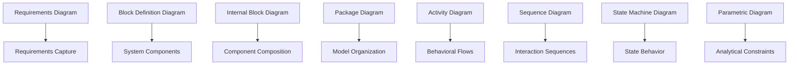

## 4. SysML Diagram Types in Practice

### 4.1. Requirements Diagrams

**Purpose:** Capture, classify, and relate requirements to other model elements, supporting traceability and impact analysis.

**Components:**

- **Requirement Elements:** Carry identifiers, text, rationale.
- **Relationships:** Satisfy, Derive, Verify, Refine, Trace, Contain.

**Example: Requirements Traceability**

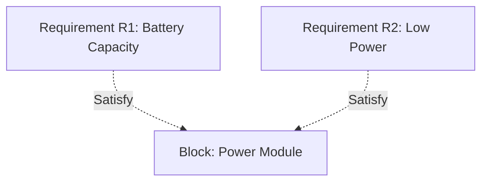

### 4.2. Block Definition Diagram (BDD)

**Purpose:** Define system hierarchy, types of system components (blocks), and their relationships.

**Elements:**

- **Blocks:** Modular components, can represent hardware, software, organizations, etc.
- **Associations:** Relationships between blocks (e.g., composition, aggregation, usage).
- **Generalizations:** Inheritance relationships.

**Example: System Hierarchy Using BDD**

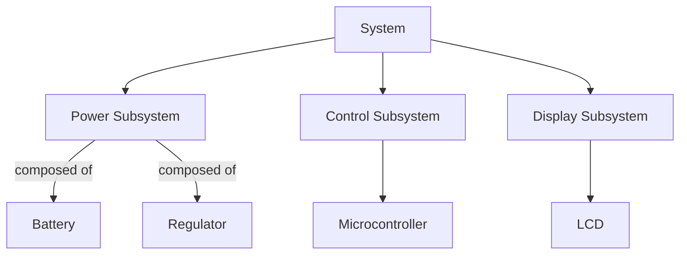

### 4.3. Internal Block Diagram (IBD)

**Purpose:** Show the internal structure of a block, specifying how its parts are connected and interact.

**Elements:**

- **Parts:** Instances of blocks.
- **Connectors:** Links between parts indicating information, energy, or material flow.
- **Ports:** Well-defined interaction points.

**Example: Power Subsystem Internal Structure**

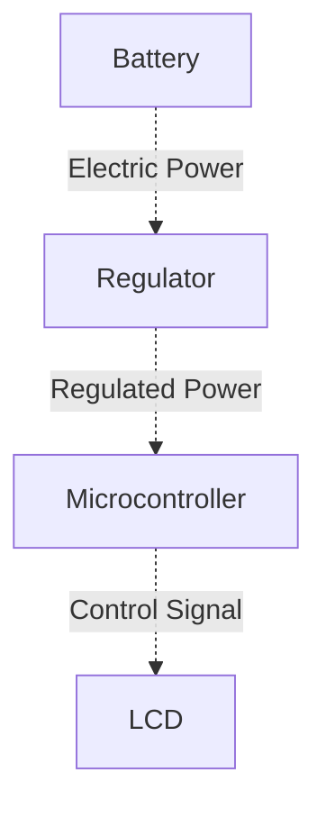

### 4.4. Package Diagrams

**Purpose:** Organize model elements into hierarchical packages for modularity, reuse, and separation of concerns.

- Show dependencies, containment, and import relationships among packages.

**Engineering Note:** Package diagrams enhance scalability in large projects and support configuration management.

### 4.5. Activity Diagrams

**Purpose:** Describe system or component behaviors as flows of activities and objects, supporting analysis of processes and workflows.

- **Actions:** Basic tasks performed.
- **Control/Data Flows:** Paths indicating process logic.

**Basic Activity Example: Data Processing Flow**

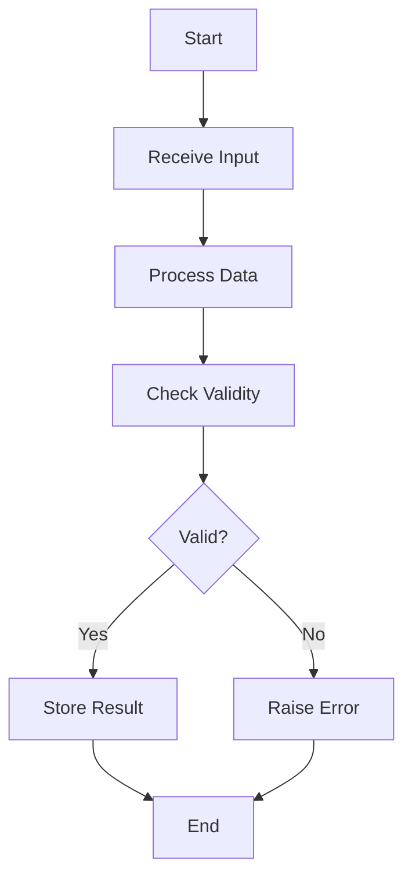

### 4.6. Sequence Diagrams

**Purpose:** Specify interactions between components or actors over time, detailing exchanged messages and their sequencing.

**Typical Use:** Protocols, scenarios, timing analysis.

**Example: System Initialization Sequence**

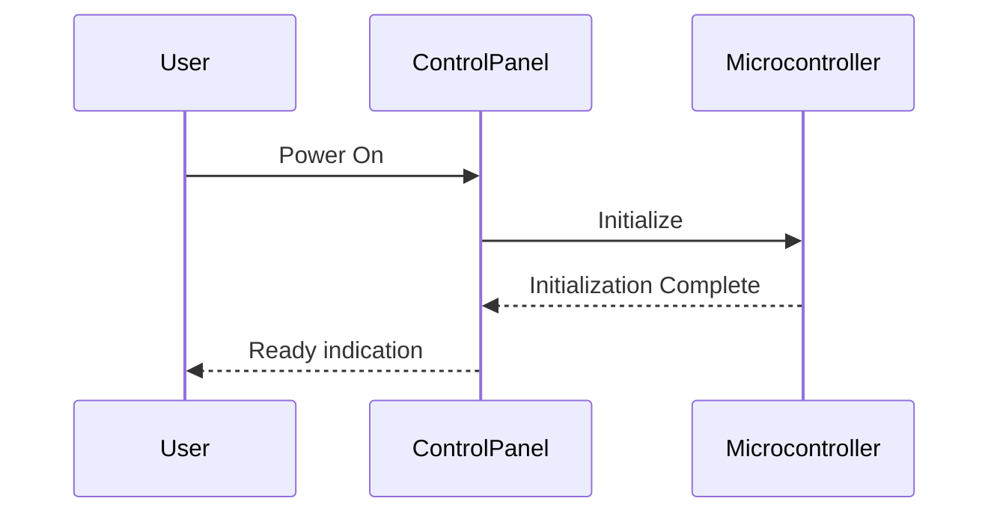

### 4.7. State Machine Diagrams

**Purpose:** Model the discrete states of a block and the events that trigger state transitions, supporting design of controllers, protocols, and life-cycle models.

**Example: Simple State Machine for Power Subsystem**

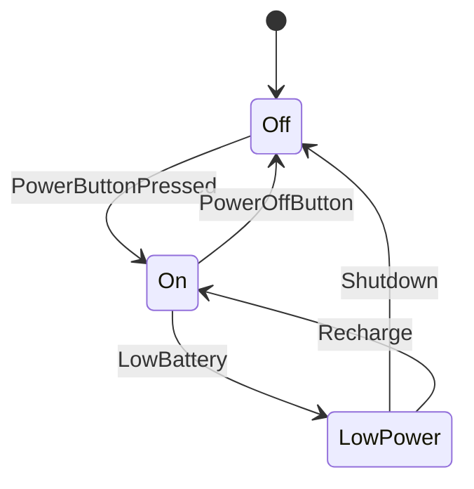

### 4.8. Parametric Diagrams

**Purpose:** Support modeling of constraints and engineering analyses, such as performance, reliability, or mass/power budgets.

- **Constraint Blocks:** Mathematical relationships between properties.
- **Binding Connectors:** Map properties to variables in constraints.

**Note**
> Diagram to be added later: Example parametric diagram showing a mass budget.

## 5. Integration into MBSE Workflows

### 5.1. Model Lifecycle

A SysML model typically evolves through the following MBSE workflow phases:

1. **Capture stakeholder needs and requirements.**
2. **Elaborate functional, logical, and physical architectures.**
3. **Model detailed behavior and interfaces.**
4. **Allocate requirements to architecture.**
5. **Analyze system properties (e.g., performance budgets).**
6. **Iterate, validate, and maintain traceability throughout lifecycle.**

### 5.2. Integration Points

SysML models are often integrated with:

- **Requirements Management Tools:** For bidirectional requirements traceability.
- **Simulation/Analysis Tools:** Via model transformations or direct API connections, enabling co-simulation, FMEA, performance analysis, etc.
- **Software Engineering:** Via generation of software architecture or code skeletons.
- **CAD/Electrical Design:** Through definition-of-structure-to-physical design flows (less direct, but supported via standards like OSLC).

### 5.3. Typical Engineering Workflows

**Mermaid - Typical SysML MBSE Workflow**

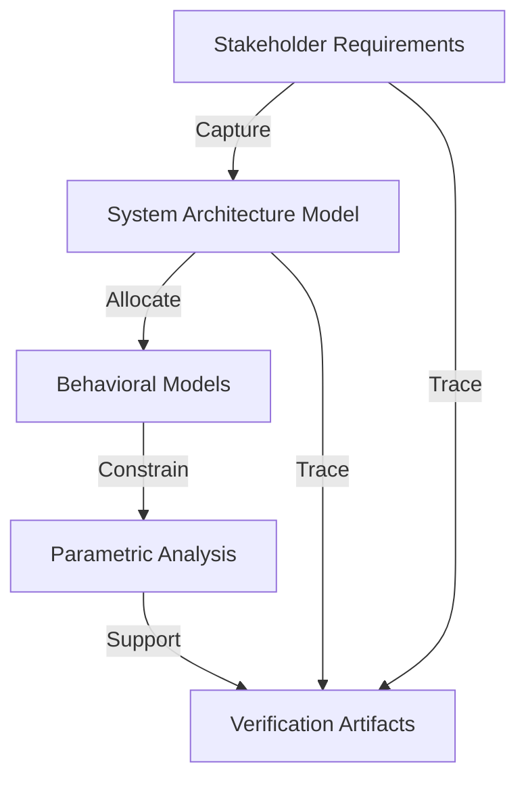

## 6. Practical Engineering Considerations

### 6.1. Tooling and Standardization

Leading SysML-compatible modeling tools include No Magic Cameo Systems Modeler, IBM Rhapsody, Sparx Systems Enterprise Architect, PTC Integrity Modeler, and open-source options such as Modelio and Papyrus.

Tools are expected to support the SysML specification (versions 1.x; 2.0 is emerging) and, in many cases, exchange models using the **XML Metadata Interchange (XMI)** standard.

> :warning: **Warning:** Tool interoperability is limited; XMI implementations vary, and round-tripping between tools can introduce inconsistencies.

### 6.2. Traceability and Verification

SysML supports explicit traceability between requirements, design, and verification entities—enabling impact analysis and providing artifacts needed for certification (e.g., DO-178C, ISO 26262).

> :bulb: **Tip:** Use built-in traceability to automate generation of verification matrices and change impact reports.

### 6.3. Model Partitioning and Scalability

To manage very large or multi-domain systems:

- Use packages and views to organize the model.
- Separate logical, physical, and software abstractions.
- Employ model libraries for reuse of blocks, diagrams, and parametric relationships.

> :triangular_flag_on_post: **Caution:** Deep or poorly planned package hierarchies can hinder model navigation and impact tool performance.

### 6.4. Version Control and Collaboration

Many tools offer integration with version control systems (e.g., git, Subversion), supporting model comparison, merge, and branching.

- **Engineering Decision:** Use model-based diff-merge tools to avoid semantic corruption compared to raw XMI file diffs.

## 7. SysML Language Elements: Reference Summary

### 7.1. Major Element Groups

| Element Type         | Purpose                                             |
|----------------------|-----------------------------------------------------|
| Block                | Modular system/component abstraction                |
| Value, Flow Property | Interface definition, data/energy/material exchange |
| Port                 | Typed interaction point                             |
| Constraint Block     | Mathematical constraints                            |
| Actor                | External system interacting partner                 |
| Requirement          | Formal system or stakeholder requirement            |

### 7.2. Common Relationships

| Relationship   | Purpose                                 |
|----------------|-----------------------------------------|
| Association    | Structural relationship                 |
| Aggregation    | Whole-part hierarchy                    |
| Generalization | Inheritance                             |
| Dependency     | Use, realization, allocation, etc.      |
| Satisfy        | Block satisfies a requirement           |
| Verify         | Test case verifies a requirement        |
| Derive         | Derived requirement interpolation       |
| Refine         | Abstract-to-concrete mapping            |
| Trace          | General traceability                    |

## 8. SysML Compared to UML and Other MBSE Approaches

- **Scope:** SysML supports a wider range of system domains (hardware, procedures) than UML, which is software-centric.
- **Diagrams:** SysML omits certain UML diagrams (e.g., object diagrams) and adds others (requirements, parametric).
- **Semantics:** SysML is agnostic to implementation technology, focusing on specification rather than detailed software modeling.
- **Standards:** SysML interoperates with MBSE standards such as the **INCOSE SE Vision**, **ISO/IEC/IEEE 15288**, and fits within the **V-Model** life-cycle process.

## 9. SysML 2.0 (Emerging Direction)

While this primer covers SysML v1.x (dominant in industry as of 2024), SysML v2.0 is under finalization, with significant changes:

- API- and code-first interfaces ("executable" models)
- Improved semantic rigor and syntax
- Enhanced architectural views and support for integration with new engineering disciplines

Transition to SysML 2.0, along with tooling shifts, should be assessed for impact on current modeling strategies.

> :information_source: **Note:** Existing SysML 1.x models will require migration or coexistence strategies as the new specification matures.

## 10. Challenges, Pitfalls, and Best Practices

### 10.1. Over-Modeling and Under-Modeling

- **Over-modeling:** Leads to excessive detail, reduced agility, and high maintenance.
- **Under-modeling:** Fails to realize MBSE benefits (e.g., traceability, unambiguous communication).

**Best Practice:** Focus modeling effort on areas of greatest risk, complexity, or areas where MBSE delivers clear value.

### 10.2. Stakeholder Engagement

- Models are only as useful as they are understood; tailor views and artifacts for consumption by different teams.

### 10.3. Tool Training and Process Alignment

- Investment in training and continuous process integration is necessary. SysML proficiency across roles is a critical adoption factor.

## 11. Example: Model Fragment for an Embedded System

Below is a simplified structure for an embedded system using selected SysML diagrams.

**Block Definition (Structure)**

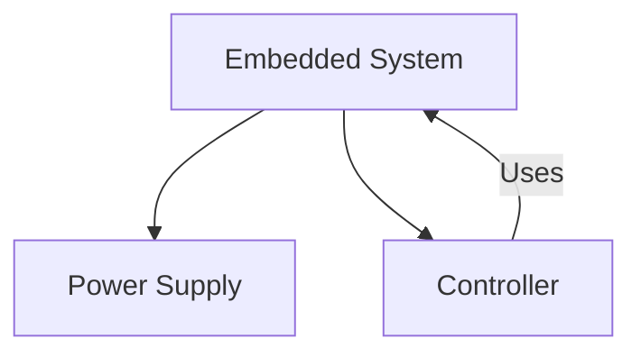

**Behavior (Activity Flow)**

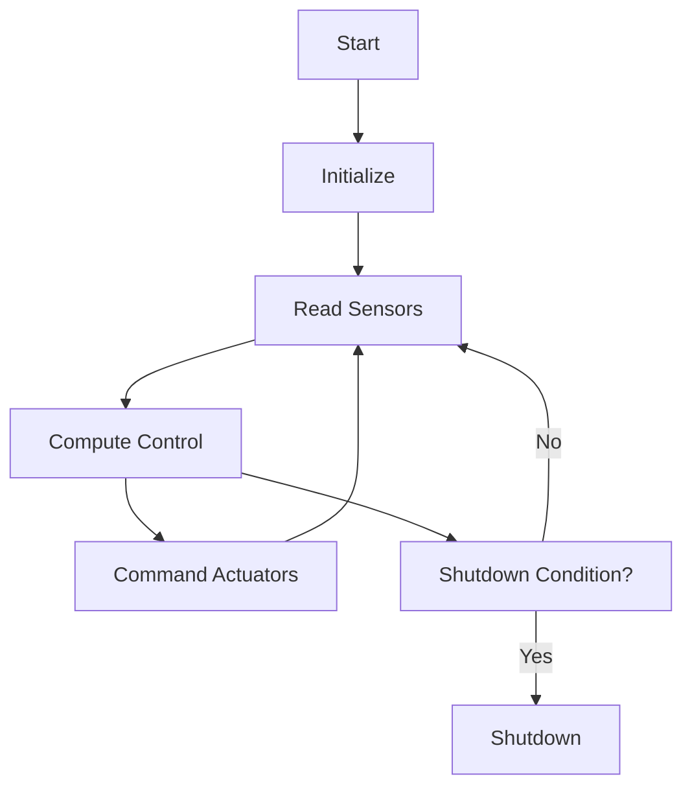

**Requirement Traceability**

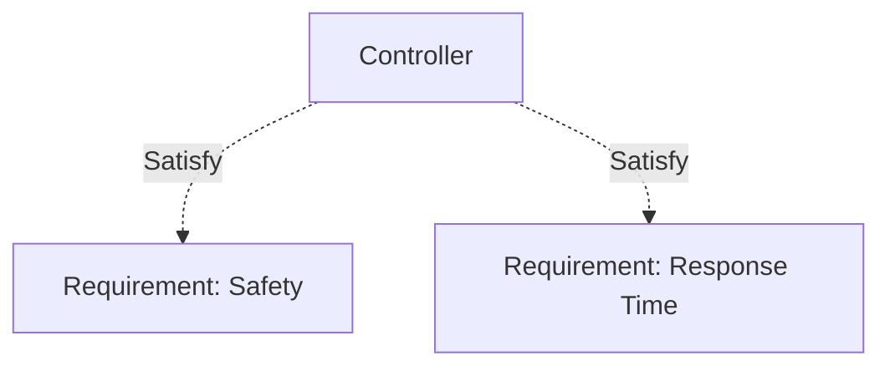

## 12. Conclusion

SysML provides a comprehensive, standardized notation for representing complex systems, supporting the principles and practices of Model-Based Systems Engineering. Its use enables consistency, traceability, and early validation across the system life-cycle. Mastery of SysML and its associated workflows is increasingly a prerequisite for engineers engaged in the design and development of multidisciplinary, high-assurance, or highly integrated systems.

SysML's flexibility, rigor, and integration capabilities make it foundational for contemporary system engineering, while emerging iterations (notably SysML 2.0) will further expand its scope and address known limitations. Successful application depends on disciplined modeling practices, stakeholder communication, tooling proficiency, and careful integration with engineering processes.